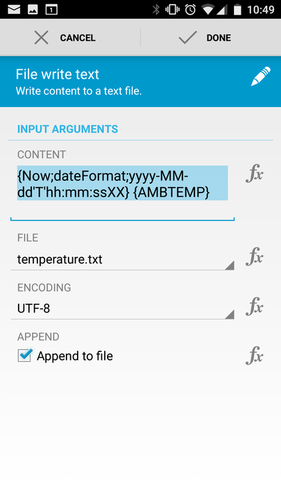
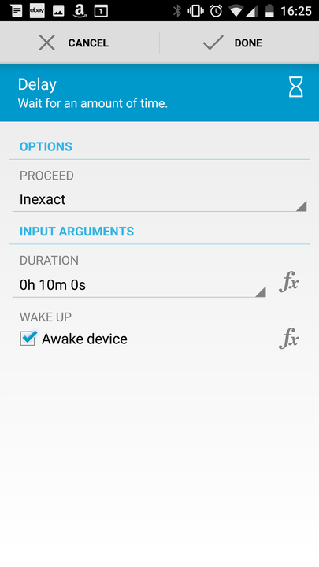
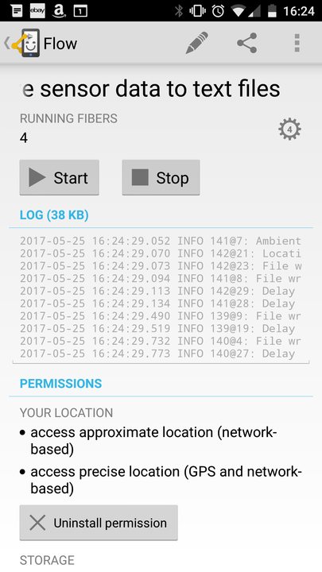

---
author:
    email: mail@petermolnar.net
    image: https://petermolnar.net/favicon.jpg
    name: Peter Molnar
    url: https://petermolnar.net
copies:
- http://web.archive.org/web/20190624125152/https://petermolnar.net/android-logging-sensor-data-with-automate/
published: '2017-05-26T19:10:00+00:00'
summary: I've been searching for a long while for a sensor data logger app;
    it turns out Automate can do this just fine with a lot of extra, so here's
    my solution for a Galaxy S4.
tags:
- android
- automation
title: Logging Android sensor data with Automate

---

**tl;dr**: download the flow file here:
<http://llamalab.com/automate/community/flows/12639>

## Automate[^1]

A long, long time ago I tried the ancestor of this app, when it was
simply called llama. Since then it look like I come a long way, and now
it resembles something I last saw when I learnt how to program PLCs[^2]

So, the short story: you have building blocks, such as, for example, get
current location, write a file, call a URL, etc, and these blocks can be
piped into eachother, so the output of one can be used in another - just
like \| in the UNIX world[^3].

## Sensorlogger flow

I've put this together for a Samsung Galaxy S4 - it's a terrible phone,
but has a decent amount of useful sensors, including humidity, ambient
temperature, light, etc, and it's pretty cheap these days, especially
one with a cracked screen. *I'm also testing if it's possible to be used
as a security camera instead of my current Raspberry Pi solution, but
that is not stable yet.*

So, sensor logging: after the start I fork the process into threads;
each thread is for a single sensor, that will log into a file for
itself.

The files look like:

    2017-05-26T10:15:30+0100 10.23234220

where the first element is an ISO 8601 timestamp and the second is the
value from the sensor.

The configuration bits of a thread:

Once it's fine, just press "Start":

This could, of course, be extended with a custom URL call, which sends
the sensor data to your server; or an MQTT push to a server and is
pretty easy to configure.

[^1]: <https://play.google.com/store/apps/details?id=com.llamalab.automate>

[^2]: <https://www.google.co.uk/search?q=PLC+programming+flow&tbm=isch&tbs=imgo:1&gbv=1&sei=3RIoWer7CqWTgAbAhI-AAw>

[^3]: <https://en.wikipedia.org/wiki/Pipeline_%28Unix%29>
