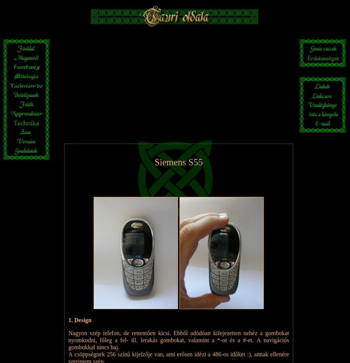
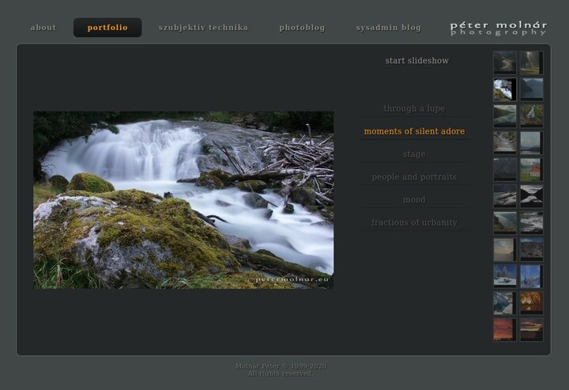
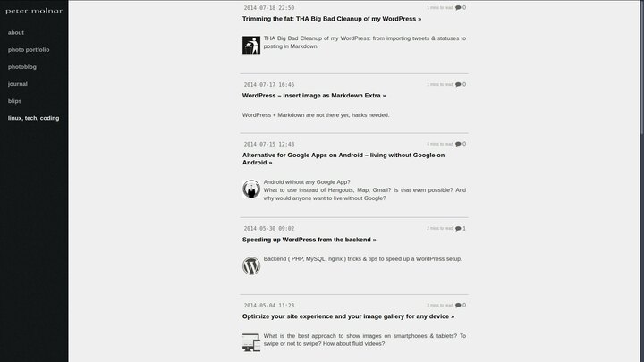

---
author:
    email: mail@petermolnar.net
    image: https://petermolnar.net/favicon.jpg
    name: Peter Molnar
    url: https://petermolnar.net
copies:
- http://web.archive.org/web/20200626222759/https://petermolnar.net/article/content-archeology/
published: '2020-06-26T21:55:00+01:00'
summary: Someone, a long time ago came up with the thought that whatever is
    put on the internet, it'll be there forever. Well, it's wrong. The old
    versions of my own website, including their design, were long gone, so
    I decided to put the Indiana Jones hat on, and started digging.
title: Excavating my former homepages

---

*It's early 1999. I'm 13 years old, just entered high school[^1].
Altavista is still a decent search engine. At this point I've been using
the web for years, but never really participated in making it yet, and
it was about to change. The idea of having a homepage stuck with me: I
could make my own design, my own little world, without limits, with any
kind of content I want to, without anyone supervising. This was such an
exciting prospect that it had to be done. Plus: it was open for anyone,
like instantly hanging your work in an art gallery!*

Long story short, I did that website. And the next one, and the next
one... and I kept going till this very day. The tragedy of it is that
due to multiple reasons, the first two iterations and designs of my site
are now completely lost.

Back in those days my English skills or my "programming" skills were
quite lacking. I never heard the idea of version controlling, digital
archiving, snapshots - these came so much later. Hungary tends to teach
foreign languages with an overwhelming amount of grammar, resulting in a
nice, but unusable skill when someone wants to explore the internet.

Put these and the options on the mid 90s web together - generic Hungary
is *always* around 5 years behind the English speaking world in internet
trends. My first sites were made with Microsoft FrontPage 98, FTP-d
directly into "production", always overwriting the tiny, free space on
free homepage providers, hopping from one to another, because the new
one offered 5MB for free, not just 1.

## 1999 - 2003 - the FrontPage years

When I decided to go after the old versions of my gazillion URLs, I
first turned to archive.org, like everyone would. For my gigantic
surprise, after remembering that the provider `extra.hu` had subfolders,
and not sub-domains, I found a version from May 2001! A year earlier
than my earliest archive! Sadly, it was the already on it's third
design, and because archive.org didn't have the images from back then,
it wouldn't have mattered anyway.

The good news was that my site at this point was static HTML, so
"recovering" it was simply opening the files. Did you know web browsers
still support frames?

I went through this version quite a few times lately, and I always
overlooked a section, in which I had a review of an Ericsson T29s -
including notes on how to hack a data cable for it, downloadable
programs, full eeprom and flash binaries, and a fascinating note of:

> I'm utterly tired that there are only ads on every page, and no real
> stuff, so I thought I'll put some here, based on my own experience

Again, this is roughly 2002. It's good to be reminded by my own words,
that the internet had this problem for a very long time by now.

I decided put the review back up - look under the IT tab -, even though
chances that someone is looking for these is converging to 0.

## 2004 - the PHP4 years

To access the 2004 version, magic has to be called upon - also known as
virtual machines. I had to spin up a Debian Sarge[^2], because I needed
PHP4 - **immeasurable kudos for the Debian archives[^3] for still having
install CDs, and working software repositories!** The only trick is that
during the install the apt mirror needs to be set to
`archive.debian.org`.

I barely remembered this version. It also made me realise that I was
microblogging, before it even became a term - although as Kevin
Marks[^4] pointed it out on the `indieweb-chat` channel on Freenode,
everyone was microblogging at first: the idea of one page per entry came
later.

After not too much digging I found two more phone reviews, also with a
lot of background content - in case you're after an 50KB mobile Java
email application, I have one for you.

Instead of webrings, in Hungary, we regularly exchanged banners with
each other: small images, that linked to another site; sort of a
graphical blogroll. Contrary to mathematical probability, I found a
banner that is still alive! 16 years and still strong: the Hungarian
Stargate fan site[^5] deserves some attribution for that banner[^6]

## 2007 - 2009 - the custom CMS with friends years

2007 brought a massive change: I wanted to make the site tiny a
community site, a place to where my close friends could also upload
photos, short stories, art.

3 years meant PHP5, so I spun a Debian Etch[^7] up. These were the days
when I had my custom, PHP-based CMS, of which if I looked at the code
of; it's proper nightmare material.

The revelation of the 2007 version was the amount of photos I sort of
accidentally *removed* from my site. In the coming years my site slowly
morphed into a portfolio for my photos and my sysadmining skills. When I
finally reverted, and swapped from curated, small galleries to a stream
of individual images, I never put the old portfolio back. This will need
to be addressed.

Related to this, I came across Ana's "Blogging and me" post at
<https://ohhelloana.blog/blogging-and-me/> . She went through very
similar cycles as I did: a website first, blogging of anything, that
gradually became a hyper-focused, work-only site, which then got
neglected, because it wasn't fun any more. Read it. If you didn't (yet)
had these cycles, or if you already did; in both cases, it's a fantastic
piece.

## 2008 - 2013 - the portfolio years

Parallel to the community site idea, I wanted to have a portfolio site;
one that is professional content only. At that point, I still believed
my life will have something to do with photography, so I made a photo
portfolio site under the new domain `petermolnar.eu`. My name is quite a
common one in Hungary, but the `.eu` domains were new, and I grabbed it
immediately.

During these years I actively participated in an alternative community
in Hungary. I wrote some articles to their site, which are still up, to
this very day, but the idea to put those on my own site (as well) didn't
occur to me.

In 2010 , the limitations of my CMS collided with the fact that I lost
touch with most people who had some content on that community site. I
decided to close it, and turn my full attention towards a personal site

-   by switching it to WordPress.

Soon after college (2009), I ended up working as a sysadmin; it made
sense to start writing my findings, my how-tos (mostly for myself) down.

With that, I've thrown a silly amount of old content away. No thoughts
or personal blog entries any more: streamlined photo portfolio, photo
equipment review - *this one never even took off; the 2 entries I wrote
for it are so low quality that they were not worth salvaging* -, and a
sysadmin blog is the way to go! I should never have done that, but these
were the early Facebook years; everyone was doing personal communication
in social silos. It seemed like a good idea that time. Mea culpa.

I did try cross-posting and syndicating early on: links to new entries
to twitter, to facebook, but soon it looked overwhelming. When the same
content goes everywhere, and you happened to have a large cross-section
of the same people on each silo, it'll be too much for them.

Slowly, but steadily, topics and sections kept creeping back in. At
first, it was merely a `photoblog` tab, in which I put collection of
images grouped by a topic. It took me a while to realise I didn't like
it that way: without context, the galleries were distant; they didn't
feel like memories, more like and extended, endless portfolio, yet I
kept going with it for years.

By the end of 2013, I was back to having a "world view" section that was
to become "journal". The trigger for this was our relocation to England:
there was an irrepressible urge to write about our new life.

## 2014 - 2017 - The features and contents years

Sometimes in 2014 I stumbled upon the indieweb[^8] community. With that,
my site started to get features - and a lot of them.

### 2014

Once you read too many studies on the internet you may start questioning
your own experiences with certain things. One of these is the "light on
dark" vs "dark on light" representation when it comes to computers and
the web. To obey this, I started presenting text content in light, photo
content with dark background and themeing; a route I should never have
taken.

During the 15 years prior to this, my site was dark. This page is
supposed to be my home, and it's supposed to represent me on the
internet. And I'm not a light background person; I never was. When I
still used Window XP it looked like this:

Even so, for the coming years, the design went lighter and lighter.

### 2016

### 2017

![In 2017, I found the icons I'm using till this very day, but I still
had the dreaded light design. Plus I added even more content, including
the idea to backfill EVERYTHING[^9] I ever made on the internet.
Needless to say this idea was later reverted, though without the
journey, I may never have realized why it was bad.](2017.jpg)

## 2018 - back to the roots: dark, static, simple.

Content was dropped[^10], and I again, felt like I have a homepage, and
not a one person social media site.

And thus we arrived to 2020, and you're looking at the freshest, most
current iteration of my website.

## Conclusions

I think at the beginning I started to dig my sites up to verify how much
have I gone back to my roots. To see how it started, how it done, when
it was solely for the fun. Ana's post, which I already mentioned[^11]
was definitely a trigger to take this journey.

I lost the first two designs. I remember the very first vividly, with
the water-like repeating background. The second I completely forgot
about, until I found a reminder of my proto-microblog entries from 2001

-   it had a planets and solar system theme, or so I wanted to believe.
    Again, we're talking 2000, in Hungary. Sadly, that entry was about
    me being happy replacing it with something fresh and new.

My conclusions are simple: your homepage is called that for a reason.
It's a poster, a gallery, a window to you, out for anyone to visit, to
see. It's not a social media profile. It's not a resume. It's you.

Whether you want it to be a portfolio, a blog, it doesn't matter; just
make it sure it represents you, and that you keep liking it, and keep
enjoying working on it, extending it.

[^1]: <https://en.wikipedia.org/wiki/Education_in_Hungary>

[^2]: <https://cdimage.debian.org/mirror/cdimage/archive/3.0_r6/i386/iso-cd/>

[^3]: <https://cdimage.debian.org/mirror/cdimage/archive/>

[^4]: <http://www.kevinmarks.com/>

[^5]: <http://www.csillagkapu.hu/>

[^6]: <http://www.csillagkapu.hu/img/agbanner.gif>

[^7]: <https://cdimage.debian.org/mirror/cdimage/archive/4.0_r0/i386/iso-cd/>

[^8]: <https://indieweb.org/>

[^9]: <https://petermolnar.net/article/personal-website-as-archiving-vault/index.html>

[^10]: <https://petermolnar.net/article/making-things-private/index.html>

[^11]: <https://ohhelloana.blog/blogging-and-me/>