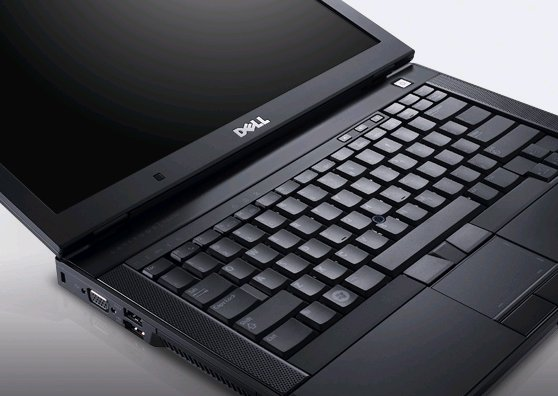
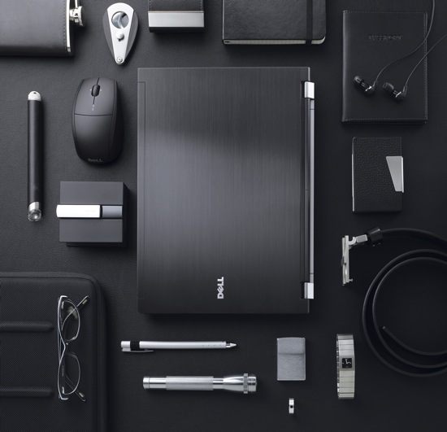
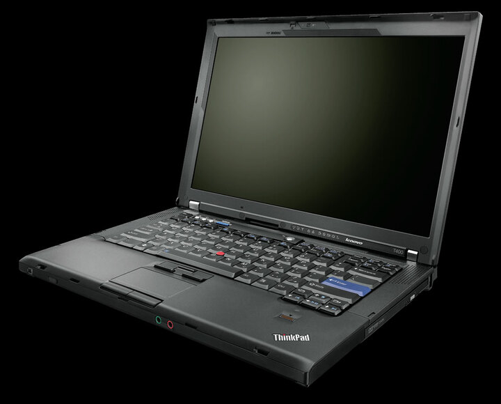
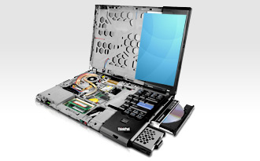
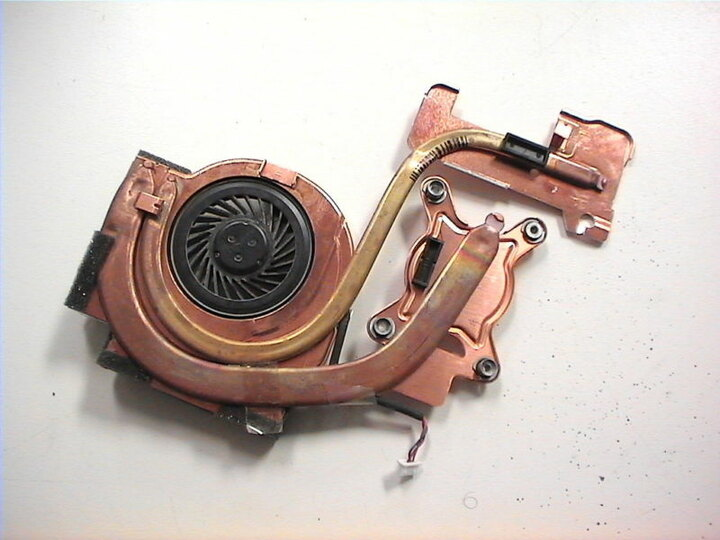
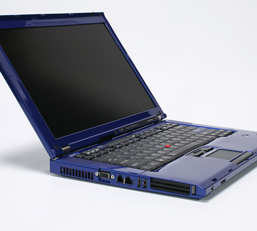

---
author:
    email: mail@petermolnar.net
    image: https://petermolnar.net/favicon.jpg
    name: Peter Molnar
    url: https://petermolnar.net
copies:
- http://web.archive.org/web/20120419213249/http://petermolnar.eu:80/linux-tech-coding/dell-latitude-e6400-vs-lenovo-thinkpad-t400/
published: '2011-06-23T10:27:59+00:00'
redirect:
- szubjektiv-dell-latitude-e6400-vs-lenovo-t400
summary: 'Szubjektív felhasználói élmény és vélemény két premium business
    gépről. Ultrakonzervatív Lenovo Thinkpad T400 vs ultramodern Dell Latitude
    E6400, avagy: Miért nincs megbízható, erős, linuxbarát és szép üzleti
    notebook a piacon?'
tags:
- hardware
title: Dell Latitude E6400 vs. Lenovo Thinkpad T400

---

## Bevezető

Röviden arról van szó, hogy fél éve gépet kellett cserélnem: egy céges
Lenovo Thinkpad T500-asom volt, amit nem tartottam meg. Az indokok: az
1680x1050-es felbontás nekem túl sok (de a munkához anno kellett, 6
konzolablak egymás mellett...), a 9 cellás akksival a gép nagy és nehéz,
ezen felül pedig drágállottam, amennyiért odaadták volna.

Ehelyett boldogan leltem rá egy apróhirdetésben egy Dell Latitude
E6400-ra, ami designban annyira elvitte a prímet a szememben, hogy
szinte gondolkodás nélkül vetettem rá magam. Tudtam róla, hogy premium
business, tehát valamit az is tud, ráadásul egy csomó ismerősöm dicsérte
a Dellt. Nem vagyok kezdő notebook használó (volt már Digital, Compaq,
HP, Lenovo, Acer, mind business), sem kezdő linuxos, de ezzel a géppel
~~csak~~ sokat szenvedtem.

Azóta eltelt fél év, és annyira meggyűlt a bajom a vele, hogy vettem egy
Lenovo T400-ast helyette, ami olyan, mint a T500, csak kisebb és egy
kicsit rosszabbul felszerelt. A T410 hangosabb, a T420 pedig egyelőre
nagyon drága, ráadásul a T400-as igazából elég, főleg, hogy ebben még
sima és nem szegekkel kivert touchpad van.

Ennek ellenére azt gondolom a Dellről, hogy jó gép, csak nem az én
igényeimnek. Szubjektív vélemény és összehasonlítás.

## Dell Latitude E6400

{.w33} Pár adat és
teszt: Review Dell Latitude E6400 @ notebookcheck.net[^1]

Ez egy **páncélozott jármű**, annak minden előnyével és hátrányával.

**Előny** például hogy **merev**, majdnem mindenhol. A palmrest jobb
oldala tud hajlani, de nagyon meg kell nyomni, és ugyanez igaz a
billentyűzetre is. **Nagyon pontos**an illeszkedik minden, nincs rés,
nincs nem teljesen passzoló dolog. Az ultrabay felett elviselhető, bár
sehol sincs egy Elitebookhoz képest, az expresscard slot felett stabil,
amíg van benne merevítő és/vagy kártya. Kikapcsolt állapotban - illetve
bekapcsolás után pár percig - imádnivalóan hűvös.

Emellett ugyanígy a **hátrány**ai is a páncélozott hadosztályt idézik: a
festés **könnyen megkopik**, **zajos** és **melegszik**. A festés azért
is probléma, mert a kijelző hátoldala magnézium ugyan, de nem túl erős
minőségű festékkel "szálhúzottra" van festve. A **zaj**os nem csak a
ventillárra értendő, hanem érdekes módon a **disk**re is. Mivel a disk
maga Free Fall Sensoros, a Dell nem tett köré semmit, egyszerűen be van
csúsztatva a magnézium keretbe, és kész. A védelem így perfekt, cserébe
rezeg az egész gép, ha merev felületen ül, asztali használat esetén elég
gyakori dolog.

Ami hozzám került egy P9700-as processzorral és egy nVidia Quadro
NVS160M-mel az általam valaha használt legerősebb gép, úgyhogy erre nem
lehet panasz. Azonban az én erősen **kíméletes igénybevétel**em mellett
a ventillátor folyamatosan, **3000-res fordulaton** megy - mivel ez a
leglassabb létező fordulat a BIOS-ban. Ha nem csinál semmit, kb 40 fokos
CPU-val és 50 fokos GPU-val lehetett számolni, ami teljesen normális,
bár ilyenkor mind a processzor, mind a videóvezérlő erősen
energiatakarékos üzemmódba volt állítva. Ilyen üzemben, bekapcsolt
WiFivel, 75%-os fényerőn egyébkén **12W körül fogyaszt**ott. A Dell a
hűtésről elég paranoid módon gondolkozik, a következő a tapasztalat:
tartós 38 fokos CPU hőmérséklet felett elindul 3000-ren a venti, 50 fok
körül már 4000 felett megy, és zajos. Hogy újra kikapcsoljon, tartósan
40 fok alá kell mennie, ami csak akkor következik be, ha otthagyjuk
hülni. Ha pedig magunk kívánjuk a gép hűtését irányítani, nos az nem
egyszerű[^2], ráadásul minden boot után játszadozni kell vele.

**Jó minőségű kijelző** kapott, 14.1 colon elfogadhatót találni eleve
művészet, hát ebben az van: **LED**, világos, erős színekkel, nekem
elviselhető kontraszttal. Ha tűző napon használtam, akkor is rendben
van, bár a fekete gép olyankor erősen melegszik. Cserébe gyengék a
zsanérok, nem kicsit, nagyon, és a szervíz annyit közöl, hogy ez sajnos
normális, nem cserélik. Amikor **buszon** használtam a gépen (7E
Astoria-Ferenciek tere próba) két hét "buszhasználat" többet
**amortizált a zsanér**okon, mint fél év asztali, illetve ölben
használat és napi hordás.

Az E6400 kivételes felszereltséggel bír**, van benne minden**, és a
minden alatt azt értem, hogy minden: ExpressCard, eSATA (USB kombó),
firewire, smartcard, contactless smartcard, fingerprint reader,
(meglepően jó) webkamera, 3 USB (a kombón felül), DisplayPort, VGA,
RJ45, rendes, 2 audió csatlakozó (lásd T410 Lenovo, ami nem rendes),
utrabay, kártyaolvasó.

Sajnos ennek a felszereltségnek van hátulütője, egészen konkrétan az,
hogy **Windowsra tervezték**. Nincs is hivatalos Dell támogatás erre a
gépre semelyik linuxra.

Linux alatt a **Broadcom (4322) szenvedés** volt, és nem is hozott
teljes sikert. Sikerült használható drivert feltenni[^3], némi hack
árán, de aircrack és társai nem tudták használni, mivel nincs monitor
mode. Cserébe az új driverrel gyors és stabil. Ugyanez a helyzet az
**nVidiával**: notebook, tehát hol van külső monitor, hol nincs. A
linuxos nVidia control ebben az összeállításban **nem** igazán
**barátságos**, de driver frissítés[^4] után legalább jól
tweakelhető[^5].

A **touchpad**et nem jó. Rendszeresen előfordult, hogy "**lefagy**ott"
addig, amíg a pöcökegeret meg nem böktem. Emellett pontatlan, lassú, és
képtelenség linux alatt jól belőni az érzékenység/sebesség arányt.

A **billentyűzet** és annak a stabilitása **kiváló**. Az egyetlen dolog,
amin javítani kellene, az az a pont, ahol a pöcökegér gombjai és a
billentyűzet találkoznak, mert ott nagyon kényelmetlen a space.
Megkockáztatom, hogy van olyan jó a billentyűzet, mint a Thinkpadekben,
a háttérvilágítás pedig szép és hasznos.

A **hangszóró**k elég rosszak. Az egy dolog, hogy nem hangos, de sajnos
a hangszín és a\*\* tónus **is elég **rosszul van belőve\*\*, a zaj
határozottan erősebb sokszor, mint a beszédfrekvencia. Zenehallgatásra
úgysincs alkalmas notebook, de a beszédhangot adja le rendesen.

Zseniálisan **könnyű szerelni**, ugyanis 1 csavarral lejön a gép teljes
alja (ami vékony, de meglepően erős), és szinte mindenhez hozzá lehet
innen férni. A szerelésnél viszont hátrány, hogy nagyon **limitált az
alkatrészek és kiegészítők száma**. Mind a HP-hoz, mind a Lenovóhoz a
business kategóriában kapni az összes alkatrészt, amiből komplett gépet
lehetne otthon fabrikálni, a Dellhez nincs minden. Nincs például
gumitalp a gépre, pedig a hozzá adott táska boldogan töri (!) le azt a
kis műanyag szigetet, amire a talp fel van fogatva, nincs
csarvarkészlet, és így tovább.\*\* \*\*A műanyag talpak leválása
egyébként egyedi elbírálás a Dellnél, hogy méltóztatnak-e cserélni.
Miért? Nos azért, mert az összes létező más géppel ellentétben ennek a
gépnek a burkolatán vannak kis szigetek kialakítva, amik nem
cserélhetők, csak a komplett burkolattal együtt. Hál istennek nálam
cserélték.\_ \_

Ami eBay-en kapható **Ultrabay SATA keret**, és állítólag ehhez való, az
nem ehhez való. Ne vegyetek olyat, mert nem rögzíthető, kilóg és elég
gyagi minden más szempontból is. Találtam egy gyártót[^6], aki készít
ehhez a géphez, azonban hivatalos **Dell **keret **nincs** és soha nem
is volt - csak diskkel együtt, előre csomagolva.

**Van** viszont a **tálcaként feltehető utazó akksi**, amin a gép teljes
aljára rápattan, nem mint a HP-nál, csak a hátsó részre, de ilyenre
nekem nincs szükségem.

Idézném egy (lány) ismerősömmel való beszélgetést a géppel kapcsolatban:

    Ő: Minden OK?
    Én: Persze, csak már megint nem bírok valamit megcsinálni a géppel.
    Ő: Akkor miért nem veszel másikat?
    Én: Mert sokkal jobban tetszik, mint a többi a kategóriájában.
    Ő: Aha. Szóval ez olyan, mint nekünk a: "Ez a cipő kényelmetlen, nyom és hordhatatlan. De piros! ^^"

És igen, igaza van: ha nem jó rád a cipő, ne vedd meg, vagy ha benézted,
legalább korrigáld a dolgot, és keress egy kényelmes darabot. Talán nem
lesz annyira de annyira szép, de jobb lesz.

### Összefoglaló

{.w33}
**Corporate IT-ra és komoly, de elsősorban irodai igénybevételre
tervezve**. Verheted, dobálhatod, gépelhetsz rajta éveket.

Arra tervezték, hogy meg lehessen jelenni vele komoly üzletfelek előtt
is, de ha ezután nem jön össze a business és rádobod az asztalra, akkor
sem lesz baja. **A jobb oldali kép** hibátlanul átadja ennek a gépnek az
**érzésvilág**át és stílusát.

**Elképesztően szép és designos gép, minden a helyén van benne** - amíg
valami el nem romlik, mert akkor csőstül jön a baj, és hiába jófejek a
szervizesek, ha maga a Dell elutasítja a garanciális javítást, lásd
zsanérok.

**Nem lehet bötykölni**, **limitált **hozzá az **alkatrészek** száma is.
**Nem alkalmas extrém környezetbe**, és éjszaka, **csendes környezetben
zavaró** tud lenni a **ventillátor** hangereje.

**Linux támogatottság**a egyáltalán **nincs** ennek a típusnak.

## Lenovo Thinkpad T400

{.w33} Pár adat és teszt: Review
Lenovo Thinkpad T400 @ notebookcheck.net[^7]

A Thinkpadekkel az új generáció legnagyobb baja, hogy "unalmas, IBM
design", de ha valamit változtatnak, akkor "nem olyan, mint régen". Ezt
főleg a minőségnél, a strapabíróságnál és az anyaghasználatnál hallani
sokat, legújabban a kijelzők miatt sírnak. Pedig ennyi erővel a Macesek
is sírhatnak, azokban a régi szép időkben Eizo csúcskijelzők voltak...
De tény, hogy részben igazuk van.

Igazuk van abban, hogy a **kijelző** elég gyenge ezekben a gépekben.
Teljesen **alkalmatlan**ok **komolyabb grafikai munkára**, ráadásul a
nem LEDesek fényereje sem üti meg a kívánalmakat, de ami azt illeti,
14.1" kijelzőből, 16:10 képaránnyal senki sem gyártott értékelhető
kijelzőt, még LEDdel sem igazán. Akinek erre kell, W5x0, fullHD, vagy
EliteBook 8740w, az lefedi az adobe RGB színteret. A 14" nem erre készül
sajnos.

Szintén igazuk van abban, hogy szokatlan dolgok jelentek meg a T400-ban.
Például, ha leteszed az asztalra, és megnyomogatod a sarkait, olyan,
mintha össze-vissza hajlana a gép. Arra nem jöttek rá a videók és
leírások készítői, hogy a\*\* T400 gumitalpai elől elég speciálisak\*\*,
és képesek kis erő hatására is süllyedni, majd visszaállni.

~~Amiben igazat kell, hogy adjak, az a **billentyűzet és környékének **a
tetemes **hajladozási és klattyogási hajlam**a. Ha bele tudnám tenni a
Dell billentyűzetét és kijelzőét a T400 formái közé, az jó lenne.~~
Kaptam bele egy új billentyűzetet, ami a korábbi típusokban is volt, ez
jó. Jobb, mint a Dell.

{.w25} A burkolat
mindenhol tényleg **burkolat**, **alatta** van a **magnézium váz**.
Ennek előnye, hogy a szépséghibákat, repedéseket könnyű javítani, nagyon
komoly hátránya, hogy **illeszkedni**e kell egymáshoz a két felületnek,
és ez bizony **nem mindenhol sikerül** ebben a gépben.

A példának erejéért a T400 csuklótámaszának jobb részét be lehet nyomni
kb. 1 millimétert - azonban utána nekikoppan a magnéziumnak az ember, és
tovább csak kalapáccsal fog menni, vagy talán azzal sem. Szóval a
burkolat sok helyen gyenge vagy nem illeszkedik teljesen, ezért
történhetett, hogy sokan, akik rénéztek, elkönyvelték "már nem IBM"-nek,
és kész. \_ ( Sajnos beelőztek azzal az ötlettel, hogy más színű műanyag
burkolatelemeket kéne gyártani hozzájuk[^8] :) )

Ez igaz az ExpressCard feletti részre is - mivel nem adnak helykitöltő
keretet. Ha az van benne, akkor már elég stabil.\*\* A burkolat az
ultrabay körül nagyon gyenge\*\*, ott nem szabad összenyomni, mert
tényleg baja lehet.

Annak ellenére, hogy rendkívül jó érzés egy stabil, merev gépet az ölben
használni (Dell), amikor hordásra és vele való utazásra kerül sor, nem
biztos, hogy elhanyagolandó, ha tud hajlani az eszköz, és nem
pattan/törik el rögtön. Igen, így kényelmetlenebb használni, ellenben
olyan terhelést is kibír, amibe a másik eltörhet, pont a merevségéből
kifolyólag.

A proci és a videókártya szignifikánsan gyengébb, mint a Dellben (P8700
vs P9700, Intel 4500HD vs nVidia Quadro NVS160M), viszont a Dell
kapacitását talán 4 év múlva, egy 30 megapixeles fényképező képeit
rendezve fogom kihasználni. Inkább melegedjen kevésbé.

A **felszereltség**e is **hagy kivetnivalót maga után**: webkamerás
verzió ritka, kártyaolvasós vagy smartcard olvasós még ritkább, **HDMI
**és/vagy **DisplayPort**, **eSATA nincs**. Contactless SmartCardos
verzió egyáltalán nem létezik. Van viszont analóg modem... ami mondjuk
kevés dologra használható, de olyan, mint a soros port: geekeknek és
rendszergazdáknak nem árt. Egyébként soros port sincs sajnos.

Mondjuk mind a kártyaolvasó[^9], mind a smartcard olvasó[^10]
orvosolható, mert azokban a modellekben, amiben nincsenek van helyette
ExpressCard és PC Card hely is. Szerintem pont ugyanígy csinálják a
gyárban is, de ilyenkor nem marad szabad kártyahely, ellentétben a
Dellel.

{.w33} A
**ventillátor és a hűtés zseniális és elképesztően halk.** Külön
érdekesség, hogy nem alulról, hanem hátulról szívja a levegőt. Egy 160
GB-os truecrypt partíció elkészítése, ami eléggé pörgette szegényt, nem
vitte 56 fok fölé, és olyankor sem ment a ventillátor 3000-res fordulat
felett. Átlag használat mellett 2000-res fordulat alatt van a gép, és
45-48 fok körül a processzor, és nem hallom a teljesen csendes lakásban.

Cserébe a "CPU whine" néven ismert magasfrekvenciás sivitás teljesen
véletlenszerűen, terheltségtől függetlenül jelentkezik, hol ekkor, hol
akkor, jó hangosan. Mivel itt nem nyomja el a ventillátor zaja, eléggé
zavaró tud lenni.

Komoly **linux támogatottság**a van. A ThinkWiki[^11]régóta gyűjti a
tudást a linuxos Thinkpadekkel kapcsolatban, az **alkatrészek
támogatottsága** is **kiváló **- kivéve az Intel 5300-at, mert az bugos
az Ubuntu mostani kerneleiben, ezért nincs n mód. Cserébe megy a monitor
mód, úgy tűnik, ez az ára.

**Szerelhető, buherálható**. Lehet kapi eBay-en komplett kitet a kijelző
LED-re upgradelésére. Lehet kapni csavarokat. A szervízben nem
szívóznak, ha leesnek a gumitalpak, adnak másikat, cserélik a
zsanérokat, ha beviszem a gépen garanciális átvizsgálásra, ingyen
újrapasztázzák, stb.

**Folyadékálló a billentyűzet**. Lehet, hogy klattyog és hullámzik, de
mivel láttam már buliban ismerőst azért nem zenélni, mert nyakonöntötték
a gépét, ez nem egy utolsó szempont.

**A touchpad kényelmes és pontos**. Hátránya, hogy rettenetes mennyiségű
IRQ-t generál, ennek az esetleges elhárításán még dolgozom.

A **zsanérok erősek**, \*\* **a kijelző önsúlya miatt határozottan
**jobban tartanak rázkódó környezetben\*\*.
<ins datetime="2012-01-16T09:16:47+00:00">Frissítés: sajnos kicsit több,
mint fél évnyi T400 használat után meg kell említenem, hogy a zsanérja
ennek is kikopik. Az vitathatatlan, hogy az említett önsúly miatt nem
lobog, mint a Dellé, azonban siralmas, hogy egy 6 éves Asus business gép
fedele tökéletesen tart, egy 2 éves Thinkpad pedig érezhetően kopik
el.</ins>

### Összefoglaló

Ezt a gépet régi motorosoknak tervezték. Hiányzanak belőle dolgok, amik
ma úgymond alapkövetelmények, mint a HDMI (vagy DisplaPort) - de mivel
úgy sem használtam még soha, el leszek a VGA-val és az analóg hanggal -
szerencsére van VGA a tévén, ha monitort kell cserélni... remélem nem
kell.

**Geekeknek, programozóknak, erős igénybevételre tervezve. Semmi új
design, kevés új hardware, semmi látványos újítás.** Cserébe stabil a
működés és minden szempontból megbízható, ámbár kicsit recsegő-ropogó,
végtelenül halk gép.

## Végkonlúziók

{.w33} Bármelyik gépet is
választom, valami fájni fog. A Dell nehezebben használható, de sokkal,
sokkal szebb, imádom a hangulatát, azt, hogy merev és stabil. A Lenovo
konzervatív, recseg-ropog és a burkolata több helyen gyengébb, mint a
Dell - de működik, minden hardware hibátlanul megy Linux Minttel, és
összehasonlíthatatlanul csendesebb a Dellnél.

Mindkettő garanciálisan volt szervízben, nem összemérhető a gyártói
hozzáállás, pedig elvileg az adott márka legjobb budapesti szervizébe
mentek.

**A végkövetkeztetés: T400**.

Ha ahhoz, hogy valami működjön, és jó legyen, le kell mondanom a
designról és a feelingről, akkor kénytelen vagyok lemondani róla.

Inkább ráköltök, és tetetek bele LED-es kijelzőt ( van egy LG, LED, 300
nites kijelző hozzá), elviselem a sivítást és a recsegést, csak
működjön, és ne legyen az, mint a Dellel, hogy egyrészt többször
megfordulsz a garanciális szervízben, másrészt Linuxszal összehangolni
egy élet munkája.

Majd megpróbálom megszépíteni, ha másnak ment, nem lehetetlen, de majd
ha már nem garanciális, és olcsón veszek hozzá egy eljátszható
burkolatot. Lásd jobb oldali kép.

[^1]: <http://www.notebookcheck.net/Review-Lenovo-Thinkpad-T400-6474-19G-Notebook.15861.0.html>

[^2]: <https://petermolnar.net/dell-latitude-e6400-and-linux-mint-11-fine-tuning/>

[^3]: <https://petermolnar.net/better-driver-for-bcm4322-802-11abgn-in-ubuntu-10-10/>

[^4]: <http://www.webupd8.org/2010/06/how-to-install-nvidia-25635-display.html>

[^5]: <https://petermolnar.net/dell-latitude-e6400-and-linux-mint-11-fine-tuning/#nvidia>

[^6]: <http://www.newmodeus.com/shop/index.php?main_page=product_info&products_id=224>

[^7]: <http://www.notebookcheck.net/Review-Lenovo-Thinkpad-T400-6474-19G-Notebook.15861.0.html>

[^8]: <http://www.colorware.com/imagegalleries.aspx?galFilter=8>

[^9]: <http://www.opentip.com/Electronics-Computers/Lindy-In-Pcmcia-Card-Reader-p-1971501.html>

[^10]: <http://www.google.com/search?hl=en&q=Lenovo+Gemplus+Smart+Card+Reader#q=Lenovo+Gemplus+Smart+Card+Reader&hl=en&prmd=ivns&source=univ&tbm=shop&tbo=u&sa=X&ei=0OYCTvneB4jPhAees6GHDg&ved=0CD0QrQQ&bav=on.2,or.r_gc.r_pw.&fp=d934deac8855874e&biw=1366&bih=641>

[^11]: <http://www.thinkwiki.org/wiki/ThinkWiki>