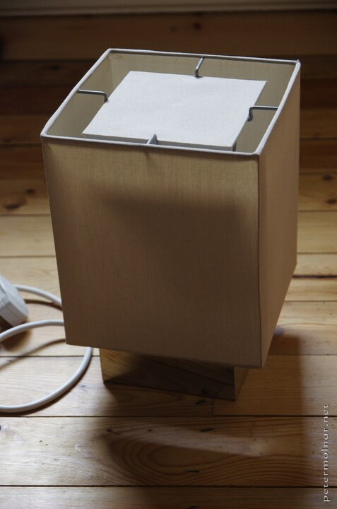

---
author:
    email: mail@petermolnar.net
    image: https://petermolnar.net/favicon.jpg
    name: Peter Molnar
    url: https://petermolnar.net/
copies:
- http://web.archive.org/web/20210207142823/https://petermolnar.net/article/diy-sunrise-lamp/
published: '2021-02-07T12:30:00+00:00'
summary: I made a smart wake up lamp, just to see if it is better, than a
    normal alarm clock. It is an insane difference, waking up is so much nicer,
    and subtle, than before, so I recommend doing one.
title: DIY smart wake up lamp with IKEA, Sonoff D1 Dimmer, and Domoticz

---

------------------------------------------------------------------------

**WARNING: this tutorial contains works on a unit that runs on mains
electricity. Be extremely aware that mains electricity is dangerous, and
could kill you, or anyone exposed to it. **

**Please also note that in certain countries, like Australia, you need
to be a licensed electrician to deal with mains electricity, or you
could be heavily fined.**

**NEVER, EVER TAKE ANYTHING APART THAT IS STILL CONNECTED TO MAINS. **

**DO NOT CONNECT THE DIMMER TO THE MAIN ELECTRICITY UNTIL IT'S SAFE**

**I am not liable for any damage or injury that could happen due to
following this tutorial**

------------------------------------------------------------------------

## Why not a smart bulb?

When I started out with Domoticz I wanted to get into Z-Wave, because
from a tech perspective, it's far superior to the rest - or so I
thought. However, the only z-wave equipment I ended up with was our
thermostat and boiler controller, and these two turned out to be a lousy
choice:

-   the thermostat is actually a z-wave controller, and having two
    controllers on the same network is tricky
-   the thermostat is dumb: it doesn't even accept changing the desired
    temperature remotely
-   the boiler controller is hard wired, yet the Aeotec Z-Wave USB stick
    regularly marked it as dead, resulting needing a full network reset

The reason for not making everything into z-wave was due to the bad
experiences with these ones, and because it's way more expensive, than
anything else.

Before getting into this project, I bought an IKEA smart bulb, namely a
TRÅDFRI white spectrum dimmable one. I'm not going to link it, because
it's not a good product (especially for the purpose of a wake up lamp),
for two reasons:

-   the initial dim level - where the lamp turns on - is way too bright,
    close to 40-50% of the total possible brightness
-   it has a very loud coil whine when it's "off"; apparently this is
    sort of a known issue, and is surprisingly common

The other problem was that it's Zigbee. There is no common zigbee
protocol over USB, and it's an utter mess to get zigbee properly working
with domoticz: one needs a good enough zigbee sniffer, an open source
firmware on it, an mqtt server, and a node.js service that translates
between mqtt and zigbee. In comparison: rflink, a free arduino mega
firmware for 433MHz bridging is essentially plug-and-play.

I could have gone for flashing ESPHome[^1] or Tasmota[^2] on a light
bulb that might be running on Tuya, but I got tired of "maybe I get
lucky and receive the device I actually ordered on eBay".

And this is how I arrived at the Sonoff D1: it's a real dimmer, it can
accept any dimmable bulb, and it runs on WiFi.

## Sonoff D1 Dimmer[^3] {#sonoff-d1-dimmer2}

I've been eyeing the Sonoff products for a while, but until I had an
actual use case for them, I wasn't going to buy one. With the need for a
wake up lamp, I bumped into the D1, and it is a very decent device -
except for one thing, see later.

### DIY mode[^4] {#diy-mode1}

Newer Sonoff devices have something called a "DIY" mode: this turns the
sonoff device's web interface to accept API calls directly. It's a
simple, reversible, official process, and you'll end up with a device
that can be easily commaneded with mere HTTP calls.

**Note: to turn on DIY mode on the D1 you still the 433MHz remote
controller.**

### Troubles with the 433MHz remote

The only trouble with D1 is with it's remote controller. The remove is a
433MHz, good looking thing, that can even be mounted as a light switch
on the wall. There's but one funny thing: apparently it sometimes turns
on on it's own[^5]. This can easily result in the lamp coming on full
100% brightness at 4am. Yes, it did happen to me.

One solution is crude, but works: un-pair the remote from the D1. After
this, if you have a 433MHz bridge, like and rflink[^6] you could map the
buttons to devices in domoticz and trigger and API call to the D1, so
the remote still functions as intended. Since un-pairing the remote, I
had no fun surprises in the middle of the night.

There might be another solution which involves adding an rc filter to
the device[^7] but I didn't want to solder just yet, so I can't verify
if it works.

## The base: an old(ish) IKEA lamp

I have two IKEA SÅNGEN Table lamps that have been out of production for
a while. The good thing about them is that they have an open bottom base
with plenty of space in there to attach the D1.




Notice the tape over the connectors if the D1: **you MUST cover the
electrical connectors with insulating tape!** This is no joke. The D1
was never planned to be use like this, it was made to be an internal or
in wall element. Without the tape **it exposes barely sunk mains
cables:**


I also replaced the bulb fixture: the original it was an E14, and most
of the bulbs in our home are B22; it's simpler to have everything as
B22.


I opted for a halogen bulb: unlike LED, halogen can be properly dimmed,
from near no light to full brightness.


## Domoticz

### Plugin for the Sonoff DIY mode

Not so surprisingly nobody fiddled with the D1 Dimmer in DIY mode wired
into Domoticz, so I wrote a plugin - consider the plugin to be in beta
stage, given I've been running it for a few months now, without any real
issues (well, once the initial bugs were ironed out). It's also on
Github[^8].

This is a Python plugin; your Domoticz has to support Python plugins in
order to work.

`/path/to/your/domoticz/dir/plugins/sonoff-d1-diy/plugin.py`

```python
__author__ = "Peter Molnar"
__maintainer__ = "https://petermolnar.net"
__email__ = "mail@petermolnar.net"

"""
<plugin key="sonoff_d1_diy" name="Sonoff D1 Dimmer DIY connector" version="0.1">
    <description>
        <h2>Sonoff D1 Dimmer DIY connector</h2><br/>
    </description>
    <params>
        <param field="Address" label="Local IP Address" width="200px" required="true" default="192.168.0.1"/>
        <param field="Mode1" label="Port" width="200px" default="8081"/>
        <param field="Mode6" label="Debug" width="150px">
            <options>
                <option label="None" value="0" default="true" />
                <option label="Python Only" value="2"/>
                <option label="Basic Debugging" value="62"/>
                <option label="Basic+Messages" value="126"/>
                <option label="Connections Only" value="16"/>
                <option label="Connections+Python" value="18"/>
                <option label="Connections+Queue" value="144"/>
                <option label="All" value="-1"/>
            </options>
        </param>
    </params>
</plugin>
"""
import Domoticz
import json


class BasePlugin:
    httpConn = None
    oustandingPings = 0
    connectRetry = 3

    def __init__(self):
        return

    def onStart(self):
        if Parameters["Mode6"] != "0":
            Domoticz.Debugging(int(Parameters["Mode6"]))

        self.httpConn = Domoticz.Connection(
            Name=Parameters["Address"],
            Transport="TCP/IP",
            Protocol="HTTP",
            Address=Parameters["Address"],
            Port=Parameters["Mode1"],
        )
        self.httpConn.Connect()

    def onStop(self):
        self.httpConn.Disconnect()
        self.httpConn = None
        Domoticz.Log("onStop - Plugin is stopping.")

    def onConnect(self, Connection, Status, Description):
        if Status == 0:
            Domoticz.Debug("Connected to Sonoff DIY interface")
            self.query_status(Connection)
        else:
            Domoticz.Log(
                "Failed to connect ("
                + str(Status)
                + ") to: "
                + Parameters["Address"]
                + ":"
                + Parameters["Mode1"]
                + " with error: "
                + Description
            )

    def onMessage(self, Connection, Data):
        try:
            strData = Data["Data"].decode("utf-8", "ignore")
            strData = json.loads(strData)
            # Status = int(Data["Status"])
            Domoticz.Debug("Parsed JSON:" + json.dumps(strData))
            self.oustandingPings = self.oustandingPings - 1
        except:
            Domoticz.Error("Failed to parse response as JSON" + strData)
            return

        if "data" in strData and "deviceid" in strData["data"]:
            return self.update_device(strData["data"])


    def onCommand(self, Unit, Command, Level, Hue):
        Domoticz.Debug(
            "onCommand called for Unit "
            + str(Unit)
            + ": Parameter '"
            + str(Command)
            + "', Level: "
            + str(Level)
        )

        # in case of 'on' and 'off', the dimmable endpoint doesn't seem to respect the switch status
        if "on" == Command.lower():
            url = "/zeroconf/switch"
            data = {"switch": "on"}
            n_value = 1
        elif "off" == Command.lower():
            url = "/zeroconf/switch"
            data = {"switch": "off"}
            n_value = 0
        else:
            url = "/zeroconf/dimmable"
            if Level > 0:
                switch = "on"
                n_value = 1
            else:
                switch = "off"
                n_value = 0
            data = {"switch": switch, "brightness": Level}
        self.httpConn.Send(
            {
                "Verb": "POST",
                "URL": url,
                "Headers": {"Content-Type": "application/json"},
                "Data": json.dumps({"deviceid": "", "data": data}),
            }
        )
        self.query_status(self.httpConn)

    def onDisconnect(self, Connection):
        Domoticz.Log(
            "onDisconnect called for connection to: "
            + Connection.Address
            + ":"
            + Connection.Port
        )

    def onHeartbeat(self):
        try:
            if self.httpConn and self.httpConn.Connected():
                self.oustandingPings = self.oustandingPings + 1
                if self.oustandingPings > 6:
                    Domoticz.Log(
                        "Too many outstanding connection issues forcing disconnect."
                    )
                    self.httpConn.Disconnect()
                    self.nextConnect = 0
                else:
                    self.query_status(self.httpConn)
            elif self.httpConn:
                # if not connected try and reconnected every 3 heartbeats
                self.oustandingPings = 0
                self.nextConnect = self.nextConnect - 1
                if self.nextConnect <= 0:
                    self.nextConnect = 3
                    self.httpConn.Connect()
            else:
                self.onStart()
            return True
        except:
            Domoticz.Log(
                "Unhandled exception in onHeartbeat; resetting"
            )
            self.httpConn = None
            self.onStart()

    def update_device(self, data):
        # create new devices if the don't exist just yet
        existing_devices = [d.DeviceID for d in Devices.values()]
        if data["deviceid"] not in existing_devices:
            # I guess brightness is only present in a dimmer
            # I could be wrong
            if "brightness" in data:
                Domoticz.Device(
                    Name=data["deviceid"],
                    Unit=1,
                    Type=244,
                    Subtype=73,
                    Switchtype=7,
                    DeviceID=data["deviceid"],
                ).Create()

        # now the device certainly exists, so find it
        device = None
        for index, d in Devices.items():
            if data["deviceid"] == d.DeviceID:
                device = Devices[index]

        if not device:
            Domoticz.Error("something is wrong: the device was not found?!")
            return

        if "switch" in data and "brightness" in data:
            if data["switch"] == "on":
                n_value = 1
            else:
                n_value = 0
            s_value = str(data["brightness"])
            # SignalLevel: see https://stackoverflow.com/a/31852591
            device.Update(
                nValue=n_value,
                sValue=s_value,
                SignalLevel=min(
                    max(2 * (data["signalStrength"] + 100), 0), 100
                ),
                BatteryLevel=100,
            )

    def query_status(self, Connection):
        Connection.Send(
            {
                "Verb": "POST",
                "URL": "/zeroconf/info",
                "Headers": {"Content-Type": "application/json"},
                "Data": json.dumps({"data": ""}),
            }
        )

global _plugin
_plugin = BasePlugin()


def onStart():
    global _plugin
    _plugin.onStart()


def onStop():
    global _plugin
    _plugin.onStop()


def onConnect(Connection, Status, Description):
    global _plugin
    _plugin.onConnect(Connection, Status, Description)


def onMessage(Connection, Data):
    global _plugin
    _plugin.onMessage(Connection, Data)


def onCommand(Unit, Command, Level, Hue):
    global _plugin
    _plugin.onCommand(Unit, Command, Level, Hue)


def onNotification(Name, Subject, Text, Status, Priority, Sound, ImageFile):
    global _plugin
    _plugin.onNotification(
        Name, Subject, Text, Status, Priority, Sound, ImageFile
    )

def onDisconnect(Connection):
    global _plugin
    _plugin.onDisconnect(Connection)


def onHeartbeat():
    global _plugin
    _plugin.onHeartbeat()
```


### DzVents wake up script

Unless I overlooked it, there isn't a simple functionality to add custom
timed dimmer in domoticz, but it's simple to add one as a DzVents event
script:

```lua
return {
    on = {
        timer = {
            'at 7:30 on mon,tue,wed,thu,fri'
        }
    },
    execute = function(domoticz, timer)
        domoticz.log('Timer event was triggered by ' .. timer.trigger, domoticz.LOG_INFO)
        -- replace '742' with the id of your D1
        local dimmer = domoticz.devices(742)
        local level = 0
        -- this is ugly, because it fires literally 100 events
        -- to be executed with 3 seconds from eachother for
        -- each % level of brightness - but it works
        -- feel free to alter this for a more subtle or more powerful
        -- wake up experience
        while (level < dimmer.maxDimLevel) do
            level = level+1
            dimmer.dimTo(level).afterSec(level*3)
        end
        -- these were the tricky ones to find:
        -- dim to 1 and not 0, because 0 means turn off, but sadly
        -- doesn't actually set the dim
        dimmer.dimTo(1).afterMin(44)

        -- make sure it's off once it's dimmed to 1%
        dimmer.switchOff().afterMin(45)
    end
}
```

## Closing words

This was surprisingly fun to make. The DIY mode in Sonoff is reasonable
to work with, and if it wasn't for the bug of having the light turning
on randomly when paired with the remote, this would be an incredibly
nice, and affordable device. This was it's a good, and affordably
device.

Don't fiddle with dimmable LEDs; just get a dimmable halogen bulb. I
know it eats more, but it also gives off a more natural (might even say
healthier) light[^9], which will make it a better wake up light.

[^1]: <https://esphome.io/>

[^2]: <https://tasmota.github.io/docs/Tuya-Convert/>

[^3]: <https://amzn.to/36PZfCQ>

[^4]: <http://developers.sonoff.tech/sonoff-diy-mode-api-protocol.html>

[^5]: <https://support.itead.cc/support/discussions/topics/11000030765>

[^6]: <http://rflink.nl/blog2/>

[^7]: <https://www.youtube.com/watch?v=aq8_os6g13s>

[^8]: <https://github.com/petermolnar/domoticz-sonoff-d1-diy>

[^9]: <https://www.researchgate.net/publication/330372622_Recent_Progress_in_Solar_Cell_Technology_for_Low-Light_Indoor_Applications>
