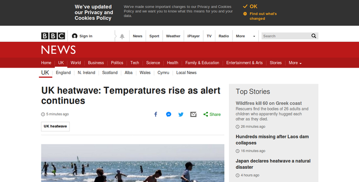

---
author:
    email: mail@petermolnar.net
    image: https://petermolnar.net/favicon.jpg
    name: Peter Molnar
    url: https://petermolnar.net
copies:
- http://web.archive.org/web/20180725140126/https://petermolnar.net/do-websites-want-us-to-use-reader-mode/
- https://news.ycombinator.com/item?id=17609251
published: '2018-07-25T10:30:00+01:00'
summary: The great unreadability of 2018 made Text secondary to Hyper in Hypertext
    Markup Language. Do publishers really want us to keep reading everything
    in the Reader Mode of the browsers?
tags:
- internet
title: Do websites want to force us to use Reader Mode?

---

## Excuse me, sir, but where's the content?

A couple of days ago I blindly clicked on a link[^1] on Hacker News[^2]

-   it was poiting at a custom domain hosted on Medium. Out of
    curiosity, I changed the browser size to external 1280x720 -
    viewport 1280 × 646 -, turned off uBlock Origin[^3] and noscript[^4]
    so I'd mimic a common laptop setup, only to be presented with this:


I don't even know where to start listing the problems.

-   Where's the content?
-   Both the header and the footer are sticky - you scroll, they stay.
    And they eat up 20+% of the available screen.
-   The GDPR warning is covering the main navigation menu.
-   Why is there so much empty space but stack buttons, menus, warning,
    all sticky?
-   The page loads 1.80MB of compiled Javascript. That is nearly billion
    characters to read 8000.


So, foolishly, I started a now flagged thread[^5], begging publishers to
go and start a static blog, or just publish this as a plain, HTML
document. *It would even be better is it was a Word 97 HTML export.*

I decided to keep the browser like that, same resolution, no adblockers,
and visited 2 more sites: bbc.co.uk, and theguardian.com.




Well... at least the BBC doesn't have sticky headers and/or footers.

**How did we get here?**

## Good examples

Let's take a look at something, which is actually readable - a random
entry from Wikipedia:


Note the differences:

-   the menu is on the side
-   the summary of the content is visible on first look

Or another readable thing:


A 31 years old text file - still perfectly readable.

Or loading the first mentioned article in Firefox Reader Mode[^6]:


## Developers gonna developer

So back to that thread. While most of the reactions were positive, there
were opposing ones as well; here are a few of those.

> I barely see the problem. Sure, the header and footer aren't perfect,
> but stupidly large? I also don't feel any "cpu melting javascripts"
> and my PC is barely usable when I compile anything.For me, Medium
> provides a very readable experience that is much better than the
> average static blog. And I don't have to fear a malware ridden page
> like an old Wordpress installation.
> <https://news.ycombinator.com/item?id=17592735>

WordPress comes with it's own can of worms, but it did introduce
automatic security updates in version 3.7[^7] - that was in 2013
October. Any WordPress installation since have been receiving security
patches, and WordPress backports security patches respectfully well.

As for being malware ridden... it doesn't even make it to the news pages
any more when an ad network start spreading malware, but that's still a
thing.[^8]

> Why is it that I only ever hear those complaints on HN and never
> elsewhere... Are you all still using Pentium 3 PCs and 56k modems?
>
> <https://news.ycombinator.com/item?id=17592801>

A couple of years ago Facebook intruduced 2G Tuesdays[^9] and that
should still be a thing for everyone out there. Rural Scotland? There
isn't any phone signal, let alone 3 or 4G. Rural Germany? 6Mbps/1Mbps
wired connections. And that is in Europe. Those who travel enough know
this problem very well, and yes, 1.8MB - *I initially stated 121kB in my
original thread, that was a mistake, and due to uBlock not being
completely off* - of JavaScript is way too much. It was too much when
jquery was served from a single CDN at may even actually got cached in
the browser, but compiled, React apps won't be cached for long.

> \[...\] people nowadays demand rich media content \[...\]
>
> <https://news.ycombinator.com/item?id=17592943>

I remember when I first saw parallax scroll - of course it made me go
"wow". It was a product commercial, I think, but soon everybody was
doing parallax scroll, even for textual content. I was horrible. Slow,
extremely hard to read due to all the moving parts.

There were times when I thought mouse trailing bouncing circles[^10]
were cool. It turned out readable, small, fast text is cooler.

Nobody is "demanding" rich media content; people demand content. For
free, but that is for another day. With some images, maybe even videos -
and for that, we have ``, `<figure>`, `<video>`, with all their
glory.

> \> 121KB javascript is not heavy
>
> Part of the problem is that HTML and CSS alone are horribly outdated
> in terms of being able to provide a modern-looking UI outside the box.
>
> Want a slider? Unfortunately the gods at W3C/Google/etc. don't believe
> in a `<input type="slider">` tag. Want a toggle switch? No
> `<input type="toggle">`. Want a tabbed interface? No
> `<tabs><tab></tab></tabs>` infrastructure. Want a login button that
> doesn't look like it came out of an 80's discotheque? You're probably
> going to need Angular, Polymer, MDL or one of those frameworks, and
> then jQuery to deal with the framework itself. You're already looking
> at 70-80kb for most of this stuff alone.
>
> Want your website to be mobile-friendly? Swipe gestures? Pull to
> refresh? Add another 30-40kb.
>
> Commenting? 20kb.
>
> Commenting with "reactive design" just to make your users feel like
> their comments went through before they actually went through? 50kb.
>
> Want to gather basic statistics about your users? Add another 10kb of
> analytics code.
>
> <https://news.ycombinator.com/item?id=17594649>

This comment is certainly right, when it comes to UI. However... this is
an article. Why would an article need swipe gestures, pull-to-refresh?
Analytics is an interesting territory, but basics are well covered by
analyzing server logs[^11][^12].

Mobile friendly design doesn't need anything at all; it actually needs
less: HTML, by design, flows text to the available width, so any text
will fill the available container.

For web UI, you need those, yes. To display an article, you really
don't.

## Medium vs blogs

I've been told that people/companies most usually post to Medium for the
following reaons:

-   discoverability, the thought that by being on medium, more people
    will find the article
-   it looks more "serious", than a simple blog

As for discoverability, I believe pushing the article link to Reddit,
HN, etc. is a significant booster, but merely putting it on medium
doesn't mean anything. I've had this problem a long while ago, with
personal blogs, as is why is dicoverability never addressed in
re-decentralize topics, but the truth is: there is no real need for it.
Search engines are wonderful, and if your topic is good enough, people
will find it by searching.

The looks more serious problem is funny, given the article I linked is
on their own domain - if I wasn't aware of the generic issues with
Medium layouts, I wouldn't know, it's a Medium article. One could make
any blog look and feel the same. One could export an article from
Typora[^13] and still look professional.

I've heard stories of moving to medium brought a lot more "reads" and
hits on channels, but I'm sceptical. Eons ago I read an article, when
PageRank was still a thing, where a certain site went to be \#1 on
Google for certain phrases without even contaning that phrase - only the
links linking to the site did. The lesson there is that everything can
be playes, and I find it hard to believe that purely posting to Medium
would boost visibility that much. I could be wrong though.

## Proposals - how do we fix this?

### Always make the content the priority

There's an article to read, so let people read it. The rest is secondary
for any visitor of yours.

### Don't do sticky headers/footers

But if you really, really have to, make it certain it's the opposite of
the display layout: for horizontal windows, the menu should be on the
side; for vertical, it should be on the top.

You don't even need JS for it, since it's surprisingly simple to tell
horizontal apart from vertical, even in pure CSS, with media queries:

```css
 @media screen and (orientation:portrait) { … }
 @media screen and (orientation:landscape) { … }
```

### Rich media != overdosed JavaScript

Embrace `srcset`[^14] and serve different, statically pre-generated
images. Seriously consider if you need a framework at all[^15]. *BTW,
React is the past, from before progessive enhancements, an it came back
to haunt us for the rest of the eternity.*

Use one good analytics system. There really is no need for multiple
ones, just make is sure that one is well configured.

Don't install yet another commenting system - nobody cares. Learn from
the bigger players and think it through if you actually need a
commenting system or not[^16].

Some JS is useful, a lot of JS is completely unneeded for displaying
articles. If your text is 8000 characters, there is simply no reasonable
excuse to serve 225x more additional code to "enhance" that.

## Closure

HTML was invented to easily share text documents. Even if it has images,
videos, etc. in them, you're still sharing text. Never forget that the
main purpose is to make that text readable.

There are many people out there with capped, terrible data connection,
even in developed countries, and this is not changing in the close
future. Every kB counts, let alone MBs.

MBs of Javascript has to be evaluated in the browser, which needs power.
Power these days comes from batteries. More code = more drain.

[Keep it simple, stupid](https://en.wikipedia.org/wiki/KISS_principle).

[^1]: <https://blog.hiri.com/a-year-on-our-experience-launching-a-paid-proprietary-product-on-linux-db4f9116be08>

[^2]: <https://news.ycombinator.com/>

[^3]: <https://addons.mozilla.org/en-US/firefox/addon/ublock-origin/>

[^4]: <https://noscript.net/>

[^5]: <https://news.ycombinator.com/item?id=17592600>

[^6]: <https://support.mozilla.org/en-US/kb/firefox-reader-view-clutter-free-web-pages>

[^7]: <https://codex.wordpress.org/Configuring_Automatic_Background_Updates>

[^8]: <https://www.theguardian.com/technology/2016/mar/16/major-sites-new-york-times-bbc-ransomware-malvertising>

[^9]: <https://www.theverge.com/2015/10/28/9625062/facebook-2g-tuesdays-slow-internet-developing-world>

[^10]: <http://dynamicdrive.com/dynamicindex13/trailer.htm>

[^11]: <https://www.awstats.org/>

[^12]: <https://matomo.org/log-analytics/>

[^13]: <https://typora.io/>

[^14]: <https://www.sitepoint.com/how-to-build-responsive-images-with-srcset/>

[^15]: <http://youmightnotneedjquery.com/>

[^16]: <https://motherboard.vice.com/en_us/article/jp5yx8/im-on-twitter-too>