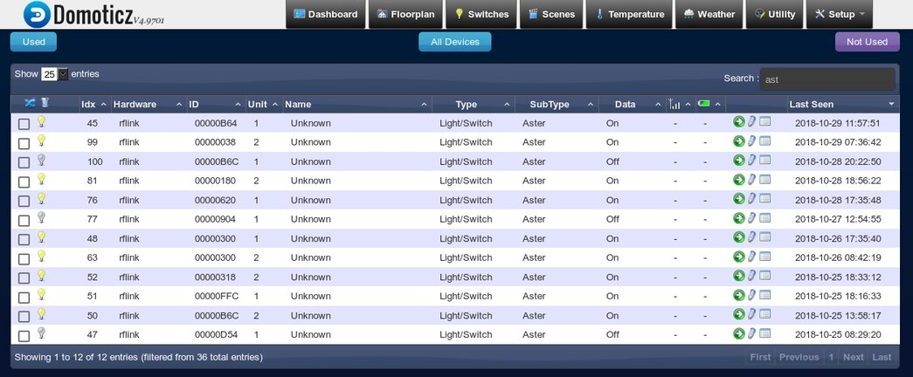
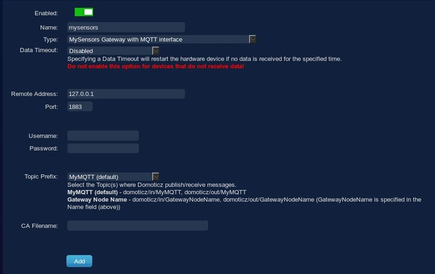

---
author:
    email: mail@petermolnar.net
    image: https://petermolnar.net/favicon.jpg
    name: Peter Molnar
    url: https://petermolnar.net
copies:
- http://web.archive.org/web/20190624125344/https://petermolnar.net/domoticz-rflink-mqtt/
published: '2018-10-29T18:00:00+00:00'
summary: Summary of my experience of adding sensors, and switches to Domoticz
    through MQTT, and RFLink.
tags:
- hardware
title: Domoticz vs sensors

---

## RFLink

I have a couple of 433.92MHz things around me, and recently I developed
an itch to log what is happening with them.

Devices include:

-   a Yale HSA6400 alarm system (door contact sensors, pir sensor,
    siren, main unit, keyfobs)[^1]
-   keyfobs for the car gate of the block of flats we're living in
-   some Energie RC wall sockets[^2]

When I started looking for solutions to listen into 433MHz, I found a
weird, extremely cheap project[^3]:

-   get a cheap USB soundcard
-   get a 433MHz receiver and transmitter
-   solder the transmitter to the headphone pins
-   solder the receiver to the mic pins
-   record/play back signals

For my genuine surprise, it works - but it's hard to match the incoming
patterns, so I decided to keep looking.

Next next project I found was the librtlsdr[^4] combined with
rtl\_433[^5] - it converts a USB DVB-T TV tuner into a 433MHz receiver.
It' sounded very nice, but at the same time, I found RFLink[^6]. RFlink
is a free, but not open source Arduino Mega firmware that can receive
and send 433MHz/868MHz & 2.4GHz signals from a plethora of devices - and
I had an unused, first generation, made in Italy Arduino Mega around,
that's been waiting to be used for a decade.

### Flashing the ROM

`avrdude` is a simple flashing utility for atmega boards, including
arduinos; it will be needed to flash the ROM.

```bash
sudo apt install avrdude
```

Download and extract the RFLink ROM:

```bash
wget -ORFLink_v1.1_r48.zip https://doc-14-94-docs.googleusercontent.com/docs/securesc/ha0ro937gcuc7l7deffksulhg5h7mbp1/3esqvusiaem47f8nistrrisk5ofk9g6g/1540800000000/03880776249665269026/*/0BwEYW5Q6bg_ZLWFJUkY4bDZacms?e=download
unzip -d RFLink_v1.1_r48 RFLink_v1.1_r48.zip
cd RFLink_v1.1_r48
```

Note: I hardcoded the v48 version in this tutorial. Visit
<http://www.rflink.nl/> to see if there's a newer one.

Once the Arduino is connected, it'll show up as 'arduino mega' in dmesg,
so find the device and flash the ROM as:

```bash
megausbdev="$(sudo dmesg  | grep -i 'arduino mega' | head -n1 | cut -d":" -f1 | awk '{print $3}')"
megattydev="$(sudo dmesg | grep "cdc_acm ${megausbdev}" | grep tty | cut -d":" -f3 | head -n1)"
sudo avrdude -v -p atmega2560 -c stk500 -P "/dev/${megattydev}" -b 115200 -D -U flash:w:RFLink.cpp.hex:i
```

Note: dmesg could be used without sudo if the sysctl parameter
`kernel.dmesg_restrict` is set to `0`.

Once this is done, wait until the mega reboots; after that, using
`minicom`, we can verify if it's working.

```bash
sudo apt install minicom
```

```bash
minicom -b 57600 -D "/dev/${megattydev}" -w
```

You should see something like this:

    Welcome to minicom 2.7.1

    OPTIONS: I18n
    Compiled on May  6 2018, 08:02:47.
    Port /dev/ttyACM3, 15:10:35

    Press CTRL-A Z for help on special keys

    teway V1.1 - R48;
    20;00;Nodo RadioFrequencyLink - RFLink Gateway V1.1 - R48;

To exit, press `CTRL+a` then `q`.

To make the device always show up on the same `/dev` path, add the
following `udev` rule:

`/etc/udev/rules.d/99-rflink.rules`

    # arduino mega as RFLink
    SUBSYSTEMS=="usb", ATTRS{idVendor}=="2341", ATTRS{idProduct}=="0010", SYMLINK+="rflink"

If needed, restart udev:

```bash
sudo udevadm trigger
```

### Physical wiring

There is a very nice, detailed tutorial in the RFLink website about
connecting the different devices to the Mega itself at:
<http://www.rflink.nl/blog2/wiring>

## Domoticz[^7] {#domoticz3}

Domoticz is a home automation platform, which is very easy to set up,
has a simple HTTP interface, and can log all those switches and devices
I'm interested in.

### Getting & starting Domoticz

```bash
sudo mkdir /opt/domoticz
cd /opt/domoticz
sudo wget https://releases.domoticz.com/releases/release/domoticz_linux_x86_64.tgz
tar xf domoticz_linux_x86_64.tgz
sudo /opt/domoticz/domoticz -www 8080 -sslwww 0 -dbase /opt/domoticz/domoticz.db -wwwroot /opt/domoticz/www -userdata /opt/domoticz -log -syslog
```

Now visit the server IP on port 8080 in your browser and get started
with the setup.

### Adding RFLink

1.  Connect the RFLink device to your server

2.  Find the ttyACM device for the RFLink

```bash
megausbdev="$(sudo dmesg  | grep -i 'arduino mega' | head -n1 | cut -d":" -f1 | awk '{print $3}')"
sudo dmesg | grep "cdc_acm ${megausbdev}" | grep tty | cut -d":" -f3 | head -n1)
# this will print something like: ttyACM3
```

3.  Go to the Domoticz web interface

4.  Go to `Setup`, then `Hardware`

5.  In the `Type` drop down, select `RFLink Gateway USB`

6.  give it a name

7.  `Serial Port` should be the ttyACM port for the RFLink

Once done, the RFLink will start sniffing all the signals it can pick
up, and your devices will start showing up in the `Devic` menu, under
`Setup`:



### Notes and finds about my sensors

Energie wall sockets
:   They send on and off separately, but their signal doesn't always
    seem to reach the RFLink properly. Still working on them. No extra
    setup is needed, their default `On/Off` type is what they actually
    are.

Yale HSA6000 PIR sensors
:   The send on, soon after off, and they have a re-arm time of \~6
    minutes. Once detected, they initially show up as Light sensor; this
    can be changed by first enabling the devices (clicking on the green
    arrow in the `Devic` menu, under `Setup` ), then going into
    `Switches`, clicking `Edit` on the sensor, and selecting the
    `Motion sensor` option in `Switch type`.

Yale HSA6000 door/window contacts
:   They only send on signal when an open is triggered; pressing the
    button sends an off. There is no way to know whether they are still
    open or already closed. They need to be set up as `Push on button`
    once they are enabled (clicking on the green arrow in the `Devic`
    menu, under `Setup` ) by going into `Switches`, clicking `Edit` on
    the sensor, and selecting the `Push on button` option in
    `Switch type`. `Door contact` type expects an `off` signal, so these
    are not proper door contacts.

gate keyfobs
:   I had to set the up as `Push off button`s; if I set them as push on
    buttons, they log 'off' entries when they are pressed.

## MQTT

A few months ago I managed to set up collectd[^8] to process I²C data
via a barely known linux subsystem, Industrial I/O, with the help of a
few bash scripts[^9]. In theory, Domoticz can deal with I²C on it's own

-   unfortunately it doesn't yet work on x86 platforms, and it can only
    do a few types of sensors. Besides that, I didn't want to lose the
    collectd data, given that Domoticz is only an experiment for now, so
    I started looking into my options. Domoticz have an excessive
    API[^10], but it's rather uncomfortable to use it, because you need
    to keep track of sensor and hardware IDs.

Fortunately, there is a workaround: using MQTT as middle ground,
utilizing the MySensors serial protocol[^11].

A bit of explanation: MySensors is an open framework, both hardware and
software components, to build custom sensors. On of the methods of
sharing sensor information between sensors and controllers is via MQTT,
a lightweight pubsub system.

The incredibly convenient part of it is that the information is
push-based: Domoticz picks up new sensors if the initialization of them
is sent, so no pre-setup, no tracking of internal Domoticz IDs are
needed.

### MQTT server

I'm not going into the details of setting up an MQTT service, because
it's very simple; on Debian, it's more or less:

```bash
sudo apt install mosquitto
sudo systemctl enable mosquitto
sudo systemctl start mosquitto
```

In order to issue updates from bash, the mosquitto clients pack is
needed as well:

```bash
sudo apt install mosquitto-clients
```

### MySensors MQTT in Domoticz

1.  Go to `Setup`, then `Hardware`
2.  In the `Type` drop down, select
    `MySensors Gateway with MQTT interface`
3.  give it a name
4.  `Remote Address`, in our case, is `127.0.0.1`
5.  Port is `1883`
6.  Leave `Username` and `Password` empty, unless you set up
    authentication in your MQTT server
7.  `Topic Prefix` should be `MyMQTT (default)`



### Sending sensor data with bash into MQTT

#### Initiate the sensor meta information

For Domoticz to know about the sensor - the type, the unit, etc - the
sensor needs to be initialized; this is done with the `presentation`
command when it comes to MySensors.

```bash
mosquitto_pub -t "domoticz/in/MyMQTT/${node_id}/${sensor_id}/0/0/${TYPE}" -m "${sensor_name}"
```

In details:

-   **domoticz/in/MyMQTT** is the main topic, it's the default for
    Domoticz to listen on for MySensors MQTT
-   **\${node\_id}** is the "group" of sensors; in case of my BME280,
    because it uses the 0x77 I²C address, I used 77.
-   **\${sensor\_id}** is a number for the specific sensor. The BME280
    has a temperature, a humidity, and a pressure sensor, I used 1, 2,
    and 3 for them.
-   **0** indicates this is a presentation command
-   the next **0** indicates this is a normal message
-   **\${TYPE}** is the sensor type, from the list at:
    <https://www.mysensors.org/download/serial_api_20#presentation> In
    case of the BME280, it's 6 for temperature (S\_TEMP), 7 for humidity
    (S\_HUM), and 8 for pressure (S\_BARO)
-   **\${sensor\_name}** is a name for the sensor (or the node. I'm
    still figuring this part out)

#### Sending sensor value updates

Unlike the previous initiation, this is a value update for our sensor:

```bash
mosquitto_pub -t "domoticz/in/MyMQTT/${node_id}/${sensor_id}/1/0/${METRICTYPE}" -m "${value}"
```

In details:

-   **domoticz/in/MyMQTT** same as above
-   **\${node\_id}** same as above
-   **\${sensor\_id}** same as above
-   **1** indicates this is a set command
-   the next **0** indicates this is a normal message
-   **\${METRICTYPE}** is the metric type sent, from the list at:
    <https://www.mysensors.org/download/serial_api_20#set,-req> In case
    of the BME280, it's 0 for temperature (V\_TEMP), 1 for humidity
    (V\_HUM), and 4 for pressure (V\_PRESSURE)
-   **\${value}** is the sensor readout value


**Working examples are in my git repository for collectd[^12].**

Happy hacking.

[^1]: <https://www.yaleasia.com/en/yale/yale-asia/products/yale-alarms/wireless-alarm-systems/b-hsa6400---yale-premium-series-home-security-alarm-system/>

[^2]: <https://www.amazon.co.uk/Energenie-Remote-Control-Sockets-Pack/dp/B004A7XGH8>

[^3]: <https://rurandom.org/justintime/w/Cheapest_ever_433_Mhz_transceiver_for_PCs>

[^4]: <http://osmocom.org/projects/sdr/wiki/Rtl-sdr>

[^5]: <https://github.com/merbanan/rtl_433>

[^6]: <http://www.rflink.nl/blog2/easyha>

[^7]: <https://www.domoticz.com/>

[^8]: <https://collectd.org/>

[^9]: <https://github.com/petermolnar/collectd-executors>

[^10]: <https://www.domoticz.com/wiki/Domoticz_API/JSON_URL's>

[^11]: <https://www.mysensors.org/download/serial_api_20>

[^12]: <https://github.com/petermolnar/collectd-executors>