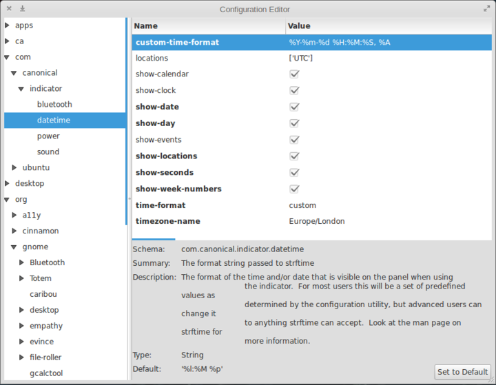

---
author:
    email: mail@petermolnar.net
    image: https://petermolnar.net/favicon.jpg
    name: Peter Molnar
    url: https://petermolnar.net
copies:
- http://web.archive.org/web/20190624125409/https://petermolnar.net/elementaryos-customize-date-time-in-wingpanel/
published: '2013-05-10T08:55:02+00:00'
summary: 'Quick hack for elementaryOS time display: use custom format.'
tags:
- linux desktop
title: 'elementaryOS: customize date & time in wingpanel'

---

Currently elementaryOS[^1] does not allow you to enter custom string for
the date format showed at the top of the screen in wingpanel, but
fortunately, there's an easy way to change it.

Open up slingshot, type `dconf-editor` and launch it ( if it's not
installed, you need to install it via `apt-get install dconf-editor` ).
This brings up a configuration editor. Navigate to com \> canonical \>
indicator \> datetime and edit the entry `custom-time-format` as you
like. Change `time-format` to `custom` and you're done; it's going to
change immediately.

To see the possibilities, enter `man strftime` to terminal.

The outcome:

[^1]: <http://elementaryos.org>