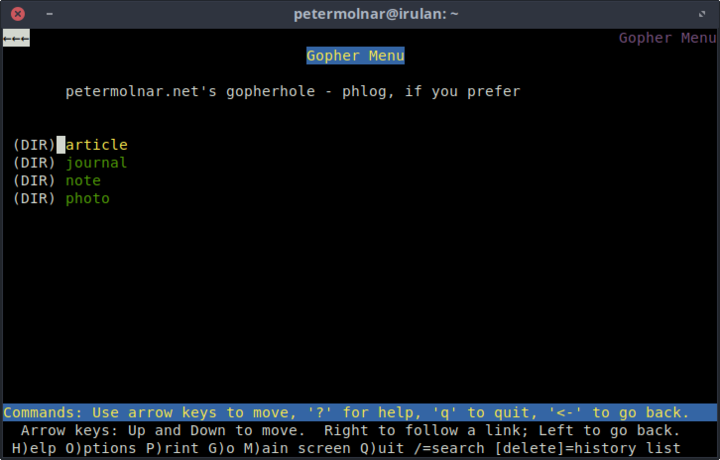

---
author:
    email: mail@petermolnar.net
    image: https://petermolnar.net/favicon.jpg
    name: Peter Molnar
    url: https://petermolnar.net
copies:
- http://web.archive.org/web/20190624125501/https://petermolnar.net/gopher/
published: '2019-02-26T22:00:00+00:00'
summary: Since last weekend, I'm serving my site over gopher as well. Yes,
    that nearly forgotten 90s protocol. And it's not even an april fools joke.
tags:
- retrocomputing
title: Gopher? Gopher.

---

"BBS The Documentary" from Jason Scott[^1] showed me a world I never
touched, never experienced - *Eastern Europe and dial up in the 80s...
we didn't even have a phone line until the early 90s at home*. So I
eagerly started digging on how to set up a BBS, to at least get a minor
feel from the time of WarGames[^2], only to realize, I'd most probably
need to write the whole thing from scratch. Not that is wouldn't be fun,
but it wouldn't be enough fun.

Soon I forgot about it, until about week ago an unusual entry popped up
on Hacker News[^3]: We must revive Gopherspace[^4] - from 2017.

The basis of the entry describes how ugly the web has become with all
the tracking, ads, attention driven social media, an puts it in constast
with the purity of Gopher. HTTP and HTML are absolutely fantastic pieces
of engineering - but indeed they became bloated and abused. Gopher on
the other hand, is time travel, to a time when a global network was
completely new.

After reading a bit about the Gopher protocol[^5], I have to say: of
course it's pure, it needs to be compared with HTTP 1.0 and HTML 1,
because it never got a 2.0. It certainly has that oldschool feeling of
following links around, finding bottomless servers that has been sitting
around for 20+ years with content.

I wanted to contribute to this tiny community of literally just hundreds
of servers around the world.

The Python script[^6] I generate my website with uses markdown source
content files and Pandoc[^7] creates nice HTML out of them. Apparently
it can also create 80 columns wrapped plain text just as easily. Setting
up `pygopherd`[^8] is pretty straightforward as well.

The only difference from the docs you might find in case of `pygopherd`
is that the `gophermap` files don't need the `i` in front of ordinary
text content.

An example snippet:

    petermolnar.net's gopherhole - phlog, if you prefer

    1article    /category/article   petermolnar.net 70
    1journal    /category/journal   petermolnar.net 70
    1note   /category/note  petermolnar.net 70
    1photo  /category/photo petermolnar.net 70

will look like:

or

    article - petermolnar.net

    0A journey to the underworld that is RDF        /web-of-the-machines/index.txt  petermolnar.net 70
    I got into an argument on Twitter - it made me realize I don’t know
    enough about RDF to argue about it. Afterwards I tried out a lot of
    different ways to drew my own conclusions on RDF(a), microdata, JSON-LD,
    vocabularies, schema.org, etc. In short: this one does not spark joy.
    Irdf-it-does-not-spark-joy      /web-of-the-machines/rdf-it-does-not-spark-joy.jpg      petermolnar.net 70
    Igsdtt_microdata_error_01       /web-of-the-machines/gsdtt_microdata_error_01.png       petermolnar.net 70
    Igsdtt_microdata_error_02       /web-of-the-machines/gsdtt_microdata_error_02.png       petermolnar.net 70
    Igsdtt_rdfa_error_01    /web-of-the-machines/gsdtt_rdfa_error_01.png    petermolnar.net 70
    Igsdtt_rdfa_error_02    /web-of-the-machines/gsdtt_rdfa_error_02.png    petermolnar.net 70

    0How to add themes to your website with manual and CSS prefers-color-scheme support     /os-theme-switcher-css-with-fallback/index.txt  petermolnar.net 70
    prefers-color-scheme is a new CSS media query feature, which propagates
    your OS level color preference. While it’s very nice, it’s way too new

There are good guides out there for setting up gopher content[^9], there
is really no need for one more, but if you do have any questions, feel
free to get in touch.

[^1]: <https://www.youtube.com/watch?v=mJgRHYw9-fU&list=PLgE-9Sxs2IBVgJkY-1ZMj0tIFxsJ-vOkv>

[^2]: <https://www.imdb.com/title/tt0086567/>

[^3]: <https://news.ycombinator.com/item?id=19178885>

[^4]: <https://box.matto.nl/revivegopher.html>

[^5]: <https://www.minnpost.com/business/2016/08/rise-and-fall-gopher-protocol/>

[^6]: <http://github.com/petermolnar/nasg>

[^7]: <http://pandoc.org/>

[^8]: <https://github.com/jgoerzen/pygopherd>

[^9]: <https://davebucklin.com/play/2018/03/31/how-to-gopher.html>