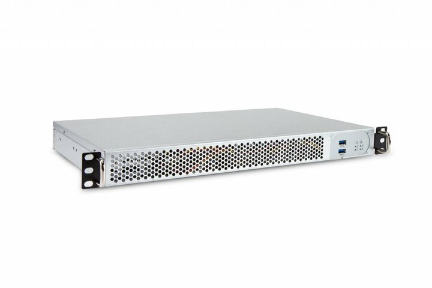

---
author:
    email: mail@petermolnar.net
    image: https://petermolnar.net/favicon.jpg
    name: Peter Molnar
    url: https://petermolnar.net
copies:
- http://web.archive.org/web/20190704184126/https://petermolnar.net/home-server-2019/index.html
published: '2019-06-21T18:00:00+01:00'
summary: For many years I used my former ThinkPads as home servers - built
    in battery, 3G modem, dead silent, sort of too good to be true as a server.
    Unfortunately my storage needs started to outgrow the options, plus my
    RAID0 ZFS decided to die within 2 days of the first alert.
tags:
- hardware
title: Rebuilding my home server on a tight budget

---

*If you have an unlimited budget don't read on: get 2x4TB 2.5" SSDs and
stick them in an old ThinkPad. I still believe it's the perfect home
server.*

## Hardware

Unfortunately I don't have unlimited budget, rather a particularly
limited one. I also I had to put a system together that fits in a very
tight space - England and it's teeny flats - and has at least 4TB,
reliable storage.

I had some spare parts: a 250GB 2.5" LiteON SSD, an ancient 64GB 2.5"
Samsung 470 SSD, 8, 4, and 2 GB DDRIII SODIMMS, but that 4TB meant I
need to think in 3.5" drives, 2 of them at least, to have a real ZFS
mirror.

Considering my as-less-as-possible wallet for this at first I caved in:
I bought a QNAP NAS. I believed their rather convincing marketing about
how advanced these things are. Well, they are not, at least the consumer
ones aren't. I couldn't even find a way to display the raw S.M.A.R.T.
state of the drive, let alone ZFS features. After a long read it turned
out that all those nice features are enterprise-only. I ended up
returning it the next day.

Back to the drawing board.

Places like mini-itx.com and pcpartpicker are absolutely invaluable
tools when it comes to designing a computer from parts, but
unfortunately they don't include old models, or arcane, hard to come by
parts.

The main issue was the lack of space: all the shelves I could place it
on were only 30cm deep. A long time ago I gave a Lian-Li house a go, but
it ended up so cramped inside that I had to give up back then. Also: the
thinner the better. I couldn't believe nobody ever done a 1U house that
fits 2x3.5" drives - I know it's possible, so there should be something
out there!

Then I finally found it. It exists, and it's called inWin IW-RF100S[^1]

A 1U chassis with 1/3 of the normal depth which can take a mini-ITX
motherboard, 2x3.5" drives AND 2x2.5" drives and has a built in PSU!
I've been looking for a case like this for about 4 years now.

Choosing drives was simple: a WD Red 4TB[^2] and a Seagate Ironwolf
4TB[^3]- different brand, different batch, so there can't be same batch
=\> fails the same time problems.

Finding a motherboard on the other hand turned tricky and resulted in
compromises. My original minimum requirements were at least 4xSATA, if
Intel, then AES-NI support in the CPU, \<25W TDP (so passive cooling
would be enough), HDMI (I have no VGA connector capable display at home
any more) and ECC RAM support.

There are nice Supermicro and ASRock Rack server boards with ECC
support, but they only got VGA. They are also pricey and usually without
CPU, so I'd need to hunt down a super rare and rather expensive Intel
Xeon E3-1235LV5 for that 25W TDP. It's an insanely good CPU, but the
motherboard and this processor would push the setup with and extra £500
at least, more likely with and extra £800, so I dropped the ECC RAM
requirement. *Yes, I know, my ZFS will be destroyed and my bloodline
will be cursed*.

In the end I settled with and ASRock J4205[^4]. It has 10 W TDP, passive
cooling, and fits the remaining requirements.

### Notes and finds

The fans that come with the inWin are **LOUD**. 10+k rpm, proper server
level, vacuum cleaner loudness. I bought a Geli silent fan, but if I
replaced the originals, it became disturbing because the metal railing
for the fans disrupt the airflow. I put it \~2cm further away with a
double sided tape and it's now working fine. The fan makes an average
8°C difference, but even with completely passive cooling, the CPUs,
running at max were \~50°C max.

The PSU fan is surprisingly quiet despite it's size. No need for hacks.

I added a tiny layer of foam under the drive trays, so no wobble
possible at all.

I also added some tiny rubber legs to the case, but I'm leaning towards
buying some anti-resonance domes.

The whole setup fits under an ordinary bookshelf.

### Cost

-   case, inWin IW-RF100S: **£95.99** from [Server Case
    UK](https://www.servercase.co.uk/shop/server-cases/rackmount/1u-chassis/in-win-iw-rf100s---1u-short-depth-server-chassis---250mm-depth-includes-power-supply-iw-rf100s/)
-   motherboard, ASRock J4205-ITX: **£101.99** from
    [Amazon](https://amzn.to/31JLcKS)
-   WD Red 4TB: **£109.00** from
    [eBay](http://www.ebay.co.uk/usr/agregson) (new, with 3 year
    warranty)
-   Seagate 4 TB IronWolf: **£104.99** from
    [Amazon](https://amzn.to/2ZAlFC0) (new, with 3 year warranty)
-   Startech SATA cables: **4x £2.38** from
    [Amazon](https://amzn.to/2ZvANR8) (they have smaller heads and fit
    the rather cramped space in this box better)
-   LiteOn 256GB SSD: £0 - had it as spare
-   Samsung 470 64GB SSD: £0 - had it as spare
-   memory - 8GB DDR3 SO-DIMM: £0 - had it as spare

**Total: £421.49**

## Operating system

### ZFS vs linux: the drama keeps rollin'

As my previous system was, my laptop system, and my main server system
is Debian, I obviously installed Debian initially. The difference, in
this case was, that wanted to stick to Stable and not faff around with
Unstable at all.

I've been having disappointing experiences with the linux community for
years now, starting with pulseaudio, that lead into systemd, but I
managed to overcome this. Every single time I tried FreeBSD I got burnt
on something, so I wasn't keen to compromise my main backup system
again.

Until...

Until I started reading of the next beauty of the linux kernel community
who I now believe is repeating the errors of anyone on the topic of the
food chain - namely about how a feature deprecation broke ZFS on Linux
(ZoL).

> My tolerance for ZFS is pretty non-existant. Sun explicitly did not
> want their code to work on Linux, so why would we do extra work to get
> their code to work properly?
>
> \- Greg Kroah-Hartman[^5]

That is really not the community I believed linux was. It used to be the
underdog, the one that always found a way to make things work on it,
even if it was via reverse engineering close source.

This, on it's own may not have been a breaking point, but something
extra happened. After building that mirror ZoL pool on Linux I
eventually decided to try FreeNAS and I tried to import the pool. Except
I couldn't.

> The Linux hate is strong today. zpool feature
> "org.zfsonlinux:userobj\_accounting (User/Group object accounting.)".
> They added Linux-only features to zpool - and made them active by
> default when creating pools with no special argument. WTF! \#zfs
>
> \- Martin Cracauer[^6]

ZoL enabled a few extra features *by default* which is not supported in
any other ZFS implementation yet, so if you want to mount a pool, you
can only do it read-only and even then it needs some trickery.

ZFS is a brilliant filesystem and is one of the key, bare minimum
requirements for my storage. It's more important than the operating
system on top of it.

### Enter FreeNAS

So I installed FreeNAS, rebuilt the mirror (with 4TB, the whole
linux-FreeNAS dance took nearly a full 24 hours of copying data here,
then there), and started getting familiar with the FreeNAS interface.

I have to admit that I like it. The new web GUI of FreeNAS 11 is clear,
simple, and offers a lot of neat utility: cloud sync (so I can back up
my cloud things on my NAS, not the other way around), alerting, even
collectd is on by default.

The plugins and jails are very nice, the virtual machines support is
decent, so if I do ever have to run Debian again, I could.

The disk layout I ended up with:

-   the two 4TB drives are in mirror - ideally set this up from the
    start, if not, re-create the partition table that's present on one
    to the other, so their size don't disagree
-   the 64GB SSD is the operating system and holds the .system dataset
-   the 256GB SSD holds the jails and sort of temporary things, like
    syncthing data

For now, I'm happy.

### Notes and finds

-   some commands I regularly use on Linux exist on FreeNAS, but it's
    not the same. `watch` is completely different. NEVER use `killall`
-   use VNET for the jails, otherwise your home router gets confused for
    one mac address having multiple IPs
-   some plugins need raw sockets enabled in the advances settings of
    the jail to work properly, eg. proxies with CONNECT option

## Closure

I've learnt a lot from this experience. Nothing in my former system was
telling me there's something wrong with one of the drives apart from ZFS
- smart still says the disk is healthy. Trust ZFS.

The FreeNAS GUI is nice and might even work for non-IT/non-sysadmin
people. If you have a spouse who should have access to these as well,
it's a highly appreciated factor.

Linux may have lived long enough to start becoming the villain.

[^1]: <https://www.ipc.in-win.com/IW-RF100S>

[^2]: <https://www.wd.com/products/internal-storage/wd-red.html#WD40EFRX>

[^3]: <https://www.seagate.com/gb/en/internal-hard-drives/hdd/ironwolf/>

[^4]: <https://www.asrock.com/MB/Intel/J4205-ITX/index.us.asp>

[^5]: <https://marc.info/?l=linux-kernel&m=154714516832389&w=2>

[^6]: <https://twitter.com/MartinCracauer/status/1007399058355445760>