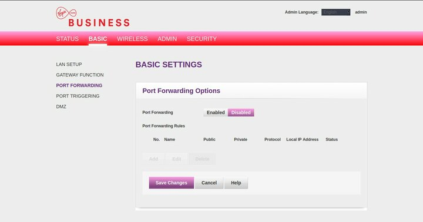
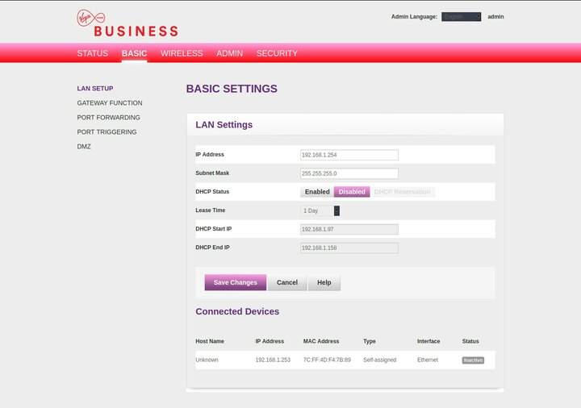
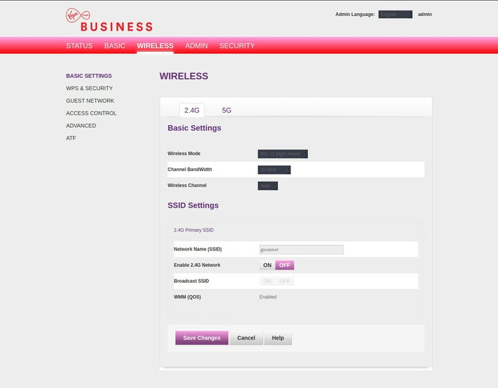
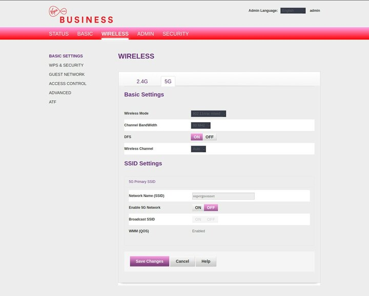
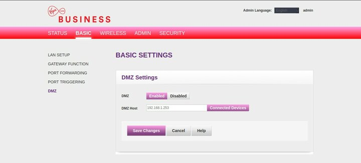

---
author:
    email: mail@petermolnar.net
    image: https://petermolnar.net/favicon.jpg
    name: Peter Molnar
    url: https://petermolnar.net
copies:
- http://web.archive.org/web/20200505084949/https://petermolnar.net/home-server-downsizing/index.html
published: '2020-05-04T17:00:00+01:00'
summary: Lately I've found myself spending way too much time and effort on
    my home server while not solving any of the issues I uncovered. It was
    time to take a step back.
tags:
- hardware
title: Rethinking, downsizing, and revisiting the idea of a home server

---

Over a decade ago I had a rented KVM. It had 128MB memory, negligible
disk space, but it was enough to run some website and mailing.
Eventually I bought a second hand 1U HP node, which was nice, but also
near impossible to upgrade (SCSI disks, pricey, ancient ECC memory,
etc). In 2012 I heard about Hetzner[^1] and had a rented server from
them ever since, until a few months ago.

When we moved houses we had to switch ISPs. My beloved previous ISP,
Zen[^2], due to the lack of fibre in the local exchange, could only
offer 16/1Mbps ADSL, which is not enough for these days. The only speedy
alternative with static IP was the dreaded Virgin Media Business.
Unuware of all the mess it will bring into my life - their participation
in the IWF block list, the fact that their "static" IP is a GRE
tunnel[^3], the frequent outages caused by T3 timeouts[^4] triggering a
router reboot that lasts 20 minutes, etc - I foolishly moved my services
to my home server[^5].

With this move, apart from the reliability issues, I eliminated an
important factor I had: off-site backups. I thought I can simply replace
this with an external hard drive and monthly offline archiving, but
other issues started to pile up. The home server lived under a cabinet,
which is nice, but far from being physically secure. We were burglared
once and got very lucky - barely anything was taken - it made me be
aware of such events. That offline single copy is also in my house,
albeit in a fire safe, and it certainly didn't contain up to date copies
of the website data. Because we now have hard floor, and that the area
is eerily quiet during the night, I heard the machine way too well at
late hours.

Another trouble was FreeNAS. The goal of running FreeNAS was have a GUI
that less technical people could use as well, but the moment I started
using jails, custom devfs rulesets, etc., the FreeNAS interface became
rather complicated immediately.

Then there were the failed ideas with the server's physical existence.

1.  I tried to make a "custom case" by putting all components in a
    drawer. It failed, because I failed to realize how much space
    cabling would need
2.  I was at the second "silent" fan - I have to tip my hat towards
    Noctua, their fans are actually pretty nice - but I still couldn't
    fit in properly in the case, which was meant to house some 10k rpm
    jet engines 

3.  I was constantly thinking of needing more drives to have RAID on
    everything 
4.  I bought car deadening mats[^6] to silence the machine, and while it
    worked a bit, it didn't nearly work well enough. *3.5" drives are
    NOISY, I forgot how noisy they are, because 20 years ago my
    computers at home were not running 24/7.*
5.  I ended up puting a \$5 DigitalOcean droplet as caching nginx proxy
    in front of the setup to prevent downtimes of the websites
6.  I spent days trying to find a better PC case 

... and the list goes on, so at this point I decided to take a step
back.

## The question I should have started with: what do I need?

Instead of thinking about "simplifying" by moving to a single machine,
"saving money" by canceling the rented server I should answer the needs.

I need:

-   a reliable 24/7 server for web, email, xmpp, etc.,
-   backup server for this server's data
-   local backups for our laptops
-   off-site backups
-   archives
-   a media renderer
-   something that can host Domoticz

So let's go one by one.

## A reliable 24/7 server and off-site backups: back to Hetzner

Hetzner is a wonderful provider, and though their hardware fleet is a
bit aging now, it's still going strong. For roughly €30 a month, one can
get a machine of with an Intel Xeon E3-1245, 2x Enterprise level 3.0 TB
SATA HDD, 4x 4GB ECC RAM. That is more, than enough to run the services,
plus the off-site backups.

I decided to stick to FreeBSD, mainly because of the smooth ZFS
experience, and because it certainly feels ile oldschool sysadmining.

## Backup server, local backups, Domoticz: home server revisited

I had some hardware lying around, namely a lot of 2.5" drives: an 1TB
HGST Travelstar, a 2TB Samsung Spinpoint, an 1TB Toshiba SSHD. These
used to be the drives in my previous home server, when it manifested as
a ThinkPad T400 laptop, but when the 2TB Spinpoint started to throw ZFS
errors, I panicked, and moved to 3.5" drives. Ever since then I ran
amples of tests on that drive and never found any issue, so when this
day came, it was time to add it back.

One of the pain points of trying to find a case was trying to find a
board with enough SATA sockets and a case to commodate it. Truth is, if
you get angry enough you realize that if you don't overdo it, USB is
actually enough(ish). I also happened to find the Thinkcentre Tiny line
of Lenovo, mainly the Thinkcentre M600[^7]: these are low power,
passively cooled, made to be thin client machines, but just enough to
also be home servers. It has 2 USB2, 4 USB3, 2 DisplayPort, 1 Gbit
ethernet, an m.2 slot (also a SATA slot, but it's unusable because of
the heatsink), and it goes nicely with all the ThinkPads at home. I
managed to source one on eBay for \~£60.


As for the disks, I had 3 USB2 enclosures, which was possible to glue on
with a strong, double sided tape on the top of the case, e voilà, my
ugly little duckling home server, that fits inside a drawer, near
silent, and is working remarkably well.


Is it fast? No. But it does the job. *And it's certainly faster than the
WordPress I once ran on a HTC Desire mobile phone. Yeah, don't do that.*


Note: during the external enclosure ventures I made an interesting
discovery. The peak power use of any of my SSDs, both SATA and mSATA, is
1.5A on 5V, whereas the HDDs have peak 900mA[^8] (even though the
sticker says 700mA on the HGST, 850mA on the Samsung, and 1A on the
Toshiba). This is a rather serious problem when you take the USB3 port
capacity into account, which is 900mA - making it unadvised to run
external SSDs off them. The M600 has a "charging" USB3 port, which I'd
assume if giving more power off, so I'm running the Toshiba off that,
but I've given up on the idea of running SSDs over USB \< 3.1.

## Archives

Whenever there's a discussion about archiving, one of the important
points is that the formats - physical media, file format, etc - should
be something that is as future proof and/or as widely used as possible.

Due to the size of the things I'd want to archive - photos over a TB - I
gave up on Blu-Ray. External hard drives, even if they are sub-par on
performance[^9], are OK for write occasionally, maybe read in the
future, so I got a 4TB Seagate USB3 hard drive. But what about the
filesystem?

When I tried to copy from FreeBSD I realized having a common file system
is, surprisingly, nearly unsolved. Ext3/4 is a no go on FreeBSD, ZFS is
obscure for desktop and nonexistent on Windows; problems are similar
with XFS, UFS, etc. I don't trust FAT and 4TB may even be over it's
limits. Which left me with NTFS.

Due to the existence of `ntfs-3g` nearly anything - Windows, Mac, Linux,
BSD, etc - can read and write NTFS, even if compression is on. *(Note:
don't turn ntfs-3g compression on. It's a serious resource hog.)* Plus,
unlike FAt, NTFS is POSIX compliant.

```bash
sudo apt install ntfs-3g
```

My drive was `sdd`, once I made a single partition, mounting it is:

```bash
sudo mkfs.ntfs -s "$(lsblk -d -o name,PHY-SEC | grep sdd | awk '{print $2}')" -f /dev/sdd1
sudo mount -o auto,users,permissions /dev/sdd1 /mnt/
```

And it's all good.

## Media renderer

I covered this already in my previous entry under 'Raspberry Pi 3 as
featherweight headless media renderer'[^10].

## + 1: addressing the router outages

Virgin Media had a nasty series of outages; 6 of them on every first
quarter of the hour. Yep, it does sound like a cronjob. The annoying bit
wasn't really the internet not being available but that whenever the
router reboots, I lose my home network. So I started to look into way
that I could reduce my reliance on the router to an absolute bare
minimum and maybe even had a 4G connection as a fallback.

I still have my previous router from a relatively unknown manufacturer,
AVM, a FRITZ!Box 3490[^11] . AVM is an oldschool German manufacturer,
meaning the have DOCUMENTATION on everything. Plus realiable and rock
solid products.

I turns out that while the 3490 is a VDSL modem/router it can be easily
put into Ethernet mode[^12] or even 4G over USB mode[^13]. Unfortunately
with Ethernet mode it is not possible to use the fallback to 4G in case
of an outage option; it's either ethernet or 4G. It still gives me an
option to connect a mobile phone with tethering in case Virgin has a
really bad outage without needing to reconfigure a single device in my
household.

In order to actually use the FRITZ!Box, I did the following in the
Hitron router:












And with that, I have a NAT behind a NAT (yay?), 2 devices, but at least
a reliable and nice solution if Virgin fails us again.

[^1]: <https://hetzner.de>

[^2]: <https://zen.co.uk>

[^3]: <https://www.ispreview.co.uk/index.php/2017/11/uk-virgin-media-business-static-ip-users-suffer-unstable-broadband.html>

[^4]: <https://www.thinkbroadband.com/broadband/monitoring/quality/share/33a204abf691e1ed2e9dc2bac326be6f0f7298b1>

[^5]: <https://petermolnar.net/home-server-2019/index.html>

[^6]: <https://www.amazon.co.uk/gp/product/B01KZ5X7KO>

[^7]: <https://www.lenovo.com/us/en/desktops-and-all-in-ones/thinkcentre/m-series-thin-clients/M600-Thin-/p/11TC1MTM60010KH>

[^8]: <https://documents.westerndigital.com/content/dam/doc-library/en_us/assets/public/western-digital/product/hgst/travelstar-5k-series/product-manual-travelstar-5k1000.pdf>

[^9]: <https://community.wd.com/t/invalid-command-operation-code-write-same/242463>

[^10]: <https://petermolnar.net/lightweight-headless-media-player-raspberry-pi/index.html>

[^11]: <https://en.avm.de/service/fritzbox/fritzbox-3490/overview/>

[^12]: <https://en.avm.de/service/fritzbox/fritzbox-3490/knowledge-base/publication/show/106_Setting-up-the-FRITZ-Box-for-use-with-another-router/>

[^13]: <https://en.avm.de/service/fritzbox/fritzbox-3490/knowledge-base/publication/show/1205_Configuring-FRITZ-Box-for-internet-access-via-an-Android-smartphone-USB-tethering/>