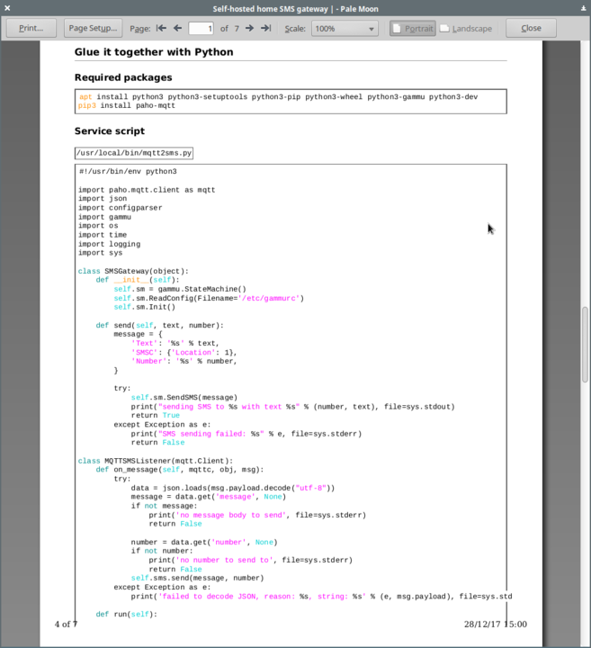
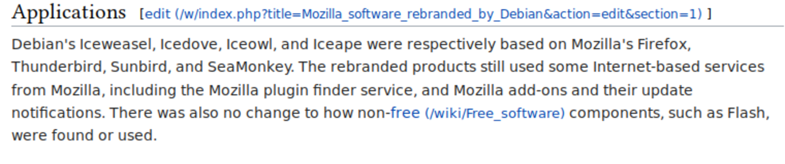
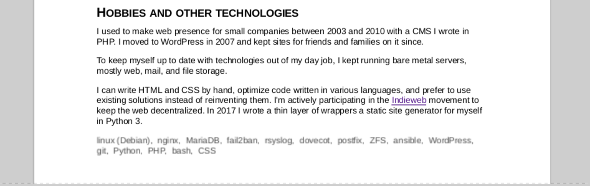

---
author:
    email: mail@petermolnar.net
    image: https://petermolnar.net/favicon.jpg
    name: Peter Molnar
    url: https://petermolnar.net
copies:
- http://web.archive.org/web/20180419080453/https://petermolnar.net/how-to-make-a-print-css/
published: '2018-04-17T19:00:00+01:00'
summary: CSS snippets to consider when you want to provide a printable version
    of your blog
tags:
- CSS
title: Guide on how to make your website printable with CSS

---

## Printing?! It's 2018!

"Printing" doesn't always mean putting it on paper. When people print a
web article, sometimes it ends up as a PDF, because the HTML save it not
usable. The reasons for this differ: JavaScript rendered content,
unsaved scripts in the end result, the lack of MHTML support in
browsers, etc. What's important is that providing a print-friendly
format for your site makes it possible for people to save it in a usable
way.

Printing might still be relevant, because that's the only method that
gives you a physical object. I have long entries about journeys, visits
of foreign places. At a certain point in time I was tempted to put
together a photobook from the images there, but the truth is: it's a lot
of work, especially if you've more or less done it already once by
writing your entry.

There's also the completely valid case of archiving: hard copies have a
life of decades if not centuries, when stored properly, unlike any
electronic media we currently have as an option.

## That little extra CSS

Before jumping into the various hacks that helps printers it's important
to mention, how to add printer-only instructions to your CSS. There are
two ways, either using:

```css
@media print {

}
```

inside an existing CSS, or by adding another CSS file specifically for
`print` media into the HTML `<head>` section:

```html
<head>
    <link rel="stylesheet" type="text/css" href="print.css" media="print">
</head>
```

## Recommended styling

### White background, black(ish) text

Most printers operate with plain, white paper, so unless there's a very,
very good reason for printing background color, just get rid of it.

It also applies to the font: a bit lighter from black, so saves tint.

```css
* {
    background-color: #fff !important;
    color: #222;
}
```

### Use printer and PDF safe fonts

If you take a look at the history of printers vs fonts there used to be
many problems around this topic - even so they might still require a
font cartridge to be able to properly print fonts out of the basic
options.[^1]

To avoid rendering problems, aliasing issues, generally speaking:
unreadable fonts, stick to one of the base 14 fonts:

-   Courier, Courier-Bold, Courier-Oblique, Courier-BoldOblique
-   Helvetica, Helvetica-Bold, Helvetica-Oblique, Helvetica-BoldOblique
-   Times-Roman, Times-Bold, Times-Italic, Times-BoldItalic
-   Symbol
-   ZapfDingbats

which are, by definition, part of the PDF standard[^2]. So for example:

```css
* {
    font-size: 11pt !important;
    font-family: Helvetica, sans-serif !important;
}
```

If you do insist on special fonts, eg. you have icons in fonts, you
might want to consider using SVG instead of fonts for icons - otherwise
printing them properly will become a problem.

Besides the potential printing issues one more reason to go with a
standard, base font is that if for any reason the text needs to go
through character recognition for scanning it back - say it's an
archival hard copy and the only one left after a data loss indicent -
the simpler and wider known the font, the better your chances for
getting the characters properly recognized.

### Pages and page breaks

It's very annoying to find a heading at the bottom of a printed page, or
a paragraph broke into separate pages, although this latter depends on
paragraph length. I generally recommend disallowing page breaks at these
locations.

Apart from this it's a good idea to have a margin around the edges so
you have an area where you can handle the page, not covering any of the
text, or where it can be glued together as pages in a book.

```css
@page {
    margin: 0.5in;
}

h1, h2, h3, h4, h5, h6 {
    page-break-after: avoid !important;
}

p, li, blockquote, figure, img {
    page-break-inside: avoid !important;
}
```

### Images

Printing images is tricky: most of the images are sized for the web and
those sizing are too small by resolution, too large by percentage of
space taken for printing. The alt-text and the image headline, which is
usually in `alt` and `title` are also something to consider printing,
but unfortunately the `href` trick doesn't work with them: that is
because you can't add `::before` or `::after` to self-closing tags, such
as images.

Lately, instead of using simple `img` tags, I switched to using
`figure`, along with `figcaption` - this way the headline became
possible to print.

Apart from this I've limited the size of the images by view-width and
view-height, so they never become too large and occupy complete pages.

```css
figure {
    margin: 1rem 0;
}

figcaption {
    text-align: left;
    margin: 0 auto;
    padding: 0.6rem;
    font-size: 0.9rem;
}

figure img {
    display: block;
    max-height: 35vh;
    max-width: 90vw;
    outline: none;
    width: auto;
    height: auto;
    margin: 0 auto;
    padding: 0;
}
```

This is how `images` inside `figure` (should) look in print with the
styling above:


### Source codes

If you have code blocks in your page it's useful to have them coloured,
but still dark-on-light.

I'm using Pandoc's built-in syntax highlighting[^3] and the following
styling for printing:

```css
code, pre {
    max-width: 96%;
    border: none;
    color: #222;
    word-break: break-all;
    word-wrap: break-word;
    white-space: pre-wrap;
    overflow:initial;
    page-break-inside: enabled;
    font-family: "Courier", "Courier New", monospace !important;
}

pre {
    border: 1pt dotted #666;
    padding: 0.6em;
}

/* code within pre - this is to avoid double borders */
pre code {
    border: none;
}

code.sourceCode span    { color: black; }
code.sourceCode span.al { color: black; }
code.sourceCode span.at { color: black; }
code.sourceCode span.bn { color: black; }
code.sourceCode span.bu { color: black; }
code.sourceCode span.cf { color: black; }
code.sourceCode span.ch { color: black; }
code.sourceCode span.co { color: darkgray; }
code.sourceCode span.dt { color: black; }
code.sourceCode span.dv { color: black; }
code.sourceCode span.er { color: black; }
code.sourceCode span.ex { color: darkorange; }
code.sourceCode span.fl { color: black; }
code.sourceCode span.fu { color: darkorange; }
code.sourceCode span.im { color: black; }
code.sourceCode span.kw { color: darkcyan; }
code.sourceCode span.op { color: black; }
code.sourceCode span.ot { color: black; }
code.sourceCode span.pp { color: black; }
code.sourceCode span.sc { color: black; }
code.sourceCode span.ss { color: black; }
code.sourceCode span.st { color: magenta; }
code.sourceCode span.va { color: darkturquoise; }
```

It should result in something similar:



### Printing links and theirs URLs

#### The basic CSS solution

Links are the single most important things on the internet; they are the
internet. However, when they get printed, the end result usually looks
something like this:


In order to avoid this problem, the URLs behind the links need to be
shown as if they were part of the text. There is a rather simple way to
do it:

```css
a::after {
    content: " (" attr(href) ") ";
    font-size: 90%;
}
```

but unfortunately it makes the text rather ugly and very hard to read:



#### Aaron Gustafson's solution[^4] {#aaron-gustafsons-solution4}

There is a very nice, minimalistic Javascript solution[^5] that collects
all links on the page and converts them into footnotes on the fly, when
it detects a print request.

This solution is way nicer, so I certainly recommend using this as well
(it's a supplement for the CSS solution above) even if it requres
Javascript: (this is a copy-paste solution, just put it in your header)

```html
<script type="text/javascript">
    // <![CDATA[
    /*------------------------------------------------------------------------------
    Function:       footnoteLinks()
    Author:         Aaron Gustafson (aaron at easy-designs dot net)
    Creation Date:  8 May 2005
    Version:        1.3
    Homepage:       http://www.easy-designs.net/code/footnoteLinks/
    License:        Creative Commons Attribution-ShareAlike 2.0 License
                    http://creativecommons.org/licenses/by-sa/2.0/
    Note:           This version has reduced functionality as it is a demo of
                    the script's development
    ------------------------------------------------------------------------------*/
    function footnoteLinks(containerID,targetID) {
      if (!document.getElementById ||
          !document.getElementsByTagName ||
          !document.createElement) return false;
      if (!document.getElementById(containerID) ||
          !document.getElementById(targetID)) return false;
      var container = document.getElementById(containerID);
      var target    = document.getElementById(targetID);
      var h2        = document.createElement('h2');
      addClass.apply(h2,['printOnly']);
      var h2_txt    = document.createTextNode('Links');
      h2.appendChild(h2_txt);
      var coll = container.getElementsByTagName('*');
      var ol   = document.createElement('ol');
      addClass.apply(ol,['printOnly']);
      var myArr = [];
      var thisLink;
      var num = 1;
      for (var i=0; i<coll.length; i++) {
        var thisClass = coll[i].className;
        if ( coll[i].getAttribute('href') ||
             coll[i].getAttribute('cite') ) {
          thisLink = coll[i].getAttribute('href') ? coll[i].href : coll[i].cite;
          var note = document.createElement('sup');
          addClass.apply(note,['printOnly']);
          var note_txt;
          var j = inArray.apply(myArr,[thisLink]);
          if ( j || j===0 ) {
            note_txt = document.createTextNode(j+1);
          } else {
            var li     = document.createElement('li');
            var li_txt = document.createTextNode(thisLink);
            li.appendChild(li_txt);
            ol.appendChild(li);
            myArr.push(thisLink);
            note_txt = document.createTextNode(num);
            num++;
          }
          note.appendChild(note_txt);
          if (coll[i].tagName.toLowerCase() == 'blockquote') {
            var lastChild = lastChildContainingText.apply(coll[i]);
            lastChild.appendChild(note);
          } else {
            coll[i].parentNode.insertBefore(note, coll[i].nextSibling);
          }
        }
      }
      target.appendChild(h2);
      target.appendChild(ol);
      addClass.apply(document.getElementsByTagName('html')[0],['noted']);
      return true;
    }
    window.onload = function() {
      footnoteLinks('content','content');
    }
    // ]]>
  </script>
  <script type="text/javascript">
    // <![CDATA[
    /*------------------------------------------------------------------------------
    Excerpts from the jsUtilities Library
    Version:        2.1
    Homepage:       http://www.easy-designs.net/code/jsUtilities/
    License:        Creative Commons Attribution-ShareAlike 2.0 License
                    http://creativecommons.org/licenses/by-sa/2.0/
    Note:           If you change or improve on this script, please let us know.
    ------------------------------------------------------------------------------*/
    if(Array.prototype.push == null) {
      Array.prototype.push = function(item) {
        this[this.length] = item;
        return this.length;
      };
    };
    // ---------------------------------------------------------------------
    //                  function.apply (if unsupported)
    //           Courtesy of Aaron Boodman - http://youngpup.net
    // ---------------------------------------------------------------------
    if (!Function.prototype.apply) {
      Function.prototype.apply = function(oScope, args) {
        var sarg = [];
        var rtrn, call;
        if (!oScope) oScope = window;
        if (!args) args = [];
        for (var i = 0; i < args.length; i++) {
          sarg[i] = "args["+i+"]";
        };
        call = "oScope.__applyTemp__(" + sarg.join(",") + ");";
        oScope.__applyTemp__ = this;
        rtrn = eval(call);
        oScope.__applyTemp__ = null;
        return rtrn;
      };
    };
    function inArray(needle) {
      for (var i=0; i < this.length; i++) {
        if (this[i] === needle) {
          return i;
        }
      }
      return false;
    }
    function addClass(theClass) {
      if (this.className != '') {
        this.className += ' ' + theClass;
      } else {
        this.className = theClass;
      }
    }
    function lastChildContainingText() {
      var testChild = this.lastChild;
      var contentCntnr = ['p','li','dd'];
      while (testChild.nodeType != 1) {
        testChild = testChild.previousSibling;
      }
      var tag = testChild.tagName.toLowerCase();
      var tagInArr = inArray.apply(contentCntnr, [tag]);
      if (!tagInArr && tagInArr!==0) {
        testChild = lastChildContainingText.apply(testChild);
      }
      return testChild;
    }
    // ]]>
  </script>
  <style type="text/css" media="screen">
    .printOnly {
      display: none;
    }
  </style>
  <style type="text/css" media="print">
    a:link:after,
    a:visited:after {
      content: " (" attr(href) ") ";
      font-size: 90%;
    }
    html.noted a:link:after,
    html.noted a:visited:after {
      content: '';
    }
  </style>
```

#### Alternative approach: always using footnotes for URLs

I little while ago I made a decision to put all links into footnotes by
default - no in-text-links which will bring you to another site. This is
a design decision and doesn't apply to most of the already existing
sites, but if you, just as me, think, there is value in it, consider it
as an option. It also makes the two hacks above obsolete, however, it
has it's own problems, such as reading the site entries via RSS.

## Avoid

### opacity and transparency: it can get blurry

A simple and sort of lazy solution to, instead of figuring out the
proper color code, just apply opacity to a text to make it slightly
different from the rest. Unfortunately some of these opacity settings
can result in blurry or unusable text:



Therefore I suggest to avoid opacity and transparency on all elements
for your printing styles.

Happy printing!

[^1]: <https://www.microsoft.com/resources/documentation/windows/xp/all/proddocs/en-us/print_c_fonts.mspx>

[^2]: <https://en.wikipedia.org/wiki/Portable_Document_Format#Standard_Type_1_Fonts_.28Standard_14_Fonts.29>

[^3]: <http://pandoc.org/MANUAL.html#syntax-highlighting>

[^4]: <https://alistapart.com/article/improvingprint>

[^5]: <https://alistapart.com/d/improvingprintfinal.html>