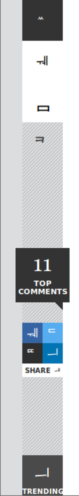
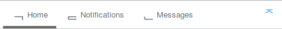
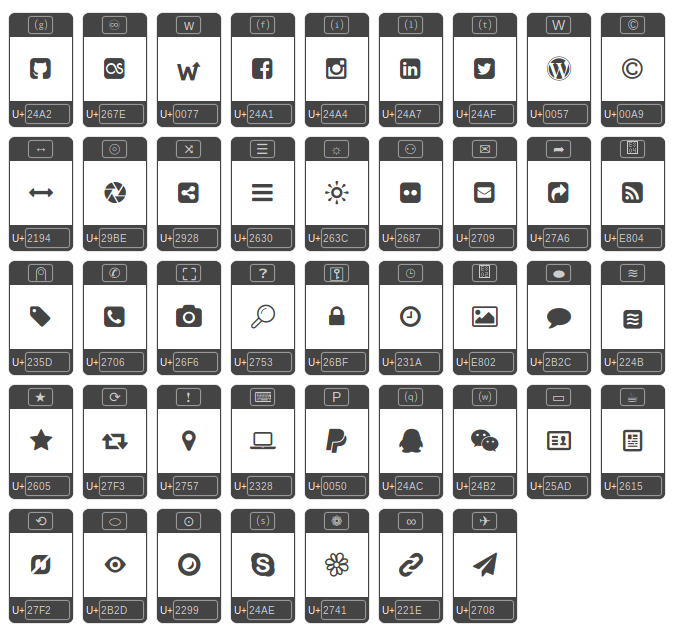

---
author:
    email: mail@petermolnar.net
    image: https://petermolnar.net/favicon.jpg
    name: Peter Molnar
    url: https://petermolnar.net
copies:
- http://web.archive.org/web/20190624125615/https://petermolnar.net/icon-fonts-fallback-unicode/
published: '2015-11-03T18:56:37+00:00'
summary: All the icons fonts could potentially have a relatively meaningful,
    fallback Unicode character that would be shown in cases when the font
    does not load for various reasons.
tags:
- design
title: Icon fonts should have meaningful unicode mappings to provide fallback

---

## 'External' fonts

Ublock has an interesting option: you can turn off external fonts with
it: enter `no-remote-fonts: * true` to My Rules and save it. I wanted to
see how much it speeds up the browsing experience - quite a bit by the
way. But somewhat surprisingly, this renders many pages unusable, like
Forbes:

I don't even have a chance to guess the menu; maybe the dark blue is
Facebbok, the light blue is Twitter, and the medium blue is LinkedIn,
but I can't be sure. No tooltips - or at least link titles - either.

Others, since they have a text fallback, are just ugly, like Twitter:

This needn't be the case.

## Unicode

The unicode table[^1] is big, and it has an insane amount of characters,
including the relatively new range of emojis. Therefore all the icons
fonts could potentially have a relatively meaningful fallback character
that would be shown in cases when the font does not load for various
reasons.

The best example, which I wasn't aware of till a few weeks ago, is the
thing everyone now knows at **the menu button**, the three, horizontal
lines. It's **called "Trigram for Heaven", U+2630, and looks like this:
☰**. It's a simple unicode character, like a letter.

So let's take the above example of Twitter:

instead of

     Home  Notifications  Messages

( U+F053, U+F054 nd U+F055 are in the "Private Use Area" )

it could be:

    ⌂ Home ⍾ Notifications ✉ Messages

with:

-   ⌂ U+2302 "House"
-   ⍾ U+237E "Bell Symbol"
-   ✉ U+2709 "Envelope"

or even:

    🏠 Home 🔔 Notifications 📫 Messages

with:

-   🏠 U+1F3E0 "House Building"
-   🔔 U+1F514 "Bell"
-   📫 U+1F4EB "Closed Mailbox with Raised Flag"

...if they decide to roam to emoji territory.

## Art with fallback

Icon fonts had been called out lately, since SVG based graphis are often
a better alternative; however, if the icons have a fallback, and you may
not even need to load the icon font, that's a big win for accessibility.

I've decided to test test the idea above - using fontello.com[^2] - to
create an icon font set where every icon is mapped to either something
similar or something that can be used as an alternative:

It's very, very far from perfect, and some icons may be hard to guess on
their own - in that cases, the context might help.

It's still better than unknown, foreign characters that might mean a
thing in another language.

## Footnote: the overwrite problem

Obviously this can lead to the situation where a carefully crafted icon
gets replaced by a built-in emoji on certain systems, ruining the
intended design.

This really is an issue, but there is a good side to it as well: it's
like the native fonts - it fits. It looks like it was intended to be
part of the system.

[^1]: <http://unicode-table.com/>

[^2]: <http://fontello.com/>