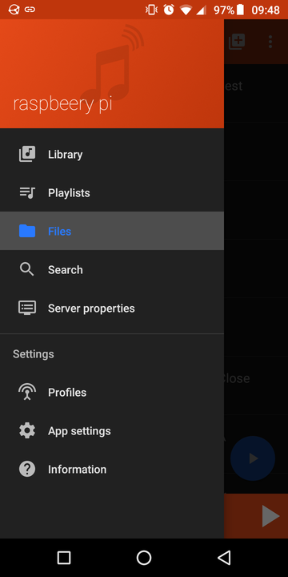

---
author:
    email: mail@petermolnar.net
    image: https://petermolnar.net/favicon.jpg
    name: Peter Molnar
    url: https://petermolnar.net
copies:
- http://web.archive.org/web/20200504160420/https://petermolnar.net/lightweight-headless-media-player-raspberry-pi/
published: '2020-04-18T19:45:00+01:00'
summary: After years of experimentation with modern media center software
    I gave up. As usual, the simpler, the better, and cleaner, so welcome
    back MPD and VLC, and welcome raspotify.
tags:
- Raspberry Pi
title: Raspberry Pi 3 as featherweight headless media renderer

---

During the past years I've been trying to find a media center to
accommodate my local data. Despite my efforts of gardening my music
metadata properly, they all fail, mainly because it's far from a usual
set of stuff. I have:

-   films with multiple audio- and subtitle tracks in various formats,
    ranging from avi through mkv packed ogg vorbis to mere mp4
-   foreign films with Hungarian dub
-   music folders with hundreds of randomly thrown together tracks with
    deliberately deleted album information
-   and so on

Despite the complexity, it's organised. If you open the library in a
file manager, the layout is trivial and it's fairly simple to browse or
find whatever you're after.

Most modern media centers which rely heavily on gathering data from the
internet, fail hard: some never even find the movies - Plex[^1], I'm
looking at you, especially since you became quite agressive with their
you really ought to subscribe message. Others, with plugins and manual
help, like Emby[^2], excel at movies, but simply overheat at music
collections by trying to force everything in one folder into one album.
*Sithicus from Sanguis in Nocte is really not part of the 100 Best
Trance Songs compalation.*

Different solutions, like Nextcloud[^3] are already slow and heavy;
adding media to it really doesn't help. Ampache[^4] feels dated, and no
matter how many times I tried, I failed to properly set it up as
DNLA/UPnP system.

Apart from the library issues, the other problem is DLNA/UPnP itself. If
you're not familiar with the idea or the details, the short summary if
the following every setup would have:

-   server
-   renderer
-   controller

The server contains (or connects to) and manages the data and the
library; the renderer shows the content; the controllers tells the
renderer what to play. The problem is that my main renderer, an LG
Netcast TV, is simple. It's so simple that it can about play wav, mp3,
mpeg2, x264, and that's it. Things like flac, vorbis, x265, etc would
all need to be transcoded. Plex doesn't support ogg and flac. Emby does,
but the transcoding doesn't really suit a 10W TDP CPU that's already
serving websites, and an NFS server. Whenever transcoding wasn't needed,
like most of the music, the TV kept asking for permission at
every.single.track. to allow to play if one was using a controller, and
not the built-in media browser.

So I tried another approach: Kodi[^5], OSMC[^6], and LibreELEC[^7] on a
Raspberry Pi. Again, they tried to be way too smart and complicated, and
none of them offered a simple File Browser mode, or something like that.
Also, all of them are oriented to either touchscreens or fancy remote
controls.

Once I arrived at this point two thoughts popped up in my mind.

1.  I ~~want~~ have to make this simpler.
2.  Hang on, had I not done this once already?

## Local music

When I first decided to run a home music center, I started with MPD[^8].
MPD, while not *that* old, is still 17 years old. And it's rock solid.
What it does: picks music libraries, plays them to various outputs, and
allows to be remote controlled over the network. That's it. No metadata
fetching daemons, no uber fancy web interface. And it can use `nfs`
shares on the fly. And it has a browse files view.

```bash
apt install mpd
```

`/etc/mpd.conf`

    music_directory         "nfs://home.server/music/library"
    playlist_directory      "/var/lib/mpd/playlists"
    db_file                 "/var/lib/mpd/tag_cache"
    log_file                "/var/log/mpd/mpd.log"
    pid_file                "/run/mpd/pid"
    state_file              "/var/lib/mpd/state"
    sticker_file            "/var/lib/mpd/sticker.sql"
    user                    "mpd"
    bind_to_address         "0.0.0.0"
    port                    "6600"
    auto_update             "no"
    zeroconf_enabled        "yes"
    zeroconf_name           "mpd @ rasbperry"
    filesystem_charset      "UTF-8"

    input {
            plugin "curl"
    }

    audio_output {
            type            "alsa"
            name            "ALSA"
    }

There are plenty of clients to control it; on Android, I prefer
M.A.L.P.[^9] whereas on desktop, `gmpc`[^10]



I have a Topping MX3[^11] connected to the Raspberry. In order to have
that as default output, `/etc/asound.conf` needs to exists with:

    defaults.pcm.card 1
    defaults.ctl.card 1

## Local video

### omxplayer

omxplayer[^12] is a Raspberry Pi native player, which has a rather
impressive performance, due to the hardware accelation it utilises on
the Pi. While omxplayer itself doesn't have a HTTP interface, it can
easily be started over SSH, plus there's and android app, OMX Remote
(Raspberry Pi)[^13] which does exactly this for you.

It's a lot faster, than VLC, and certainly has less bugs.

### VLC

**UPDATE: I added the section under `omxplayer` - I had a lof of trouble
with VLC after writing this article.**

I'm aware Kodi & Friends have web interfaces, but that doesn't make them
less wannabe smart. Then I remember that I used to have VLC[^14] with
it's HTTP interface on as player.

```bash
apt install vlc dbus-x11
```

It's a little tricker to launch it on a headless system - meaning no X
server -, but not that bad:

`/lib/systemd/system/cvlc.service`

```systemd
[Unit]
Description=Headless VLC service
After=network.target sound.target

[Service]
Type=simple
User=mpd
Restart=always
RestartSec=10
EnvironmentFile=-/etc/default/cvlc
Environment="HTTP_PORT=8080"
Environment="HTTP_PASSWORD=12345678"
Environment="ALSA_DEVICE=hw:CARD=ALSA,DEV=0"
ExecStart=/usr/bin/dbus-launch -- /usr/bin/vlc -A alsa --alsa-audio-device ${ALSA_DEVICE} -I http --http-port ${HTTP_PORT} --http-password ${HTTP_PASSWORD} --media-library

[Install]
WantedBy=multi-user.target
```

The `dbus-x11` package contains the `dbus-launch` command, which allows
the service to start in a non-x environment properly. The ALSA device
selected in this case is the built-in HDMI; `aplay -L` gives the list of
options.

Unfortunately, unlike MPD, VLC can't directly use NFS shares, so it
needs to be mounted by hand by adding this to `/etc/fstab`:

```fstab
home.server:/media/library /media nfs ro,hard,intr,rsize=8192,wsize=8192,timeo=14 0 0
```

Once done, with a remote control, like VlcFreemote[^15] on android, the
whole filesystem can be browsed, including the NFS mount. This way
there's not transcoding problem, no mis-identified media problem, and
all the subtitles/tracks are available.


## Spotify

*Yes, I use Spotify. Yes, I should buy albums. Trouble is: the CD is not
that good business for the artist either, so unless I can buy on
Bandcamp directly from the band, I'm ok with Spotify. I will, and always
had been trying to go live gigs, because that is an actual support, plus
a whole different, hopefully unique experience.*

I mentioned I went down similar roads a while ago but that was before
Spotify Connect appeared. I gave mopidy with it's spotify plugin[^16] a
go, but it wasn't working nicely, so instead, I used to run the full
fledged Spotify client in a mocked X environment with xfvb. Sometimes is
worked. Sometimes.

Eventually I stumbled upon `spotifyd`[^17] and `raspotify`[^18]. Tried
both, with `raspotify` came out as winner - it shows up as speaker over
Wi-Fi properly, allowing other accounts to use it and see it as well. It
has nice install guide, and basicall doesn't need any special trickery
to work.


## A maybe-working DLNA/UPnP setup

The trial and search journey that dragged me across these experiences
introduced a nice project: gmrender-resurrect[^19]. This is a picked up
and continued project of an old, abandoned software, GMediaRenderer,
which was made to be an audio *(and potentially video, but I still can't
get that running, no matter, what)* DLNA renderer for linux. Combined
with pulseaudio-dlna[^20] it's possible to stream the audio of anything
- in-browser youtube, etc - onto my speakers via the raspberry.

Unfortunately, pulseaudio-dlna itself can get rather choppy and slow; it
works fine on my XFCE desktop, but not with my wife's Cinnamon.

If I ever make it work properly, I'm hoping I can add the codecs into
gmrender itself, making the problem of the lack of codecs disappear, and
use a simple minidlna[^21] to be my media server again. Talking about
minidlna: it has a fork, that, in theory, can transcode if needed:
ReadyMedia-transcode[^22].


I'm going to stick to MPD, VLC, raspotify, for now. It's working. Not
the nicest, shiniest setup, but it does what I'm asking for. I have
Netflix and Amazon Prime, where having information, maybe even trailers,
can be important. With my own collection, especially with the music and
the ripped CDs of street musicians, I know what I'm looking at, I don't
need overly smart media centers with their mistakes and CPU baking
capabilities.

[^1]: <https://www.plex.tv/>

[^2]: <https://emby.media/>

[^3]: <https://kodi.onl/>

[^4]: <http://ampache.org/>

[^5]: <https://kodi.onl/>

[^6]: <https://osmc.tv/>

[^7]: <https://libreelec.tv/>

[^8]: <https://www.musicpd.org/>

[^9]: <https://f-droid.org/en/packages/org.gateshipone.malp/>

[^10]: <https://gmpc.fandom.com/wiki/Gnome_Music_Player_Client>

[^11]: <http://www.tpdz.net/productinfo/398300.html>

[^12]: <https://www.raspberrypi.org/documentation/raspbian/applications/omxplayer.md>

[^13]: <https://play.google.com/store/apps/details?id=com.tencarssoftware.omxremote&hl=en_US>

[^14]: <https://www.videolan.org/>

[^15]: <https://f-droid.org/en/packages/com.nicolasbrailo.vlcfreemote/>

[^16]: <https://mopidy.com/ext/spotify/>

[^17]: <https://github.com/Spotifyd/spotifyd/>

[^18]: <https://dtcooper.github.io/raspotify/>

[^19]: <https://github.com/hzeller/gmrender-resurrect>

[^20]: <https://github.com/masmu/pulseaudio-dlna>

[^21]: <https://sourceforge.net/projects/minidlna/>

[^22]: <https://bitbucket.org/stativ/readymedia-transcode/>