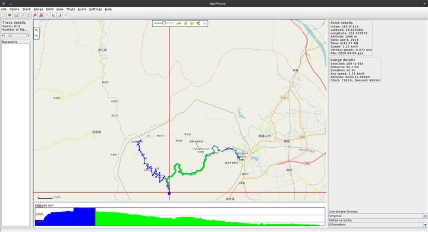

---
author:
    email: mail@petermolnar.net
    image: https://petermolnar.net/favicon.jpg
    name: Peter Molnar
    url: https://petermolnar.net
copies:
- http://web.archive.org/web/20180928133438/https://petermolnar.net/location-tracking-without-server/
published: '2018-09-27T11:05:00+01:00'
summary: My pipeline of tracking where I've been using and Android phone,
    Backitude, python, and cron
tags:
- android
title: GPS tracking without a server

---

Nearly all self-hosted location tracking Android applications are based
on server-client architecture: the one on the phone collects only a
small points, if not only one, and sends it to a configured server.
Traccar[^1], Owntracks[^2], etc.

While this setup is useful, it doesn't fit in my static, unless it
hurts[^3] approach, and it needs data connectivity, which can be tricky
during abroad trips. The rare occasions in rural Scotland and Wales
tought me data connectivity is not omnipresent at all.

There used to be a magnificent little location tracker, which, besides
the server-client approach, could store the location data in CSV and KML
files locally: Backitude[^4]. The program is gone from Play store, I
have no idea, why, but I have a copy of the last APK of it[^5].

My flow is the following:

-   Backitude saves the CSV files
-   Syncthing[^6] syncs the phone and the laptop
-   the laptop has a Python script that imports the CSV into SQLite to
    eliminate duplicates
-   the same script queries against Bing to get altitude information for
    missing altitudes
-   as a final step, the script exports daily GPX files
-   on the laptop, GpsPrune helps me visualize and measure trips

## Backitude configuration

These are the modified setting properties:

-   Enable backitude: yes
-   Settings
    -   Standard Mode Settings
        -   Time Interval Selection: 1 minute
        -   Location Polling Timeout: 5 minutes
        -   Display update message: no
    -   Wifi Mode Settings
        -   Wi-Fi Mode Enabled: yes
        -   Time Interval Options: 1 hour
        -   Location Polling Timeout: 5 minutes
    -   Update Settings
        -   Minimum Change in Distance: 10 meters
    -   Accuracy Settings
        -   Minimum GPS accuracy: 12 meters
        -   Minimum Wi-Fi accuracy: 20 meters
    -   Internal Memory Storage Options
        -   KML and CSV
    -   Display Failure Notifications: no

I have an exported preferences file available[^7].

## Syncthing

The syncthing configuration is optional; it could be simple done by
manual transfers from the phone. It's also not the most simple thing to
do, so I'll let the Syncting Documentation[^8] take care of describing
the how-tos.

## Python script

Before jumping to the script, there are 3 Python modules it needs:

```bash
pip3 install --user arrow gpxpy requests
```

And the script itself - please replace the `INBASE`, `OUTBASE`, and
`BINGKEY` properties. To get a Bing key, visit Bing[^9].

```python
import os
import sqlite3
import csv
import glob
import arrow
import re
import gpxpy.gpx
import requests

INBASE="/path/to/your/syncthing/gps/files"
OUTBASE="/path/for/sqlite/and/gpx/output"
BINGKEY="get a bing maps key and insert it here"

def parse(row):
    DATE = re.compile(
        r'^(?P<year>[0-9]{4})-(?P<month>[0-9]{2})-(?P<day>[0-9]{2})T'
        r'(?P<time>[0-9]{2}:[0-9]{2}:[0-9]{2})\.(?P<subsec>[0-9]{3})Z$'
    )

    lat = row[0]
    lon = row[1]
    acc = row[2]
    alt = row[3]
    match = DATE.match(row[4])
    # in theory, arrow should have been able to parse the date, but I couldn't get
    # it working
    epoch = arrow.get("%s-%s-%s %s %s" % (
        match.group('year'),
        match.group('month'),
        match.group('day'),
        match.group('time'),
        match.group('subsec')
    ), 'YYYY-MM-DD hh:mm:ss SSS').timestamp
    return(epoch,lat,lon,alt,acc)

def exists(db, epoch, lat, lon):
    return db.execute('''
        SELECT
            *
        FROM
            data
        WHERE
            epoch = ?
        AND
            latitude = ?
        AND
            longitude = ?
    ''', (epoch, lat, lon)).fetchone()

def ins(db, epoch,lat,lon,alt,acc):
    if exists(db, epoch, lat, lon):
        return
    print('inserting data point with epoch %d' % (epoch))
    db.execute('''INSERT INTO data (epoch, latitude, longitude, altitude, accuracy) VALUES (?,?,?,?,?);''', (
        epoch,
        lat,
        lon,
        alt,
        acc
    ))


if __name__ == '__main__':
    db = sqlite3.connect(os.path.join(OUTBASE, 'location-log.sqlite'))
    db.execute('PRAGMA auto_vacuum = INCREMENTAL;')
    db.execute('PRAGMA journal_mode = MEMORY;')
    db.execute('PRAGMA temp_store = MEMORY;')
    db.execute('PRAGMA locking_mode = NORMAL;')
    db.execute('PRAGMA synchronous = FULL;')
    db.execute('PRAGMA encoding = "UTF-8";')

    files = glob.glob(os.path.join(INBASE, '*.csv'))
    for logfile in files:
        with open(logfile) as csvfile:
            try:
                reader = csv.reader(csvfile)
            except Exception as e:
                print('failed to open CSV reader for file: %s; %s' % (logfile, e))
                continue
            # skip the first row, that's headers
            headers = next(reader, None)
            for row in reader:
                epoch,lat,lon,alt,acc = parse(row)
                ins(db,epoch,lat,lon,alt,acc)
        # there's no need to commit per line, per file should be safe enough
        db.commit()

    db.execute('PRAGMA auto_vacuum;')

    results = db.execute('''
        SELECT
            *
        FROM
            data
        ORDER BY epoch ASC''').fetchall()
    prevdate = None
    gpx = gpxpy.gpx.GPX()

    for epoch, lat, lon, alt, acc in results:
        # in case you know your altitude might actually be valid with negative
        # values you may want to remove the -10
        if alt == 'NULL' or alt < -10:
            url = "http://dev.virtualearth.net/REST/v1/Elevation/List?points=%s,%s&key=%s" % (
                lat,
                lon,
                BINGKEY
            )
            bing = requests.get(url).json()
            # gotta love enterprise API endpoints
            if not bing or \
                'resourceSets' not in bing or \
                not len(bing['resourceSets']) or \
                'resources' not in bing['resourceSets'][0] or \
                not len(bing['resourceSets'][0]) or \
                'elevations' not in bing['resourceSets'][0]['resources'][0] or \
                not bing['resourceSets'][0]['resources'][0]['elevations']:
                alt = 0
            else:
                alt = float(bing['resourceSets'][0]['resources'][0]['elevations'][0])
                print('got altitude from bing: %s for %s,%s' % (alt,lat,lon))
                db.execute('''
                    UPDATE
                        data
                    SET
                        altitude = ?
                    WHERE
                        epoch = ?
                    AND
                        latitude = ?
                    AND
                        longitude = ?
                    LIMIT 1
                ''',(alt, epoch, lat, lon))
                db.commit()
            del(bing)
            del(url)
        date = arrow.get(epoch).format('YYYY-MM-DD')
        if not prevdate or prevdate != date:
            # write previous out
            gpxfile = os.path.join(OUTBASE, "%s.gpx" % (date))
            with open(gpxfile, 'wt') as f:
                f.write(gpx.to_xml())
                print('created file: %s' % gpxfile)

            # create new
            gpx = gpxpy.gpx.GPX()
            prevdate = date

            # Create first track in our GPX:
            gpx_track = gpxpy.gpx.GPXTrack()
            gpx.tracks.append(gpx_track)

            # Create first segment in our GPX track:
            gpx_segment = gpxpy.gpx.GPXTrackSegment()
            gpx_track.segments.append(gpx_segment)

        # Create points:
        gpx_segment.points.append(
            gpxpy.gpx.GPXTrackPoint(
                lat,
                lon,
                elevation=alt,
                time=arrow.get(epoch).datetime
            )
        )

    db.close()
```

Once this is done, the `OUTBASE` directory will be populated by `.gpx`
files, one per day.

## GpsPrune

GpsPrune is a desktop, QT based GPX track visualizer. It needs data
connectivity to have nice maps in the background, but it can do a lot of
funky things, including editing GPX tracks.

```bash
sudo apt install gpsprune
```

**Keep it in mind that the export script overwrites the GPX files, so
the data needs to be fixed in the SQLite database.**

This is an example screenshot of GpsPrune, about our 2 day walk down
from Mount Emei and it's endless stairs:



Happy tracking!

[^1]: <https://www.traccar.org/>

[^2]: <https://owntracks.org/>

[^3]: <https://indieweb.org/manual_until_it_hurts>

[^4]: <http://www.gpsies.com/backitude.do>

[^5]: [gaugler.backitude.apk](gaugler.backitude.apk)

[^6]: <https://syncthing.net/>

[^7]: [backitude.prefs](backitude.prefs)

[^8]: <https://docs.syncthing.net/intro/getting-started.html>

[^9]: <https://msdn.microsoft.com/en-us/library/ff428642>