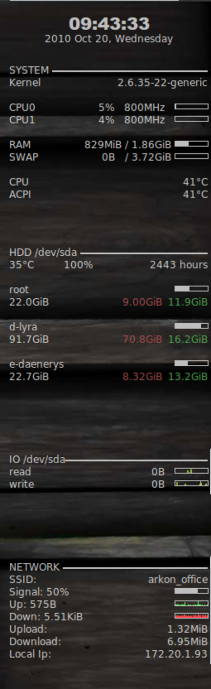

---
author:
    email: mail@petermolnar.net
    image: https://petermolnar.net/favicon.jpg
    name: Peter Molnar
    url: https://petermolnar.net
copies:
- http://web.archive.org/web/20120414091818/http://petermolnar.eu:80/linux-tech-coding/minimal-conky-with-hdd-data-nvidia-core-temperature-and-dell-fan-speed/
published: '2011-06-11T08:07:25+00:00'
redirect:
- my-minimal-conky-updated
summary: Minimal, text-based conky scripts to show a really sophisticated
    system monitor.
tags:
- linux desktop
title: Minimal Conky with HDD data, nVidia core temperature and Dell fan speed

---



This is my updates conky screenshot, with the following capabilities:

-   CPU, RAM, disk I/O usage
-   CPU, GPU (nVidia), motherboard temperature and fan speed (Dell
    Latitude E series)
-   power usage on battery mode
-   Ethernet and WLAN status
-   disk health and temperature

## Additional programs in need

-   hdsentinel[^1]
-   dellfand[^2]

This conky needs root privileges to run, because it reads informations
like disk S.M.A.R.T. data, so add the following to the end
of`/etc/sudoers`

    YOUR_USERNAME ALL=(root) NOPASSWD: /usr/bin/hdsentinel , /usr/bin/conky , /usr/bin/dellfand

## Additional scripts

### for hdsentinel

In order to get hdsentinel output readable, a small additional script is
needed.

If there's no parameter given, it lists all the available drives with
formatted informations. Alternatively, it can take two parameters, first
for the drive (for example `sda` or `/dev/sda`), the second for the
needed information. If the second parameter is not given, the same row
will be displayed as before for all the drives, but only for the drive
in parameter one.

I placed this script in `/home/USERNAME/.conky/hdsentinel_`
`hdsentinel.sh`

```bash
#!/bin/bash

if [ -n "$1" ]; then
data=`sudo hdsentinel -solid | grep $1`
temp=`echo $data | cut -d" " -f2`
health=`echo $data | cut -d" " -f3`
hours=`echo $data | cut -d" " -f4`

if [ -n "$2" ]; then
case $2 in
"temp")
echo $temp
;;
"health")
echo $health
;;
"hours")
echo $hours
;;
esac
else
echo "$temp°C    $health%    health    $hours hours"
fi
else
devs=`ls /dev/ | grep -v [0-9] | grep sd`

for device in ${devs[*]}
do
data=`sudo hdsentinel -solid | grep $device`
disk=`echo $data | cut -d" " -f1`
temp=`echo $data | cut -d" " -f2`
health=`echo $data | cut -d" " -f3`
hours=`echo $data | cut -d" " -f4`
echo "$device      $temp°C    $health% health    $hours hours"
done
fi
```

### for dellfand

Dellfand somewhy scales the turn/min with a 30 factor, so it needs to be
reduced.

I placed this script in `/home/USERNAME/.conky/dellfand_`

`dellfand.sh`

```bash
#!/bin/bash

SPEED=`sudo dellfand | cut -d" " -f7`
let SCALED=$SPEED/30
echo $SCALED
```

### for power usage

Power usage need to be calculated from the battery's current state,
therefore you first need to find you battery. It's usually in
`/proc/acpi/battery/BATTERY_NAME/`. If in this directory, there's
information in the `state` file (`cat state`), you've find your battery.

The script takes two paramters, the first is needed, it's the
BATTERY\_NAME from `/proc/acpi/battery/BATTERY_NAME/`, the second is for
the needed information, and it's optional: voltage, current or power. If
the second is not given, all three information will be displayed.

I placed this script in `/home/USERNAME/.conky/power_`

`powerusage.sh`

```bash
#!/bin/bash

volt=`cat /proc/acpi/battery/$1/state | grep "present voltage" | awk '{print $3}'`
ampere=`cat /proc/acpi/battery/$1/state | grep "present rate" | awk '{print $3}'`

volt=`echo "scale=2;$volt/1000"|bc`
ampere=`echo "scale=2;$ampere/1000"|bc`
power=`echo "scale=2;$volt*$ampere"|bc`

if [ -n "$2" ]; then
case $2 in
"voltage")
echo $volt
;;
"current")
echo $ampere
;;
"power")
echo $power
;;
esac
else
echo "Voltage: " $volt "V"
echo "Current: " $ampere "A"
echo "Power: " $power "W"
fi
```

## The conky scripts

### The starter script

In order to start all conky scripts, a wrapper script was needed. It was
placed in /home/USERNAME/.conky/conky\_start

`conky_start.sh`

```bash
#!/bin/bash

sudo conky -c /home/USERNAME/.conky/conky_clock -d
sudo conky -c /home/USERNAME/.conky/conky_sys -d
sudo conky -c /home/USERNAME/.conky/conky_hdd -d
sudo conky -c /home/USERNAME/.conky/conky_io -d
sudo conky -c /home/USERNAME/.conky/conky_net -d
```

### conky\_clock

`conky_clock.conf`

```apache
use_xft yes
xftfont DejaVu Sans:size=8
xftalpha 0.8
text_buffer_size 2048
total_run_times 0
no_buffers yes
uppercase no
cpu_avg_samples 1
net_avg_samples 1
override_utf8_locale yes
double_buffer yes
use_spacer none

own_window yes
own_window_transparent yes
own_window_type normal
own_window_hints undecorated,below,sticky,skip_taskbar,skip_pager
minimum_size 230 0
maximum_width 230
draw_shades no
draw_outline no
draw_borders no
stippled_borders 0
border_width 0
default_color grey
own_window_colour grey
alignment top_left

update_interval 1
gap_x 1190
gap_y 35

TEXT
${alignc 20}${font Arial Black:size=16}${time %H:%M:%S}${font}
${alignc}${time %Y %b %d, %A}
```

### conky\_hdd

`conky_hdd.conf`

```apache
use_xft yes
xftfont DejaVu Sans:size=8
xftalpha 0.8
text_buffer_size 2048
total_run_times 0
no_buffers yes
uppercase no
cpu_avg_samples 1
net_avg_samples 1
override_utf8_locale yes
double_buffer yes
use_spacer none

own_window yes
own_window_transparent yes
own_window_type normal
own_window_hints undecorated,below,sticky,skip_taskbar,skip_pager
minimum_size 230 0
maximum_width 230
draw_shades no
draw_outline no
draw_borders no
stippled_borders 0
border_width 0
default_color grey
own_window_colour grey
alignment top_left

update_interval 60
gap_x 1190
gap_y 750

TEXT
${font DejaVu Sans:style=Bold:size=10}HDD${font} ${hr 2}
${exec /home/USERNAME/.conky/hdsentinel_ }
```

### conky\_io

`conky_io.conf`

```apache
use_xft yes
xftfont DejaVu Sans:size=8
xftalpha 0.8
text_buffer_size 2048
total_run_times 0
no_buffers yes
uppercase no
cpu_avg_samples 1
net_avg_samples 1
override_utf8_locale yes
double_buffer yes
use_spacer left

own_window yes
own_window_transparent yes
own_window_type normal
own_window_hints undecorated,below,sticky,skip_taskbar,skip_pager
minimum_size 230 0
maximum_width 230
draw_shades no
draw_outline no
draw_borders no
stippled_borders 0
border_width 0
default_color grey
own_window_colour grey
alignment top_left

update_interval 1

gap_x 1190
gap_y 600

TEXT
${font DejaVu Sans:style=Bold:size=10}IO${font} ${hr 2}
${if_existing /dev/sda}
${font DejaVu Sans:style=Bold:size=8} /${font}
${color #449944}${font DejaVu Sans:style=Bold:size=7}   read: ${font} ${diskio_read /dev/sda}${color} ${goto 120}${color #994444}${font DejaVu Sans:style=Bold:size=7} write: ${font} ${diskio_write /dev/sda}${color}${endif}${if_existing /dev/sdb}
${font DejaVu Sans:style=Bold:size=8} ${exec cat /proc/mounts | grep sdb | cut -d" " -f2 }${font}
${color #449944}${font DejaVu Sans:style=Bold:size=7}   read: ${font} ${diskio_read /dev/sdb}${color} ${goto 120}${color #994444}${font DejaVu Sans:style=Bold:size=7} write: ${font} ${diskio_write /dev/sdb}${color}${endif}${if_existing /dev/sdc}
${font DejaVu Sans:style=Bold:size=8} ${exec cat /proc/mounts | grep sdc | cut -d" " -f2 }${font}
${color #449944}${font DejaVu Sans:style=Bold:size=7}   read: ${font} ${diskio_read /dev/sdc}${color} ${goto 120}${color #994444}${font DejaVu Sans:style=Bold:size=7} write: ${font} ${diskio_write /dev/sdc}${color}${endif}${if_existing /dev/sdd}
${font DejaVu Sans:style=Bold:size=8} ${exec cat /proc/mounts | grep sdd | cut -d" " -f2 }${font}
${color #449944}${font DejaVu Sans:style=Bold:size=7}   read: ${font} ${diskio_read /dev/sdd}${color} ${goto 120}${color #994444}${font DejaVu Sans:style=Bold:size=7} write: ${font} ${diskio_write /dev/sdd}${color}${endif}${if_existing /dev/sde}
${font DejaVu Sans:style=Bold:size=8} ${exec cat /proc/mounts | grep sde | cut -d" " -f2 }${font}
${color #449944}${font DejaVu Sans:style=Bold:size=7}   read: ${font} ${diskio_read /dev/sde}${color} ${goto 120}${color #994444}${font DejaVu Sans:style=Bold:size=7} write: ${font} ${diskio_write /dev/sde}${color}
${endif}
```

### conky\_net

You may need to change eth1 and eth0. `conky_net.conf`

```apache
use_xft yes
xftfont DejaVu Sans:size=8
xftalpha 0.8
text_buffer_size 4096
total_run_times 0
no_buffers yes
uppercase no
cpu_avg_samples 1
net_avg_samples 1
override_utf8_locale yes
double_buffer yes
use_spacer left

own_window yes
own_window_transparent yes
own_window_type normal
own_window_hints undecorated,below,sticky,skip_taskbar,skip_pager
minimum_size 230 0
maximum_width 230
draw_shades no
draw_outline no
draw_borders no
stippled_borders 0
border_width 0
default_color grey
own_window_colour grey
alignment top_left

update_interval 3
gap_x 1190
gap_y 400

TEXT
${font DejaVu Sans:style=Bold:size=10}NET${font} ${hr 2}
${if_existing /proc/net/route eth1}
${font DejaVu Sans:style=Bold:size=8} WLAN ${font}
${font DejaVu Sans:style=Bold:size=7}   IP:${font} ${addr eth1} ${goto 120}${font DejaVu Sans:style=Bold:size=7} SSID:${font} ${wireless_essid eth1}
${font DejaVu Sans:style=Bold:size=7}   Bitrate:${font} ${wireless_bitrate eth1} ${goto 120}${font DejaVu Sans:style=Bold:size=7} Signal: ${font} ${wireless_link_bar 6,15 eth1} ${wireless_link_qual_perc eth1}%
${color #449944}${font DejaVu Sans:style=Bold:size=7}   Upspeed:${font} ${upspeed eth1} ${color} ${goto 120}${color #994444}${font DejaVu Sans:style=Bold:size=7} Downspeed: ${font} ${downspeed eth1}${color}
${color #449944}${font DejaVu Sans:style=Bold:size=7}   Upload: ${font} ${totalup eth1} ${color} ${goto 120}${color #994444}${font DejaVu Sans:style=Bold:size=7} Download: ${font} ${totaldown eth1}${color}${endif}${if_existing /proc/net/route eth0}${font DejaVu Sans:style=Bold:size=8} WLAN ${font}

${font DejaVu Sans:style=Bold:size=8} ETHERNET ${font}
${font DejaVu Sans:style=Bold:size=7}   IP:${font} ${addr eth0}
${color #449944}${font DejaVu Sans:style=Bold:size=7}   Upspeed:${font} ${upspeed eth0} ${color} ${goto 120}${color #994444}${font DejaVu Sans:style=Bold:size=7} Downspeed: ${font} ${downspeed eth0}
${color #449944}${font DejaVu Sans:style=Bold:size=7}   Upload: ${font} ${totalup eth0} ${color} ${goto 120}${color #994444}${font DejaVu Sans:style=Bold:size=7} Download: ${font} ${totaldown eth0}
${endif}
```

### conky\_sys

`conky_sys.conf`

```apache
use_xft yes
xftfont DejaVu Sans:size=8
xftalpha 0.8
text_buffer_size 2048
total_run_times 0
no_buffers yes
uppercase no
cpu_avg_samples 1
net_avg_samples 1
override_utf8_locale yes
double_buffer yes
use_spacer none

own_window yes
own_window_transparent yes
own_window_type normal
own_window_hints undecorated,below,sticky,skip_taskbar,skip_pager
minimum_size 230 0
maximum_width 230
draw_shades no
draw_outline no
draw_borders no
stippled_borders 0
border_width 0
default_color grey
own_window_colour grey
alignment top_left

update_interval 2
gap_x 1190
gap_y 100

#${font DejaVu Sans:style=Bold:size=8} SWAP ${font}
#${font DejaVu Sans:style=Bold:size=7}   used: ${font} $swap ${goto 120}${font DejaVu Sans:style=Bold:size=7} total: ${font} $swapmax

TEXT
${font DejaVu Sans:style=Bold:size=10}SYS${font} ${hr 2}
${font DejaVu Sans:style=Bold:size=7}  kernel:${font} ${kernel}

${font DejaVu Sans:style=Bold:size=8} CPU0 ${font}
${font DejaVu Sans:style=Bold:size=7}   speed: ${font} ${freq 0}MHz ${goto 120}${font DejaVu Sans:style=Bold:size=7} load: ${font} ${cpubar cpu0 6,40} ${cpu cpu0}%
${font DejaVu Sans:style=Bold:size=8} CPU1 ${font}
${font DejaVu Sans:style=Bold:size=7}   speed: ${font} ${freq 1}MHz ${goto 120}${font DejaVu Sans:style=Bold:size=7} load: ${font} ${cpubar cpu1 6,40} ${cpu cpu1}%

${font DejaVu Sans:style=Bold:size=8} RAM ${font}
${font DejaVu Sans:style=Bold:size=7}   used: ${font} $mem ${goto 120}${font DejaVu Sans:style=Bold:size=7} total: ${font} $memmax

${font DejaVu Sans:style=Bold:size=8} BATTERY ${font}
${font DejaVu Sans:style=Bold:size=7}   status: ${font} ${battery BAT0} ${goto 150} ${battery_time BAT0}

${font DejaVu Sans:style=Bold:size=8} TEMPERATURES ${font}
${font DejaVu Sans:style=Bold:size=7}   CPU: ${font} ${i8k_cpu_temp}°C${font DejaVu Sans:style=Bold:size=7}      GPU: ${font} ${nvidia temp}°C${font DejaVu Sans:style=Bold:size=7}      ACPI: ${font} ${hwmon 0 temp 1}°C
${font DejaVu Sans:style=Bold:size=7}   fan speed: ${font} ${exec /home/USERNAME/.conky/dellfand_ }/min

${font DejaVu Sans:style=Bold:size=8} POWER USAGE ${font}
${font DejaVu Sans:style=Bold:size=7}   voltage: ${font} ${exec /home/USERNAME/.conky/power_ BAT0 voltage } V${goto 120}${font DejaVu Sans:style=Bold:size=7}current: ${font} ${exec /home/USERNAME/.conky/power_ BAT0 current } A
${font DejaVu Sans:style=Bold:size=7}   power: ${font} ${exec /home/USERNAME/.conky/power_ BAT0 power } W
```

[^1]: <http://www.hdsentinel.com/hard_disk_sentinel_linux.php>

[^2]: <http://dellfand.dinglisch.net/>