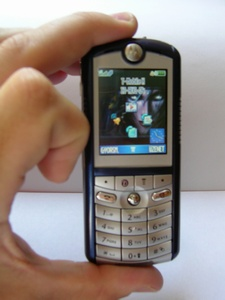

---
author:
    email: mail@petermolnar.net
    image: https://petermolnar.net/favicon.jpg
    name: Peter Molnar
    url: https://petermolnar.net
copies:
- http://web.archive.org/web/20200625125905/https://petermolnar.net/article/motorola-e398/
lang: hu
published: '2004-08-14T20:34:00+02:00'
summary: Nekem tetszik. Bár eddig volt egy belépő, egy közép és egy üzleti-jellegű
    mobilom (Alcatel OT301, Ericsson T29s, Siemens S55), nekem ő is tetszik.
    Tény, hogy néhány PIM funciót hiányolok (rendes szinkronizálás Outlookkal,
    jegyzetek, hangjegyzet), de végül is nem erre tervezték. Fiataloknak és
    zeneőrülteknem szánták, annak pedig tökéletes.
tags:
- mobile
title: Motorola E398
review:
    rating: 5
    best: 5
    brand: Motorola
    model: E398
    description: mobiltelefon
    img: mote398_1.jpg
    caption: Ez egy elpusztíthatatlan, hackelhető, fantasztikus telefon volt.
    url: https://www.gsmarena.com/motorola_e398-690.php
---

*Ez egy ősi bejegyzés; az oldalam 2004-es mentéséből vakartam elő.*

## Design

Szerintem nagyon szépre sikeredett a telefon. Tény, hogy a T-Mobile-os
verziót kissé elcsúfítja a plusz gomb középen, sőt, a használhatóságán
is ront, de ennek ellenére még mindig szép készülék. Nincs a
használhatatlanságig fejlesztve, mint pl. a Nokia néhány készüléke, de
nem is annyira szép mint néhány Siemens (amit viszont rettentően nehéz
nyomkodni...). A gombok kellemesen erősek, a pöcök sokkal jobb, mint
amilyennek képről tűnik, a kábelcsatlakozó pedig kifejezetten igényes,
kipattan egy gomb megnyomására, nem kell cibálni. A fülhallgató nekem
kicsit kényelmetlen, de a hangjára egy szavam sem lehet - már majdnem
Sennheiser minőséget hoz, a csatlakozóaljzata is rendesen működik, jól
passzol. A kijelző gyönyörű, Samsung minőségű. Sokkal szebb, mint pl. a
Sony-Ericsson T610-é, de talán szebb a Nokiák döntő többségénél is.
Élesek a színei, jók a kontrasztok és napfényben is jól látszik. Hangos,
de nagyon. Csengésben szinte bárhol meghallani, de telefonálás közben
lehetne még egy kicsit erősíteni. Persze, be lehet kapcsolni a
hangszórókat, és akkor már igen messzire kell tartani az ember fülétől
:). Apropó, hangszórók. Van egy bal és egy jobb oldalt, amiket így
összevetve a cucc stereoban szól :).

## Software

Az első benyomásom a Siemens S55 telefon után az volt, hogy lassú.
Sajnos, ez még mindig fent áll, de az okra nem jöttem rá. A JAVA dolgok
gyorsak, és sokkal gyorsabban beveszik a billentyűket, mint maga a menü.
Ettől még évezhető sebességgel fut, de kicsit zavaró. Az elején. Aztán
nem is annyira.

## Amiket nem tud vagy zavaró:

-   nincs infraport, és bár a Bluetooth jó, szerintem beletehették
    volna.
-   a telefonkönyv nevenként sok bejegyzést tud tárolni, de mindet külön
    recordként, és név alapján fésüli őket össze. Ez rettenetesen zavaró
    tud lenni az sms címzés kiválasztásánál, mert sokszor át kell
    görgetni ugyanazt a nevet kétszer-háromszor.
-   csak egy betű alapján keres a telefonkönyvben, komoly hiba, bár
    igaz, a telefont nem az üzleti szférába szánták.
-   lehet, hogy tud, de még nm találtam meg, hogy egyszerre rezegjen és
    csengjen. Hozzá kell tenne, hogy van benne egy Vibe Sync nevű
    rendszer, ami az egész telefont rezegteti, ha zene szól belőle, de
    az azért nem olyan erős, mint a rendes rezgés.
-   a kamera elméletileg VGA (640\*480-as) felbontással rendelkezik.
    Tényleg ekkora is lesz a kép, de élvezhető csak akkor, ha felére
    kicsinyíti az ember...akkor viszont meg azt is mondanám, hogy szép a
    képe.
-   az sms küldésnél nem lehet alalpértelmezetté tenni a kézbesítés
    értesítőt, viszont felajánlja az egyik képernyőn, ami két
    pöcökbillentéssel bekapcsolható.
-   a Bluetootht még nem sikerült róla elindítva párosítanom, nem tudtam
    megkeresni a többieket. Ez szerintem komoly hiba, hátha egy
    softwarefrissítés segít majd a dolgokon.
-   az aksit meglehetős izomerővel kell kiszedni, ami szerintem nem
    méltó a telefonhoz

## Amiket tud, új és jó

-   mp3 csengőhang :), bár nem olyan hangos, mint a midi maximuma.
-   a motorolás java alkamazások szinte mind futnak rajta, kiváló
    minőséggel.
-   több ébresztőóra lehet
-   igényes naptár
-   videót is visszajátszik
-   64 MB-os Trans Flash kártya, 2/3-a s SIM kártya méretének (nem
    vicc), adnak hozzá SD adaptert (! :) ), meglepően gyors
-   pár klikkeléssel memóriakártyaként látható a számítógépen (!!!), ami
    ME-től kezdve driver nélkül működik.

## Telefon és számítógép

Nagyjából szeretik egymást. A <http://thiskman.no-ip.org> címen sok
minden le van írva, érdemes betartani és végigcsinálni :). Megjegyzem,
az a leírás csak XPvel megy, nekem 2000el nem. Linuxos leírásról még nem
tudok.

A mobile phone tools: érdekes software, gyorsabb, mint pl. a Siemensé,
viszonylag sok mindent tud, bár a telefonköny-kezelés a fent említett
bejegyzés-tárolás miatt nekem kicsit nehézkes. E-mailt, smst jól küld, a
media center teljesen korrektül működik. A Bluetooth nekem szépen ment,
zavaró, hogy nem engedett virtuális COM portot nyitni, de ez legyen a
legnagyobb bajom. Analóg modemnek még ezt sem sikerült használnom.
(Utoljára Nokia 6310i-vel sikerült)

## Linkek

<http://www.hellomoto.com> - a hivatalos, magyarul nem túl jó oldal

<http://www.motclub.com> - spanyol nyelvű emészthető oldal

<http://members.lycos.co.uk/v525> - bár nem ehhez a telefonhoz készült,
de sok hasznos cucc van fent rajta

<http://thiskman.no-ip.org> mit hogyan (pl. java a számítógépről),
alapmű, viszont csak XP-re működik (2000en próbáltam, nem ment)

## Letöltések

  File                                                                                       Méret
  ------------------------------------------------------------------------------------------ ----------
  [FlashBackup\_2.61.rar](FlashBackup_2.61.rar)                                              448.7 KB
  [P2KTools\_0.8.6-406.rar](P2KTools_0.8.6-406.rar)                                          899.4 KB
  [PCMMod\_E398\_Rokr\_v1\_1\_.7\_MP\_w-o\_CG6.7z](PCMMod_E398_Rokr_v1_1_.7_MP_w-o_CG6.7z)   17.1 MB
  [RAMLDR\_IMPROVED.rar](RAMLDR_IMPROVED.rar)                                                26.2 KB
  [usbinf\_xpw2k.zip](usbinf_xpw2k.zip)                                                      2.2 KB
