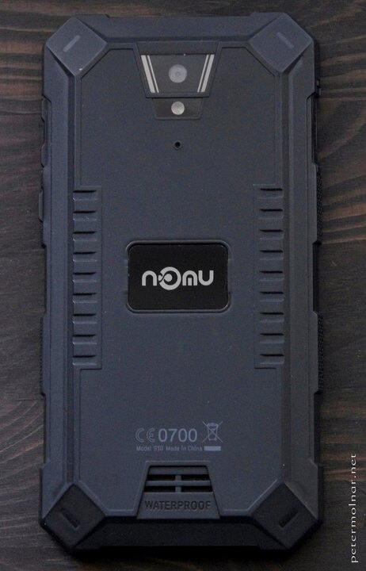

---
author:
    email: mail@petermolnar.net
    image: https://petermolnar.net/favicon.jpg
    name: Peter Molnar
    url: https://petermolnar.net
copies:
- http://web.archive.org/web/20190624125853/https://petermolnar.net/nomu-s10/
published: '2018-01-07T11:00:00+00:00'
review:
    best: 5
    brand: Nomu
    description: rugged Android smartphone
    img: nomu_s10_front.jpg
    caption: Nomu S10 after a few months of regular use in pockets and
        bags
    model: S10
    rating: 3
    url: https://amzn.to/2Jb1CBZ
summary: Cheap, good outdoor phone, with gigantic, but irreplaceable battery,
    waterproof body, very loud speaker. Has no repair options, starts to fall
    apart after a year of use, and might come with a virus preinstalled.
tags:
- hardware
title: Living with a rugged, cheap Chinese Android phone, the Nomu S10

---

*Disclaimer: I didn't get paid for this entry: I simply liked this phone
enough to share the whys and the fixes for it's problems. It also serves
as notes for myself.*

**Update 2018-04-18:** the phone's rubber exteriors started to
deteriorate on the bottom right corner, where it contacts my hand most
of the time; some of this is visible on the first image already, but it
gets much worse surprisingly fast. I've found a glue - namely Loctite
Power Flex Super Glue - which holds it, but it's quite ugly after the
fix. A single year out of a device like this is not very good, but
considering the price, it's not a big surprise. Unfortunately there is
no repair kit available in any form, and I seriously dislike generating
a phone per year amount of waste. However, I still like most of it's
aspect very much.

*Disclaimer: I didn't get paid for this entry: I simply liked this phone
enough to share the whys and the fixes for it's problems. It also serves
as notes for myself.*

**Update 2018-04-18:** the phone's rubber exteriors started to
deteriorate on the bottom right corner, where it contacts my hand most
of the time; some of this is visible on the first image already, but it
gets much worse surprisingly fast. I've found a glue - namely Loctite
Power Flex Super Glue - which holds it, but it's quite ugly after the
fix. A single year out of a device like this is not very good, but
considering the price, it's not a big surprise. Unfortunately there is
no repair kit available in any form, and I seriously dislike generating
a phone per year amount of waste. However, I still like most of it's
aspect very much.

## How the Nomu S10 found me

About half a year ago we (my wife and me) decided we need to replace our
phones - again. The Galaxy S4 was a sad choice after a Nexus 4 and a
Galaxy Nexus, but those had to be replaced: they were literally falling
apart and none of them supported European LTE bands - 3, 8, 20.

The Samsung Galaxy S4 is a weak, fragile creature, with weird bugs, a
bloated, locked system, and with a slippery, rounded-everywhere shape
that will certainly land on the tarmac a few times due to this. It has
an impressive range of sensors, but that's it, and I wanted a phone
which works reliably and which is a bit more rugged.

I don't believe in the current trend of bezel-free design and I'm very
tired of all-glass, expensive, overheating, bloated, gargantuan
"phones", so I started looking into less-known brands. Initially into
names like Oneplus, Xiaomi and some similar, sort of established
manufacturers, but soon I learnt getting the actually good models in
Europe is quite hard and due to this, nearly none of them covers LTE
band 20 - the one giffgaff[^1], my service provider has access to.

The danger of less known brands is that they can be cheap for very
logical reason: many of them are built cheap. On the bright side, the
usually bring a surprising but good feature: most of the time these
phones feature a near-raw AOSP system, without any bloat, and only minor
software modifications.

Not long into my search I found a gem: the Nomu S10[^2] and the Nomu
brand in general. Apart from the S10, there is now the S10 Pro[^3], the
S20[^4] and S30[^5] model. All of them are IP68 - waterproof enough to
survive being fully submerged under water for a little while, rugged,
with huge batteries.

The S10 is a relatively basic phone. It lacks NFC, 5GHz WiFi, and any
new, shiny tech - but it's loud, has a very capable 5000mAh battery, and
covers more or less anything that falls under regular use. *Yes, it's
heavy.* It also has a metal frame inside - some way it resembles a
ThinkPad from the old days. It packs 2GB RAM, 16GB storage, and either
expandable with microSD, or it accepts 2 SIMs. The screen is a HD IPS
screen, which I prefer to the OLED screens personally. The 2.4GHz Wifi
is fast and stable and has a better reception than my previous, high-end
phones did.

It also comes with a protective foil by default - actually it comes with
2 layers; after removing the first, a second is still protecting the
display. Also has some version of Qualcomm Quick Charge which is also
supported by the European charger it came with, which is certainly
needed for the monster battery it has.

Though the stock firmware accepted SD cards up to 32GB, for my surprise,
one of the system updates made 64GB possible as well - I don't have any
bigger ones, but I wouldn't be surprised if the upper limit was 256GB.

Overall it has all the features you'd want from a phone that was built
to last and be a companion for rough weather or outdoor activities.

I got a very good phone for the price and it worked well enough that I
even used it without rooting.



## Troubles arise: the Triada malware fiasco

One day my wife came home, telling me that her phone started to act
weird: it randomly shows full screen popups, installs random software,
and generally acting weird.

Knowing the she is quite careful and not installing basically anything
on her phone after a few initial, well established apps, it looked very
much like either a hack through other networks she connects to or
something completely out of our control.

Unfortunately it turned out to be the later: there has been reports that
a good amount of similarly cheap Chinese phones **got infected with
malware - from the manufacturer**[^6]! Interestingly the malware did not
manifest on my phone, but the possibility that it might got me itchy.

Having a little experience in flashing custom ROMs the solution was
obvious: I need to find a malware-free ROM for the Nomu and re-flash
them.

The last time I had to dwell deep into Android and flashing was with my
beloved HTC Desire - in 2011 - apparently a lot has changed since, and
the malware, Triada, managed to sit into a part of the system, called
Zygote, which is deep enough that even with root privileges you couldn't
get rid of it.

**So here is how to get rid of the Triada malware on a Nomu S10 by
flashing a malware free ROM.**

### The search for a malware-free ROM - the downside of niche phones

When you have a widely bought and known phone there are usually plenty
of custom ROMs floating around for it. This used to be the case for the
Nexus 4, the Galaxy S4, even for the HTC Desire.

This is not the case with the Nomu S10: it's rare, so nobody made a
full-on custom ROM for it. I started looking into forums and threads on
the topic and thankfully I came across a French forum[^7] mentioning
something called Archos 50 Saphir ROM. I was hoping to find some
~~Cyanogenmod~~ LineageOS based ROM, but for my surprise, Archos is a
retailer: they sell Archos branded phones. One of these is what they
call 50 Saphir[^8] - which is a re-branded Nomu S10.

Apparently the S10 had been sold to various "brands" who buy cheap
phones, put a logo and a ROM without malware on them, and sell them for
double the price.

This is the Archos ROM I ended up using:

<https://www.dropbox.com/s/yk2t2mlv1uch0y7/Archos-50-Saphir-14-OTA.zip?dl=0>

*You can also get it from needrom.com[^9].* It's 1.1GB, so if you're
tight on bandwidth, don't grab it immediately.

Another option is to get one of the newer, official Nomu ROMs, from
their own site[^10] - the version 1.1.4, uploaded 2017-11-11 seems to be
running fine and malware free for me for the past month:

<https://drive.google.com/file/d/1ZXlnlic2z10CSFGoCf7nHygfTWsnFsAq/>

I went with this solution, although it's reasonable to be cautious and
stick to the Archos version.

### OEM Unlocking - the upside of OEM phones

**Note: OEM unlocking can trigger a complete factory reset, deleting
anything on your phone, excluding the microSD card. I'd still suggest
removing even the microSD card and saving everything before starting the
process.**

Since the S10 has been sold for other brands to be used with their
labels, Nomu allowed these resellers to flash their own operating
system. This is good news for us: it means we can do the same, and
rather simply.

There is a process in newer Androids that protects your phone from being
overwritten by a mere USB cable and a laptop which requires a working
operating system. If you don't have one, you won't be able to unlock
flashing on your phone, so first to a factory reset and then follow
these steps.

In your running Android:

1.  enable the `Developer mode`:
    1.  go to `Settings`
    2.  enter `About phone`
    3.  tap `Build number` approximately 6 times
2.  once you have `Developer options` under `Settings`, enter it
3.  enable `OEM unlocking`

For the next stage, you'll need a tool called `fastboot`. I'm using
Debian, which is a linux distribution, and I have `fastboot` available
from `apt` *(the Debian app store, one could say)* . I have no idea how
to install it on Windows, but there are many tutorial available on the
internet, and the commands should work once you have it. The commands
below need to be executed as `root` user in linux.

Once you have fastboot:

1.  power off your phone
2.  press and hold `volume up` and the `power` buttons
3.  you'll be greeted with a little menu, looking like:

<!-- -->
    Select Boot Mode:
    [VOLUME_UP to select, VOLUME_DOW is OK.]

    [Recovery   Mode]       <<==
    [Fastboot   Mode]
    [Normal     Mode]

Select `Fastboot mode` by pressing `volume up` and press `volume down`.
The screen will now print a new line:

    => FASTBOOT mode...

On your laptop, connect the USB cable and test if you see the device in
your laptop:

```bash
fastboot devices
EEMRTK5PBEJ78DWS        fastboot
```

**If you don't see the device, there is something wrong; try to repeat
the process from the beginning of OEM unlocking.**

Now enter:

```bash
fastboot flashing unlock
```

**Note: it used to be** `fastboot oem unlock`. Now it's
`fastboot flashing unlock`. If it doesn't work, try the oem command
version.

It will ask for confirmation and you'll have to press the corresponding
volume button - read the instructions on the phone, but `volume up`
should enable to unlock.

Congratulations! You can now install any ROM made for your phone.

**Things that might go wrong with this:**

-   to get out of fastboot press and hold the `power` button for a while
-   if neither `fastboot oem unlock` nor `fastboot flashing unlock` does
    nothing, do a factory reset, a cache clear, and re-enable OEM
    unlocking. For this, you need to boot the `recovery` option instead
    of fastboot, the select the options.
-   if this didn't work either... well, that's a problem, and I don't
    have a simple, fast, or working solution.

### Flashing the stock ROM

#### Using SP Flash Tool (UPDATE 2018-04-20)

I turns out I was unaware of a tool - namely the **SP Flash Tool** -
which is the official way of flashing ROMs on MediaTek based systems.

When the phone is turned off and connected to a computer via USB, it
shows up as modem (!) device, as ttyACM. The SP Flash tool uses this to
flash the ROM, but in order to do that - even if the flash tool is run
by root - needs some tweaking on the linux side.

In order to get this supported on Debian, some udev rules need to be
added:

Run (as root):

```bash
cat > etc/udev/rules.d/20-mediatek-blacklist.rules << EOF
ATTRS{idVendor}=="0e8d", ENV{ID_MM_DEVICE_IGNORE}="1"
ATTRS{idVendor}=="6000", ENV{ID_MM_DEVICE_IGNORE}="1"
EOF

cat > etc/udev/rules.d/80-mediatek-usb.rules << EOF
SUBSYSTEM=="usb", ACTION=="add", ATTR{idVendor}=="0e8d", ATTR{idProduct}=="*"
EOF

systemctl restart udev.service
```

Once done add your user to the `dialout` and `uucp` groups as:

```bash
usermod -a -G dialout,uucp YOUR_USERNAME
```

Sp Flash tool needs an old version of libpng12, so get that from the
Debian packages, or from the jessie (oldstable) repository:

```bash
wget http://ftp.uk.debian.org/debian/pool/main/libp/libpng/libpng12-0_1.2.50-2+deb8u3_amd64.deb
dpkg -i libpng12-0_1.2.50-2+deb8u3_amd64.deb
rm libpng12-0_1.2.50-2+deb8u3_amd64.deb
```

This should make it possible to flash, using the SP flash tool, which
can be downloaded from spflashtool.com[^11].

Credit due to Miss Montage on needrom.com[^12] for finding these out.

#### Using `fastboot`

Originally I tried to flash the stock ROM via the stock recovery, but
every single time I got an error, telling me the zip file is corrupted.
After a while I decided to take another approach.

Once you have the stock ZIP, extract it:

```bash
unzip NOMU_S10_COMMON_V1.1.4_2017_11_01_FQ5C62WTE1D.XWP.NOMU.M0.HB.H.SSXSSYDAKLS23.1101.V3.14.zip -d nomu_s10_1.1.4
```

It will create the following files in the `nomu_s10_1.1.4` directory:

    APDB_MT6735_S01_alps-mp-m0.mp1_W16.47
    boot.img
    boot-verified.img
    BPLGUInfoCustomAppSrcP_MT6735_S00_MOLY_LR9_W1444_MD_LWTG_MP_V88_P92_1_lwg_n
    cache.img
    Checksum.ini
    lk.bin
    lk-verified.bin
    logo.bin
    logo-verified.bin
    md1arm7.img
    md1dsp.img
    md1rom.img
    md3rom.img
    MT6737T_Android_scatter.txt
    preloader_fq5c62wt_xwp_nomu.bin
    preloader.img
    recovery.img
    recovery-verified.img
    secro.img
    secro-verified.img
    system.img
    trustzone.bin
    userdata.img
    V18S NOMU 软件配置说明.txt

**The following will render your phone temporarily useless,; you will be
without recovery, left only with a bootloader, for a short period. I
seriously recommend only doing this with a fully charged phone and
avoiding any accidental reboots during the process.**

First, wipe the relevant partitions:

```bash
fastboot erase system
fastboot erase boot
fastboot erase recovery
fastboot erase cache
```

Now flash them:

```bash
cd nomu_s10_1.1.4
fastboot flash boot boot.img
fastboot flash recovery recovery.img
fastboot flash cache cache.img
fastboot flash system system.img
```

It will take a while, be patient.

### Flashing the Archos ROM

Just use the same method as above, but instead of extracting the Nomu
zip, extract the Archos zip.

However, unlike the stock ROM, the Archos ROM can be installed via
`adb sideload` or simply selecting the zip in the
`dirty booted TWRP recovery` described below. In case you're familiar
with custom recovery zip installing then there's no need for the extract
magic, but that method works just fine as well.

### \[Optional\] How to root the Nomu S10 - dirty booting TWRP recovery

Dirty boot means we don't flash the recovery partition, only load it on
the fly from the laptop and use it temporarily - think about it as a
live linux distribution. I found a TWRP custom recovery which worked
very well for me; unfortunately I don't remember the source, so I've
uploaded it to Dropbox:

TWRP 3.0.2 recovery for Nomu S10:

<https://www.dropbox.com/s/yebkei44w9oq6kh/nomu-s10_twrp-3.0.2.img?dl=0>

Once you're in the recovery, you can install whatever you want,
including SuperSu:

<https://www.dropbox.com/s/semoj6evcio3nyw/SuperSU-v2.82-201705271822.zip?dl=0>

SuperSu is a "systemless root" method, which means instead of touching
the `system` partition, which triggers an alarm with many root
detectors, it puts the `su` binary into `/sbin` - which is part of the
boot image. It can be simply reverted, should that be needed.

I didn't have luck installing Magisk. While it worked flawlessly on a
LineageOS install on a Nexus 10, no matter what I tried, it never worked
here, but every single attempt triggered a factory reset. Just use
SuperSu. If you do need features Magisk provides, maybe take a look at
the Xposed framework instead, that worked well:

<https://www.dropbox.com/s/xuqmah3vwh3nsre/xposed-v88.2-sdk23-arm.zip?dl=0>

The simplest for these to install is to put them on the microSD card and
select them as zip to be installed from TWRP. I will not cover the
process this here, there are very good howto about TWRP and installing
zips.

## Waterproof - as long as you are careful

Not too long ago we spent a few days abroad, next to the sea, and found
a tiny pool, left with water during low tide. The pool had a surprising
amount if small fish and a small amount of coral in it, and, since the
S10 is marketed as IP68, we decided to take a few underwater pictures
with it. It's important to say that one of the first things we did when
we got the phones was submerge it in a lake to test the waterproofness,
and there were not issues, but it was just a few seconds.

It's a terrible underwater camera, so don't use it as one. The
touchscreen gets mad and recognizes the water as constant touch, so
pushing the camera shutter button is hard and tricky.

But after finishing taking the shoots it seemed like my wife's phone got
a leak somewhere. It could have been a tiny bit of looseness in the
rubber USB cover, or something completely unrelated, but after a few
minutes out of the water it developed weird errors. The screen showed a
lot of vertical lines, fading or altering the colour "behind" them, the
resolution looked like it fell back to 320x240, and charging worked only
sporadically. Apart from this, it was still working, receiving calls,
responsive to touch.

After getting home I returned it to Amazon, who, due to the lack of
replacement units with the original seller, refunded the value (the
phone was less, the 6 months old). In my opinion, and according to the
marketing, we did nothing out of ordinary use. We bought another one.

## Touchscreen quality issues? (it may have been the only problematic one we got)

After buying the replacement for the defective one the next we received
seemed fine - until you poked the touchscreen around the 'a' character
on the keyboard. From that point, it started acting like the screen was
being touched at multiple locations - would have made a nice stock video
for ghost movies.

This was an obvious, immediate return, and we are now with yet another
one without glitches - I hope it stays like that.

## And you're still recommending it?!

Oh, yes.

It's cheap, with very nice features: small, compared to the battery it
packs; runs for days on a single charge even with reasonable use;
waterproof enough to survive being out in the rain for a long while,
even submerged (when the flaps a strictly closed); the features it has
all work; it's "hackable" by default (the good way, unlike the Samsung
or HTC phones).

The malware-by-manufacturer is not a unique problem and not strictly a
problem of no-name manufacturers. There were reports that similar issues
hit well known brands, such as Samsung, LG, Asus - at a point, the
problem even included some Nexus 5 phones by Google[^13].

My sole remaining moan with the phone is that it's glued. To take it
apart, you'd need a special machine or a rather precise heat-gun and a
steady hand. However, all the ones with screws, like the Blackview
BV6000, are much larger and heavier.

So yes: regardless of the potential malware issue, I'm still
recommending this phone, but do make sure you have a virus-free OS once
before you start using it as your main phone.

[^1]: <https://www.giffgaff.com/orders/affiliate/petermolnar2>

[^2]: <http://amzn.to/2AioYRp>

[^3]: <http://amzn.to/2CCxb9e>

[^4]: <http://amzn.to/2CNBf3a>

[^5]: <http://amzn.to/2E3E7IK>

[^6]: <https://news.drweb.com/news/?i=11390&lng=en>

[^7]: <https://forums.malwarebytes.com/topic/200072-trojantriada>

[^8]: <http://www.archos.com/gb-en/products/smartphones/saphir/archos_50saphir/index.html>

[^9]: <https://www.getdroidtips.com/stock-rom-archos-50-saphir/>

[^10]: <http://www.nomu.hk/s10-rom-download/>

[^11]: <https://spflashtool.com/download/SP_Flash_Tool_v5.1744_Linux.zip>

[^12]: <https://www.needrom.com/download/how-to-setup-sp-flash-tool-linux-mtk>

[^13]: <https://arstechnica.com/information-technology/2017/03/preinstalled-malware-targets-android-users-of-two-companies/>
