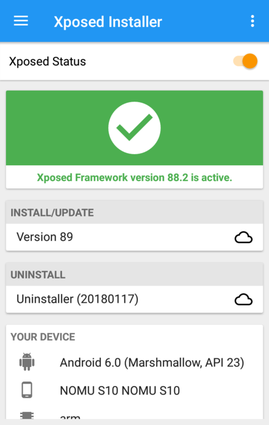

---
author:
    email: mail@petermolnar.net
    image: https://petermolnar.net/favicon.jpg
    name: Peter Molnar
    url: https://petermolnar.net
copies:
- http://web.archive.org/web/20180425082712/https://petermolnar.net/odexed-android-6-marshmallow-with-microg/
published: '2018-02-24T10:00:00+00:00'
summary: The method of replacing Google Services Framework with microG suite
    on the stock, Android Marshmallow ROM of a Nomu S10
tags:
- android
title: How to install microG an odexed stock android ROM

---

## Why would anyone want an android without Google?

About 1.5 years ago I attended to a wedding. It took place outside of
the city, at a restaurant with a very nice garden, where I've never
before. In about 2 hours into the happening, my phone buzzed. I took it
out, expecting a text message, or similar, but no: it was Google Maps,
asking me if I'm at the place where I am, and since I'm there, could I
upload some pictures of the place?

Since then this had become regular, until the point it became
obstructive and annoying. I'm not alone: Brad Frost's[^1] entry talks
about the same problem. I've tried everything to turn Google location
tracking off. I went to Location History[^2] and disabled it. I went
through the Google Maps application and removed every notification. This
latter one cleared the madness for a while - until a new version of Maps
came up, which introduced some extra notification setting, which then
showed yet another popup out of the blue.

Google fails to respect user settings lately, turning into a desperately
annoying data hoarding monster. They've been doing nasty things, like
silently collecting cell tower information, even with location settings
disabled for years[^3], but with the coming of GDPR[^4] they need to get
consent - hence the silly amount of notifications they are bombarding
you with.

Once I set a setting in a service, I expect it to stay they way I set
it. I expect backwards compatibility, backfilled data, if needed. Google
and Facebook are both failing at this; Facebook always had, Google only
recently started. *New app, we renamed all the settings, let's reset
them to the default level of annoyance!*

The whole problem on android can be traced back to one omnipotent
application: Google Services Framework. This silent, invisible beast
upgrades itself and Play Store whenever, wherever it wants it to. It
does this all in the background, not even letting you know. If you
happen to run an ancient phone, like my HTC Desire[^5], it will fill up
that generous 150MB you have for user apps without a blink of an eye,
and let you wonder why your phone can't boot any more.

The extremely sad part is that everyone started depending on GMS -
Google Mobile Services - for convenience: it provides push services, you
don't have to run you own. It all leads to the point that android, while
in theory is Open Source, it will never be Free from Google, in it's
current form.

Enter microG[^6]: a few enthusiasts with the same feelings as me, but
with actual results. microG is a service level replacement for Google;
it's Free and Open Source, it's transparent. There's only one problem:
it's *very* tricky to install it on nieche phones, with odexed ROMs.

So I made a guide. While this guide was made using a Nomu S10[^7], but
given it's an AOSP based ROM with tiny modifications, I'm fairly certain
it can be applied to any similar, ~~no-name~~ less known brands and
phones.

## Important notes

**The methods below might void your warranty. It might brick your phone.
It will take while. It can cause an unexpected amount of hair pulled
out.**

**Never do it on your only phone, or a phone you value high. I take no
responsibility if anything goes wrong.**

**It was done on a Nomu S10, with Android 6.0 Marshmallow. It will most
probably need to be altered for other versions.**

**The heavy lifting, the work, are all done by magnificent people out
there; this article is merely summary of existing knowledge.**

The only thing I can assure is that it worked for me, but it took a
weekend to get to the bottom of it.

## Prerequisites

### Operating system, adb, fastboot

The guide was made for **Debian** based linux, including **Ubuntu** and
**Mint**.

I assume you have a general understanding and familiarity with
`fastboot` and `adb` - these are both needed during the process.

It's doable on Windows as well, with very similar steps, but I don't
have a Windows, so I can't make that guide.

### SP Flash Tool (flashing stock ROMs on MediaTek devices)

The stock ZIPs Nomu provide can't be flashed via the regular recoveries,
like TWRP. As a workaround, I used to extract it and flash the pieces by
`fastboot` - that is because I wasn't aware of a tool, called **SP Flash
Tool** and the MediaTek download mode.

When the phone is turned off and connected to a computer via USB, it
shows up as modem (!) device, as ttyACM. The SP Flash tool uses this to
flash the ROM, but in order to do that - even if the flash tool is run
by root - needs some tweaking on the linux side.

In order to get this supported on Debian, some udev rules need to be
added:

Run (as root):

```bash
cat > etc/udev/rules.d/20-mediatek-blacklist.rules << EOF
ATTRS{idVendor}=="0e8d", ENV{ID_MM_DEVICE_IGNORE}="1"
ATTRS{idVendor}=="6000", ENV{ID_MM_DEVICE_IGNORE}="1"
EOF

cat > etc/udev/rules.d/80-mediatek-usb.rules << EOF
SUBSYSTEM=="usb", ACTION=="add", ATTR{idVendor}=="0e8d", ATTR{idProduct}=="*"
EOF

systemctl restart udev.service
```

Once done add your user to the `dialout` and `uucp` groups as:

```bash
usermod -a -G dialout,uucp YOUR_USERNAME
```

Sp Flash tool needs an old version of libpng12, so get that from the
Debian packages, or from the jessie (oldstable) repository:

```bash
wget http://ftp.uk.debian.org/debian/pool/main/libp/libpng/libpng12-0_1.2.50-2+deb8u3_amd64.deb
dpkg -i libpng12-0_1.2.50-2+deb8u3_amd64.deb
rm libpng12-0_1.2.50-2+deb8u3_amd64.deb
```

This should make it possible to flash, using the SP flash tool, which
can be downloaded from spflashtool.com[^8].

Credit due to Miss Montage on needrom.com[^9] for finding these out.

### TWRP recovery for Nomu S10

**Do not flash TWRP recovery on the Nomu S10**. There is some kind of
safety check, which wants to trigger a factory reset, so what happens in
short is the following:

-   you flash system, boot, cache from stock
-   you flash TWRP as recovery
-   the phone boots
-   it re-locks the OEM unlock switch
-   it removes TWRP

At this point it's stuck with a boot logo on screen (not even a
bootloop); it can't even be turned off, it's without a working system,
no recovery, and a locked fastboot. If you reach this point, use SP
Flash Tool described above.

**Instead of flashing, a method called dirty boot will be used**: via
`fastboot`, the TWRP image will be booted from the PC, not from the
phone, because TWRP is still neede in order to flash custom ZIPs.
Jemmini[^10] made one for the Nomu S10; it in a zip[^11] ; extract it to
get a `.img` file.

### SuperSu flashable ZIP

Many things have changed since the early days of rooting android (2.3
and 4.x). Nowadays fiddling with the system /bin might result in mayhem,
so clever people came up with the idea to put `su`, the actual binary
needed for rooting into the boot image, ending up in `/sbin`, without
triggering any "security". One of these systemless rooting apps is
SuperSu[^12], which you'll need in a flashable zip[^13] format.

### Xposed framework ZIP and apk

A vast amount of Android's real potential is lock behind bars - the
reason is "security". I'm putting this in quotes, because it's smoke and
mirrors: malware can use vulnerabilities to install itself deep inside
the system that it's impossible to even detect it, yet you're not
allowed to have full access on your phone. Not even the security suits
and the malware scanners ask for root, and without that, they are not
much more than a paid, bad joke.

Anyway: the XPosed Framework[^14] is here to help. It's a utility which
lets you install modules which modules tweak low level android
behaviour. For example, Volumesteps+ will let you change the granularity
of volume steps, which is very useful for someone who'd find a volume
level between the factory 8 and 9 the best. For us, the important module
will be FakeGApps, which allows signature spoofing[^15], which is a hard
requirement for microG to work.

For reasons I'm yet to understand, I had to both flash the zip[^16] and
install the apk[^17] version to get XPosed on the phone. In theory, only
one should have been enough, but for now, get both.

### NanoDroid microG ZIP

NanoDroid[^18] is originally a Magisk module (it's another systemless
rooting and framework, but I could never get it running on the Nomu),
but it's also available as flashable ZIPs.

For our needs, only the NanoDroid microG zip[^19] is required.

## The actual un-googling

### Summary

1.  root the phone and install xposed
2.  enable signature spoofing via xposed module fakegapps
3.  removed all google related apps, libs, entries
4.  install microg

Now: in details.

### 1. Rooting the Nomu S10 with SuperSu and Xposed

**Important: OEM unlocking will trigger a factory reset, it will wipe
every user and app setting from the phone.**

1.  Start android
2.  Enable `Developer Options`:
    -   go into `Settings`
    -   `About Phone`
    -   tap on the `Build Number` until you get the message 'you are now
        a developer!' 
3.  Enable OEM unlocking
    -   go into `Settings`
    -   `Developer`
    -   allow `oem unlocking`
4.  Enable USB Debugging (ADB)
    -   go into `Settings`
    -   `Developer`
    -   allow `usb debugging` 
5.  reboot into fastboot:
    -   run `adb reboot bootloader` from the host, **or**:
    -   power off the phone, then press and hold `Volume Up` and `Power`
        
6.  in fastboot, issue the oem unlock command:
    -   `fastboot oem unlock` from the host
    -   press `Volume up` as asked on the phones 
7.  reboot the phone: `fastboot reboot`
8.  let the factory reset flush through
9.  re-enable `Developer Options` (see 2.)
10. verify that OEM unlocking is on - is should be. If not, go back
    to 1. and start again.
11. re-enable `USB debugging` (see 3.)
12. boot into fastboot (see 5.)
13. "dirty" boot TWRP recovery:
    -   `fastboot boot [path to the twrp image - the one extracted from the zip]`
14. install SuperSu via TWRP
    -   either put the zips on a microSD card and flash it as regular
        zips
    -   or use `adb sideload` from the `Advanced` menu in TWRP
15. install Xposed via TWRP (see 14.)
16. reboot the phone
17. install the Xposed apk

### 2. Enable signature spoofing with FakeGapps

Once the Xposed Installer is up and running it will look like this:



Under `Menu`, `Download` search for FakeGApps[^20], click `Download` and
enable it:


**For FakeGApps to take effect, the phone has to be rebooted, but it can
be done together with the next step.**

### 3. Remove all google apps and libraries

These commands should be run either via an `adb` shell, or from a
`Terminal Emulator` on the phone.

```bash
adb shell

# become root - SuperSu will prompt for verification
su -
# remount / and /system for read-write
mount -o remount,rw /
mount -o remount,rw /system
# create a file with the list it items to delete
cat > /sdcard/ungoogle.sh << EOF
rm -rf /system/app/CarHomeGoogle*
rm -rf /system/app/ChromeBookmarksSyncAdapter*
rm -rf /system/app/ConfigUpdater*
rm -rf /system/app/FaceLock*
rm -rf /system/app/GenieWidget*
rm -rf /system/app/Gmail*
rm -rf /system/app/Gmail2
rm -rf /system/app/GmsCore*
rm -rf /system/app/Google*
rm -rf /system/app/LatinImeTutorial*
rm -rf /system/app/LatinImeDictionaryPack*
rm -rf /system/app/MarketUpdater*
rm -rf /system/app/MediaUploader*
rm -rf /system/app/NetworkLocation*
rm -rf /system/app/OneTimeInitializer*
rm -rf /system/app/Phonesky*
rm -rf /system/app/PlayStore*
rm -rf /system/app/SetupWizard*
rm -rf /system/app/Talk*
rm -rf /system/app/Talkback*
rm -rf /system/app/Vending*
rm -rf /system/app/VoiceSearch*
rm -rf /system/app/VoiceSearchStub*
rm -rf /system/etc/permissions/com.google.android.maps.xml
rm -rf /system/etc/permissions/com.google.android.media.effects.xml
rm -rf /system/etc/permissions/com.google.widevine.software.drm.xml
rm -rf /system/etc/permissions/features.xml
rm -rf /system/etc/preferred-apps/google.xml
rm -rf /system/etc/g.prop
rm -rf /system/addon.d/70-gapps.sh
rm -rf /system/framework/com.google.android.maps.jar
rm -rf /system/framework/com.google.android.media.effects.jar
rm -rf /system/framework/com.google.widevine.software.drm.jar
rm -rf /system/lib/libfilterpack_facedetect.so
rm -rf /system/lib/libfrsdk.so
rm -rf /system/lib/libgcomm_jni.so
rm -rf /system/lib/libgoogle_recognizer_jni.so
rm -rf /system/lib/libgoogle_recognizer_jni_l.so
rm -rf /system/lib/libfacelock_jni.so
rm -rf /system/lib/libfacelock_jni.so
rm -rf /system/lib/libgtalk_jni.so
rm -rf /system/lib/libgtalk_stabilize.so
rm -rf /system/lib/libjni_latinimegoogle.so
rm -rf /system/lib/libflint_engine_jni_api.so
rm -rf /system/lib/libpatts_engine_jni_api.so
rm -rf /system/lib/libspeexwrapper.so
rm -rf /system/lib/libvideochat_stabilize.so
rm -rf /system/lib/libvoicesearch.so
rm -rf /system/lib/libvorbisencoder.so
rm -rf /system/lib/libpicowrapper.so
rm -rf /system/priv-app/CarHomeGoogle*
rm -rf /system/priv-app/ChromeBookmarksSyncAdapter*
rm -rf /system/priv-app/ConfigUpdater*
rm -rf /system/priv-app/FaceLock*
rm -rf /system/priv-app/GenieWidget*
rm -rf /system/priv-app/Gmail*
rm -rf /system/priv-app/GmsCore*
rm -rf /system/priv-app/Google*
rm -rf /system/priv-app/LatinImeTutorial*
rm -rf /system/priv-app/LatinImeDictionaryPack*
rm -rf /system/priv-app/MarketUpdater*
rm -rf /system/priv-app/MediaUploader*
rm -rf /system/priv-app/NetworkLocation*
rm -rf /system/priv-app/OneTimeInitializer*
rm -rf /system/priv-app/Phonesky*
rm -rf /system/priv-app/PlayStore*
rm -rf /system/priv-app/SetupWizard*
rm -rf /system/priv-app/Talk*
rm -rf /system/priv-app/Talkback*
rm -rf /system/priv-app/Vending*
rm -rf /system/priv-app/VoiceSearch*
rm -rf /system/priv-app/VoiceSearchStub*
EOF
# execut the created list
sh /sdcard/ungoogle.sh
```

### 3. Install NanoDroid microG

Once Google is cleaned up and the FakeGapps module is ready, reboot into
recovery (see 12. and 13.) and install the NanoDroid zip via TWRP.

If you done everything right, there will be no Google Services or apps
left, if not - as I did - a few leftovers will need to be manually
cleaned up.

If the microG flashing was successful, an app, called `microG settings`
will show up:


**Done!**

[^1]: <http://bradfrost.com/blog/post/google-you-creepy-sonofabitch/>

[^2]: <https://myaccount.google.com/activitycontrols/location>

[^3]: <https://qz.com/1131515/google-collects-android-users-locations-even-when-location-services-are-disabled/>

[^4]: <https://www.eugdpr.org/>

[^5]: <https://en.wikipedia.org/wiki/HTC_Bravo>

[^6]: <https://microg.org/>

[^7]: <http://www.nomu.hk/pro/s10_product_show/>

[^8]: <https://spflashtool.com/download/SP_Flash_Tool_v5.1744_Linux.zip>

[^9]: <https://www.needrom.com/download/how-to-setup-sp-flash-tool-linux-mtk>

[^10]: <https://forum.xda-developers.com/showthread.php?t=3482755>

[^11]: <https://forum.xda-developers.com/attachment.php?attachmentid=3947063>

[^12]: <http://www.supersu.com/>

[^13]: <https://s3-us-west-2.amazonaws.com/supersu/download/zip/SuperSU-v2.82-201705271822.zip>

[^14]: <https://forum.xda-developers.com/showthread.php?t=3034811>

[^15]: <https://github.com/microg/android_packages_apps_GmsCore/wiki/Signature-Spoofing>

[^16]: <https://dl-xda.xposed.info/framework/sdk23/arm/xposed-v89-sdk23-arm.zip>

[^17]: <https://forum.xda-developers.com/attachment.php?attachmentid=4393082>

[^18]: <http://nanolx.org/nanolx/nanodroid>

[^19]: <https://downloads.nanolx.org/NanoDroid/Stable/NanoDroid-microG-16.1.20180209.zip>

[^20]: <http://repo.xposed.info/module/com.thermatk.android.xf.fakegapps>