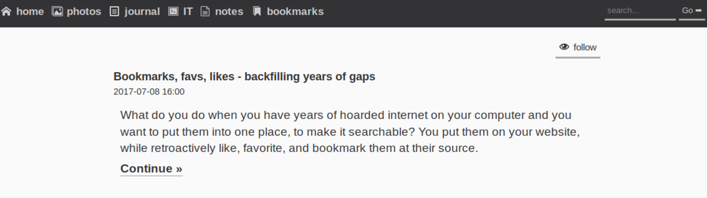

---
author:
    email: mail@petermolnar.net
    image: https://petermolnar.net/favicon.jpg
    name: Peter Molnar
    url: https://petermolnar.net
copies:
- http://web.archive.org/web/20181116175421/https://petermolnar.net/os-theme-switcher-css-with-fallback/index.html
published: '2018-11-16T22:45:00+00:00'
summary: prefers-color-scheme is a new CSS media query feature, which propagates
    your OS level color preference. While it's very nice, it's way too new
    to rely solely on it, so a manual fallback is needed.
tags:
- CSS
title: How to add themes to your website with manual and CSS prefers-color-scheme
    support

---

**Note: a commented version of the code is available as a Github Gist as
well[^1]**

Ever since I had a website, I nearly always had it dark, but after
reading a lot on reading text on displays, and just listening to
opinions and stories, it seemed like people do prefer dark text on white
background - light themes. So I tried it.



I felt weird and distant; it wasn't me. A couple of months ago I decided
to switch my site back to a dark theme. Unfortunately it really doesn't
work for everyone, which I can completely understand: I always wished I
could tell sites that I want a dark version of them - not with browser
addons, just by setting a preference.

My prayers got answered: in the upcoming version of CSS media queries -
level 5 -, there is an element: prefers-color-scheme[^2] which is
exactly this - a setting based on your operating system preference.
*Let's not talk about the fact that this will become yet another
fingerprinting method.*

While it's in experimental state, macOS Mojave with the preview 68
Safari is already supporting it[^3]. Unfortunately neither Windows nor
linux browsers do, regardless the preferred colour scheme[^4] option in
Windows 10, or the :dark GTK3 theme option in Gnome being present for
years.

Because it's highly experimental, and some might prefer a manual option,
I wanted an solution that provides a button to change theme as well.
There are blogposts out there about CSS-only[^5] or JS-based[^6]
automated solutions, and complex, even more experimental solutions,
based CSS variables[^7] but none of them provided a fallback.

This is my solution to support dynamic media queries for
prefers-color-scheme with manual fallback, using an inlined alternative
CSS.

## Inlined alternative stylesheet

In my site, I have 3 `<style>` elements: the base, dark style; an
alternative light style, which, by default, is only available for
`speech` media - a successor of `audible` -, and a third, print-only
one, which is out of scope for now.

I snippet of it looks like this:

```html
<head>
    [...]
    <style media="all">
        html {
            background-color: #111;
            color: #bbb;
        }
        body {
            margin: 0;
            padding: 0;
            font-family: sans-serif;
            color: #ccc;
            background-color: #222;
            font-size: 100%;
            line-height: 1.3em;
            transition: all 0.2s;
        }
        [...]
    </style>
    <style id="css_alt" media="speech">
        body {
            color: #222;
            background-color: #eee;
        }
        [...]
    </style>
    [...]
</head>
```

The idea is to toggle the `speech` to `all` on that `css_alt` element,
either automatically or based on user preference. To do this the most
semantic way I could think of I made a radiobutton, with 3 states: auto,
dark, light.

```html
<form class="theme" aria-hidden="true">
    <span>
        <input name="colorscheme" value="auto" id="autoscheme" type="radio">
        <label for="autoscheme">auto</label>
    </span>
    <span>
        <input name="colorscheme" value="dark" id="darkscheme" type="radio">
        <label for="darkscheme">dark</label>
    </span>
    <span>
        <input name="colorscheme" value="light" id="lightscheme" type="radio">
        <label for="lightscheme">light</label>
    </span>
</form>
```

## Making radiobuttons nice

Unfortunately styling a radiobutton (or a checkbox) is near impossible -
what you do instead is you hide the checkbox itself and add fancy CSS to
show something nicer. That is the reason for wrapping them in a
`<span>`.

```css
label {
  font-weight: bold;
  font-size: 0.8em;
  cursor: pointer;
  margin: 0 0.3em;
  padding: 0.1em 0;
}

.theme {
  margin: 0 0.3em;
  color: #ccc;
  display: none;
}

.theme input {
  display: none;
}

.theme input + label {
  border-bottom: 3px solid transparent;
}

.theme input:checked + label {
  border-bottom: 3px solid #ccc;
}
```

## JavaScript

In order to support both a user preference and the automated detection,
I had to add the media query in JavaScript instead of using a mere
`@media` query in CSS. I also had to put the script to the bottom of
page - otherwise it won't find the elements, since they are not defined
yet. I didn't want to use things like `document.onload`, because that
would delay the execution, and I want this as invisible and fast for the
visitor as possible.

```javascript
var DEFAULT_THEME = 'dark';
var ALT_THEME = 'light';
var STORAGE_KEY = 'theme';
var colorscheme = document.getElementsByName('colorscheme');

/* changes the active radiobutton */
function indicateTheme(mode) {
    for(var i = colorscheme.length; i--; ) {
        if(colorscheme[i].value == mode) {
            colorscheme[i].checked = true;
        }
    }
}

/* turns alt stylesheet on/off */
function applyTheme(mode) {
    var st = document.getElementById('css_alt');
    if (mode == ALT_THEME) {
        st.setAttribute('media', 'all');
    }
    else {
        st.setAttribute('media', 'speech');
    }
}

/* handles radiobutton clicks */
function setTheme(e) {
    var mode = e.target.value;
    if (mode == 'auto') {
        localStorage.removeItem(STORAGE_KEY);
    }
    else {
        localStorage.setItem(STORAGE_KEY, mode);
    }
    /* when the auto button was clicked the auto-switcher needs to kick in */
    var e = window.matchMedia('(prefers-color-scheme: ' + ALT_THEME + ')');
    autoTheme(e);
}

/* handles the media query evaluation, so it expects a media query as parameter */
function autoTheme(e) {
    var current = localStorage.getItem(STORAGE_KEY);
    var mode = 'auto';
    var indicate = 'auto';
    /* user set preference has priority */
    if ( current != null) {
        indicate = mode = current;
    }
    else if (e != null && e.matches) {
        mode = ALT_THEME;
    }
    applyTheme(mode);
    indicateTheme(indicate);
}

/* create an event listener for media query matches and run it immediately */
var mql = window.matchMedia('(prefers-color-scheme: ' + ALT_THEME + ')');
autoTheme(mql);
mql.addListener(autoTheme);

/* set up listeners for radio button clicks */
for(var i = colorscheme.length; i--; ) {
    colorscheme[i].onclick = setTheme;
}

/* display theme switcher form(s) */
var themeforms = document.getElementsByClassName(STORAGE_KEY);
for(var i = themeforms.length; i--; ) {
    themeforms[i].style.display = 'inline-block';
}
```

## The effect

macOS screen capture by Martijn van der Ven[^8]:

<video controls="controls">
<source src="prefers-color-scheme.mp4" type="video/mp4">
</video>
*Unfortunately this is the version which contains a former bug, where
the indicator followed the media query detected value for the light
theme. This is fixed in the code above.*

## Footnotes

```javascript
if (! window.matchMedia("(prefers-color-scheme: dark)").matches)
```

doesn't work trying to match `light`. That is because
`prefers-color-scheme` has 3 options: `no-preference`, `light`, `dark`,
the default being `no-preference`. The correct method is to match
`light` exactly.

[^1]: <https://gist.github.com/petermolnar/d7ccaffadb92bf6c3d3615ed92832669>

[^2]: <https://drafts.csswg.org/mediaqueries-5/#descdef-media-prefers-color-scheme>

[^3]: <https://webkit.org/blog/8475/release-notes-for-safari-technology-preview-68/>

[^4]: <https://blogs.windows.com/windowsexperience/2016/08/08/windows-10-tip-personalize-your-pc-by-enabling-the-dark-theme/>

[^5]: <https://dri.es/adding-support-for-dark-mode-to-web-applications>

[^6]: <https://kevinchen.co/blog/support-macos-mojave-dark-mode-on-websites/>

[^7]: <https://developer.mozilla.org/en-US/docs/Web/CSS/Using_CSS_variables>

[^8]: <https://vanderven.se/martijn/>