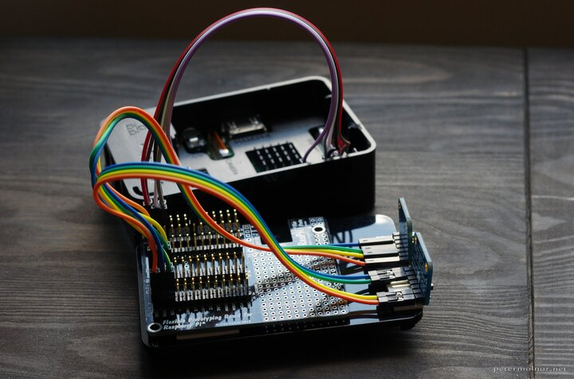
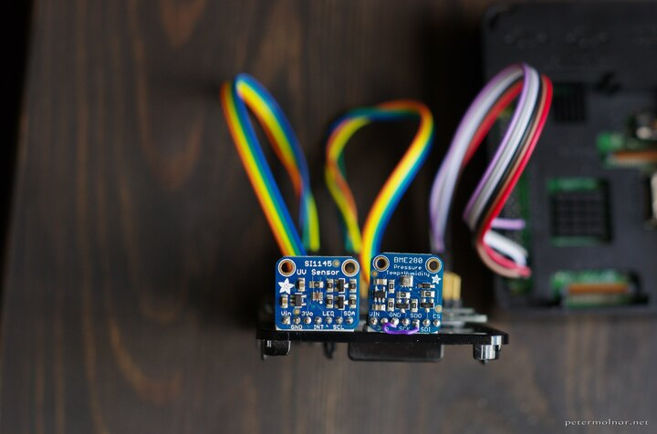

---
author:
    email: mail@petermolnar.net
    image: https://petermolnar.net/favicon.jpg
    name: Peter Molnar
    url: https://petermolnar.net
copies:
- http://web.archive.org/web/20190624130008/https://petermolnar.net/raspberry-pi-bme280-si1145-collectd-mosquitto/
published: '2017-08-06T21:00:00+01:00'
summary: How to collect, monitor, read, and store pressure, temperature, humidity,
    visible, IR, and UV light data  with a Raspberry Pi, an Adafruit BME280,
    Adafruit SI1145, collectd stats collector, and mosquitto MQTT.
tags:
- Raspberry Pi
title: Environmental sensor logging with Rasbperry Pi, Adafruit BME280 and
    SI1145, collectd, and mosquitto

---

## Overview

I wanted a way to start collecting environmental stats, without any
vendor-lock in, preferably cheap, and in a form that I can store and use
the data points long term. Z-Wave (Zigbee, Xbee, these are the same)
looks great, especially since IKEA started to offer smart lights based
on completely Open Source protocols.

Until Z-Wave, though, I have a spare Raspberry Pi 3, so let's see where
I could get with these.

## Physical setup

Initially I started with cheap sensors, like the DHT11, but those are
way to inaccurate and their resolution is far from desirable: 1 °C
without digits in case of the DHT11, so I bought better ones before
moving on.

Unfortunately the accuracy of the BME280 temperature readings can be a
bit messy as well, for which I'll only read every 10 minute and lower
the read rate - the board the sensor is mounted on has a tendecy to
overheat a little and these seem to be working countermeasures against
that scenario[^1].

The setup needs:

-   a Raspberry Pi 3[^2] *(or any Raspberry Pi, but given the 3 has
    built-in Wifi, which makes your life easy, I recommend the 3)*
-   an Adafruit BME280[^3] sensor: this will gather temperature,
    humidity, and pressure data
-   an Adafruit SI1145[^4] sensor: this will read UV, IR and visible
    light data
-   something to multiplex the 3.3V, GND, SDA, and SCL (1, 6, 3, 4) pins
    on the Raspberry with for the 2 sensors OR simply connect them
    parallel. I've found RasPiO proto board in the Cambridge
    Makespace[^5], but this is for the original Pi and is out of
    production, so you'll need something like a TriBorg[^6] which
    triplicates the GPIO pins.






These are high resolution, accurate sensors. If you don't need this, or
you're not a maximalist electrical engineer, feel free to go for
anything cheaper, but keep in mind, that these are also I2C devices, so
you can have a lot of sensors, and add new ones later. (Airflow, air
quality, motion, etc.)

### Wiring & pins

  Raspberry Pi pin   BME280   SI1445
  ------------------ -------- --------
  1 - 3.3V           Vin      Vin
  6 - GND            GND      GND
  3 - SDA            SDI      SDA
  5 - SCL            SDI      SCL

## Install & configure the software

### Enable I2C on the Raspberry

Installing the Raspberry Pi is out of scope, there are many really good
documents out there. One important bit: you need to enable the I2C
module as:

1.  Run `sudo raspi-config`.
2.  Use the down arrow to select `9 Advanced Options`
3.  Arrow down to `A7 I2C`.
4.  Select `yes` when it asks you to enable I2C,
5.  Also select `yes` when it asks about automatically loading the
    kernel module.
6.  Use the right arrow to select the `<Finish>` button.
7.  Select `yes` when it asks to reboot.

### Collectd[^7] {#collectd6}

collectd is an Open Source stats collecting utility which can both
collect stats locally and send or receive through the network. It's very
lightweight - the collection part that is - and runs on more or less
anything, can send to various backends, including Kafka, graphite, etc.
In short, it's good for

#### Install collectd

```bash
sudo apt update
sudo apt install collectd-core collectd --no-install-recommends
```

*Note: `--no-install-recommends` will save you, for example, installing
java. We won't need recommends.*

#### Configure the collectd server

`/etc/collectd/collectd.conf`

```xml
FQDNLookup true
BaseDir "/var/lib/collectd"
PluginDir "/usr/lib/collectd"
AutoLoadPlugin false
CollectInternalStats false
Interval 600

LoadPlugin syslog
<Plugin syslog>
    LogLevel info
</Plugin>

LoadPlugin csv
<Plugin csv>
    DataDir "/where/you/want/your/csv/files"
    StoreRates false
</Plugin>

<LoadPlugin python>
</LoadPlugin>
<Plugin python>
  ModulePath "/home/pi/collectd"
  LogTraces true
  Interactive false
  Import "collectd_i2c"
  <Module collectd_i2c>
  </Module>
</Plugin>
```

Normally collectd use RRDTool to save data; this is a time series data
format that compresses the old data after a while. Because I want to be
able to use the data later on, in this case, I decided to go for CSV
files which are easy to parse - or to feed to some machine learning.

### Mosquitto[^8] MQTT server {#mosquitto8-mqtt-server}

MQTT is a lightweigh messasing protocol: it has a server, a hub, which
collects all the incoming data; publishers pushing the data, and
subcribers, reading topics. It's used widely in the "Internet of Things
area" - though I seriously dislike the phrase -, and it's a good
protocol to get started with. There are a few decent MQTT dashboard apps
for Android, so it's easy to read the data as well with it.

#### Install Mosquitto

```bash
sudo apt install mosquitto mosquitto-clients
sudo systemctl enable mosquitto
sudo systemctl start mosquitto
```

Keep in mind that this will load your MQTT server without authentication
and authorization on port 1883, so don't ever do this on an internet
facing device.

To test it:

```bash
mosquitto_sub -h 127.0.0.1 -p 1883 -u 'your-mqtt-user-if-any' -P 'your-mqtt-password-if-any' -t '#' -v
```

The `#` is to subscribe to everything; replace it with `i2c` to monitor
our plugin only.

### Install the necessary Python libraries

These are needed to build the sensor libraries and to interface with
collectd.

```bash
sudo apt install i2c-tools python-dev python-pip git
sudo pip install collectd
sudo pip install paho-mqtt
```

#### Detect the sensors

The `i2cdetect` command will show you your sensors, if all the wiring is
happy:

```bash
pi@raspberry:~/ $ i2cdetect -y 1
pi@lydia:~ $ i2cdetect -y 1
     0  1  2  3  4  5  6  7  8  9  a  b  c  d  e  f
00:          -- -- -- -- -- -- -- -- -- -- -- -- --
10: -- -- -- -- -- -- -- -- -- -- -- -- -- -- -- --
20: -- -- -- -- -- -- -- -- -- -- -- -- -- -- -- --
30: -- -- -- -- -- -- -- -- -- -- -- -- -- -- -- --
40: -- -- -- -- -- -- -- -- -- -- -- -- -- -- -- --
50: -- -- -- -- -- -- -- -- -- -- -- -- -- -- -- --
60: 60 -- -- -- -- -- -- -- -- -- -- -- -- -- -- --
70: -- -- -- -- -- -- -- 77
```

#### Get the sensor libraries

Just run these in the `pi` user home directory.

##### Generic Adafruit libraries

```bash
git clone https://github.com/adafruit/Adafruit_Python_GPIO.git
cd Adafruit_Python_GPIO.git
sudo python setup.py install
```

##### Library for the BME280

I'm using a branch which is not yet merged into the main code, thanks to
frank-f: this contains code with lets you set the mode for the BME280,
which, in theory, helps with mitigatin the self-heating problems often
mentioned with this board[^9].

```bash
git clone https://github.com/frank-f/Adafruit_Python_BME280
cd Adafruit_Python_BME280
git checkout reset-and-sleepmode
sudo python setup.py install
```

##### Library for the SI1145

```bash
git clone https://github.com/zzts/Python_SI1145
cd Python_SI1145
sudo python setup.py install
```

#### Create a simple ini file for your MQTT config

`/etc/mqtt.ini`

```ini
[mqtt]
host = 127.0.01
port = 1883
user = your-user-in-mqtt-server
password = your-password-in-mqtt-server
```

#### Create the collectd module

Save this to `/home/pi/collectd/collectd_i2c.py`:

```python
#!/usr/bin/env python2

import collectd
import paho.mqtt.client as mqtt
import ConfigParser as configparser
import json
import SI1145.SI1145 as SI1145
from Adafruit_BME280 import *
import os

SENSOR_BME280 = BME280(
    t_mode=BME280_OSAMPLE_1,
    p_mode=BME280_OSAMPLE_1,
    h_mode=BME280_OSAMPLE_1,
    standby=BME280_STANDBY_500,
    filter=BME280_FILTER_off,
    address=0x77
)
SENSOR_BME280.set_mode(BME280_FORCED)

SENSOR_SI1145 = SI1145.SI1145(
    address=0x60
)

MQTT_CONF = configparser.ConfigParser()
MQTT_CONF.read('/etc/mqtt.ini')
MQTT_CLIENT = mqtt.Client()
MQTT_CLIENT.username_pw_set(
    MQTT_CONF.get('mqtt', 'user'),
    MQTT_CONF.get('mqtt', 'password')
)
MQTT_CLIENT.connect(
    MQTT_CONF.get('mqtt', 'host'),
    MQTT_CONF.get('mqtt', 'port'),
    120
)

def config_func(config):
    collectd.info('i2c plugin initialising')

def read_func():
    values = {}

    SENSOR_BME280.set_mode(BME280_FORCED)
    temperature = SENSOR_BME280.read_temperature()
    pressure = SENSOR_BME280.read_pressure()
    humidity = SENSOR_BME280.read_humidity()
    values.update({
        'humidity': {
            'value': humidity,
            'type': 'humidity',
            'unit': '%',
        },
        'pressure': {
            'value': pressure,
            'type': 'pressure',
            'unit': 'Pa',
        },
        'temperature': {
            'value': temperature,
            'type': 'temperature',
            'unit': 'C'
        },
    })
    SENSOR_BME280.set_mode(BME280_FORCED)

    light = SENSOR_SI1145.readVisible()
    ir = SENSOR_SI1145.readIR()
    uv = SENSOR_SI1145.readUV()

    values.update({
        'uv': {
            'value': uv,
            'type': 'gauge',
            'unit': '',
        },
        'ir': {
            'value': ir,
            'type': 'gauge',
            'unit': 'lux',
        },
        'light': {
            'value': light,
            'type': 'gauge',
            'unit': 'lux',
        },
    })

    for name, v in values.iteritems():
        v['value'] = round(v['value'], 2)

        val = collectd.Values(
            type=v['type'],
            plugin='i2c',
            type_instance=name
        )
        val.dispatch(values=[v['value']])
    MQTT_CLIENT.publish('i2c', json.dumps(values))

collectd.register_config(config_func)
collectd.register_read(read_func)
```

### Start monitoring

The only remaining step you need to do is to start the collectd server:

```bash
sudo systemctl enable collectd
sudo systemctl restart collectd
```

If everything is happy - and they should be - your stats will be in CSV
files under:

-   `/where/you/want/your/csv/files/[your hostname]/i2c`

directories, the one under `DataDir` in the collectd configuration.

Enjoy your stats!

[^1]: <https://www.kandrsmith.org/RJS/Misc/Hygrometers/absolutetemperature.html>

[^2]: <http://amzn.to/2vEOAKh>

[^3]: <http://amzn.to/2vEbpOc>

[^4]: <http://amzn.to/2vEhv18>

[^5]: <http://makespace.org>

[^6]: <https://www.piborg.org/triborg>

[^7]: <https://collectd.org/>

[^8]: <http://mosquitto.org/>

[^9]: <https://www.reddit.com/r/dataisbeautiful/comments/5lc08e/faulty_temperature_readings_caused_by_a/>