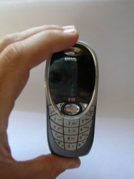

---
author:
    email: mail@petermolnar.net
    image: https://petermolnar.net/favicon.jpg
    name: Peter Molnar
    url: https://petermolnar.net
copies:
- http://web.archive.org/web/20200625125912/https://petermolnar.net/article/siemens-s55/
lang: hu
published: '2003-08-14T20:34:00+02:00'
summary: Szép (formatervezési díjat nyert), jó, rendkívül okos, de túlságosan
    kicsi. Az üzleti szférát célozták vele, de elfelejtették, hogy az üzletember
    elsősorban telefonál, aztán a többi - arra pedig sokkal alkalmasabb pl.
    a Nokia 6310i, ami a színes  kijelzőt és a kamerát leszámítva ugyanezeket
    tudja, csak sokkal kényelmesebb telefonálni vele.
tags:
- mobile
title: Siemens S55 vélemény
review:
    rating: 4
    best: 5
    brand: Siemens
    model: S55
    description: mobiltelefon
    img: siems55_1.jpg
    caption: 2020-ból, a 6 inches okostéglák korából nézve megdöbbentően apró, szép, és borzasztóan kényelmetlen kezeni.
    url: https://www.gsmarena.com/siemens_s55-343.php
---

*Ez egy ősi bejegyzés; az oldalam 2004-es mentéséből vakartam elő.*

## Design

Nagyon szép telefon, de rettentően kicsi. Ebből adódóan kifejezetten
nehéz a gombokat nyomkodni, főleg a fel- ill. lerakás gombokat, valamint
a \*-ot és a \#-et. A navigációs gombokkal nincs baj. A csöppségnek 256
színű kijelzője van, ami erősen idézi a 486-os időket :), annak ellenére
szerintem szép. Hátránya, hogy kissé halk, mint csengésre, mint
beszélgetés közben, a kihangosítója pedig erősen tud torzítani. A
kábelcsatlakozó hagyományosan Siemens (lehetne jobb is típusú), de
nagyjából megfelelő, mert másfél éves használat alatt sem kopott ki.

## Software

Gyors. Igen gyors a navigáció, gyorsan reagál a billentyűkre, hamar
betölti a midiket. Viszont a JAVAt néha igen lassan futtatja, a
programok elindítása is sok időt vesz igénybe. A képeket viszonylag
gyorsan jeleníti meg. Nagy előny, hogy a Siemens honlapon könnyen
elérhető a telefon legfrissebb softwareverziója, ami egy soros porti
vagy USB kábellel otthon is könnyen frissíthető - csak el ne szálljon
közben a számítógép...

## Amiket nem tud vagy zavaró

-   halk
-   szálkás betűk, néha nehezen olvasható
-   nagyon kevés a memória, mert a gyárilag feltett dolgok is ezt
    használják, ami összesen 900 KB (ebből az elején csak 470 szabad)

## Amiket tud, új és jó

-   "kapcsolatkész" :): Bluetooth, IRDA, soros és USB lehetőség,
    bármilyen (!) file-t tud fogadni, megnyitja a txt kiterjesztést,
    igaz, az ékezeteket ?-el helyettesíti
-   csatlakozhatható kamera, vakuval, elviselhető minőségű, 640\*480-as
    képeket készít.
-   nagyon komoly szinkronizálási lehetőség Outlookkal

## Telefon és számítógép

Jól érzik magukat együtt, de analóg modemnek nem tudtam használni. A
Westelnél kezdtem, a Siemens Hungarynál folytattam, akik
feljebbterjesztették a Siemens Corp.-nak, de sajnos semmi eredménye.
Viszont a hozzá adott software használható, bár sokszor nagyon lassú. A
GPRS viszont tökéletesen működik. A sotware infrával és Bluetooth-szal
is képes kommunikálni, de érdemes a Bluetooth-szal előbb virtuális COM
portot nyitni, hogy azon keresztül könnyebben megtalálhassa a telefont.
Ami viszont nagyon jó, gyors és egyszerű, az a telefon szinkronizálása
az Outlookkal: a címjegyzék ugyanúgy jelenik meg, nagyon sok mezőt képes
tárolni, a naptárt is rendesen átküldni a telefonra, a jegyzetek is
kicserélődnek, sőt, akár a teljes e-mailezésünk is rákerülhet a
telefonra - azaz kerülhetne, mert a telefonon minden valószínűség
szerint egy csipetnyi hely sincs már.

## Linkek

<http://www.my-siemens-de> - hivatalis site, mint olyan korrekt -

<http://www.siemens-info.de> - félhivatalos, szerintem jó lap -

## Java programok

### Siemens C55

  Name               `jar` file               `jad` file               size
  ------------------ ------------------------ ------------------------ ---------
  Galaxy Hero        [.jar](galaxyHero.jar)   [.jad](galaxyHero.jad)   79,5 KB
  Prince of Persia   [.jar](Prince_C55.jar)   [.jad](Prince_C55.jad)   72,1 KB
  Remind Me          [.jar](Remind_me.jar)    [.jad](Prince_C55.jad)   21,4 KB

### Tesztelve Siemens S55-ön

  ---------------------------------------------------------------------------------------------------
  Name                                 `jar` file                  `jad` file                  size
  ------------------------------------ --------------------------- --------------------------- ------
  Metris (gyengécske Tetris-klón)      [.jar](metris.jar)          [.jad](metris.jad)          27,6
                                                                                               KB

  Space Invaders                       [.jar](SpaceInvaders.jar)   [.jad](SpaceInvaders.jad)   17,0
                                                                                               KB

  Snake for S55                        [.jar](snake.jar)           [.jad](snake.jad)           38,6
                                                                                               KB

  SpruceChess                          [.jar](SpruceChess.jar)     [.jad](SpruceChess.jad)     40,2
                                                                                               KB

  Micro Mail (eredetileg SL45-höz) -   [.jar](MicroMail.jar)       [.jad](MicroMail.jad)       50,7
  elég profi e-mail program, olvas is,                                                         KB
  ír is, több fiókkal

  E-mail Reader (csak fogad!)          [.jar](EmailReader.jar)     [.jad](EmailReader.jad)     6,08
                                                                                               KB
  ---------------------------------------------------------------------------------------------------
