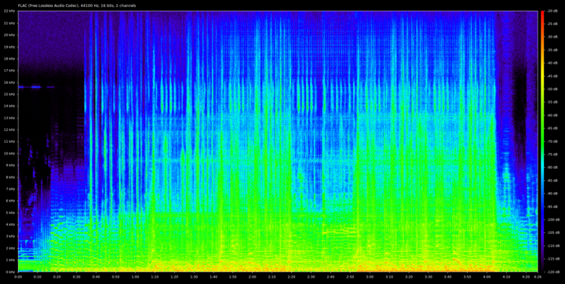
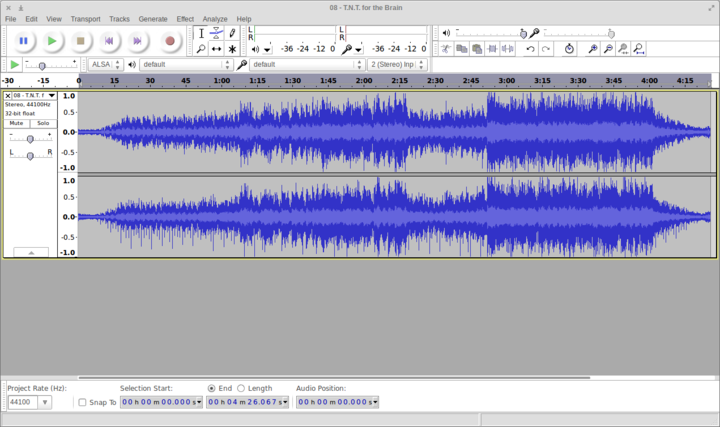

---
author:
    email: mail@petermolnar.net
    image: https://petermolnar.net/favicon.jpg
    name: Peter Molnar
    url: https://petermolnar.net
copies:
- http://web.archive.org/web/20190624130209/https://petermolnar.net/spotify-how-good-is-high-quality-streaming/
published: '2015-09-11T12:41:46+00:00'
summary: Is there an actual difference between high and normal quality streaming
    on Spotify? How does Spotify high quality streaming compare to CD quality?
tags:
- Spotify
title: 'Spotify: how good is high quality streaming?'

---

I've been looking all around to find a decent review that shows me how
good is the quality of Spotify's "High quality" streaming. No luck, so
I'll do one.

## CD RIP (flac)

This is the spectrum and wave of the original, 1996 CD version:

## 320kbps MP3 from CD RIP by ffmpeg

 

## Spotify high quality (desktop) streaming

( Recorded with audio-recorder\[\^3\] into flac. )

 

## Spotify normal quality (desktop) streaming

 

Conclusions: high quality is still not CD, but is far ahead of the 320k
MP3 output of ffmpeg.