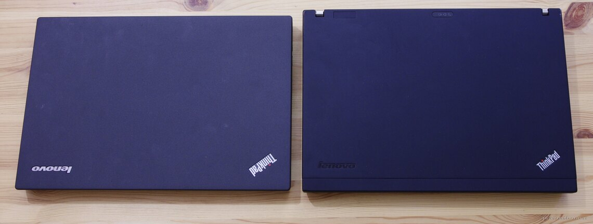

---
author:
    email: mail@petermolnar.net
    image: https://petermolnar.net/favicon.jpg
    name: Peter Molnar
    url: https://petermolnar.net
copies:
- http://web.archive.org/web/20170709001221/https://petermolnar.net/switcing-from-thinkpad-x200-to-x250/
published: '2017-02-25T10:00:00+00:00'
summary: Even though I only owned an X200 for 3 years, the laptop from 2009
    was becoming aged, no matter how many things I replaced on it, so sadly,
    it was time to look for an alternative.
tags:
- hardware
title: 'Changing laptops: ThinkPad X200 vs X250, a story of a long postponed
    upgrade'

---

## The X200

My wife had been using an X201[^1] since \~2012. It's an exceptional
machine, but the touchpad was organised in a way that when I tried it it
constantly got in the way for me, so I ignored all the ravings about the
12.1" machines. Before this, I always had bigger (with one exception)
ones (see list at the bottom).

I held this position till I bought a beaten up X200[^2] in 2013 for a
family member and feel in love in \~10 minutes. I've been using it since
then, although, due to various events - such as not disconnecting the
battery before replacing the display and thus frying the motherboard -,
I eventually replaced every part in the machine since. *(I bought
another one for the family member.)*

Following the footsteps of fellow ThinkPad enthusiasts[^3] I changed a
few things in it (these are just additions, not mods, doable by anyone
with a screwdriver and patience):

-   replaced the display with an AFFS (IPS variant) Boe-Hydis
    HV121WX4-120
-   added 64GB SuperTalent CoreStore (true pci) MiniPCI-e SSD
-   1TB HDD
-   8GB RAM

In short, it was maxed out. Unfortunately, the CoreStore was the only
true MiniPCI-e SSD the X200 gladly accepted. It died after a little more
than 3 years extensive use and it did gracefully: you could still boot
it but the drive soon degraded into read-only mode, and so it was
possible to safely migrate away. This is unlike what most SSDs do when
they die[^4].

I had to learn it's impossible to buy CoreStores any more, and because I
wasn't willing to spend hunreds of £ on SSD, I went back to spinning
disk. Reminder: they are slow.

The display started to develop a few "spots": brighter areas where it
probably received some pressure, which will never go away. Not
surprising, given how much I walked around with it, tucked in a tight,
crowded backpack on business trips. No easy to buy it anymore: last year
I upgraded another X200, but that display came with a dead green
subpixel, which, at this resolution, is visible.

Some plastic parts, especially the palmrest, started to soften up and
creak here and there when I put my wrists down - it's annoying. I was
able to live with it for long, but lately it was getting worse, and
finding new parts is getting harder and harder.

Due to it's age, it doesn't have up to date ports. No HDMI, no
DisplayPort without Ultrabase dock, no Thunderbolt, no USB3.0. There are
reasonable quality USB powered VGA-to-HDMI converters those are dongles,
additional things you need to carry, and good for presentation, but not
for anything else to be honest.

## Moving on is not as trivial as it sounds

When you're used to something this good it's hard to make compromises.
I've been looking at laptops, even before I got the X200 (I was on a
T400 which was getting a bit heavy for the amount of trips I make) for a
while at this point, but they all failed something on my requirements
list:

-   at max. 13" (portabilty)
-   has trackpoint *(it's extremely useful when you're at a crowded
    place, like an airplane)*
-   at max \~35dB full load noise (according to notebookcheck.net tests)
-   doesn't get burning hot when under load
-   can accept a PCI-like SSD (msata or m.2) plus a 7/9.5mm drive
-   CPU runs at modest temperature
-   high sRGB gamut coverage full HD IPS display

I know many start asking questions on the why SSD+HDD, why do you need
so much space, etc. SSD-s have a tendency do die a sudden death, without
any preindication that they are unhappy, which, for my irreplaceable
data, is unacceptable. Yes, I have backups, I have archives, and so on,
but not immediately. I have overwritten backups I shouldn't have, so I
have a little delay (sometimes days) doing them to prevent this. As for
why so much storage: a RAW photo from a Pentax is 30-40MB. I don't like
splitting my data unless I'm certain, it can be archived (10+ years).
1TB SSDs are not really 1TB and they are way to expensive for the time
being.

### T450s! Or maybe not...

After all the searches I reached the conclusion that what I need is the
T450s[^5]: neat display, decent weight, only slightly larger than ideal,
so I ordered a "factory sealed" one from a top-grade eBay seller.

It arrived with broken security seals, with a loose screw inside(!) and
a completely borked keyboard, sending out unknown characters when the
buttons were pressed. It did come with a complete, 3 year warranty, so I
don't completely understand what happened there.Thankfully I managed to
I send it back and get a refund.

### Solution: "DIY" X250

The reason for not going with the X250[^6] directly is that while
originally there were full HD IPS options[^7], but this disappeared from
the parts list[^8] and in reality it was impossible to get one with a
display like this.

After the T450s, I got frustrated enough to look around and realise the
00HM111 panel[^9] is only \~£70.

I bought a mid-config, manufacturer refurbished X250 *(manufacturer
refurbished is good: it means that whatever tends to break or has a
defect was already fixed and - hopefully - you won't have to deal with
it again, at least not for a while)*, the aforementioned panel, an 2242
m.2 SSD[^10], some plastic plyers *(yes, you need these to open the
casing, I'll get there later)*, pulled a 1TB HGST drive from a previous
laptop and put it all together.

## X200 vs X250

### Look & size

As you can see, even though the X200 is 16:10, the overall area is
nearly the same; the thickness dropped significantly.

### Maintenance - things changed and not for the good

Apparently these days you pull the complete bottom off a ThinkPad,
similar to what I had to do with the Dell Latitude E6400. However,
there's a catch: apart from the screws these covers are held together
with dozens of small, plastic hooks. This is why you need the plastic
plyer: if you use something hard, you'll damage the case... Whoever came
up with this solution should have shipped a tool with the laptop, given
these are business grade ones, so replacing a storage device should be
daily routine.

The display bezel is without screws, which is fine. But the display
itself is just sitting in there, also without screws! This was a pure
shock for me: all laptops I ever took apart had their screens fixed at a
few points.

I believe one of the reasons is that the panels are incredibly light,
compared to my former experiences. Still, this left me in shock and
eventually I added some double sided tape at the back, just a tiny
amount, to prevent potential slips and shakes.

At least the replacement was easy, except learning that there's a hook
holding the display cable in place. Raise that, otherwise it's not
possible to remove the cable.

Once the bottom is removed, all the internals are accessible - and there
are no more stabilizers, "bones", on might say, like the T60 has. In
short: no rollcage. Yes, the case is sturdy, no crackings, nearly no
warping on the bottom, tolerable warp on the top, but no rollcage.

### The keyboard

Novels had been written about the mourning of The ThinkPad Keyboard: I
long realized I'm not going to get them any more so I accepted my fate.
Most tests say, the new, chiclet keyboard is great to type on: they are
mostly true, but I have a few things to note.

The `"'`, `|\`, `{[`, `]}` keys are smaller, than the rest. I didn't
realize by looking at photos. It's weird, but not particularly bad.

The F key are not F, but multimedia by default: this, surprisingly, I
can live with. It might make my life harder, but I've been using an
Apple keyboard at work for a month now, to get used to the feeling, it's
not as terrible as I anticipated.

It's not spill-proof any more, no matter what videos or Lenovo marketing
says. Zhere are no drain holes at the bottom, so whoever says it's spill
proof, they don't understand that they're talking about. However, if I
wanted a spill-proof machine, I would have bought a Panasonic
Toughbook[^11] which has IP certification.

Apart from these, it's an OK keyboard. It's nowhere close to the T60 MNB
level, but it's not as terrible as it could have been. After using it
for a few hours, I'm finding it rather comfortable. The layout is a bit
annoying, but there's always xmodmap[^12].

## The future

I'd love to see the Retro ThinkPad[^13] to come to an existence, but I'm
not holding my breath. Especially because it'll be \~14"[^14] and the
X200 seem to have irreversibly converterted me to 12".

I've recently learned some madmen in China are making custom
motherboards and hacked displays for X61, X220 and X230 models[^15],
which looks incredibly promising but they are facing a significant
problem with supplies. It also doesn't address the problem with ageing
and used plastic, which will soon be another real issue.

## Footnote: my history with laptops

### DIGITAL, Compaq, HP

During the years I've had the luck to use some high-end laptops. I only
got my hands on them when they got out of the usual, 3-5 years support,
so, in other words, used. They were still way better than regular
laptops you can buy from ordinary stores.

Before 2009, I typed on DIGITAL HiNote[^16], a HiNote Ultra 2000[^17], a
Compaq Evo N600c[^18], and a HP nc6120[^19]. (You may see a pattern
here.)

If I had to choose I'd say I loved the n600c the most. Maybe that's due
to it's tragic end, me losing it by leaving it on a bus, maybe because
it's blazing fast, short-lived 1GHz PIII Tualatin[^20] processor, who
knows, but I that's still my all time favourite. Built like a tank,
silent, lovely, with one, tiny flaw: the headphone jack was made of
steel and sometimes gave you a small electric shock, since it was
located on the front.

In 2009 I started to work at offices and most of them gave me a working
laptop. I had a brief experience with a bulky Acer and thankfully moved
on to a ThinkPad T500 at my next workplace.

### Acer, T500, E6400, T400, L412

For a brief time I had an Acer Travelmate - brilliant screen, bulky,
heavy. I also had a ThinkPad L412, which is not worthy of the ThinkPad
name, so I'll just move on from these.

One of the immediate differences between the brand new T500[^21] and my
previous nc6120 was the noise: none. The T500 was silent, even at full
load, which, I believed at that time, is a new standard for new laptops
- boy, I was wrong. It was a feature the Tx00/Xx00 line nailed and still
is a rarity in 2017.

I used it for years, loved it, but eventually, changed jobs and the
laptop stayed with the company. I looked around for something within
affordable range, and I made a mistake: I fell in love with the looks if
a Dell Latitude E6400[^22]. I wrote about comparing the T400 and the
E6400[^23] and came to the conclusion that what I need and what I like
is the ThinkPad T400[^24], not the Dell.

I still have the T400 I bought used in 2011. It's my current home
server: 1+2 TB disk, built-in battery, SMS sending, always quiet - the
only downsize is the display connector: DVI at best, even with a docking
station. Unfortunately, the display backlight is dead in it, but for a
server, it's still ideal.

And then I fell under the spell of 12".

[^1]: <http://shop.lenovo.com/us/en/laptops/thinkpad/x-series/x201>

[^2]: <http://shop.lenovo.com/us/en/laptops/thinkpad/x-series/x200>

[^3]: <https://prohardver.hu/tema/ibm_lenovo_thinkpad_topik/friss.html>

[^4]: <http://techreport.com/review/27909/the-ssd-endurance-experiment-theyre-all-dead>

[^5]: <http://shop.lenovo.com/us/en/laptops/thinkpad/t-series/t450s/>

[^6]: <http://shop.lenovo.com/us/en/laptops/thinkpad/x-series/x250/>

[^7]: <https://download.lenovo.com/parts/ThinkPad/x250_frubom_20150127.pdf>

[^8]: <https://download.lenovo.com/parts/ThinkPad/x250_frubom_20160106.pdf>

[^9]: <https://rover.ebay.com/rover/1/710-53481-19255-0/1?ff3=4&toolid=11800&pub=5575274756&campid=5338045748&mpre=http%3A%2F%2Fwww.ebay.co.uk%2Fitm%2F401258903812>

[^10]: <http://amzn.to/2m1YVuk>

[^11]: <http://business.panasonic.com/toughbook/semi-rugged-laptop-toughbook-54.html>

[^12]: <https://wiki.archlinux.org/index.php/Xmodmap>

[^13]: <http://blog.lenovo.com/en/blog/retro-thinkpad-time-to-think>

[^14]: <http://blog.lenovo.com/en/blog/retro-thinkpad-survey-3-whats-under-the-hood>

[^15]: <http://www.notebookcheck.net/Enthusiasts-bring-classic-ThinkPad-designs-to-the-modern-era.194630.0.html>

[^16]: <https://ja.wikipedia.org/wiki/DIGITAL_HiNote>

[^17]: <http://windowsitpro.com/windows/digital-hinote-ultra-2000>

[^18]: <http://h20564.www2.hp.com/hpsc/doc/public/display?docId=c00056671>

[^19]: <http://h20566.www2.hp.com/portal/site/hpsc/public/psi/home?sp4ts.oid=447346&ac.admitted=1487594389246.1123376534.199480143>

[^20]: <https://en.wikipedia.org/wiki/Pentium_III#Tualatin>

[^21]: <http://pcsupport.lenovo.com/nl/en/products/laptops-and-netbooks/thinkpad-t-series-laptops/thinkpad-t500>

[^22]: <http://www.dell.com/us/dfb/p/latitude-e6400/pd>

[^23]: <https://petermolnar.net/dell-latitude-e6400-vs-lenovo-thinkpad-t400/>

[^24]: <https://support.lenovo.com/us/en/products/laptops-and-netbooks/thinkpad-t-series-laptops/thinkpad-t400>