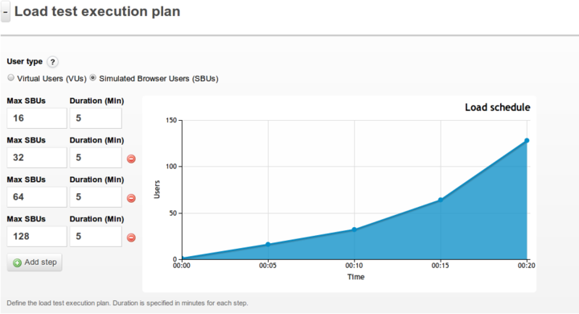
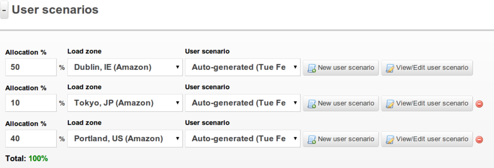
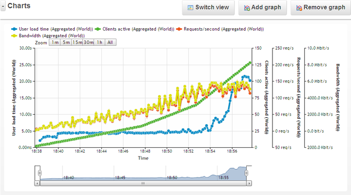
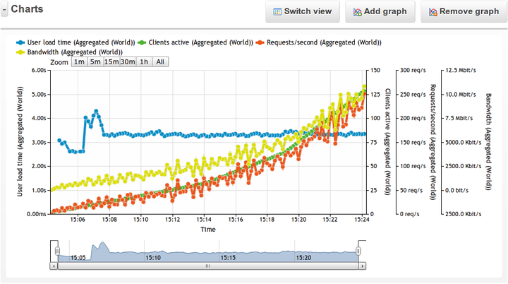
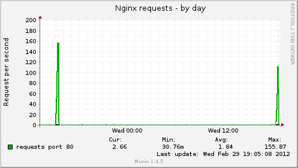
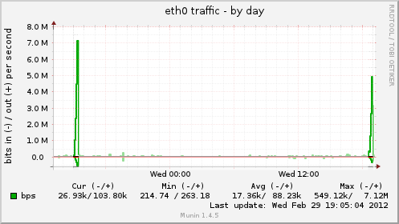
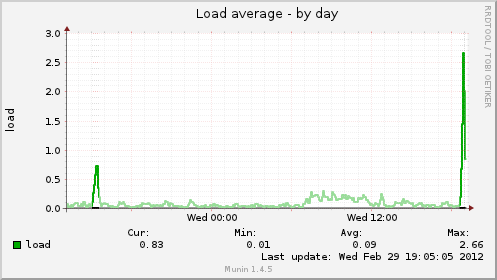

---
author:
    email: mail@petermolnar.net
    image: https://petermolnar.net/favicon.jpg
    name: Peter Molnar
    url: https://petermolnar.net
copies:
- http://web.archive.org/web/20120305211400/http://petermolnar.eu:80/linux-tech-coding/testing-wordpress-the-importance-of-php-opcode-cache
published: '2012-03-01T16:06:55+00:00'
summary: Testing the limits of an nginx and PHP-FPM based WordPress Network
    with and without PHP APC opcode cache running on a really small KVM VPS.
tags:
- WordPress
title: 'Testing WordPress: the importance of PHP opcode cache'

---

## The why-s

There were some discussions lately at LinkedIn mostly on the topic of
choosing a VPS (virtual private server) over a shared hosting provides
any benefits. My opinion: a VPS can clearly outnumber a shared host in
performance and freedom, but not in pricing. Price can only be matched
when the VPS is an unmanaged one, meaning you (or someone you hire) has
to take care of all the configurations, the server management, the
monitoring - even the operating system install itself.

For most people this looks horrible and finding a cheap but good system
operator is a nightmare for anybody. The problem is, that on a shared
host you are limited to the system services. There are really few
hosting providers how allow switching between web servers, or even
switching PHP versions, and what's worts: you clearly not allowed to
tweak any of the services.

I know there are really few WordPress users who want - and are able - to
fine tune the backend of the install, but there are tiny things which
can make incredible difference.

I decided to make a little test to show how little is enough for, in
this case a WordPress Network, to brutally gain on performace.
Originally I wanted to show only the power of WP-FFPC[^1], a full page
cache plugin written by me. The problem was that I left APC object cache
plugin active, so I decided to show the importance of APC[^2] instead.

## Test setup

-   KVM VPS V1 plan[^3] from cheapVPS[^4]
-   Ubuntu server 11.10
    -   kernel 3.0.0-16-server
-   nginx 1.0.11
    -   gzip compression enabled at level 1
-   PHP 5.3.6-13ubuntu3.6 with Suhosin-Patch
-   Percona server (MySQL replacement) 5.5.20
-   opcode cache: APC-3.1.9\^
-   WordPress Network 3.3.1, sunrine (domain mapping) enabled
-   WordPress cache enabled
-   APC object cache[^5] plugin\*
-   WP-FFPC[^6] full page cache for APC plugin\*

\^ APC cache was only enabled for the first test

The page I was testing is a category archive page. It shows 4 special
post: all posts include numerous small pictures, some larger ones,
loading jQuery with some extensions and listing some CSS files as well.
It's also a domain mapped sub-blog of the site.

*I have to add that I have a little trick made on my server config.
Normally all sub-site content is server by PHP in a WordPress Network.
This was change by my when I added some extra into my nginx setup[^7].
If this test had been done with the default WordPress Network setup, I'm
fairly sure my result would be pretty awful, please take this into your
count.*

#### What is nginx?

nginx is a webserver, similar to apache2 (running behind most of the web
pages on the world). The main differences: nginx is a lot harder to
extend (for example, there are no possibilities to use files like
.htaccess in apache), but it eats significantly less memory and CPU time
in exchange.

#### What is PHP?

PHP is one of the programming languages WordPress was written in.
Traditional programming languages are needed to be compiled, thus they
become and exe, or some kind of binary file. PHP instead is compiling
all files, all the time on-the-fly -and this requires inmense computing
power.

#### What is PHP-FPM?

The web server can load the PHP compiler in various ways; apache2 server
has a built-in module for it, which, unfortunately, can eat up all the
possible memory. An other way is to use a "PHP server", which can than
be access with a protocoll, named FastCGI. PHP-FPM is a FastCGI server
version of the PHP compiler.

#### What is opcode caching?

PHP Opcode cache can store compiled variables, pages and parts of the
code. By default PHP always recompile everything which is really not
neccessery at most times. The opcode cache therefore uplifts a lot of
uneeded compilation, speeds up the program and saves CPU time.

## Load test setup

I've used \<a href="<http://><tr> <th>Max. 128 users</th> <td>5
minutes</td> \< href="<http://loadimpact.com>"\>loadimpact.com</a> for
making a stress test on my server. I have so low traffic on this very
server that the stress test should make a clearly visible difference.

The test setup: 20 minutes total runtime splitted into 5 minute parts.
All parts have limited maximum simultaneous users.

  Total runtime    20 minutes
  ---------------- ------------
  Max. 16 users    5 minutes
  Max. 32 users    5 minutes
  Max. 64 users    5 minutes
  Max. 128 users   5 minutes

### Users geographical dispersion

  Location       \% of users
  -------------- --------------------------------------------
  Dublin, IE     50% of all users (server is located in UK)
  Tokyo, JP      10% of all users
  Portland, US   40% of all users

## Load test results

### User experience

#### Without APC enabled

#### With APC enabled

### Meanwhile on the server

These are munin the graphs taken from the server while the tests were
running. There are two highlited spikes, the first time was with APC on,
the second (\~1 day later) is without APC cache.

#### Number of nginx requests/sec

#### Traffic on ethernet device

#### Server load

Server has 4 CPUs, therefore 4 means the full utilization.

## Conclusions

### CheapVPS performance

The performance and the capacity of the smallest - and probably one of
the cheapest KVM based virtual servers - suprised me again. It could
handle 100 simultaneous connections per second without opcode cache! For
calculation: if this would keep up for a day, it would result 8 640 000
hist on that day, which is way over a normal site's traffic. For 14.40 £
(with taxes!), this is the best buy ever.

### The results

Aggregated 5 seconds page load time is not really a bad result, but the
system could only handle it just for limited number of requests/second.
With cache enabled the load time went down by 2 seconds, which is really
much (\~40%) and also, I could not reach the limit of the server. For
calculation: keeping 220 requests/second rate for a day would result 19
008 000 hits per day, and the server is still serving all the content
with the same speed.

The munin graphs show another important thing: without cache, the server
load can be measured at lest 3 times multiplied. This also results that
the ethernet traffic and the handled nginx requests per second will fall
off.

### Overall conclusion

-   CheapVPS worths every penny
-   PHP opcode cache should be implemented in it by default, without the
    need if installing additions
-   always install PHP opcode on a server
-   tweaking the backend can bring out true performance even with
    WordPress

[^1]: <http://wordpress.org/extend/plugins/wp-ffpc>

[^2]: <http://php.net/manual/en/book.apc.php>

[^3]: <http://cheapvps.co.uk/plans-kvm.php>

[^4]: <http://cheapvps.co.uk/>

[^5]: <http://wordpress.org/extend/plugins/apc/>

[^6]: <http://wordpress.org/extend/plugins/wp-ffpc/>

[^7]: <https://petermolnar.net/nginx-config-for-wordpress-network/>