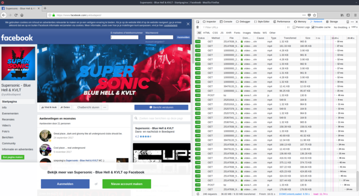
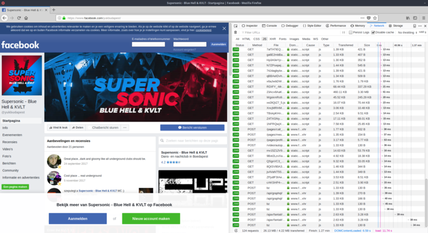
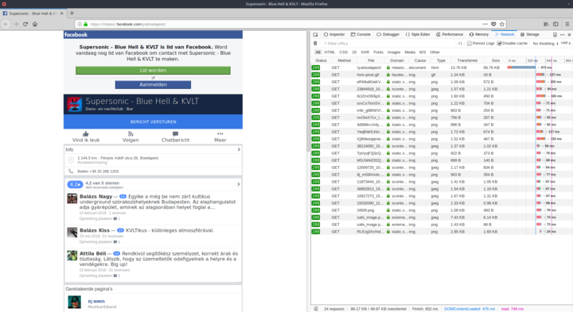

---
author:
    email: mail@petermolnar.net
    image: https://petermolnar.net/favicon.jpg
    name: Peter Molnar
    url: https://petermolnar.net
copies:
- http://web.archive.org/web/20180823095427/https://petermolnar.net/the-three-facebooks/
published: '2018-08-23T10:45:00+01:00'
summary: 'Facebook offers three different interfaces one can reach it at:
    desktop, mobile, and basic. One of them is a hellhole of torrential bloat.'
tags:
- internet
title: The three Facebooks

---

I recently wanted to check the upcoming gigs of a music venue. I tried
to pull up their website[^1], but I couldn't find their agenda there -
turned out it's sort of an abandoned site, because the hosting company
is refusing to respond to any requests.

As a result their gigs are listed on Facebook - at least it can be
access without logging in. My current browser setup is a bit complex,
but the bottom line is I'm routing my Firefox through my home broadband.
I'm used to very fast, unlimited desktop connections these days, both at
work and at home, but the throttling I introduced by going through a few
loops made some problem visible. When I loaded the Facebook page itself,
it took quite a long while, even with noscript and ublock origin, and it
made me curious, why.

So I made a fresh Firefox profile and loaded all three versions of
Facebook I'm aware of.

## Desktop

Visiting the main Facebook site from a regular desktop client gives you
the whole, full-blown, unfiltered experience - and the raw madness
behind it.

**The page executed 26.13 MB Javascript**. That is 315x the size of the
complete jquery framework, 193x of Bootstrap + Popper + Jquery together.

## m.facebook.com

.m is for mobile devices only; without faking my resolution and user
agent in Firefox dev tools, I couldn't get there.

It's better, but it still had 1.28 MB Javascript in the end. On mobile,
that is a serious amount of code to be executed.

## mbasic.facebook.com

mbasic is a fascinating thing: it doesn't have JS at all. It's like the
glorious, old days: ugly, very hard to find anything, but incredibly
fast and light.

## Summary

                                desktop[^2]   m.[^3]      mbasic.[^4]
  ----------------------------- ------------- ----------- -------------
  **Uncompressed everything**   36.83 MB      2.22 MB     96.91 KB
  **Total used bandwidth**      9.33 MB       1.01 MB     57.98 KB
  **JS code to execute**        26.13 MB      1.28 MB     n/a
  **JS bandwidth**              4.22 MB       364.39 KB   n/a
  **JS compression ratio**      6.19x         3.59x       1.67x
  **CSS to parse**              1.34 MB       232.81 KB   inline
  **CSS bandwidth**             279.73 KB     53.61 KB    inline
  **CSS compression ratio**     4.90x         4.34x       \-
  **HTML to parse**             2.78 MB       172.06 KB   70.20 KB
  **HTML bandwith**             199.73 KB     37.73 KB    14.20 KB
  **HTML compression ratio**    14.25x        4.56x       4.94x

## Conclusions

React is evil. It splits code up into small chunks, and on their own,
they seem reasonably sized. However, when there's a myriad of these,
they add up.

The compressed vs uncompressed ratio in desktop JS and HTML indicates
extreme amount of repetition.

Most resources are unique, hashed names, and I'm guessing many of them
are tied to A/B testing or something similar, so caching won't solve the
issue either.

There's always a balanced way to do things. A couple of years ago,
during the times of backbone.js an underscore.js, that balance was
found, and everyone should learn from it.

Many moons ago, in 2012 (*when Facebook still had an API*), an article
was published: The Making of Fastbook: An HTML5 Love Story[^5]. It was a
demonstration that the already bloated Facebook app could be replaced
with a responsive, small, service worker powered HTML5 website.

Facebook won't change: it will keep being a monster on every level.

**Don't follow their example.**

[^1]: <http://yuk.hu/>

[^2]: <https://facebook.com/yukbudapest>

[^3]: <https://m.facebook.com/yukbudapest>

[^4]: <https://mbasic.facebook.com/yukbudapest>

[^5]: <https://www.sencha.com/blog/the-making-of-fastbook-an-html5-love-story/>