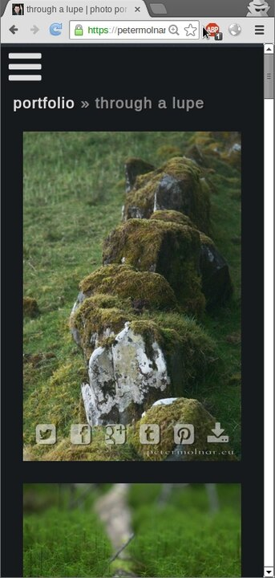
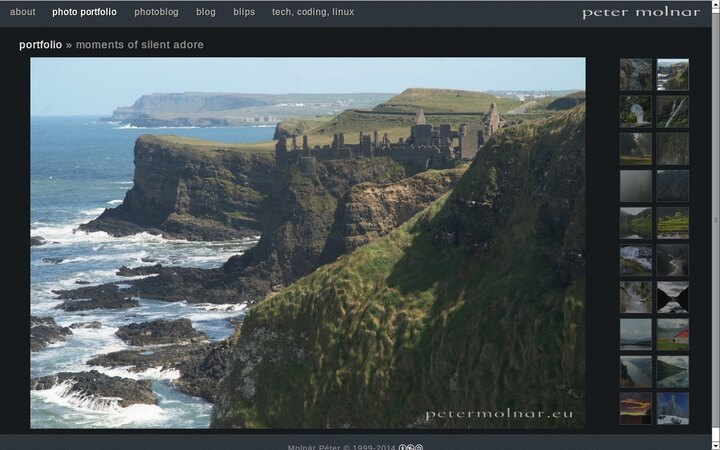

---
author:
    email: mail@petermolnar.net
    image: https://petermolnar.net/favicon.jpg
    name: Peter Molnar
    url: https://petermolnar.net
copies:
- http://web.archive.org/web/20140720005708/https://petermolnar.eu/linux-tech-coding/use-responsive-layout-for-image-galleries/
published: '2014-05-04T11:23:48+00:00'
summary: What is the best approach to show images on smartphones & tablets?
    To swipe or not to swipe? How about fluid videos?
tags:
- CSS
title: Optimize your site experience and your image gallery for any device

---

About a month ago I decided to heavily redesign my website. This little
site has been my cutting-edge technologies playground for years but it
was becoming outdated by some many ways.

The base points of the planned design were:

1.  Mobile first. Mobile is unquestionably becoming the standard for
    content consuming - reading, browsing, looking. Even I find myself
    using my smartphone for reading the articles and using the laptop
    only for writing or creating content. Therefore the site needs to be
    at least as good on mobile, than on desktop, if not better.
2.  Responsive images, fluid videos One of the main topics is to show my
    photos, I want them to be responsive and give the best experience on
    any device.
3.  Get rid of round corners, box shadows, double borders, etc, in short
    remove unnecessary, outdated design features. I don't think I need
    to explain these :)

It's not that hard, is it? YES IT IS.

## The Problem: the image gallery

There are: carousels[^1], lightbox[^2]-(clone[^3]) galleries, fancy over
animated galleries[^4], mobile friendly swipe galleries[^5], the one I
did for myself gallery[^6], the other I borrowed into a WordPress plugin
gallery[^7], the old-but-still-cool gallery[^8], even some 3D, real-life
gallery mimicking ones[^9], and soo many more... How could anyone choose
from these? And which one is giving the best user experience?

### The solution - for now

I don't have The One True Answer, I only have my answer: **for mobile,
go as static as possible.**

Remove the fuss, remove basically everything that could make the visitor
miss an image. Swiping can be buggy, can be counter-intuitive. Full
screen pop-up galleries, slideshows, carousels are all hiding the
overview option and they require the user to rotate through all the
images. They are also without the ability to quickly revisit one. (Why
sliders and carousels are evil?[^10]) and a brief explanation why you
should never use them[^11] ) For mobile, thanks to the mostly vertical
displays, you can simple place the images below each other and have
vertical scrolling.



But the desktop is still a different world. *( I'm not messing with the
touch screen desktops yet, that still needs to evolve and show the
actual usage patterns. )* Desktops have mouse which is a high precision
tool compared to your finger. They are mostly horizontal compared to the
vertical screen ration on the handhelds so if'd I want static images,
I'd need to create horizontal sliding for the same experience making the
landscapes full-screen size, and that is a bad idea[^12]. Sticking to
the original, thumbnails-and-preview layout it is then.

The **desktop** version **can stay fancy**.



Until the actual picture set[^13] tag truly emerges, I need to stick to
CSS3 media query based background changing[^14]. Ugly as hell, but it's
at least scriptable and even saves bandwidth a little.

### How about the videos?

Thankfully this topic is much easier due to the already present
different resolutions on most of the video sites. The List Apart article
Creating Intrinsic Ratios for Video[^15] made a clear point for
presenting fluid videos on a page, and for WordPress, check out
WordPress Canvas - Responsive Videos[^16] and use it without even
touching code.

Of course it might need some hacking and maximum width limiting if you
want to avoid fullscreen videos on desktop, but it's much easier than
with the image galleries.

### The cons?

There are always cons, and in our case, it's the different design. I
used to have customers, where no matter what I said, no matter how I
tried to make them understand, what is screen resolution, or pixel
density, they wanted their websites, galleries and everything look
exactly the same on all device. *( Of course it's not possible. )*

But this is something you need to learn to live with. We're using our
mobile devices very differently than we used our desktops. Even the
social activity shows a crazy difference on behalf of the mobiles. So
let's face it: we need different layout to have the same effect.

### Future issues: the limits of media queries

There is also another problem which we are soon about to face. I'm using
this to add the desktop additions to the LESS stylesheet:

```css
/* DESKTOP */
@media ( min-width : 960px ) and ( orientation: landscape ) and ( -webkit-max-device-pixel-ratio: 1.5 ),
( min-width : 960px ) and ( orientation: landscape ) and ( max-resolution: 220dpi ),
( min-width : 2400px ) and ( orientation: landscape ) and ( -webkit-max-device-pixel-ratio: 1.9 ),
( min-width : 2400px ) and ( orientation: landscape ) and ( max-resolution: 290dpi ) {
}
```

The first two for traditional desktops, the second pair for retina
desktops. But with 4K, there's more to come, again.

##### Credits

Featured image icon is from Ian Crowter's Responsive Web Design
article.[^17]

[^1]: <http://jetpack.me/support/carousel/>

[^2]: <http://lokeshdhakar.com/projects/lightbox2/>

[^3]: <http://planetozh.com/projects/lightbox-clones/>

[^4]: <http://dropthebit.com/demos/photobox/>

[^5]: <http://photoswipe.com/latest/examples/jquery-mobile.html#Gallery1>

[^6]: <https://petermolnar.net/adaptive-responsive-css3-gallery/>

[^7]: <http://trentacular.com/2009/10/galleriffic-2-0/>

[^8]: <http://www.dhteumeuleu.com/not-in-vein>

[^9]: <http://www.dhteumeuleu.com/he-knew>

[^10]: <https://yoast.com/opinion-on-sliders/>

[^11]: <http://shouldiuseacarousel.com/>

[^12]: <http://www.nngroup.com/articles/horizontal-scrolling/>

[^13]: <http://www.w3.org/TR/html-picture-element/>

[^14]: <https://petermolnar.net/linux-tech-coding/adaptive-responsive-css3-gallery/>

[^15]: <http://alistapart.com/article/creating-intrinsic-ratios-for-video>

[^16]: <http://wordpress.org/plugins/wc-responsive-video/>

[^17]: <http://www.iancrowther.co.uk/responsive-web-design/>