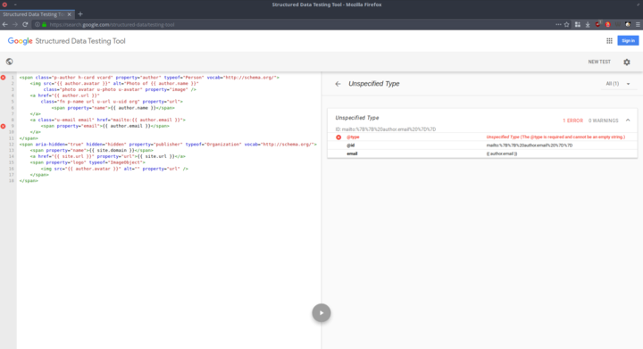

---
author:
    email: mail@petermolnar.net
    image: https://petermolnar.net/favicon.jpg
    name: Peter Molnar
    url: https://petermolnar.net
copies:
- http://web.archive.org/web/20190211231734/https://petermolnar.net/web-of-the-machines/
published: '2019-02-10T20:10:00+00:00'
summary: 'I got into an argument on Twitter - it made me realize I don''t
    know enough about RDF to argue about it. Afterwards I tried out a lot
    of different ways to drew my own conclusions on RDF(a), microdata, JSON-LD,
    vocabularies, schema.org, etc. In short: this one does not spark joy.'
tags:
- internet
title: A journey to the underworld that is RDF

---


I want to say it all started with a rather offensive tweet, but it
wouldn't be true. No, it all started with my curiosity to please the
Google Structured Data testing tool[^1]. Last year, in August, I added
microdata to my website - it was more or less straightforward to do so.

Except it was ugly, and, after half a year, I'm certain to say, quite
useless. I got no pretty Google cards - maybe because I refuse to do
AMP[^2], maybe because I'm not important enough, who knows. But by the
time I was reaching this conclusion, that aforementioned tweet happened,
and I got caught up in Semantic Hell, also known as arguing about RDF.

The first time I heard about the Semantic Web collided with the dawn of
the web 2.0 hype, so it wasn't hard to dismiss it when so much was
happening. I was rather new to the whole web thing, and most of the
academic discussions were not even available in Hungarian.

In that thread, it pointed was out to me that what I have on my site is
microdata, not RDFa - I genuinely thought they are more or less
interchangeable: both can use the same vocabulary, so it shouldn't
really matter which HTML properties I use, should it? Well, it does, but
I believe the basis for my confusion can be found in the microdata
description: it was an initiative to make RDF simple enough for people
making websites.

If you're just as confused as I was, in my own words:

-   **RDF** is a ruleset framework, which is **only used to describe
    sets of rules**
-   these rules are named **vocabularies**: Schema.org, Dublin Core,
    Open Graph (*the not-invented-here is strong in Facebook*), FOAF
    (*for the sake of your own sanity, don't read the FOAF doc, unless
    you already know how to greet Shub-Niggurath or what geekcode
    is/was*), etc
-   if you try to use multiple vocabularies at once - which you can -,
    it will be incredibly hard to remember when to use what
-   a vocabulary is what you can actually add to your data - machines
    then go to the RDF definition of the vocabulary make databases out
    of the data
-   **microdata** is `itemprop`, `itemscope`, `itemtype` and `itemref`
    HTML5 attributes
-   whereas **RDFa** is `vocab`, `typeof`, `property` HTML5 attributes
-   if you want to please academics or some sort of internal tool that
    is built to utilize RDF, use RDFa - I keep asking if RDFa
    vocabularies, such as Dublin Core, are consumed by anything on the
    public internet, but I keep getting answers[^3] with no actual
    answers
-   if you're doing this for a search engine, stick to microdata, it's
    less prone to errors
-   ... or instead of both, just do **JSON-LD**, which is JSON with
    special keys: `@context`, which points to a vocabulary, and `@type`,
    which points you to a vocabulary element, and these two define what
    your data keys should be named and what kind of data they might
    contain

With all this now known, I tried to turn mark up my content as
microformats v1, microformats v2, and RDFa.

I already had errors with microdata...


...but those errors then became ever more peculiar problems with RDFa...




... while microformats v1 was parsed without any glitches. *Sidenote:
**microformats** (v1 and v2), unlike the previous things, are extra HTML
`class` data, and v1 is still parsed by most search engines.*

**At this point I gave up on RDFa and moved over to test JSON-LD.**

It's surprisingly easy to represent data in JSON-LD with schema.org
context (*vocabulary, why on earth was vocabulary renamed to context?!
Oh. Because we're in hell.*). There's a long entry about why JSON-LD
happened[^4] and it has a lot of reasonable points.

What it forgets to talk about is that JSON-LD is an invisible
duplication of what is either already or what should be in HTML. It's a
decent way to store data, to exchange data, but not to present it to
someone on the other end of the cable.

The most common JSON-LD vocabulary, Schema.org has it's own interesting
world of problems. It wants to be a single point of entry, one gigantic
vocabulary, for anything web, a humongous task and noble goal. However,
it's still lacking a lot of definitions (*ever tried to represent a
resume with it?*), it has weird quirks (*'follows' on a Person can only
be another Person, it can't be a Brand, a WebSite, or a simple URL*) and
it's driven heavily by Google (*most people working on it are working at
Google*).

I ended up with compromises.

```html
<html lang="en"  prefix="og: http://ogp.me/ns# article: http://ogp.me/ns/article#">
<head>
    <title>A piece of Powerscourt Waterfall - petermolnar.net</title>
<!-- JSON-LD as alternative -->
    <link rel="alternate" type="application/json" title="a-piece-of-powerscourt-waterfall JSON-LD" href="https://petermolnar.net/a-piece-of-powerscourt-waterfall/index.json" />
<!-- Open Graph vocabulary RDFa -->
    <meta property="og:title" content="A piece of Powerscourt Waterfall" />
    <meta property="og:type" content="article" />
    <meta property="og:url" content="https://petermolnar.net/a-piece-of-powerscourt-waterfall/" />
    <meta property="og:description" content="" />
    <meta property="article:published_time" content="2017-11-09T18:00:00+00:00" />
    <meta property="article:modified_time" content="2019-01-05T11:52:47.543053+00:00" />
    <meta property="article:author" content="Peter Molnar (mail@petermolnar.net)" />
    <meta property="og:image" content="https://petermolnar.net/a-piece-of-powerscourt-waterfall/a-piece-of-powerscourt-waterfall_b.jpg" />
    <meta property="og:image:type" content="image/jpeg" />
    <meta property="og:image:width" content="1280" />
    <meta property="og:image:height" content="847" />
<!-- the rest of meta and header elements -->
<!-- followed by the content, with microformats v1 and v2 markup -->
```

HTML provides an interesting functionality, the `rel=alternate`. This is
meant to be the representation of the same data, but in another format.
The most common use is links to RSS and Atom feeds.

I don't know if Google will consume the JSON-LD alternate format, but
it's there, and anyone can easily use it.

As for RDFa, I turned to `meta` elements. Unlike with JSON-LD, I decided
to use the extremely simple vocabulary of Open Graph - at least Facebook
is known to consume that.

**The tragedy of this whole story: HTML5 has so many tags that is should
be possible to do structured data without any need for any of the things
above.**

My content is now:

-   microformats v1 and v2 within the visible content
-   a minimal RDFa in `meta` tags
-   a sidecar JSON-LD version

This way it's simple, but compatible enough for most cases.

## Footnotes

Out of the blue, Maria from 3WhiteHats pinged me with an article of
their on how to do structured data on your site[^5] - it's useful, and
it's good, especially the troubleshooting at the bottom of the entry.

[^1]: <https://search.google.com/structured-data/testing-tool>

[^2]: <https://www.ampproject.org/>

[^3]: <https://twitter.com/RubenVerborgh/status/1092029740364587008>

[^4]: <http://manu.sporny.org/2014/json-ld-origins-2/>

[^5]: <https://www.3whitehats.co.nz/knowledge/guide-to-structured-data-seo/>