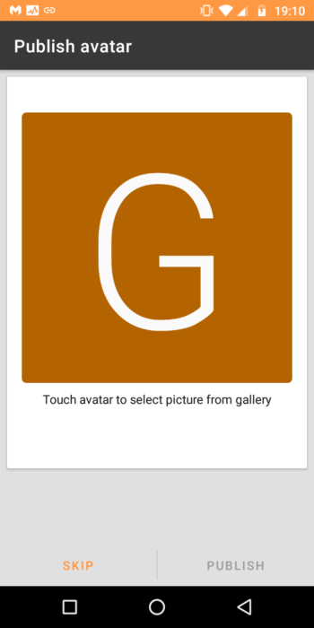

---
author:
    email: mail@petermolnar.net
    image: https://petermolnar.net/favicon.jpg
    name: Peter Molnar
    url: https://petermolnar.net/
copies:
- http://web.archive.org/web/20210401070036/https://petermolnar.net/article/xmpp-hu/
lang: hu
published: '2021-02-10T17:00:00+00:00'
summary: Az azonnali üzenetküldők egyre gyalázatosabbak a felhasználói érdekek
    és adatvédelem terén, pedig jó ideje lenne lehetőség szabadon választani
    szolgáltatót, programot/felületet, de akár még futtathatnánk is saját
    rendszert.
title: Mi az az XMPP, miért jó, és hogyan használd?

---

## Miért nem tudnak chat programok egymás között üzeneteket váltani?

Valószínű, hogy küldtél és/vagy fogadtál már emailt életedben, és
teljesen általánosnak találtad, hogy (például) egy @gmail.com email
címről minden gond nélkül lehet levelet küldeni egy @outlook.com, de
akár egy @freemail.hu címre is, pedig ezeket a rendszereket egészen más
cégek üzemeltetik.

Hasonló a helyzet az SMS-sel is: manapság valószínű, hogy bárkinek a
világon, akinek ismered a telefonszámát, gond nélkül tudsz SMS-t
küldeni, pedig lehet, hogy más a telefon gyártója, az operációs
rendszere, a szolgáltatója - mégis működik.

Azonban az azonnali üzenetküldők esetén ez nem így van: Viberből nem
lehet üzenetet küldeni Facebook-ra, vagy WhatsAppról Signal-ra.

Amikor kb. 23 évvel ezelőtt elkezdtem használni az ICQ-t (az akkori 98
verziót) egy darabig minden ismerősöm ezt használta, és semmi gond nem
volt. Nem sokkal később azonban a Windows-ba beépülve megjelent az MSN
Messenger, amit hirtelen nagyon sokan elkezdtek használni azok, akik az
ICQ-val már nem találkoztak - nekik csak MSN Messengerrel lehetett
üzenetet küldni, ICQ-val nem. Később ez igaz lett a Skype-ra, a Google
Talk-ra, Facebook-ra, mindenre. Az okostelefonok terjedésével ez még
rosszabbá vált: mára rengeteg olyan program akad, ami ráadásul kizárólag
mobilon elérhető, vagy ha mást nem, legalább egy mobiltelefon-számot kér
a regisztrációhoz: Whatsapp, Viber, Telegram, Signal, QQ, WeChat, stb.

A kétezres évek elején megjelentek néhány multi-protokoll program, amik
megpróbálták ezt áthidalni azzal, hogy egy felületből sok rendszerhez
próbáltak meg csatlakozni. Ilyen volt például a Trillian[^1], a
Pidgin[^2], vagy a Miranda[^3]. Azóta a Trillian megalkotta a saját
protokollját *(et tu, Brute?!)*, a Mirandát pedig eléggé elhanyagolták.
Egyedül a Pidgin-t *(illetve helyesebben szólva a programkönyvtárat
mögötte, a libpurple-t)* lehetséges felturbózni úgy, hogy mai, "modern"
rendszereket, mint például Discord, Slack, Signal, Whatsapp[^4], stb. is
képes legyen kezelni.

Ugyanezen évtized végén volt egy rövid időszak, amikor mind a Facebook,
mind a Google, mind a WhatsApp ugyanazt a szabványt használta, amelyet
XMPP[^5]-nek hívnak. Az XMPP nem egy alkalmazás, hanem egy
szabvány/protokoll - olyan, mint a HTTP és HTML - és ahhoz hasonlóan
lehetséges több, másféle, nem kizárólag a hivatalos, gyártótól származó
programmal használni azt. Ennek a szabványka egy elemi része kellet
volna, hogy legyen az úgynevezett föderáció (federation), ami ugyanaz,
mint az email esetében: mások által üzemeltetett rendszerek egymás
között is tudjanak kommunikálni. Sajnos mindhárom említett szolgáltató,
(Javítás: a Google Talk 2006 körül csendben engedélyezte[^6] egészen
létezése végéig) úgy döntött, hogy ezt a funkciót kiiktatja, és sajnos
azóta mindhárom szolgáltató lecserélte az XMPP-t zárt, egymással
egyáltalán nem kompatibilis rendszerekre.

Közel húsz évvel ezelőtt a Firefox elérte, hogy az emberek tisztában
legyenek vele, hogy az internetet nem kizárólag a két Internet Explorer
programmal lehet használni, hanem bármilyen más böngészővel is: Edge,
Internet Explorer, Safari, Chrome, Firefox, csak pár példát említve.
Ennél sokkal kevesebben tudják, hogy ugyanez igaz (szinte) mindegyik
email szolgáltatóra, beleértve a Gmail-t, az Outlookot: vannak email
alkalmazások, amelyek függetlenek a szolgáltatótól, mint például Apple
Mail[^7], K9[^8], mutt[^9], Thunderbird[^10], Geary[^11] Ezzel teljes
ellentétben a legtöbb azonnali üzenetküldő egyenesen tiltja azon
programok használatát, ami nem az ő hivatalos programjuk - van, amelyik
ezt olyan mértékben teszi, hogy visszavonhatatlanul kitiltja a
felhasználót, ha ilyenen kapja.

### Vannak rendszerek, amik képesek egymás között kommunikálni?

Jelenleg két fő azonnal üzenetküldő szabvány/rendszer létezik, amelyek
képesek a már említett föderációra: XMPP és a Matrix.

A két rendszer között alapvető elvi különbségek vannak, ezek röviden
összefoglalva:

-   egy XMPP szerver nem más, mint egy átjátszó állomás. Ha szükséges,
    ideiglenesen képes üzeneteket megőrizni a kézbesítésig, de
    alapvetően az adat csak átfolyik rajta; tárolni nem tárolja azt.
-   a Matrix ezzel ellentétben szinte mindent a szerveren tárol; ennek
    oka, hogy így a kliens kevésbé kritikus, és ha pl. elveszik a
    telefon, attól még a beszélgetések, csoportok megmaradnak, míg az
    XMPP esetében ez csak bizonyos adatokra igaz.

A két megközelítés közül én az XMPP-t részesítem előnyben, de elismerem,
hogy vannak előnyei a Matrix megközelítésének. Megjegyzés: a Matrix
egyik funkciója, a föderált szobák, még nem létezik XMPP-n.

### Hogyan lehet előrelépni a széttöredezett üzenetküldő rendszerek világából?

A válasz viszonylag egyszerű, de a kivitelezés egyáltalán nem az;
ráadásul mindenkitől energiabefektetést igényel.

1.  Újra meg kell tanulnunk kisebb szolgáltatókat használni. Keress egy
    ismerőst, egy céget, valakit, akit személyesen ismerhetsz,
    valakiket, akik felveszik a telefont, ha baj van a szolgáltatással.
    Rengetek történet kering emberekről, akiket a Facebook kizárt az
    oldalról, anélkül, hogy bármilyen módon újra hozzáférhetnének a
    fiókjukhoz[^12].

2.  Válassz olyan szolgáltatót és/vagy rendszert, ami lehetővé teszi a
    föderációt. A <https://list.jabber.at/> címen található egy lista
    publikus XMPP szerverekről.

3.  Válassz kliens alkalmazást szabadon, azt, ami a legjobban tetszik,
    nem azt, amit a szolgáltató kénye-kedve szerint, állandóan
    változtat. A <https://xmpp.org/getting-started/> oldalon van egy
    lista ajánlott kliensekről.

4.  Ha képes vagy rá, futtasd a saját szolgáltatásod magadnak,
    barátoknak, családnak.

## Modern XMPP kliensek

Az évek során - az XMPP elődje, a jabber, 1999-ben jelent meg - rengeteg
új fejlesztés került az XMPP-be, de a természetéből fakadóan nem minden
kliens illetve szerver támogatja az összes lehetséges funkciót. Emiatt
elég sok támadás érte, holott a frissebb megoldások minden mai
követelménynek megfelelnek.

Az egyik ilyen, sokat kritizált probléma, hogy sokak szerint a végpontok
közötti titkosítás (e2e encryption) "túl későn" került az XMPP-be, pedig
ez nem igaz: az első, PGP alapú már sok éve jelen van, de nehéz és
kényelmetlen volt használni. Azóta az elsődleges megoldássá az OMEMO
vált[^13], amit sokkal egyszerűbb használni.

A hang- és videóbeszélgetés sokáig váratott magára, de 2020-ra végre egy
nyílt forráskódú Android kliens is tartalmazza a Jingle[^14] megoldást -
megjegyzendő, hogy az AstraChat[^15] nevű szoftver, ami több platformra
is elérhető, régóta képes erre, cserébe viszont az OMEMO titkosítást nem
támogatja.

2021-re minden platformra elérhető modern, titkosítást kezelni képes,
videó- és hanghívást támogató kliens.

### Példák modern kliensekre

-   **Conversations** Android-ra Play áruházon keresztül 899 Ft,
    F-Droidon keresztül ingyenes
    -   <https://play.google.com/store/apps/details?id=eu.siacs.conversations&hl=hu_HU&gl=HU>
    -   <https://f-droid.org/hu/packages/eu.siacs.conversations/>
-   **blabber.im** (korábban Pix-Art Messenger) Android-ra; ez a
    Conversations egy leszármazottja; több beállítást tesz elérhetővé,
    de alapvetően ugyanolyan funkciókkal bír. A következő bekezdés
    végigveszi ennel a programnak a telepítését.
    -   <https://play.google.com/store/apps/details?id=im.blabber.messenger&hl=hu_HU&gl=HU>
    -   <https://f-droid.org/hu/packages/de.pixart.messenger/>
-   **aTalk** for Android Egy hagyományosabb XMPP kliens.
    -   <https://play.google.com/store/apps/details?id=org.atalk.android>
    -   <https://f-droid.org/hu/packages/org.atalk.android/>
-   **Siskin** iPhone-ra, iPad-re, és MacOS-re:
    -   <https://apps.apple.com/us/app/tigase-messenger/id1153516838>
-   **Gajim** Windowsra, linuxra, vagy Mac-re:
    -   <https://gajim.org/download/>

## Példa: Blabber.im telepítése Androidra

Keresd ki a Play áruházból a `blabber.im` klienst, vagy kövesd a
<https://blabber.im/en/download/> linket!


### Ha megvolt a telepítés, indítsd el

### Bevezető

Az első néhány képernyő végigvezet az alapokon angolul. A nyilak
segítségével léptesd végig. A végén használd a pipát.


**Engedélyezd a file-okhoz való hozzáférést, amikor kéri!**


### Hozzáférés

Ezután a következő 3 képernyő elmagyarázza, hogyan működik egy
hozzáférés az XMPP rendszerben.


### Hozzáférés-készítés

Amikor megjelenik a "Create new account" ablak, válassz egy
felhasználónevet (bármi, de angol karakterek legyenek) majd:

-   vagy válassz a legördülő listából egy végződést (ez olyan, mint anno
    ingyen email olyanokkal, mint cia.hu)
-   vagy pipáld ki a "Use own provider"-t, hogy más szervereket tudj
    használni


Ezután felajánl egy jelszót. Ezt ha akarod, elfogadhatod, de akkor írd
le.

Utána ez a képernyő fogad:


Megkéri, hogy írd be a neved:


### Beállítások

A következő képernyő rákérdez pár beállításra; az alapbeállítások jók,
fogadd el.


Ha akarod, a következő képernyőn beállíthatsz egy avatárt.



Az ezután következő képernyő végigvezet azon, hogy hogyan tudsz
beszélgetést indítani.


És megkérdezi, hogy hozzáférhet-e a névjegyeidhez.


Ha minden jól ment, kész vagy a felhasználói fiókkal.

### Csatlakozás csoportbeszélgetéshez

Nyomd meg jobbra lent a nagy sárga + gombot, feljön egy menü:


Válaszd ki a `Join public channel` gombot:


Az felugró ablakba írd be a csoport teljes címét, pl.:
`chatszoba@muc.example.net`


Kész vagy!

## Saját XMPP szerver futtatása

### Megjegyzések és figyelmeztetések

Ez nem egy kimásolható-beilleszthető útmutató; kérlek módosítsd a
beállításokat. Ha elakadsz, nyugodtan vedd fel velem a kapcsolatot a
<mail@petermolnar.net> email és/vagy XMPP címen, szívesen segítek, ha
tudok.

A leírás FreeBSD FreeBSD[^16] szerverre készült, így a legtöbb beállítás
a `/usr/local/etc` könyvtárra mutat a linuxban megszokott `/etc`
helyett.

### Előkövetelmény: szabadon módosítható DNS rekord beállítások

Az XMPP rendszer követelményei között szerepel több DNS rekord
beállítása, így mindenképpen olyan DNS szolgáltató szükséges, amely
támogatja az A, CNAME, SRV és TXT rekordokat. Az alábbi példák az
`example.net` domaint használják; értelemszerűen módosítsd a saját
domainedre.

#### A (és AAAA rekordok, ha ipv6 címe is van a rendszerner)

```dns
example.net. 1800 IN A a.szervered.ipv4.cime
example.net. 1800 IN AAAA a.szervered.ipv6.cime
```

#### CNAMEs a "komponens" aldomaineknek

```dns
proxy.example.net. 1800 IN CNAME example.net.
upload.example.net. 1800 IN CNAME example.net.
groupchat.example.net. 1800 IN CNAME example.net.
pubsub.example.net. 1800 IN CNAME example.net.
```

#### SRV rekordok

```dns
_xmpp-client._tcp.example.net. 1800 IN SRV 1 1 5222 example.net.
_xmpps-client._tcp.example.net. 1800 IN SRV 1 1 5223 example.net.
_xmpp-server._tcp.example.net. 1800 IN SRV 1 1 5269 example.net.
```

#### TXT rekordok

```dns
_xmppconnect.example.net. 1800 IN TXT "_xmpp-client-xbosh=https://example.net/http-bind"
```

### Előkövetelmény: létező nginx szerver és SSL tanusítványok

Az alábbi két kategóriát ez az útmutató **nem** tartalmazza:

-   az nginx webszerver telepítése és beállítása
-   SSL tanúsítványok beszerzése a letsencrypt segítségével

Rendkívül sok mód áll rendelkezésre mindkettőre, és kiváló útmutatók
találhatóak az interneten mindkét témában.

### nginx mint reverse-proxy a Prosody XMPP szerver előtt

Ezzel a lépéssel lehetővé tesszük, hogy egy pl. egy weboldalt is ki
lehessen szolgálni ugyanarról a domainről, mint az XMPP szolgáltatást;
vagy egy olyan webfelületet, ami az XMPP szerverünkhöz biztosít
hozzáférést, mint például a movim[^17].

Az alábbi blokk az nginx `server { }` blokkján belülre kell, hogy
kerüljön, a `location /` beállítás elé:

```nginx
    # BOSH
    location /http-bind {
         proxy_pass  http://127.0.0.1:5280/http-bind;
         proxy_set_header Host $host;
         proxy_set_header X-Forwarded-For $remote_addr;
         proxy_buffering off;
         tcp_nodelay on;
    }

    # websockets
    location /xmpp-websocket {
        proxy_pass http://127.0.0.1:5280/xmpp-websocket;
        proxy_http_version 1.1;
        proxy_set_header Connection "Upgrade";
        proxy_set_header Upgrade $http_upgrade;
        proxy_set_header Host $host;
        proxy_set_header X-Forwarded-For $remote_addr;
        proxy_read_timeout 900s;
    }

    # http_upload
    location /upload {
         proxy_pass  http://127.0.0.1:5280/upload;
         proxy_set_header Host $host;
         proxy_set_header X-Forwarded-For $remote_addr;
         proxy_buffering off;
         tcp_nodelay on;
    }
```

### Automatikusan frissülő letsencrypt tanúsítványok a Prosody részére

A `certbot` által szolgáltatott beállítások bővíthetőek, így
lehetőségünk adódik létrehozni a
`/usr/local/etc/letsencrypt/renewal-hooks/post/10-prosody.sh` file-t,
hogy amint frissül a tanúsítvány, a Prosody szerver is automatikusan
megkapja azt.

Csak akkor működik, ha a Prosody szerver tartalmaz `VirtualHost`
elemeket.

```bash
#!/usr/bin/env bash

for d in $(cat /usr/local/etc/prosody/prosody.cfg.lua | grep VirtualHost | sed -r 's/.*"([^"]+)"/\1/'); do
        prosodyctl --root cert import "${d/.conf/}" /usr/local/etc/letsencrypt/live/
done
/usr/sbin/service prosody restart
```

### Szerezzük be a naprakész `prosody-modules` csomagot

A disztribúciókban elérhető verzió általában elavult; a letöltéshez
szükség van a `mercurial` ( `hg` ) verziókezelőre.

```bash
mkdir -p /opt
cd /opt
hg clone https://hg.prosody.im/prosody-modules/ prosody-modules
```

### Telepítsük a Prosody XMPP szervert

FreeBSD alatt:

```bash
pkg install prosody
```

### (ha szükséges) luadbi SQLite támogatással

A FreeBSD `pkg`-n keresztül elérhető `luadbi` csomagja kizárólag a
MySQL-t (abból is az 5.7-es verziót) támogatja, így ha szeretnénk SQLite
adatbázist használni, le kell fordítani.

```bash
cd/usr/ports/databases/luadbi
make config
```


```bash
make
make install
```

### A Prosody szerver beállítása

Ezeket érdemes futtatni, csak a biztonság kedvéért:

```bash
# az összes alábbi parancs root felhasználóként történik
mkdir -p /var/run/prosody
chown prosody:prosody /var/run/prosody
mkdir -p /var/db/prosody
chown prosody:prosody /var/db/prosody

# a http_upload modul részére
mkdir -p /usr/local/www/prosody
chown prosody:prosody /usr/local/www/prosody
```

`prosody.lua.cf`

```lua
plugin_paths = { "/opt/prosody-modules" }
admins = {  "admin@example.net" }

modules_enabled = {
    "announce";
    "blocklist";
    "bookmarks";
    "bosh";
    "carbons";
    "cloud_notify";
    "csi";
    "csi_simple";
    "csi_battery_saver";
    "dialback";
    "disco";
    "http";
    "http_altconnect";
    "http_files";
    "limits";
    "log_auth";
    "mam";
    "motd";
    "offline";
    "pep";
    "ping";
    "posix";
    "presence";
    "private";
    "proxy65";
    "pubsub";
    "register";
    "roster";
    "saslauth";
    "server_contact_info";
    "smacks";
    "throttle_presence";
    "time";
    "tls";
    "turncredentials";
    "uptime";
    "vcard4";
    "vcard_legacy";
    "version";
    "watchregistrations";
    "websocket";
    "welcome";
}

modules_disabled = {
}

allow_registration = false;
daemonize = true;
pidfile = "/var/run/prosody/prosody.pid";

legacy_ssl_ports = { 5223 }
legacy_ssl_ssl = {
    key = "certs/https.key";
    certificate = "certs/https.crt";
}

c2s_require_encryption = true;
s2s_require_encryption = true;
s2s_secure_auth = true;

auth_append_host = true;

pep_max_items = 10000

-- több info: https://groups.google.com/g/prosody-users/c/U1LN78jhh_A
network_default_read_size = "*a"

trusted_proxies = { "127.0.0.1", "::1" }

storage = "internal"
-- amennyiben SQLite adatbázist használnál inkább:
--sql = {
--    driver = "SQLite3";
--    database = "/var/db/prosody/prosody.db";
--}

-- naplózás
log = {
    info = "*syslog";
}

-- a tanusítványok mappája a prosody beállításokon belül
certificates = "certs";

-- BOSH (XMPP HTTP-n keresztül)
http_ports = { 5280 }
http_interfaces = { "*" }
https_ports = { 5281 }
https_interfaces = { "*" }
cross_domain_bosh = true
consider_bosh_secure = true
cross_domain_websocket = true

-- mobil kliens optimalizációk
push_notification_with_body = true
push_notification_with_sender = true
smacks_hibernation_time = 86400

-- szerver kapcsolati adatok
contact_info = {
    abuse = { "mailto:admin@example.net", "xmpp:admin@example.net" };
    admin = { "mailto:admin@example.net", "xmpp:admin@example.net" };
    security = { "mailto:admin@example.net", "xmpp:admin@example.net" };
    support = { "mailto:admin@example.net", "xmpp:admin@example.net" };
};

limits = {
    c2s = {
        rate = "100kb/s";
        burst = "2s";
    };
    s2sin = {
        rate = "100kb/s";
        burst = "5s";
    };
}

-- erre az XMPP címre riasszon a rendszer, amint új felhasználó
-- regisztrál
registration_watchers = { "admin@example.net" }

-- Proxy
-- ez egy régi kiegészítő eszköz, nagy file-ok küldésénél hasznos
-- lehet
proxy65_ports = { 5000 }
proxy65_address = "YOUR.EXTERNAL.IP.ADDRESS"

-- http_upload
-- az előző modern verziója, amikor a kliens inkább feltölti a file-t a
-- szerverre
http_upload_path = "/usr/local/www/prosody"
http_upload_file_size_limit = 10485760

-- TURN/STUN
-- audio/video hívásokra; ehhez szükséges egy külső program, lásd később
turncredentials_secret = "HOSSZÚ-TITKOS-JELSZÓ-AMIT-KÉSŐBB-MÁSHOL-IS-HASZNÁLNI-FOGUNK";
turncredentials_ttl = 86400;
turncredentials_host = "A.SZERVERED.TELJES.DOMAIN.NEVE";
turncredentials_port = 3478

-- engedélyezd ezt a beállítást, ha szeretnéd, hogy regisztrálni lehessen
-- a szerveren
-- allow_registration = true;

-- beállítás domainenként
VirtualHost "example.net"
    authentication = "internal_hashed"
    -- itt add meg hogy milyen "külső" címen érhető el a szerver; ez az, ami
    -- az nginx-ben be van állítva
    http_external_url = "https://example.net/"
    http_host = "example.net"

    -- a http_upload module részére
    Component "upload.example.net" "http_upload"
        -- ugyaúgy meg kell adni, mint az előbb; a legtöbb beállítást minden Component-en meg
        --- kell adni külön
        http_external_url = "https://example.net/"
        http_host = "example.net"

    -- a proxy részére
    Component "proxy.example.net" "proxy65"

    -- csoportbeszélgetések részére - enélkül nincs lehetőség szobákat nyitni
    Component "groupchat.example.net" "muc"
        modules_enabled = {
            "muc_mam",
            "vcard_muc"
        }
   -- amennyiben szükséges, pl. movim - https://movim.eu/
   -- részére
   -- Component "pubsub.example.net" "pubsub"
   --    pubsub_max_items = 10000
```

Futtassuk az alábbi parancsokat, hogy betöltsük a tanusítványokat:

```bash
# töltsük be a meglevő tanusítványokat az első akalommal az
# előkészített letsencrypt kiegészítő parancsból:
bash /usr/local/etc/letsencrypt/renewal-hooks/post/10-prosody.sh

# készítsünk symlinket a fő tanusítványra, hogy az ún. legacy SSL modulok
# tudjanak mit használni
cd /usr/local/etc/prosody/certs
ln -s example.net.crt https.crt
ln -s example.net.key https.key
```

### Indítst a Prosody szervert

```bash
service prosody start
```

Ha nem engedélyezted a regisztrációt, a `prosodyctl` paranccsal lehet
felhasználót létrehozni:

```bash
prosodyctl adduser admin@example.net
```

### (optionális) `coturn` TURN szerver a telepítése

Videó- és hanghívások támogatásához.

```bash
pkg install coturn
```

### (optionális) `coturn` TURN szerver beállítása

Az alábbi beállítások egy olyan szerverre érvényesek, amelyik egyetlen,
közvetlenül az internetre kapcsolt IP címmel rendelkeznek. Amennyiben ez
nem igaz, a beállításokat ehhez mérten kell módosítani.

`/usr/local/etc/turnserver.conf`

```ini
listening-port=3478
tls-listening-port=5349
listening-ip=0.0.0.0
min-port=49152
max-port=65535
use-auth-secret
static-auth-secret=HOSSZÚ-TITKOS-JELSZÓ-AMIT-KÉSŐBB-MÁSHOL-IS-HASZNÁLNI-FOGUNK
server-name=example.net
realm=example.net
cert=/usr/local/etc/prosody/example.net.crt
pkey=/usr/local/etc/prosody/example.net.key
syslog
proc-user=prosody
proc-group=prosody
```

### Tűzfal beállítások

Az alábbi portok mindeképpen szükségesek, hogy az XMPP szerver helyesen
üzemeljen:

```bash
ipfw add 03600 allow tcp from any to me 5222
ipfw add 03700 allow tcp from any to me 5223
ipfw add 03800 allow tcp from any to me 5269
ipfw add 04100 allow tcp from any to me 5000
```

Amennyiben a TURN szerver is beállításra került:

```bash
ipfw add 04700 allow tcp from any to me 3478
ipfw add 04800 allow udp from any to me 3478
ipfw add 04900 allow tcp from any to me 5349
ipfw add 05000 allow udp from any to me 5349
ipfw add 05200 allow udp from any to me 49152-65535
ipfw add 05300 allow tcp from any to me 49152-65535
```

Az `/etc/rc.conf` file beállításában, hogy újraindítás után is
beállításra kerüljenek:

```bash
firewall_script="/etc/rc.firewall"
firewall_type="workstation"
firewall_myservices="22/tcp 5222/tcp 5223/tcp 5269/tcp 5000/tcp 3478/tcp 3478/udp 5349/tcp 5349/udp 49152-65535/udp 49152-65535/tcp"
firewall_allowservices="any"
firewall_logging="YES"
firewall_logdeny="YES"
firewall_enable="YES"
firewall_quiet="YES"
```

Megjegyzés: a 22-es port a biztonság kedvéért van a listában, nehogy
valaki kizárja magát a rendszerből.

Javaslat: érdemes a `rc.conf` file `firewall_` részéről bővebben
olvasni, mielőtt az ember alkalmazná, mert könnyű kizárni magunkat a
rendszerből.

## Végszó

Amíg használni az XMPP könnyű, egy szervert üzemeltetni egyáltalán nem
az. Szerencsére a Prosody XMPP szerver rendszerigénye rendkívül
alacsony, és a mai, gyors internetkapcsolatokkal akár otthon is, egy
régi laptopon, vagy egy Raspberry Pi-n is lehetséges egy teljes értékű
szervert üzemeltetni. Ha nem áll rendelkezésre fix IP, az sem baj: a
DigitalOcean[^18] például ingyenes DNS szervert biztosít, amin egyszerű
HTTP hívásokkal keresztül lehet módosítani a rekordokat, amennyiben
frissül az IP cím.

A <https://prosody.im/doc> rengeteg, hasznos dokumentációkat tartalmaz,
de sajnos kissé nehéz navigálni az oldalon.

Ha le akarod tesztelni a szervered, a
<https://compliance.conversations.im/> segít benne.

Amennyiben hibát találsz a leírásban, kérlek jelezd, de szívesen fogadok
bővítést, kiegészítést is.

Sok sikert!

[^1]: <https://www.trillian.im/>

[^2]: <https://pidgin.im/>

[^3]: <https://sourceforge.net/projects/miranda/>

[^4]: <https://github.com/petermolnar/awesome-pidgin-plugins>

[^5]: <https://xmpp.org/>

[^6]: <http://googletalk.blogspot.com/2006/01/xmpp-federation.html>

[^7]: <https://www.lifewire.com/set-up-gmail-account-with-macs-mail-application-2260069>

[^8]: <https://k9mail.app/documentation/accounts/providerSettings.html>

[^9]: <http://www.mutt.org/>

[^10]: <https://www.thunderbird.net/>

[^11]: <https://wiki.gnome.org/Apps/Geary>

[^12]: <https://www.elliott.org/blog/banned-from-facebook-permanently-how/>

[^13]: <https://omemo.top/>

[^14]: <https://prosody.im/doc/jingle>

[^15]: <https://astrachat.com/>

[^16]: <https://www.freebsd.org/>

[^17]: <https://movim.eu/>

[^18]: <https://www.digitalocean.com/>
