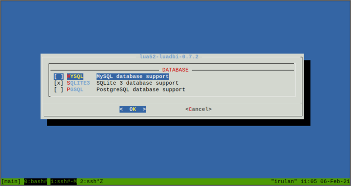

---
author:
    email: mail@petermolnar.net
    image: https://petermolnar.net/favicon.jpg
    name: Peter Molnar
    url: https://petermolnar.net/
copies:
- http://web.archive.org/web/20210125222811/https://petermolnar.net/article/xmpp/
published: '2021-01-25T19:00:00+00:00'
summary: 'Fleeing Whatapp due to their policy changes? Tired of the never
    ending roam between the actual trendy instant messaging app? Here is a
    simple, elegant solution: run your own server, onboard your friends and
    family, and live happily ever after.'
title: Run your artisan instant messaging service for your friends & family

---

## Chat systems should be able to talk across one another, why are they not?

You probably have used email before. I have multiple email addresses,
among them <mail@example.net> and <petermolnar.eu@gmail.com> . It's
perfectly normal that I will be able to send a mail from one another,
even though these email addresses are on different domain (example.net
vs gmail.com), different servers, and different are the people running
them.

There's a similar case with SMS: nowadays I expect that I'd be able to
send a text to anyone in the world who's number I know, and if I'm using
the international number format correctly. +44 (UK) to +36 (Hungary), or
+49 (Germany) to +1 (USA) - it should all work. *I have to admit, I
don't know if sending a text to mainland China works; I never tried, but
I'd believe it does.*

When it comes to instant messages, this was never the case, even though
it has been possible for a long time - just disabled by most providers.

Around 23 years ago I launched ICQ 98, and the people I could interact
with were the people on ICQ. If they were on AIM, I'd need to launch
AIM. Later MSN, Skype, Gtalk came onto play, all before mobile took off.

Somewhere down the road fantastic developers had enough of needing to
use many software for the same purpose, and thus multi-protocol instant
messengers happened, notably: Trillian[^1], Pidgin[^2], Miranda[^3].
Since then Trillian became yet another instant messaging protocol *(et
tu, Brute?!)*, Miranda got heavily neglected. Pidgin, or, more
specifically, libpurple, the library behind it, is doing acceptably
well, and can be made to connect to "modern" walled garden services,
such as Discord, Slack, Signal, or even Whatsapp[^4]


When smartphones started to become widely available, the messenger space
grew exponentially, fuelled by "free" SMS and calls. Now we have more
instant messengers, then ever, and they can only, and strictly only be
used within the same system, many are mobile "exclusive": Whatsapp,
Viber, Telegram, Signal, new ICQ, Google ~~Talk~~ ~~Hangouts~~ ~~Allo~~
~~Duo~~ ~~Meet~~ Chat *(I think it's called Chat at the moment)*,
Threema, Facebook Messenger, QQ, WeChat - the list is endless.

There was a brief, interesting period of time, namely when Facebook
introduced their chat, Gtalk was still called Gtalk, and Whatsapp was
still just starting: they all used the very same underlying standard,
called XMPP[^5]. XMPP is not an app; it's more like HTTP and HTML; a
wire frame, so people can build their own apps on top of it. It has a
feature that sadly none of the three mentioned service provided, called
federation: it means that just like email, it should have been possible
to talk from your Whatsapp with someone on Gtalk. Since then, all three
of them abandoned XMPP, and made different, incompatible with each other
systems.

This feature then was disabled (EDIT: with the exception of Google Talk
in 2006, that had federation until it's demise[^6]); probably to train people
to associate an app with the service behind it. Many of us know that the
internet can be accessed with many browsers - Edge, Internet Explorer,
Safari, Chrome, Firefox. Much less know that nearly ever email service,
including Gmail, or Outlook, can also be accessed with different
programs, like Apple Mail[^7], or K9[^8] on android. With instant
messengers, using a 3rd party client sometimes even leads to instant
ban. If you think of it, it's completely insane.

### What can be done to address the fragmented nature of instant messaging?

The answer is simple, but the execution is not at all, and it needs
effort from all of us.

1.  We need to return to smaller service providers. Find a firm where
    you'll know real people, where you'll know the faces to turn to if
    you have a problem. There are so many stories about people locked
    out from their accounts on Facebook without any option to appeal
    that it's frightening[^9]. These days places like
    <https://conversations.im/> is a good start for such provider.
2.  Use a provider which allows your account to talk to other accounts
    on the same network - it's called federation. (See below)
3.  Choose an app you like (see later), not one someone wants to force
    on you.
4.  If you can, run your own service, and do it for friends, and family
    as well.

### What are the networks capable of talking to each other?

At the moment there are two main messaging ecosystems which can do
federation and accepts many clients: XMPP and Matrix. They cannot (yet?)
talk to one another. There are fundamental philosophical differences in
their approach, which can be summarised as:

-   and XMPP server is nothing, but a relay station. It barely stores
    any data, it's purpose is to allow the data to flow through it to
    the clients, and lets the client decide what to do.
-   a Matrix server, on the other hand, stores as much of this data on
    the server side as possible, so the clients never have to worry
    about losing data from their devices.

I prefer the approach of XMPP.

## About modern XMPP clients

One of the beautiful benefits of using a service that allows, sometimes
even encourages, using the application you prefer, is that we can decide
based on our needs and likes.

There have been many critical voices aimed at XMPP, mainly like "too
late to add end-to-end encryption". This is a complex question, because
in fact XMPP was one of the first things to offer encryped messaging -
PGP based -, but it was very difficult to use. A more modern approach,
borrowed from Signal, arrived later, and it's called OMEMO. There are
now many client supporting OMEMO encryption[^10], providing basically
transparent, secure chat to many.

Another feature that many waited a long time was voice and video chat -
but this, again, has a similar story to encryption. Jingle[^11] is a
very old addition to the XMPP standard, so old, that it doesn't work
with Pidgin any more - the relevant Pidgin part was built around a media
library that has been dead for over a decade, namely gstreamer-0.1 -,
but on mobile clients, this feature was missing for a long time. A
notable exception is AstraChat[^12] which offered it for quite a while,
but in return, it still doesn't offer e2e encryption.

The point is: in 2020, XMPP clients on mobile or desktop are up to all
needs, all requirements, and are certainly much easier to use, then they
used to be even just a few years ago.

### The clients I'd recommend these days

-   **Conversations** (or a derivative of it) for Android
    -   <https://play.google.com/store/apps/details?id=eu.siacs.conversations>
        -   £2.19
    -   <https://f-droid.org/en/packages/eu.siacs.conversations/> - free
-   **aTalk** for Android
    -   <https://play.google.com/store/apps/details?id=org.atalk.android>
    -   <https://f-droid.org/en/packages/org.atalk.android/>
-   **Siskin** for iOS:
    -   <https://apps.apple.com/us/app/tigase-messenger/id1153516838>
-   **Dino** or **Gajim** for desktop:
    -   <https://dino.im/>
    -   <https://gajim.org/download/>

*With a heavy heart, I'm not putting Pidgin on that list, because it's
basically impossible to get audio/video support for XMPP on it, and
while I'll remain a heavy user of it due to needing to connect to many
networks, it is not the best choice if someone is looking for a good,
modern XMPP client.*

There's an ever growing list of clients at
<https://xmpp.org/software/clients.html> for more options.

aTalk has an incredible FAQ at <https://atalk.sytes.net/atalk/faq.html>
which probably answers any and all questions one might have with XMPP
from the user side.

## Running a service: prosody behind nginx

### Notes and warnings

This is how I've done it; it's not guaranteed it'll work for you. If you
get stuck, or want to hire me to set it up for you, reach out to me at
<mail@petermolnar.net> (that's both an email and an XMPP address).

My server runs FreeBSD[^13], meaning most paths will be `/usr/local/etc`
instead of `/etc` as it would be on Debian or CentOS.

### Prerequisites: access to DNS configuration

Running a webserver is usually simple, but those who'd ever set up an
email server know there are additional magic that needs to be added to
the domain records. The case of an XMPP server is not as complex as with
email, but neither is so simple, with a mere A record.

#### Base A (and AAAA records, if possible)

```dns
example.net. 1800 IN A your.server.ipv4.address
example.net. 1800 IN AAAA your.servers.ipv6.address
```

#### CNAMEs for subdomains used by components

```dns
proxy.example.net. 1800 IN CNAME example.net.
upload.example.net. 1800 IN CNAME example.net.
groupchat.example.net. 1800 IN CNAME example.net.
pubsub.example.net. 1800 IN CNAME example.net.
```

#### Service records for the XMPP clients

```dns
_xmpp-client._tcp.example.net. 1800 IN SRV 1 1 5222 example.net.
_xmpps-client._tcp.example.net. 1800 IN SRV 1 1 5223 example.net.
_xmpp-server._tcp.example.net. 1800 IN SRV 1 1 5269 example.net.
```

#### TXT record for BOSH

```dns
_xmppconnect.example.net. 1800 IN TXT "_xmpp-client-xbosh=https://example.net/http-bind"
```

### Prerequisites: nginx and SSL (letsencrypt) certificates

There are two topics **not covered** in this mini tutorial:

-   setting up nginx
-   obtaining SSL certificates from letsencrypt

There are many ways of doing both, and excellent tutorials are
available.

### nginx configuration to act as reverse-proxy for Prosody

Nginx is an ideal reverse proxy. By putting it in front of Prosody, we
keep the ability to serve websites, or web interfaces for our XMPP
server, like movim[^14].

This is the minimum required configuration that goes inside a
`server { }` block, before the `location /` part for nginx to forward
everything needed for Prosody:

```nginx
    # BOSH
    location /http-bind {
         proxy_pass  http://127.0.0.1:5280/http-bind;
         proxy_set_header Host $host;
         proxy_set_header X-Forwarded-For $remote_addr;
         proxy_buffering off;
         tcp_nodelay on;
    }

    # websockets
    location /xmpp-websocket {
        proxy_pass http://127.0.0.1:5280/xmpp-websocket;
        proxy_http_version 1.1;
        proxy_set_header Connection "Upgrade";
        proxy_set_header Upgrade $http_upgrade;
        proxy_set_header Host $host;
        proxy_set_header X-Forwarded-For $remote_addr;
        proxy_read_timeout 900s;
    }

    # http_upload
    location /upload {
         proxy_pass  http://127.0.0.1:5280/upload;
         proxy_set_header Host $host;
         proxy_set_header X-Forwarded-For $remote_addr;
         proxy_buffering off;
         tcp_nodelay on;
    }
```

### Letsencrypt post-renewal hook

I've added this into
`/usr/local/etc/letsencrypt/renewal-hooks/post/10-prosody.sh` so
whenever the `certbot` requests new certificates automatically, it'll
get deployed for prosody.

This needs `VirtualHost` in Prosody to work; if you're not using that,
you'll need to change this.

```bash
#!/usr/bin/env bash

for d in $(cat /usr/local/etc/prosody/prosody.cfg.lua | grep VirtualHost | sed -r 's/.*"([^"]+)"/\1/'); do
        prosodyctl --root cert import "${d/.conf/}" /usr/local/etc/letsencrypt/live/
done
/usr/sbin/service prosody restart
```

### Get up to date `prosody-modules`

The one in every distribution repository, including FreeBSD is outdated.
You need `mercurial` aka `hg` to clone it:

```bash
mkdir -p /opt/prosody-modules
cd /opt
hg clone https://hg.prosody.im/prosody-modules/ prosody-modules
```

### Install Prosody

As I mentioned, I'm using FreeBSD, so installing Prosody is simple these
days:

```bash
pkg install prosody
```

### (optional) luadbi vs SQLite - if you want to use SQLite as backend

In order to have luadbi work with SQLite, it needs to be compiled from
ports, because the one from pkg is only built against MySQL. More so,
it's built against MySQL 5.7, and so far I failed to built it against
MySQL 8.0.

```bash
cd/usr/ports/databases/luadbi
make config
```



```bash
make
make install
```

### Configuring Prosody

Before moving to the prosody config, these probably have to be run:

```bash
# these are all ran as the root user
# these are probably not required, they are here just in case
mkdir -p /var/run/prosody
chown prosody:prosody /var/run/prosody
mkdir -p /var/db/prosody
chown prosody:prosody /var/db/prosody

# this is for the http_upload module
mkdir -p /usr/local/www/prosody
chown prosody:prosody /usr/local/www/prosody

# import the letsencrypt certificates using the script from the
# "Letsencrypt post-renewal hook"
# above
bash /usr/local/etc/letsencrypt/renewal-hooks/post/10-prosody.sh

# symlink the main certificate for the legacy SSL services, just in case something needs it
cd /usr/local/etc/prosody/certs
ln -s example.net.crt https.crt
ln -s example.net.key https.key
```

`prosody.lua.cf`

```lua
plugin_paths = { "/opt/prosody-modules" }
admins = {  "admin@example.net" }

modules_enabled = {
    "announce"; -- Send announcement to all online users
    "blocklist"; -- Allow users to block communications with other users
    "bookmarks"; -- XEP-0048: Bookmarks
    "bosh"; -- Enable BOSH clients, aka "Jabber over HTTP"
    "carbons"; -- Keep multiple clients in sync
    "cloud_notify"; -- XEP-0357: Cloud push notifications
    "csi"; -- client state indication
    "csi_simple"; -- Simple Mobile optimizations
    "csi_battery_saver";
    "dialback"; -- s2s dialback support
    "disco"; -- Service discovery
    "http";
    "http_altconnect";
    "http_files"; -- Serve static files from a directory over HTTP
    "limits"; -- Enable bandwidth limiting for XMPP connections
    "log_auth"; -- Log failed authentication attempts with their IP address
    "mam"; -- XEP-0313, Store messages in an archive and allow users to access it
    "motd"; -- Send a message to users when they log in
    "offline"; --  XEP-0160 XEP-0091, Offline message storage and delayed delivery support
    "pep"; -- XEP-0163, Enables users to publish their mood, activity, playing music and more
    "ping"; --  XEP-0199, Replies to XMPP pings with pongs
    "posix"; -- POSIX functionality, sends server to background, enables syslog, etc.
    "presence"; --
    "private"; -- Private XML storage (for room bookmarks, etc.)
    "proxy65"; -- Enables a file transfer proxy service which clients behind NAT can use
    -- if you are planning to use movim - https://movim.eu/ - you'll need this:
    -- "pubsub"; -- Implements a XEP-0060 pubsub service.
    "register"; -- Allow users to register on this server using a client and change passwords
    "roster"; -- Allow users to have a roster, aka friends list
    "saslauth"; -- Authentication for clients and servers. Recommended if you want to log in.
    "server_contact_info"; -- Publish contact information for this service
    "smacks"; -- XEP-0198: Reliability and fast reconnects for XMPP
    "throttle_presence"; -- presence throttling in CSI
    "time"; -- Let others know the time here on this server
    "tls"; -- Add support for secure TLS on c2s/s2s connections
    "turncredentials"; -- to pass TURN/STUN service that allows voice/video calls in modern clients
    "uptime"; -- XEP-0012, Report how long server has been running
    "vcard4"; -- XEP-0292
    "vcard_legacy"; -- XEP-0398 User Avatar to vCard-Based Avatars Conversion
    "version"; -- Replies to server version requests
    "watchregistrations"; -- Alert admins of registrations
    "websocket"; -- XMPP over WebSockets; useful for web/JS clients
    "welcome"; -- Welcome users who register accounts
}

modules_disabled = {
}

allow_registration = false;
daemonize = true;
pidfile = "/var/run/prosody/prosody.pid";

legacy_ssl_ports = { 5223 }
legacy_ssl_ssl = {
    key = "certs/https.key";
    certificate = "certs/https.crt";
}

c2s_require_encryption = true;
s2s_require_encryption = true;
s2s_secure_auth = true;

auth_append_host = true;

pep_max_items = 10000

-- see https://groups.google.com/g/prosody-users/c/U1LN78jhh_A
network_default_read_size = "*a"

trusted_proxies = { "127.0.0.1", "::1" }

storage = "internal"
-- note: you can, and probably should use an SQL backend
-- but this was not covered in the tutorial. If you were
-- to use MySQL:
--storage = "sql"
--sql = {
--    driver = "MySQL";
--    database = "prosody";
--    host = "localhost";
--    port = 3306;
--    username = "prosody";
--    password = "acbd542f-9009-46e4-9c01-a5a75092160f";
--}
-- or if it's SQLite:
--sql = {
--    driver = "SQLite3";
--    database = "prosody.sqlite";
--}

-- Logging configuration
log = {
    info = "*syslog";
}

-- Certificates
certificates = "certs";

-- BOSH
http_ports = { 5280 }
http_interfaces = { "*" }
https_ports = { 5281 }
https_interfaces = { "*" }
cross_domain_bosh = true
consider_bosh_secure = true
cross_domain_websocket = true

-- Smacks and cloud notify
push_notification_with_body = true
push_notification_with_sender = true
smacks_hibernation_time = 86400

-- Server contact info
-- don't forget to either create an admin@example.net email account
-- or to replace these with the real admin email
contact_info = {
    abuse = { "mailto:admin@example.net", "xmpp:admin@example.net" };
    admin = { "mailto:admin@example.net", "xmpp:admin@example.net" };
    security = { "mailto:admin@example.net", "xmpp:admin@example.net" };
    support = { "mailto:admin@example.net", "xmpp:admin@example.net" };
};

-- Limits
limits = {
    c2s = {
        rate = "100kb/s";
        burst = "2s";
    };
    s2sin = {
        rate = "100kb/s";
        burst = "5s";
    };
}

-- Registration watch
-- so you'll get alerted if anyone registers on your server
registration_watchers = { "admin@example.net" }

-- Proxy
-- this is barely ever used since http_upload, but could come useful
proxy65_ports = { 5000 }
proxy65_address = "YOUR.EXTERNAL.IP.ADDRESS"

-- http_upload
http_upload_path = "/usr/local/www/prosody"
http_upload_file_size_limit = 10485760

-- TURN/STUN
-- for voice/video; it needs another, external service, see later
turncredentials_secret = "CHANGE-THIS-TO-A-LONG-SECRET-WE-WILL-NEED-IT-IN-THE-TURNSERVER";
turncredentials_ttl = 86400;
turncredentials_host = "YOUR.SERVER.FQDN";
turncredentials_port = 3478

-- this is the setting that needs to be turned on to make your server
-- accept registrations
-- without this setting, you can still create users manually,
-- on the server itself.
-- allow_registration = true;

-- Virtual hosts
VirtualHost "example.net"
    -- if you are running dovecot as an imap server on the same host
    -- and it already has authentication configured, use can use this:
    -- authentication = "dovecot"
    -- dovecot_auth_host = "127.0.0.1"
    -- dovecot_auth_port = "9993"
    -- but then you are limited to the users who exist in dovecot.
    -- Alternatively, you can stick to:
    authentication = "internal_hashed"
    -- this is telling the built-in webserver what to really use for URLS
    http_external_url = "https://example.net/"
    http_host = "example.net"

    -- this is the http_upload module to exchange files
    Component "upload.example.net" "http_upload"
        -- some things need to be defined per component, these are one of them:
        http_external_url = "https://example.net/"
        http_host = "example.net"

    -- probably superseeded by http_upload, but could come useful for old clients
    Component "proxy.example.net" "proxy65"

    -- this is to have multi user chats, aka rooms, aka groupchat
    Component "groupchat.example.net" "muc"
        modules_enabled = {
            "muc_mam",  -- For XEP-0313
            "vcard_muc" -- For XEP-0153
        }
   -- If you're using movim - https://movim.eu/
   -- or if you're planning to use this XMPP server as an IoT hub:
   -- Component "pubsub.example.net" "pubsub"
   --    pubsub_max_items = 10000
```

### Start the prosody server

On most systems `service prosody start` should do.

Don't forget to either create the `admin@example.net` user, or change
the value in the config to one that exists, and can receive alerts:

```bash
prosodyctl adduser admin@example.net
```

### Install `coturn` TURNserver (needed for voice/video)

Again, depending on your system. On FreeBSD:

```bash
pkg install coturn
```

### Configure TURN for voice/video

This setup is for a server which is on the internet directly, with a
public facing IP address.

`turnserver.conf`

```ini
listening-port=3478
tls-listening-port=5349
listening-ip=0.0.0.0
min-port=49152
max-port=65535
use-auth-secret
static-auth-secret=CHANGE-THIS-TO-A-LONG-SECRET-WE-WILL-NEED-IT-IN-THE-TURNSERVER
server-name=example.net
realm=example.net
cert=/usr/local/etc/prosody/example.net.crt
pkey=/usr/local/etc/prosody/example.net.key
syslog
proc-user=prosody
proc-group=prosody
```

### Open firewall ports

I hope you have a firewall if you have an internet facing server. This
is a snippet from my `ipfw list`

```bash
ipfw add 03600 allow tcp from any to me 5222
ipfw add 03700 allow tcp from any to me 5223
ipfw add 03800 allow tcp from any to me 5269
ipfw add 04100 allow tcp from any to me 5000
ipfw add 04700 allow tcp from any to me 3478
ipfw add 04800 allow udp from any to me 3478
ipfw add 04900 allow tcp from any to me 5349
ipfw add 05000 allow udp from any to me 5349
ipfw add 05200 allow udp from any to me 49152-65535
ipfw add 05300 allow tcp from any to me 49152-65535
```

And in my `/etc/rc.conf` (note: it contains the TCP port 22, SSH as
well, in case you copy-pasted it, to prevent anyone from locking them
out from their server. If you don't need it, remove it):

```bash
firewall_script="/etc/rc.firewall"
firewall_type="workstation"
firewall_myservices="22/tcp 5222/tcp 5223/tcp 5269/tcp 5000/tcp 3478/tcp 3478/udp 5349/tcp 5349/udp 49152-65535/udp 49152-65535/tcp"
firewall_allowservices="any"
firewall_logging="YES"
firewall_logdeny="YES"
firewall_enable="YES"
firewall_quiet="YES"
```

## Closing words

Running a service is not a simple task, but all of the above is possible
to run on a Raspberry Pi, at home, with no extra costs on your existing
internet connection - that is if your service provider allows you to run
a server. If you have a dynamic IP address, you'll need to be able to
change the DNS entries according to it, and fast. DigitalOcean[^15]
offers free DNS service and has an API the allows one to easily alter
the needed entries, but it is definitely simpler if you have a fixed IP
at home, or if you rent a VPS or a server that has a fixed IP.

For more documentation, <https://prosody.im/doc> is a wonderful
resource, but it's a bit hard to find what you're looking for on it. If
you want to test your XMPP server,
<https://compliance.conversations.im/> offers such a service.

If you spot any mistakes, or have any improvement recommendations, do
not hesitate, let me know!

Good luck, and don't forget to spread the word of your artisan service!

[^1]: <https://www.trillian.im/>

[^2]: <https://pidgin.im/>

[^3]: <https://sourceforge.net/projects/miranda/>

[^4]: <https://github.com/petermolnar/awesome-pidgin-plugins>

[^5]: <https://xmpp.org/>

[^6]: <http://googletalk.blogspot.com/2006/01/xmpp-federation.html>

[^7]: <https://www.lifewire.com/set-up-gmail-account-with-macs-mail-application-2260069>

[^8]: <https://k9mail.app/documentation/accounts/providerSettings.html>

[^9]: <https://www.elliott.org/blog/banned-from-facebook-permanently-how/>

[^10]: <https://omemo.top/>

[^11]: <https://prosody.im/doc/jingle>

[^12]: <https://astrachat.com/>

[^13]: <https://www.freebsd.org/>

[^14]: <https://movim.eu/>

[^15]: <https://www.digitalocean.com/>
