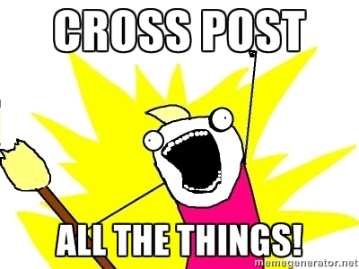

---
author:
    email: mail@petermolnar.net
    image: https://petermolnar.net/favicon.jpg
    name: Peter Molnar
    url: https://petermolnar.net
copies:
- http://web.archive.org/web/20140719175318/https://petermolnar.eu/blog/after-facebook/
published: '2014-05-01T20:27:20+00:00'
summary: I'm tired of all the social networks. I want to go back to RSS, forums
    and real communication instead of reading through tonnes of meaningless
    shit. And by the time you reach the point of being tired - not angry,
    upset, flooded, but tired - it usually means you really are about to opt
    out.
tags:
- internet
title: enough

---

<ins datetime="2014-05-05T15:06:19+00:00">
</ins>
UPDATE: My attention was driven to IndieWeb, so I might give syndication
another go, but I'll prepare my site better this time.

I'm tired of the social networks. I want to go back to RSS, forums and
actual communication instead of reading through tonnes of meaningless
shit. I want things out of my comfort zone, I want the posts and
comments to stay there, to be readable after years when I feel
nostalgic, the shared links to be searchable. By the time you reach the
point of being tired - not angry, upset, flooded, but tired - it usually
means you really are about to opt out. Or come up with something else.

## Why am I even using {x} ?

I've realized I'm using Twitter at least 90% only for tech news and
nearly all of those tech news are available via RSS. ( rss2email makes
it even more easier anyway. ). The rest is from a handful of friends,
about strange animals and abandoned places. I know how important Twitter
is in news spreading and what an incredible role it played in the Arab
Spring[^1] but for me, in Europe, in peaceful times, it's not vital to
have the news ***that*** fast. For that minimal amount I cannot replace
with an alternative source will be OK after the cleanup of tech part.

In LinkedIn's case I've already removed myself from groups and networks
a long time ago because LinkedIn sucks implementing them correctly. They
are overly noisy and most of them is extremely useless. Old-school
forums or StackExchange sites were designed for this, not LinkedIn.

Google Plus was terrible 3 years ago when I first gave it a go. It's
getting better but it still has a long way to go to be an actual
alternative. Although I think those who had enough of the
meaninglessness on Facebook will eventually end up on Plus, especially
since Plus is not the only product Google has, therefore they are not
forced to make it work in a way to favour money above all. But at the
end, it's going to end up the same, because after a critical amount of
ordinary people it's inevitable to be flooded with children pictures,
selfies and memes.

All the other I've tried ( DeviantArt, Pinterest, Flickr, etc. ) I've
given up a long time ago already on the social part. For just browsing
and looking at art, DeviantArt is still unbeatable. Instagram would be
very good for photographers, if only it wasn't restricted to mobile. Way
too slow & problematic to upload REAL photos rather then selfies.

Facebook is the problematic one. I'm getting less and less of those that
actually interest me. I mean do I really need to like every singe post
of my wife to have them on my wall? Really? I've tried convincing some
of my friends to move to something else - *anything else* -, since I
know most of them from an oldschool forum/news/etc "social network"[^2]
site which had been closed down for a while now. So far I've failed. It
seems that Facebook did an exceptional job to make people believe
there's no other way, since everyone is on Facebook, so why go anywhere
else for a smaller audience? Because you're being scammed[^3], that's
why, because their system is shit and not working reliably at all,
because it's impossible to read back even a few months, and all the
other reasons.

## An idea: centralize and cross-post all the things!

I have a WordPress site ( I had a website for nearly 15 years, old
habits die hard I guess ) so why not use it as a base publishing
platform and cross-post everything to everywhere? I fulfil the
requirement to be present everywhere, have a searchable backup and push
one button. And in this case, it would also be a good idea to import my
old things from everywhere to have it in one, safe, self-installed
place.

So I've downloaded a copy of my Facebook data[^4] and my Twitter
archives[^5] and I was stunned. The amount of meaningless things I've
thrown into these systems alone is massive; at least 60% is garbage and
probably shouldn't have been posted at all. The quality difference
between the archives is also interesting. Twitter offers a csv file of
all the tweets you ever added which is exceptionally useful in case you
want to import it or just simply store it. Facebook on the other side
has a bulk message HTML where you cannot even run a regex to get the
posts out and has a lot if posts as "Peter shared something via
\[service name\]". That's just ridiculous. Anyway, the import will
happen, but it will take a long time and it will serve the sole purpose
to have a backup of data I currently do not own or have any control over
it.

But the cross-posting did not work out. This was not my first try and
the outcome was the same both times. Since it's impossible to actually
interact according to the social site ( retweet, reshare, like, + ) it
becomes rather useless and feels like you're not interested in your
followers. *( Like you have an audience\[6\], but that's a story for
another day. )* It's flooding all the accounts you have and since you
probably share some of the same friends on all of them ( which should
not happen; there's no reason using different systems if I'm talking to
the same people ), they will get very tired of you very soon. And do I
really need to be heard, to be seen[^6] this bad?

So I dropped this approach and faced the reality: it's either not going
to change at all or I more or less
<del datetime="2014-05-01T18:24:38+00:00">go full retard</del> opt-out
and try to build *something else*. A bridge between old, semi-static
forums and the overcomplicated social networks.

[^1]: <https://en.wikipedia.org/wiki/Arab_Spring>

[^2]: <http://ld50.hu>

[^3]: <https://www.youtube.com/watch?v=l9ZqXlHl65g>

[^4]: <https://mbasic.facebook.com/help/131112897028467>

[^5]: <https://blog.twitter.com/2012/your-twitter-archive>

[^6]: <https://www.youtube.com/watch?v=sue_ufnvqcs>