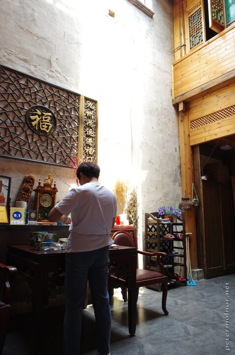
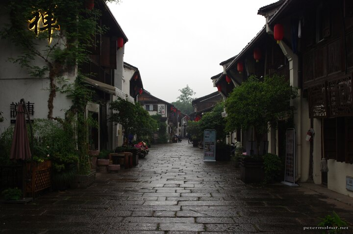

---
author:
    email: mail@petermolnar.net
    image: https://petermolnar.net/favicon.jpg
    name: Peter Molnar
    url: https://petermolnar.net
copies:
- http://web.archive.org/web/20201106192551/https://petermolnar.net/journal/anhui-zhejiang/
published: '2021-12-01T20:00:00+00:00'
summary: Someone asked my wife at her workplace to ok, 3 highlights of your
    trip to China" - I told her I would have responded with the title above,
    just to confuse people. Two minutes later I realised this is also a description
    of Cowboy Bebop.
tags: null
title: A corgie's bum, stairs, blues in the rain

---

*I'm long overdue with this entry. In 2019 we moved houses, and had
extensive amount of work to be either done or arranged. Then 2020
happened, and time vanished. At the moment - 244 March, 2002- I'm
finding myself completely motivation, so I'm forcing myself to finish
this: to remember there's a world out there, and that it's wonderful.*

Visiting the Yellow Mountains is a must for anyone practicing Chinese
brush painting - my wife had been learning it for 4 years by 2019, so
our next bi-yearly big trip became Huangshan, and it's surroundings.

## Hangzhou 杭州市

Our flight took us to Hangzhou, via Amsterdam. Flying with KLM paid off
(quite literally, see later), but travelling there as nothing special,
apart from long, long hours. Learning from our previous mistakes, we
skipped sleeping again, so there wouldn't be the problem of not being
able to fall asleep at night for days.

### West Lake 西湖

Finding our accommodation - [Best Wishes
Inn](https://www.booking.com/hotel/cn/best-wishes-inn.html) - was not
simple this time either, but eventually a taxi driver was able to locate
the destination. The place itself is lovely, with tea benches, and a
pinch of Japanese tea rooms, though it's a bit more secluded, than we
thought; finding eating out in the viscinity soon turned into a treasure
hunt.

Eventually we had a nice walked around the West Lake.

Our first roaming on foot made us realize that, like always, places on
the map looks a LOT smaller in Chine, than they are. The trouble was
that we couldn't rent a bike.

It turned out that since our last visit from 2016 basically everything
went Alipay. One can't sign up to Alipay with any European phone number,
and one can't simply get a SIM card in China that could receive SMS.
*(Data card, sure, no problem. Oh, you want to text and make phone calls
with a phone?! No. )* Without internet and without Alipay we couldn't
find any way to get two bloody bicycles.

Unlike in Chengdu, taxis seemed to be more expensive and had way less
availability. It took us unusually long times to get hold of one, so
that's not really an option either.

I heavily recommend planning to hire bicycles, unless of course you
already have Alipay. And data connectivity.

### Yun Qi Zhu Jing (Bamboo lined path) 云栖竹径

Prices:

-   entry ticket 8¥

## Huangshan

### Tangkoucun 汤口村

tea

dog

fish

\#\#\#Huangshan mountain 黄山

Prices:

-   entry ticket 190¥
-   bus, one way(!) 19¥
-   cable car - Guangguang ropeway - 100¥
-   cable car - Yuping Ropeway - 90¥
-   cable car - Yungu Ropeway - 100¥
-   total for one person: 518¥

### Jade Valley Scenic Area 翡翠谷

a.k.a Lovers' Valley, Emerald Valley

Prices:

-   entry ticket ¥

### Huangshan Hot Spring

Prices:

-   entry ticket

## Hóngcūn 宏村

\#\#\#Hóngcūn 宏村

Prices:

-   entry ticket

### Mukeng Bamboo Forest 木坑竹海

Prices:

-   entry ticket 40¥

## Hangzhou 杭州市 (part 2)

### Xiaohe Street Historic Block 小河直街历史保护街区

### Yongfu temple

Prices:

-   entry ticket
-