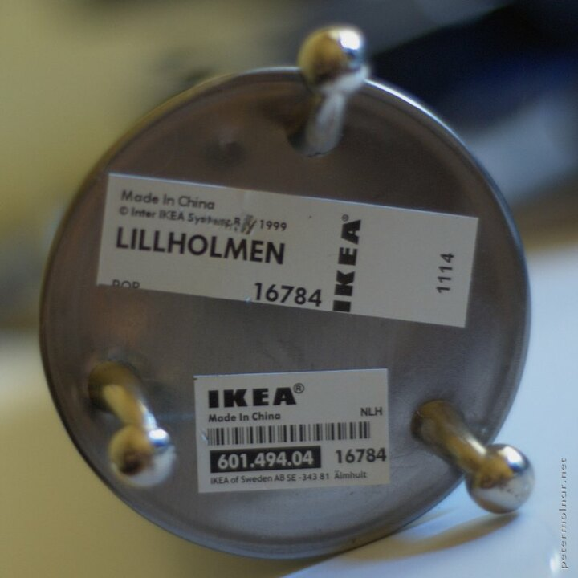
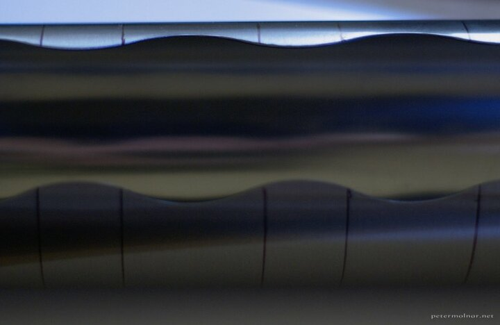
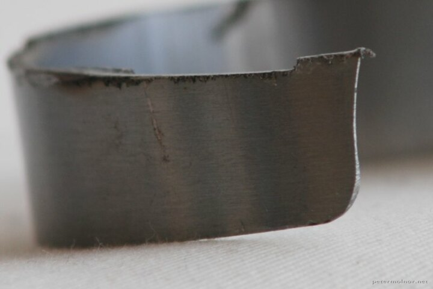
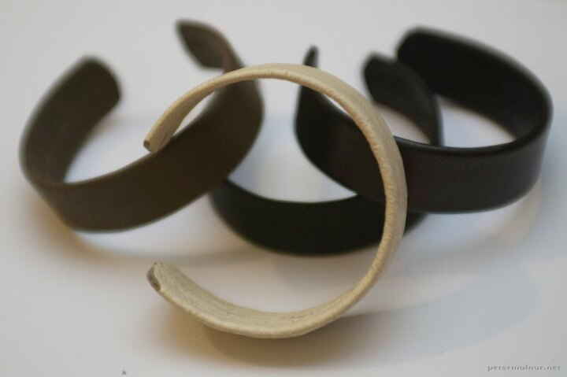
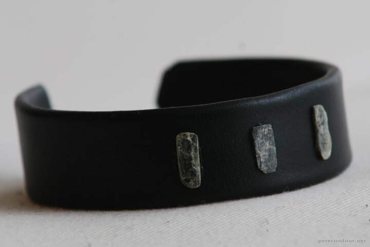

---
author:
    email: mail@petermolnar.net
    image: https://petermolnar.net/favicon.jpg
    name: Peter Molnar
    url: https://petermolnar.net
copies:
- http://web.archive.org/web/20141019205508/https://petermolnar.eu/journal/bracelet-from-ikea-lillholmen-cotton-pad-holder/
published: '2011-12-26T21:26:28+00:00'
summary: How to make a nice bracelet from an IKEA Lillholmen inox element.
tags:
- DIY
title: 'DIY: Bracelet from IKEA Lillholmen Cotton pad holder'

---

A few month ago we visited the local IKEA (I'm living literally 5 mins
walk from one) I came across with the Lillholmen cotton pad holder, and
the first thing came into my mind was that is has the perfect diameter
and shape to become bracelets for the women in my family.

## Required tools

-   1 piece of IKEA Lillholmen cotton pad holder[^1]
-   pliers
-   a good knife[^2]
-   Pattex Palmatex *( because it can stick on **anything** )*
-   Pattex Repair extreme *( transparent and flexible )*
-   angle grinder *(instead of angle grinder, you obviously can use
    anything that cuts inox, but this is the fastest)*
-   rasp and abrasive cloth

## Recommended materials

-   some slate pieces
-   wood crust
-   leather

## The process

Sign the cotton pad holder where you want to cut it. The best tool for
this is an waterproof marker and a paper line with the width of the
required bracelet, wrapped around the metal. After this put on your
safety glasses, protective gloves and earmuffs - in order for yourself
to get out of the cutting one piece - cut the metal into the required
pieces with the angle grinder. Use 1-1.5mm blade and be careful to
choose the blade for inox/metal.

The cut pieces will be full of burr, you really need to rasp these off.
For this, I'd recommend angle grinder with flap wheel first, rasp second
and abrasive cloth for the third round. Continue until you feel rough
edges anywhere, but be careful, the burrs are really nasty.

Once you've finished the rasping, you can decide what material will the
piece wrapped in. If you done the cutting and rasping nice enough, you
can leave it bare, but be careful because it can result metal allergy
alone. I decided to use leather for this purpose. The palmatex glue can
hold the leather to the metal, but clean the metal first with some
alcohol to get rid of the fat and dirt on it. I also added a little
varnish to the very ends in order to harden the leather, not to bend so
easily.

I wanted to cut patterns into the leather, but somehow it wasn't as nice
as I dreamed. I decided to add the ornaments from mica, slate, wood and
crust.

Mica and slate are special rocks: you can make very thin slices out of
it and also it is quite easy to form with a metal rasp and with the help
of some pliers. For wood, try to find some pine crusts: if you
cautiously carve it by helping the natural pieces to fall apart, you'll
get some purple-brown, beautiful pieces of wood.

For simple crust, but them into water for a few hours. Crust usually
becomes flexible by this and you can dry them into the form you desire.

## The result

[^1]: <http://www.ikea.com/hu/hu/catalog/products/60149404/>

[^2]: <http://www.olfa.co.jp/en/body/detail/77.html>