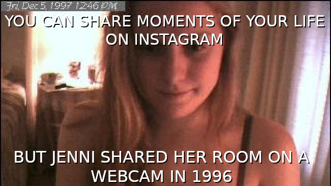

---
author:
    email: mail@petermolnar.net
    image: https://petermolnar.net/favicon.jpg
    name: Peter Molnar
    url: https://petermolnar.net
copies:
- http://web.archive.org/web/20190624125630/https://petermolnar.net/influental-articles-the-old-web/
published: '2019-01-18T13:00:00+00:00'
summary: A collection of articles I found influential on the topic of the
    early days of the internet, and my comments on why I found them thought-provoking.
tags:
- internet
title: 'Influential reads online: finds about the old Web'

---

### How the Blog Broke the Web

> Back then, we didn’t have platforms or feeds or social networks or…
> blogs.
>
> We had *homepages*.
>
> The backgrounds were grey. The font, Times New Roman. Links could be
> any color as long as it was medium blue. The cool kids didn’t have
> parallax scrolling… but they did have horizontal rule GIFs.
>
> <cite><https://stackingthebricks.com/how-blogs-broke-the-web/></cite>

This little piece stirred a maelstrom in my head, because it's damn
right.

The argument goes by this: before streams or feeds - chronological
ordering - websites had their own library system, invented and
maintained by the site owner. This resulted in genuinely unique sites,
not just on a theme level, but on a fundamental layer, as a reflection
of how their creators were thinking.

That said, there are, of course, valid uses for chronological ordering,
but for some content, maintaining a table of contents could make a much
better structure. Unfortunately making content machine-readable by hand
is painful.

It would be interesting to see a reprise of home page builders. Not a
by-default-a-blog, but an oldschool website builder, but with up to date
features in the background.

### Why Do All Websites Look the Same?

> The internet suffers from a lack of imagination, so I asked my
> students to redesign it
>
> <cite><https://medium.com/s/story/on-the-visual-weariness-of-the-web-8af1c969ce73></cite>

It ties in to the first one: most sites look the same, and that's not
how it's supposed to be.

It contains wonderful ideas on how a certain websites could look and be
completely unique, and, in my opinion, personal homepages should
consider putting energy and time (and a lot of swearing) into making
their online home truly their own as well.

### The Slow Web (plus: the modern experience of film-watching)

> We need a Slow Internet Movement along the lines of Slow Food and Slow
> Cinema, if we're really going to take advantage of the archival nature
> of the Web.
>
> <cite><http://www.rebeccablood.net/archive/2010/06/a_slow_web.html></cite>

I missed out on the golden days of the blogsphere. Not being a native
English speaker, being occupied with a community around 2007, and a
couple of other reasons contributed to this factor, so when I stumbled
upon Rebecca's site, I got reminded how wonderfully packed personal
websites used to be with text content. It's a joyful find, with things
dating back to 1999, and with a plethora of now completely dead links.

As for this very entry: yes. We do need a slow web, one, where content
is generated not for quick fame and likes, but for the love of the
topic.

### 404 Page Not Found - The internet feeds on its own dying dreams

> For with the collapse of the high-modernist ideology of style—what is
> as unique and unmistakable as your own fingerprints, as incomparable
> as your own body \[e.g. MySpace, Geocities pages\] . . . the producers
> of culture \[big Internet companies\] have nowhere to turn but to the
> past: the imitation of dead styles \[glitter graphics, Geocities\],
> speech through all the masks and voices stored up in the imaginary
> museum of a now global culture \[the whole internet\].
>
> <cite><https://thebaffler.com/salvos/404-page-not-found-wagner></cite>

A recent find - this is an article from 2019. A devastating, sour
summary, and a frightening reflection on an 1991 essay, describing how
recycled nostalgia eats the very thing itself. It also taught me the
phrase and the movemenet of vaporwave.

Every single time I try to revive or revisit something I missed out on
in the past - BBS systems, for example - I find that they were, in fact,
incredibly hard to deal with. They required deep understanding, you had
to build a serious amount of things yourself, and it took a long time.
While some aspects of this are wonderful - you'll certainly learn it for
example -, from another perspective, it's impossible to get people
involved if there isn't a simple way to start these days.

Recycling old things is not inherently bad, but in case of the internet,
there isn't a simple way to use them without overshadowing the original.

### why i’ll never delete my LiveJournal

> In truth, I like who I was on the Internet better when I was young and
> brash though I know not how to do that anymore (and wouldn’t want the
> burden of it, honestly). My LJ is a space I guard in defense of my
> younger, wilder, more whimsical self. To alter or destroy this place
> would mean losing a version of me with an honesty I can no longer
> afford.
>
> <cite><https://medium.com/@emroselarse/why-ill-never-delete-my-livejournal-3ef54bd904af></cite>

I never thought I'll find an article that summarizes feelings and
drifting thoughts on what is now lost from the internet. Being online in
the early 2000s meant to retreat from the world, it was another plane -
it was not a connected world yet, but a text-based reality, away from
the people you know in your physical existence.

It even touches an extremely important aspect: we need to be reminded
how we used to be, and an unchanged, or archived version of our ancient
journals or websites websites is a good start.

### Patient Zero of the selfie age: Why JenniCam abandoned her digital life

> "I keep JenniCam alive not because I want to be watched, but because I
> simply don’t mind being watched."
>
> <cite><http://www.news.com.au/technology/online/social/news-story/539cd1b26016fcee1a51cfca3895a7b5></cite>

In 1996, I was in elementary school, in Hungary, my English was enough
to understand 2 stupid dogs[^1] and some of The Real Adventures of Jonny
Quest[^2].

So when I bump into articles talking about a certain Aussie who set up a
non-stop webcam in 1996 about her life, it feels like a lightning strike
about things I never heard of.

I'm not completely certain why I wanted to add this to the entry. Maybe
it's because it feels like history is just sort of repeating itself, but
is becoming more smoke and mirrors with each iteration; maybe to
recognise that the early internet already pioneered most things that
became mainstream(ish) 20 years later.

Be more, or less, like Jenni? That is something to decide for everyone
for themselves.

[^1]: <https://web.archive.org/web/19990508175315/http://cartoonnetwork.com/doc/2stupiddogs/index.html>

[^2]: <https://www.imdb.com/title/tt0115226/>