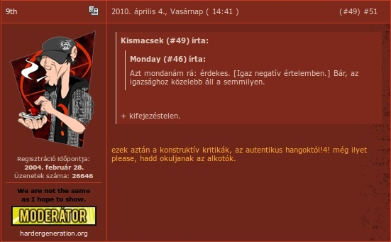

---
author:
    email: mail@petermolnar.net
    image: https://petermolnar.net/favicon.jpg
    name: Peter Molnar
    url: https://petermolnar.net
copies:
- http://web.archive.org/web/20141021003328/https://petermolnar.eu/journal/nested-comments-are-bad/
published: '2014-10-11T15:43:01+00:00'
summary: Nested comments are bad for you, for the article, for the discussion
    and for readability.
tags:
- internet
title: Internet, please forget threaded comments

---

> Early forum software used nested replies and some people still prefer
> this format. These are probably the same people who think you should
> still be able to buy leaded gasoline. - Why Vanilla Doesn't Have
> Nested Comments[^1]

In reality I see the opposite: relatively new things, like Disqus,
that's just recently been adopted widely, are by default, nested. And
this is not good for you, for the commenters, for the site - no one, to
be honest.

It's good for flames but one of the worst things that can happen to a
discussion.

## Threaded comments = shattered discussions

### Try read this thread

> \#1, a response for the article

> > \#2, a response for \#1

> > > \#3, a response for \#2

> > > > \#5, a response for \#3

> > > \#4, a response for \#2

> > \#6, a response for \#1

> > > \#8, a response for \#6

> > > \#9, a response for \#8

> \#7, a response for the article

> > \#10 a response for \#7

When you've reached \#6, would you remember what it was a reply for
without a quote, a name, without anything? No one would.

### Now try this

1.  \#1, a response for the article
2.  re\#1: (a response for \#1)
3.  re\#2: (a response for \#2)
4.  re\#2: (a response for \#2)
5.  re\#3: (a response for \#3)
6.  re\#1: (a response for \#1)
7.  \#7, a response for the article
8.  re\#6: (a response for \#6)
9.  re\#8: (a response for \#8)
10. re\#7: (a response for \#7)

## Why is it bad

### It goest against continuity

It is just impossible to read a thread with nested comments in order.
It's even worse if you want to find new comments, because you need to
read up which sub-thread it was a reply to.

### It breaks readability

Have you ever tried to figure out which comment is a reply to which in a
2+ level nested situation? The worst is when you want to follow more
than one subthread.

### From nest level 2, 99% of the comments have nothing to do with the original content

Flames, ideology war, anything can happen in those little subthreads,
any most probably none of them will have anything in common with the
original topic.

### Limited levels and/or limited screen size

Most of the systems have limited nesting capabilities, but the thread
might go on and on. After a while, they are forced to be on the same
nest level and everything falls apart.

## Solutions

### re, @reply, (username) **XYZ:**

Refer back to the actual comment in the text you're writing. It's
possible to be parsed so it can be highlighted, the referred user
notified, and so on. Twitter is a fairly good example for this:

<blockquote class="twitter-tweet" lang="en">
<a href="https://twitter.com/jtroyer">@jtroyer</a> <a href="https://twitter.com/etherealmind">@etherealmind</a> blogs.&#10;They might be re-named to <a href="https://twitter.com/hashtag/indieweb?src=hash">#indieweb</a> though.
- pmlnr (@petermolnar) <a href="https://twitter.com/petermolnar/status/519127523142430720">October 6, 2014</a></blockquote>
### in-text quotes

Quote from the original comment text you're replying to, making context
for the reply.

And... that's it. Keep it simple.

[^1]: <http://blog.vanillaforums.com/philosophy/why-vanilla-no-nested-comments/>