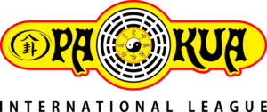

---
author:
    email: mail@petermolnar.net
    image: https://petermolnar.net/favicon.jpg
    name: Peter Molnar
    url: https://petermolnar.net
copies:
- http://web.archive.org/web/20190624125928/https://petermolnar.net/pakua-international-league/
published: '2019-04-24T14:00:00+01:00'
summary: There's a South American school growing around the world teaching
    ancient Chinese knowledge - or, according to the lovely online world,
    so they claim. I've now been learning it for while now, so here are my
    personal conclusions.
tags:
- life
title: Experiences with the Pa-Kua International League

---

***Note: this is not an official statement in any form; it's merely my
own, personal view and opinion on Pa-Kua.***

Eons ago I did ITF Taekwondo, followed by a some no-name branch of
karate, then ITF Taekwondo again, then years of medieval re-enactment
with swords and archery, then a few months of Yang style Tai-Chi,
including the martial aspect and their broad sword.

I did the Tai-Chi for the shortest time, but left a forceful impression
on me - mainly due to my teacher, Johnny Burke[^1], because it felt
whole; it radiated out into my everyday life. Karate was rather
mindless, Taekwondo was way too competition oriented, re-enactment was
fun for a while, but soulless, especially after knight fights became a
thing. Unfortunately Johnny left Mei Quan, and I left London and
Tai-Chi.

In 2017, as a company summer program, someone organised oriental archery
for us. This lead me to Pa-Kua[^2] and their traditional Chinese
archery. There is a Hungarian man, Lajos Kassai[^3], who also made his
own research in the 80s, in order to revive ancient Hungarian horseback
archery, and to create a version of the recurve bow they used to use. I
met people following his teachings and it shows vast similarities to the
archery Pa-Kua teaches. Around 2009[^4] China started to popularise folk
archery as well - there are now people writing about and practising
reprised Manchurian archery[^5], which also shares common techniques.
While it's not the same, I have no doubts that of the archery of Pa-Kua
works, and that is a Chinese style archery.

Soon I joined their martial art classes as well; occasionally acrobatics
and weapons.

There are countless wushu movies out there indicating there is, or there
used to be, more to kung fu than movements: acupressure points, healing,
philosophy, sometimes religion, and so on, but it seems like during
their way out of China, many of these aspects fell off, and the world is
now left with fighting styles without their foundation. There are
exceptions - such as the aforementioned Mei Quan Academy of Tai-Chi in
London, or, in my opinion, the Pa-Kua International League. I've
mentioned archery, martial art, and weapons, but it also teaches Chinese
medicine, massage, acupressure, acrobatics, etc., so unlike a
traditional dojo, it offers a lot more.

## FAQ

### Is Pa-Kua a Chinese martial art?

Pa-Kua split it's teachings into disciplines. Some of these are based on
traditional Chinese knowledge (energy, reflexology); others are
infusions of mainly Chinese and other far Asian practice (acrobatics,
edged weapons, martial art, sintony, cosmodynamics); yet others are
mainly results of historical reconstruction (archery); whereas some are
completely modern, for modern times (rhythm).

The main influence of martial arts discipline - based on the actual
elements being taught and some personal research - is certainly Chinese,
but not strictly one specific Chinese style.

### I saw videos calling Pa-Kua fake.

During the past decade some people embraced the idiotic stand that MMA
is the only efficient martial art. MMA is training gladiators.

Traditional martial arts was meant to be a way to kill fast and
efficiently. They changed since, especially internal styles. Would
Pa-Kua be efficient against MMA? No, it probably won't. It's not the
goal. It's not a hard, competition style; you should be comparing it to
Xingyi, Bagua, Tai-Chi, and the other, mainly internal styles instead.

The goal is to practise, to find your balance, learn to control one's
self in every aspect, both physically and mentally.

Going a bit further: the authenticity of a martial art is a whole
spectrum of turmoil. A lot of Chinese styles were nearly wiped out first
in the 17th century, then in the mid 20th century. People tried to keep
them alive, some of them by passing it strictly within a family - this
resulted in hundreds, if not thousands of streams of a formerly
organised styles[^6]. It's not that surprising not to be able to find
someone based on a pinyin version of a Chinese name on Google, but it
doesn't mean they never existed. Many villages in rural China only got
electricity 10-15 years ago, let alone the monasteries in the mountains,
and I seriously doubt historical paperwork was digitised at all. (I've
been to villages and monasteries like this.) *This problem goes way
beyond this by the way; finding translated Chinese knowledge is a
massive pain, let alone origin stories in a world where history is quite
flexible.*

The best option you have it go decide for yourself. Go; meet some
actually high belts; talk to them, train with them. See what and how
they teach, and decide for yourself.

### I've heard that Pa-Kua is just a pyramid scheme.

When it comes to belts and ranks, it's an organisation.

The international school needs funding, and knowledge needs people who
can dedicate their lives to teaching and research. Since there is no
membership fee, all the activities that are controlled by the school -
progress with belts, intensive courses, etc - are paid directly to the
school who distributes it they way they want to. It's not that different
to non-profit organisations.

Local practices are completely in the hands of the leading
instructor/master. You pay them directly, they rent/own the building,
etc. That is just like and standard dojo.

### Pa-Kua has Japanese uniform, so it can't be Chinese!

If you judge a school based on their clothing, you're doing it wrong.

Buying Chinese silk robes was a hard stunt anywhere before aliexpress,
so I'm not going to blame anyone for utilising something more widely
available - the karate gi.

### Pa-Kua teaches katana, so it can't be Chinese!

Everyone knows that the katana is a Japanese weapon. What people don't
know is that China had a lot of very similar weapons in the family of
*dao* swords: changdao, dadao, zhanmadao, wodao, etc[^7].

Yes, for practical reasons, Pa-Kua utilizes katana-like blades[^8]; the
historical similarities between weapons allows it do so. The differences
between these weapons are tiny, and katanas and bokens are far more
accessible - and cheaper -, than, for example, a wodao.

As you progress, the weapons practice will soon incorporate knife(s),
spear, baguadao, jian, etc. as well.

As I mentioned at the beginning, I did European medieval re-enactment
for years, and my main weapon was one handed straight sword. Boosted by
this I took a jian course at Pa-Kua and I have to admit, it's a
ridiculously different weapon, and it's extremely hard to handle. There
are good reasons why it's at higher levels. The katana-like weapons are
much more straightforward to learn - not to master, just to learn -,
which is probably the reason why the school decided to start with those.

### Is it true that you can buy (black) belts in Pa-Kua?

If you've done some kind of martial you've been conditioned to identify
a belt with a certain degree of capability, and that to achieve a belt,
you need to pass a physical exam, with clearly defined requirements.

Here, the belts are mainly theory-indicators. They show what can safely
be taught to its wearer and what things the wearer knows in theory
already. It's completely normal if a green or grey belt Pa-Kua
practitioner has never done a full contact fight.

You can achieve these belts through intensive courses. These are face to
face trainings with multiple masters in a dense timeframe. You will most
probably lack practice, but the theoretical knowledge will be there.

So the short answer: no, you can't simply buy belts, but you might be
allowed to participate in intensive training to learn faster.

### I'm not convinced.

If you're looking for something extremely orthodox, rigid, and stict the
school is probably not for you. Similarly, if you want to fight, beat
people, do hard contact, train with ex-soldiers, it's probably also not
the place.

I met a few of the regional leaders, and they definitely have a wide and
interesting knowledge. To access this knowledge, you need to pay. This
may not be the ideal, imagined way of learning, but it's always been
like this, and making money from teaching is never easy[^9].

## Summary

The Pa-Kua International League is not simply another martial art dojo:
it offers a broad knowledge that used to accompany martial arts.

Did it start out as a fake? I’ll never know. But in that 40 years since
it's establishment it grew, and today there's a lot of proficiency
within the school.

It's not strictly Chinese and has other far Asian influences.

It's expensive compared to other schools, and there are ways to progress
mainly on theoretical knowledge, but you always get something for your
tuition fee.

Belt colour doesn't indicate the same thing as in most Westernised
martial arts.

The martial arts discipline is an internal style. Do not expect contact
fights early on.

Every single high ranking member I met was talented and had a lot to
offer. However, their main focus may not be martial arts, due to the
split across disciplines, so don't judge anyone just by their martial
arts skill. There are, and always were, scholar monks as well.

I'd encourage to try the whole spectrum of Pa-Kua: taste every
discipline and get the full picture. Only after that decide if it's for
you or not.

If you disagree, agree, want to discuss, have questions, spotted a
mistake, feel free to get in touch with me; contact options are at the
bottom of the page.

[^1]: <https://schoolofeverything.com/teacher/johnnyburke>

[^2]: <https://pakua.com>

[^3]: <https://en.wikipedia.org/wiki/Lajos_Kassai>

[^4]: <http://www.chinaarchery.org/archives/94>

[^5]: <http://www.manchuarchery.org/photographs>

[^6]: <http://thelastmasters.com/a-few-thoughts-on-emei-mountain-kung-fu/>

[^7]: <http://www.ancientpages.com/2018/09/19/deeper-look-into-chinese-swords-throughout-the-history-of-the-dynasties/>

[^8]: <https://medium.com/@osergionauta/pa-kua-e-o-estudo-dos-sabres-chineses-e79b1baca413>

[^9]: <http://time.com/4587078/kung-fu-martial-arts-hakka-hong-kong-preserve/>