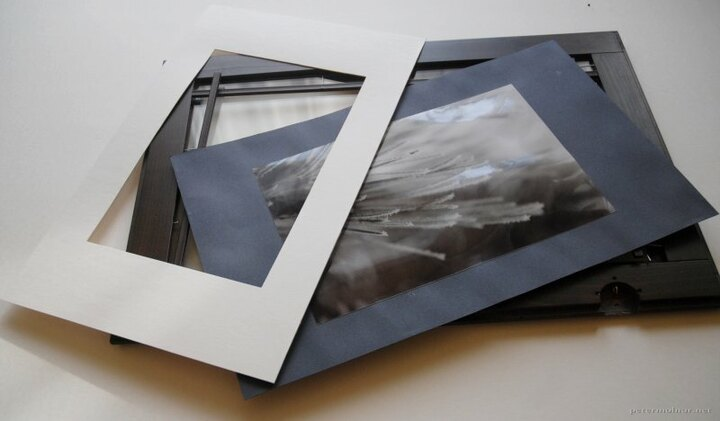

---
author:
    email: mail@petermolnar.net
    image: https://petermolnar.net/favicon.jpg
    name: Peter Molnar
    url: https://petermolnar.net
copies:
- http://web.archive.org/web/20141019205423/https://petermolnar.eu/journal/picture-frame-from-ikea-cupboard-window/
published: '2011-12-29T10:00:14+00:00'
summary: Cupboard frame for $2, what would you make out of it? Picture frame,
    obviously.
tags:
- DIY
title: 'DIY: Picture frame from IKEA cupboard window'

---

The local IKEA has a "sale" part, where you can get the disassembled
exhibited furniture parts for pennies. I've found a glassed-window here
once, and first idea was to create a picture frame out of it.

Unfortunately, the newer ones are glued, this was nailed on the back, so
it could be disassembled and put back together without too much effort.

## Required tools and materials

-   a good knife
-   board paper (thin)
-   glue spray or equivalent
-   hammer

## The process

Turn the window around and pull off the "positioners". Be careful: the
nails are tough, they can easily break out from the plastic. Be patient
and watch for a good order in the process.

Get the glass out, and cut a similar size out of two board papers. One -
a thinner - is going to be needed to be the bearer of the picture, the
other will be the inner frame.

Glue the picture you'd like to add onto the middle of the supporter
board.

Cut the size of the picture (or a bit smaller, about 5mm smaller on each
side) out of the middle of the other board, which is going to be the
inner frame.

When the glue had dried put it all together: glass, inner frame,
supporter with the picture, and put the positioners back also. Hammer
the nails back carefully.

Reel to picture frame hooks into the original place of the hinges, and
you're done.

## The result

{