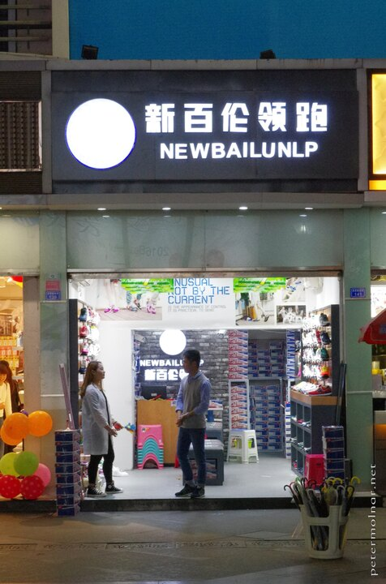
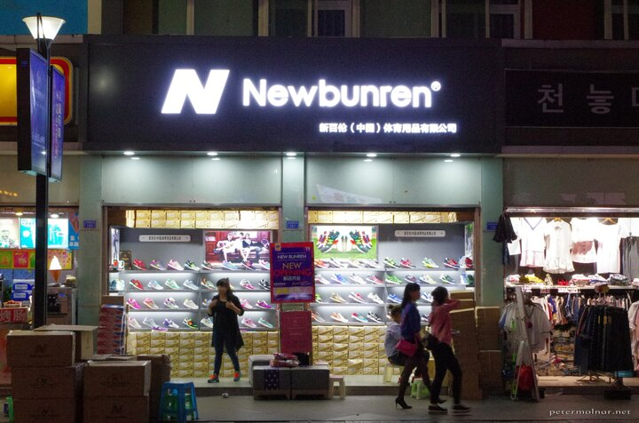
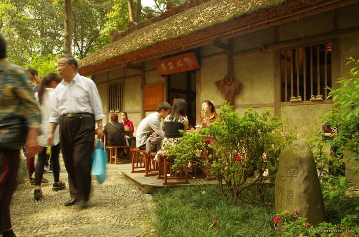
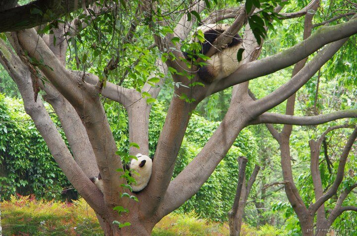
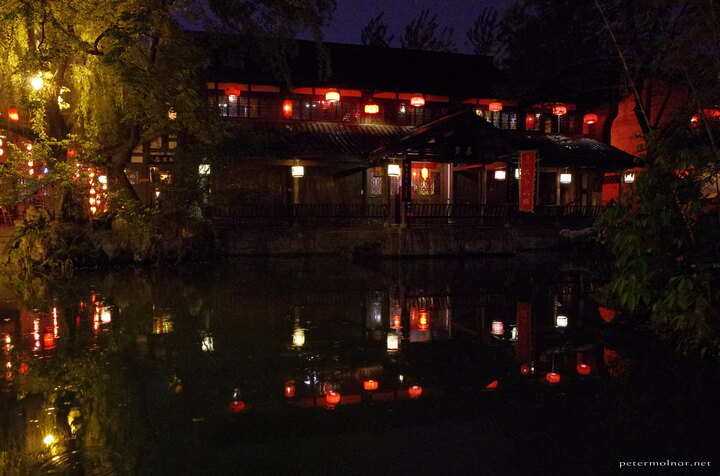
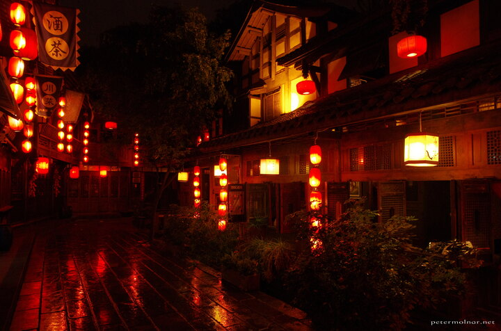
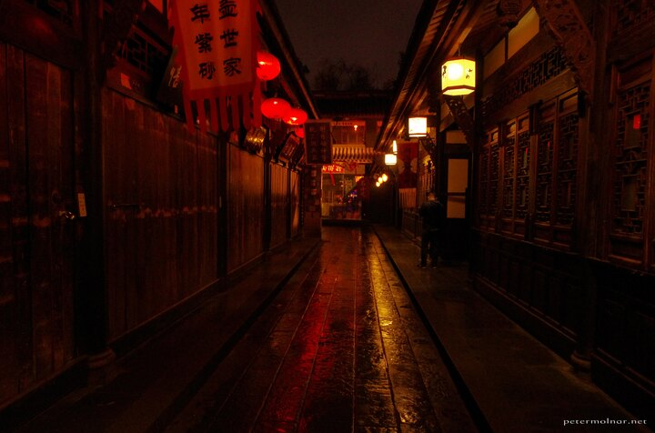
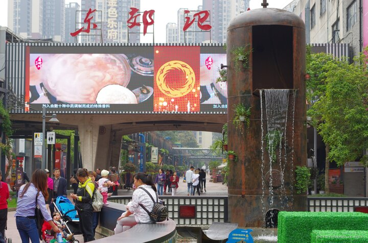

---
author:
    email: mail@petermolnar.net
    image: https://petermolnar.net/favicon.jpg
    name: Peter Molnar
    url: https://petermolnar.net
copies:
- http://web.archive.org/web/20160709135327/https://petermolnar.eu/sichuan-chengdu-2/
published: '2016-05-05T18:00:00+00:00'
summary: There are places you know you want to go back to, and there are places
    you have to go back to, because you loved it and you missed too many things
    to see there.
tags:
- travel
title: 'Another 2 weeks in Sichuan: Chengdu revisited'

---

The previous[^1] two[^2] weeks[^3] there[^4] was just barely enough for
about the half of the places we wanted to visit, so it was easy to
justify revisiting a place - besides, we were still fond of the memories
from Chengdu.

## The flight

This time we'd flown in a Dreamliner[^5] - it was nice, airy and
comfortable. While the electrically darkening windows are cool, they to
remove your option of peaking out when the crew sets them to dark
centrally. One other thing I disliked: the media center screens. No
privacy filter, very bright, so a nightmare for those who'd actually
want to get some sleep; but in the end, not getting any sleep helped a
lot preventing the jetlag; this time, it was much less of a pain.

I had some wonderful sights outside: finally it wasn't always cloudy.
We'd flown on a surprisingly northern route, but I could not see the the
Ural Mountains. These ones I think were somewhere around the Altai
Mountains.

## The city

Chengdu is still lovely, although first it was too warm, too sweaty and
way too humid after months of English winter, which is 0-6 °C for a long
while. This time I counted the floors of a few buildings: 40-50 floors
are the most common.

Unlike the nightscapes in Europe, nightscapes in China are hard. There
will be no straight white and red lines of car lights in Chendgu :)

In Chengdu, most of the things, especially the shopping oriented areas,
are open till 22:00, so late night shopping is by default a thing. I
believe there is at least one street like this in every major city in
the world, but unlike the usual, there were much more local brands
present here.

For some Hungarian friends: there are constants in our world. Adldas,
Rebuk, ah, the good old days. 

And of course, there are less developed streets, just like in every
major city. 

## Baihuatan Park 百花潭公园[^6] {#baihuatan-park-百花潭公园6}

We've been to this park on our previous trip and we enjoyed it well
enough to know, it's not crowded and there are many things to see.
Indeed: this time the bonsai garden was open, and we could take a look
at some magnificent miniature trees - until Nora[^7] spotted the Chinese
landscape painters in one of the corners and decided to watch them for a
while, in case she can get a glimpse of some special techniques.

If you're just arriving in Chengdu and you want some nature, cool
climate and not too much of a crowd, I can highly recommend this spot.
It seems many young creatives prefer the park as well.

## Du Fu Thatched Cottage 杜甫草堂[^8] {#du-fu-thatched-cottage-杜甫草堂8}

Inside a city of 14 million, there is a rather large park, hosting a
cottage, that was rebuilt numerous times (with original materials, the
same way it was) since \~700BC. It is said to be the former residence of
Du Fu, a well known ancient poet of China.

Unfortunately we went there on a weekend, and during weekends,
everything can get seriously crowded in Sichuan. Apart from that, this
is a rather pleasant place and the cottage does look like a thing from
those Chinese movies from the ancient times.

One of the smaller buildings host options for tasting teas. Without
knowing what to expect, we joined and instead of tasting the regular
green tea, we went for pure jasmine flower tea and another tea, which I
forgot the name of. The jasmine tea is much lighter and tastier than I
expected and the tasting was unique and atmospheric in a traditional
cottage.

## Pandas again

There is no Chengdu without pandas! They are still an absolute cute
overload: real bears ( with all the claws, muscles, everything ) lazy
enough to decide that they rather eat grass ( bamboo is a big grass
after all ) instead of hunting.

And the red pandas. I didn't know, but originally they had the name of
panda - the big black and white one only got it's name decades later.
This time we could enter an area where you walk into their territory, so
we could see them pretty close - just to realize again they act like a
mixture of cats and bears, so the alternative name of firefox is fairly
accurate.

## Jinli Ancient Street 锦里步行街[^9] {#jinli-ancient-street-锦里步行街9}

Last time we simply couldn't find this place; it turned out that due to
issues with maps vs. GPS there, we were looking for it surprisingly far
away from the actual entrance. According to the written mentions, this
street had been here for 2200 years and it's always been a shopping
mall-like entity.

Unlike most places, we came here twice: our first visit was on a weekend
- not a good idea. Therefore when we were back in the city, we gave it
another go, visiting it on a rainy weekday evening: trust me, it's much
better, and looks pretty much like a scene from Spirited Away.

One important things: even though Sichuan food is expected to be spicy,
the snacks here are burning. Be careful :)

**Nora[^10] captured the feeling of Jinli at night much better than I
did, so please check her gallery as well.**

## Chengdu Shu Brocade and Embroidery Museum[^11] {#chengdu-shu-brocade-and-embroidery-museum11}

The only museum we decided to check - it's much harder to find than we
expected - was a museum of silk, brocade and embroidery, because
according to the legends, Sichuan is the origin of silk. It's a nice
museum, just the right size, with some working, extremely complicated,
authentic, made of silk and bamboo machinery to create brocade.

## Eastern Suburb Memory 东郊记忆[^12] {#eastern-suburb-memory-东郊记忆12}

We got a trip from a friend we met in Cambridge to check out the Eastern
Suburb Memory but we had no expectations. After being there I looked up
a few reviews, and came across this line: "A Memory of Soviet-Style
Communism and A Cosplayer Gathering Place"[^13]. It perfectly captures
the base feeling of the place, but it's much, much better live.

When you look at the style of 1960s industrial building of anything
somewhat connected to the Soviet Union, you'll see not just patterns but
exact same looks. This particular place used to be a cathode display
factory - now it hosts art places, pubs, dance halls, a huge outdoor
stage, numerous coffee houses - and it's all soaked in anime figures and
cosplay clues.

If you're from Hungary, and you're a bit of a nerd, this will feel home.

 (here: [^14])

## Wen Shu Fang 成都文殊坊[^15] again {#wen-shu-fang-成都文殊坊16-again}

We still love this place, but this time, instead of taking numerous
photos, we enjoyed a nice tea in the vegetarian restaurant of the Wen
Shu Monastery.

## Notes

### Public transport and metros

Earlier we didn't use any public transportation - apart from the trains
-, but this time we did make great use of the metros. They are air
conditioned, clean, quiet, new, and cheap, so if you destination is on
the line, use it. Price wise: 5 yuan for \~1 hour of run from one train
station to another for a single ticket, one person.

[^1]: <https://petermolnar.net/sichuan-chengdu/>

[^2]: <https://petermolnar.net/sichuan-jiuzhaigou-huanglong/>

[^3]: <https://petermolnar.net/sichuan-shunan-bamboo-sea/>

[^4]: <https://petermolnar.net/sichuan-mount-quingcheng/>

[^5]: <https://en.wikipedia.org/wiki/Boeing_787_Dreamliner>

[^6]: <https://www.tripadvisor.com/Attraction_Review-g297463-d546619-Reviews-Baihuatan_Park-Chengdu_Sichuan.html>

[^7]: <http://norahamucska.eu/>

[^8]: <https://www.tripadvisor.com/Attraction_Review-g297463-d488516-Reviews-Du_Fu_Cottage-Chengdu_Sichuan.html>

[^9]: <http://www.cometochengdu.com/index.php?app=article_viewer&action=view&id=655>

[^10]: <https://norahamucska.eu/chengdu-nights/>

[^11]: <http://www.sichuantravelguide.com/chengdu/attractions/chengdu-shu-brocade-and-embroidery-museum.html>

[^12]: <http://www.cometochengdu.com/index.php?app=article_viewer&action=view&id=20>

[^13]: <https://www.tripadvisor.co.uk/Attraction_Review-g297463-d2411494-Reviews-Chengdu_Eastern_Memory-Chengdu_Sichuan.html>

[^14]: <https://www.openstreetmap.org/#map=18/30.6712377/104.12088>

[^15]: <https://www.tripadvisor.com/Attraction_Review-g297463-d5302983-Reviews-WenShuFang_Folk_and_Culture_Street-Chengdu_Sichuan.html>