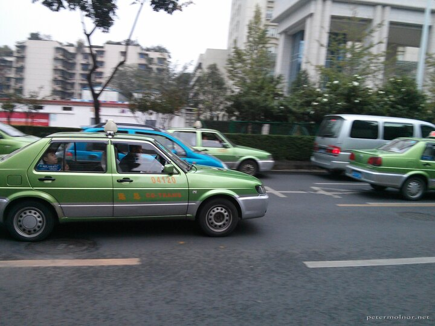
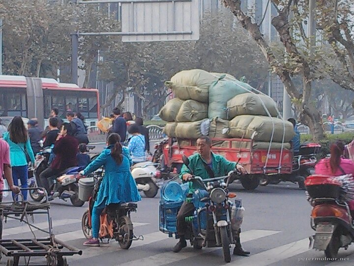
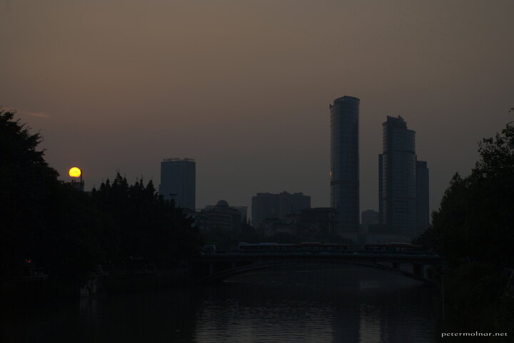
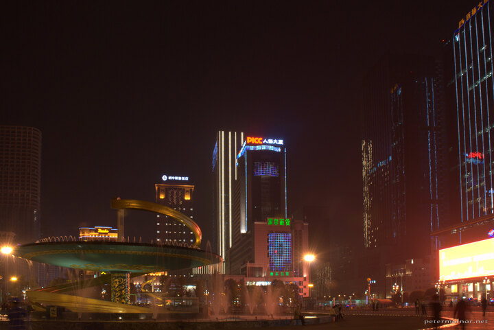
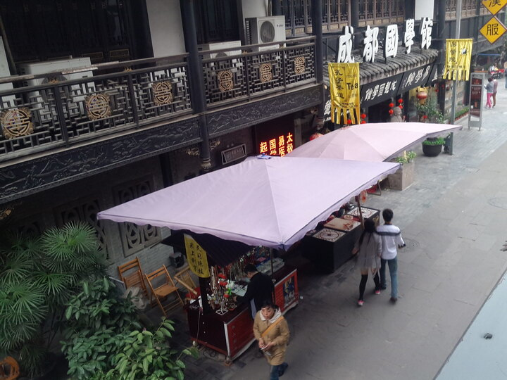
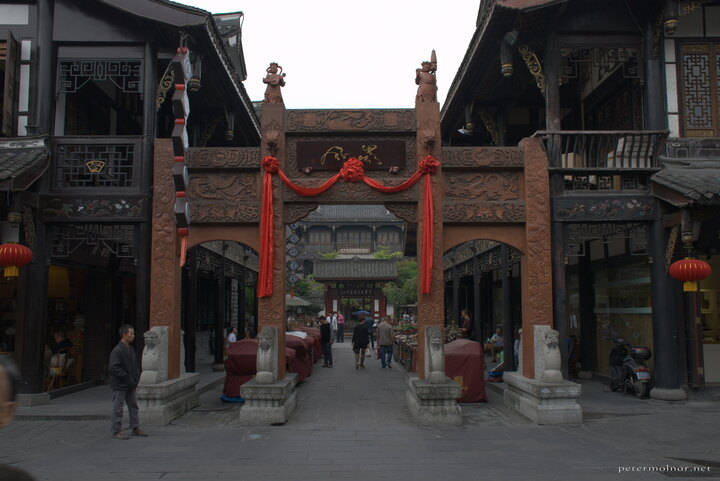
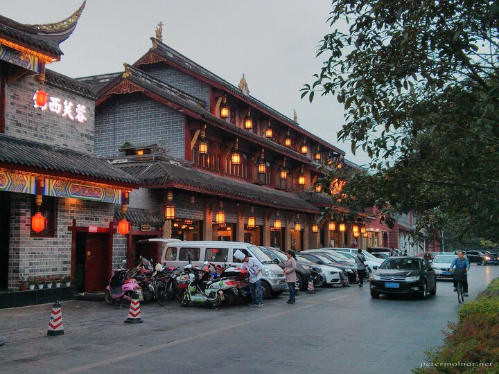
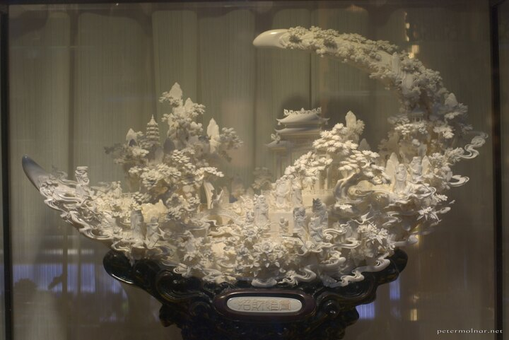
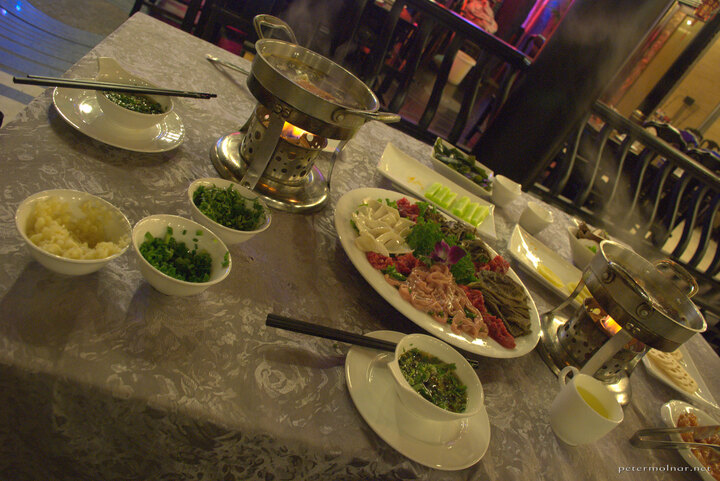
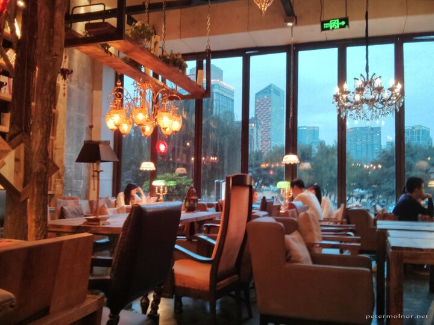

---
author:
    email: mail@petermolnar.net
    image: https://petermolnar.net/favicon.jpg
    name: Peter Molnar
    url: https://petermolnar.net
copies:
- http://web.archive.org/web/20141206131519/https://petermolnar.eu/journal/sichuan-chengdu/
published: '2014-11-22T13:19:12+00:00'
summary: Tales of Chengdu, our base city, the capital of Sichuan.
tags:
- travel
title: '2 weeks of Sichuan: Chengdu ( 成都 )'

---

Chengdu[^1] is the capital of Sichuan and the 4th largest city in China.
The 14 million inhabitants for a European sounds frightening, yet the
streets are clean, the smog is not too bad and the roads are
surprisingly airy.

We chose this city because there is a KLM flight from Heathrow ( change
at Schipol, Amsterdam ), and it "only" takes 12 hours all together. *And
only 3 hours of this is above Europe!* By the way, KLM is brilliant for
long flights. The food is good, the standard economy seat size is
tolerable and the entertainment system has some quite new films.

At the airport a smiling man approached us with some words of English
knowledge if we need a taxi. We did, so we accepted a bargain to bring
us to our hotel - not taking the advice to use only the real taxies. We
became pretty nervous when after about 2 minutes of driving he asked us
to change to a different car. I immediately started tracing our route if
we were going towards the correct directions of the hotel, but it all
turned out to be OK; we reached the hotel and everyone was happy. I'd
still recommend taking the an official taxi instead, they are easy to
spot.

The traffic is shocking. Not because of the jams or the amount of cars,
no. Shocking because of its randomness, its chaotic dance, where
everyone is going at the same time to all the possible directions - but
even in this chaos I did not see a single accident, nor a serious
traffic jam. Flow with the others, that'll help. All the scooters we saw
in Chendgu were electrical, so no sound, no smell, but do get used to
the "hey, I'm here" type honks. Scooters and bicycles are technically
pedestrians; and cars always go first. They are stronger.

This city is very easy to like. Not really to love it, but to like it:
it looks liveable, people seems to be happy and there's always something
going on. Not in the European way; not hidden, secret clubs and
happenings but collectively, on the street. Like dancing in the People's
Park, for free, together.

## Chengdu Research Base of Giant Panda Breeding[^2] {#chengdu-research-base-of-giant-panda-breeding1}

Chengdu is one of the very few places in the world with a Giant Panda
research centre. Yes, they have pandas. Adults, cubs, babies, and red
pandas as well.

The place itself is beautiful, it's approximately 20km from the city
centre - *meaning the taxi should not cost more, than 50¥, so don't
accept the 80¥ ride like we did*. There are lots of bamboos inside, with
nice paths and a lot of space for the pandas. And pandas.

One adult was called by its keeper for food; when he got it, he sat
down, put the food on his belly and ate if from there - he managed to
eat without raising a hand. I've never seen any creature being this
lazy.

## Wenshu Fang

Wenshu Fang is an ancient-ish part of Chengdu. Some buildings are
original, but all look very authentic, giving you the experience of the
"romantic" Chinese era. There are lots and lots of traditional art
shops, with hand crafted souvenirs, restaurants, tea houses - all you
might expect from a place like this.

Right at the centre of this quarter there is a hotel, the Buddha Zen
Hotel[^3], which is usually heavily booked. Even if you can't book a
room, they have a traditional spa: wooden baths ( covered with a thin,
plastic sheet for hygienic reasons ) with herb water and Chinese massage
that can do miracles to your tired body. Their food is also great.

On our last day we revisited this area to buy some brushes for Nora. We
found a little alley we have not seen before and a calligraphy shop with
a lovely storekeeper. From out of nowhere he asked us ( he used his
computer to translate ) if we'd drink a tea with him - we accepted. He
then guided us through an hour of tea tasting with lovely, tiny pots and
cups, getting the tea out of the safe (!) and even giving us a bit of
the best tea he had as a gift. We learned that there are significant
differences between spring, summer and autumn tea and the one we got the
gift from was the mixture of these three: the Morning Breeze of the
Mountain.

## Wenshu Monastery[^4] {#wenshu-monastery3}

This place is a working Buddhist Temple. Right after you step through
its gates, the noise of the city disappears and the only sound left is:
birds tweeting. It's one of the most peaceful, most beautiful places
we've seen so far.

## Qingyang Taoist Temple[^5] {#qingyang-taoist-temple4}

On day 3, we wanted a light day, so the only place we visited is a
large, Taoist temple. Surprisingly it is very far from the regular,
European meaning of a temple; it's rather a small, ancient town. It's a
nice place and has a special feeling and if you keep your eyes open
you'll realize there is a temple for every zodiac in the Chinese
astrology.

To be honest, we fell asleep this afternoon; jet-lag will eventually
kick in.

## Wide and Narrow Alley[^6] {#wide-and-narrow-alley5}

Apart from Wenshu Fang, there are some other revived antique parts of
Chengdu, including the Wide and Narrow alleys. The tourist density is
much higher here than in Wenshu, but it's still a nice place. There are
plenty of street-food-snack sellers and it's quite nice.

There is a big, wide road ( Qintai Road ) very close to this area with
very expensive restaurants and Sichuan Opera places and with some
extremely expensive but interesting art pieces.

## Hot Pot with mini Sichuan Opera

Nora wanted to visit an Opera, but to be honest, I was a bit afraid of
potentially hurting, high-pitched singing. Accidentally we learned that
many of the hot-pot places ( which we also wanted to try ) offer and
additional, mini-opera with the meal - and the whole thing was 75¥ per
person! The opera is not what I was expecting: it's a mixture of
different, short plays, including: singing, musical instruments,
dancing, fight-like plays, a special tea "ceremony", where the teapot is
used just like a sword and a bit of the world-famous Sichuan face
changing[^7]. The hot pot is a bowl of spicy, empty soup with a lot of
raw food around it ( offal, vegetables, lotus root, etc. ). You have to
brew it according to your own taste, right in front of yourself while
enjoying the play in the back.

The man playing the violin-like instrument played tones that again
reminded us some Hungarian tones.

## Footnotes

### Language

The are very, very, very few people speaking English. We met a few in
Rhombus Fantasia Hotel[^8] who spoke nearly fluent English, but do not
expect it at all.

Bring a smartphone or a tablet with Google Translate[^9] and
**Simplified** Chinese offline package[^10]. We did not know that the
Simplified is the official and many of those we met had trouble reading
Traditional. *Privacy fighters: Google Translate app does not need the
Google Framework or Play Store or a Google account.*

In case they want to reply, they will grab their smartphones and go
online for a translator app :)

### Taxies

If possible, always take the official taxies - *white-green in Chengdu,
and white-blue in Jiuzhaigou* - because the work on actual distance
bases. 2014 October prices: 8¥ base price including 2km, 1.90¥/km after.

If this is not possible, you have to bargain. They will always say a bit

-   *sometimes much* - more than they should, depending on the place
    you're trying to get the taxi at. Once you agreed on the price, you
    cannot change it. Tipping is optional, but very appreciated. *Don't
    expect receipt.*

Don't accept bargains within Chengdu unless there is no other option at
all - this includes the airport and the Panda Research Center. If you
pay by km it will be better for you.

Bargain example: they ask for 100¥: offer 80¥; they will accept it and
everyone is happy. Do not over-bargain; they will not take you.

### Food

The food is great, but do follow one important rule: follow your nose.
If it smells good, it's good.

### How to get coffee?

There are a few Starbucks and McDonald's' around, otherwise coffee is
extremely rare and surprisingly expensive. There is hope though: at the
bottom of Somerset Riverside Hotel[^11] there is an authentic Dutch
coffee house, named Maan's Coffee. You can also get some waffles with
ice-cream here ;)

### Computer City[^12] {#computer-city11}

There is a junction with some massive buildings filled with any kind of
computing and photography related electronics. It's very different from
the European stores.

### Beer and nightlife

At the foot of Anshun Bridge there are lots of small clubs; many of them
offer live music and import drinks. They are **expensive**. A small
bottle of Heineken was priced 200¥. ( Yes, you read it right, it's
approximately £20 ).

### The police

When we arrived back from Jiuzhaigou a photographers backpack was left
at the point we got off the bus. Taking some photos ourselves we
understood how hurting it would be to loose our bags, so we decided to
take it to the bus station, to the lost luggage section. Since we had no
idea what to actually do with it - and to avoid any potential trouble -
we approached two police officer and showed our tablet with the
translation of what happened. For our big surprise, one of them switched
to a perfect English and told us that he's a traffic officer, but he can
show us where to go and drop the bag off at. He was very polite and
looked very happy that we turned the backpack in. *He was also
impressively tall compared to the locals.*

[^1]: <https://en.wikipedia.org/wiki/Chengdu>

[^2]: <http://www.travelchinaguide.com/attraction/sichuan/chengdu/panda-breeding-and-research-center.htm>

[^3]: <http://www.booking.com/hotel/cn/chengdu-buddhazen.en-us.html>

[^4]: <http://www.chengduplaces.com/listing/wenshu-temple/>

[^5]: <http://www.travelchinaguide.com/attraction/sichuan/chengdu/qingyang.htm>

[^6]: <http://www.travelchinaguide.com/attraction/sichuan/chengdu/wide-narrow-alley.htm>

[^7]: <https://www.youtube.com/watch?v=BV3AyvlrH3s>

[^8]: <https://www.booking.com/hotel/cn/rhombus-chengdu.html>

[^9]: <http://esk1989.store.aptoide.com/app/market/com.google.android.apps.translate/30000305/7392982/Google%20Translate>

[^10]: <http://www.cnet.com/uk/how-to/use-google-translate-offline-by-downloading-language-packs/>

[^11]: <https://www.booking.com/hotel/cn/somerset-riverview-chengdu.en-gb.html>

[^12]: <http://www.chinatouronline.com/china-travel/chengdu/chengdu-shopping/Computer-City_1000596.html>