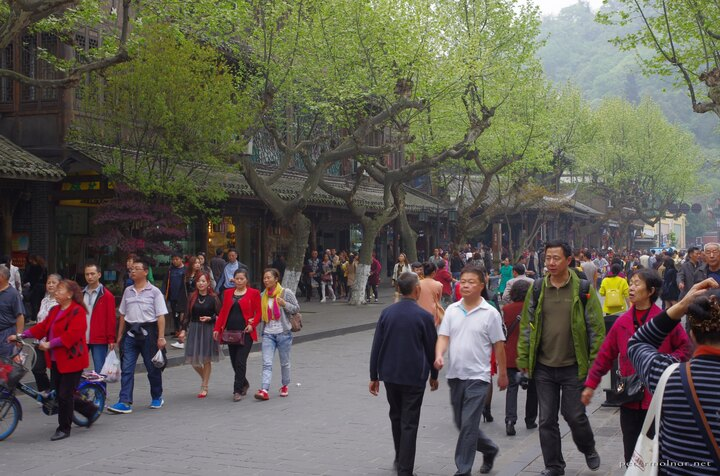
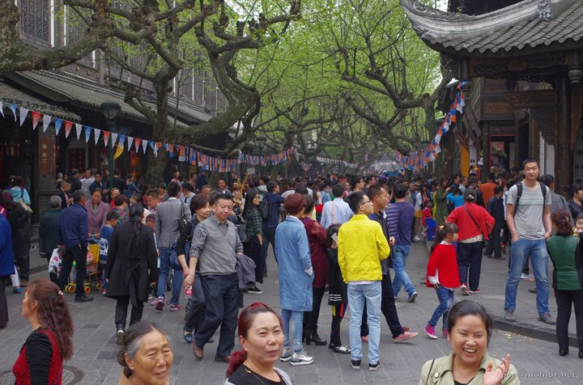
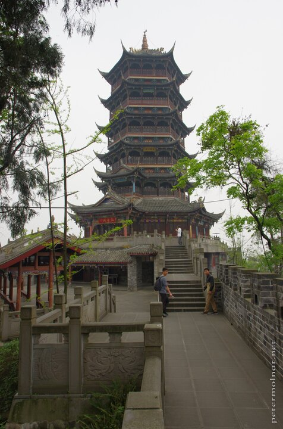
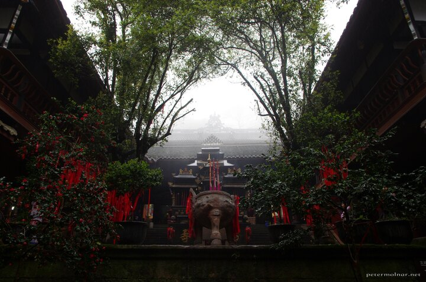
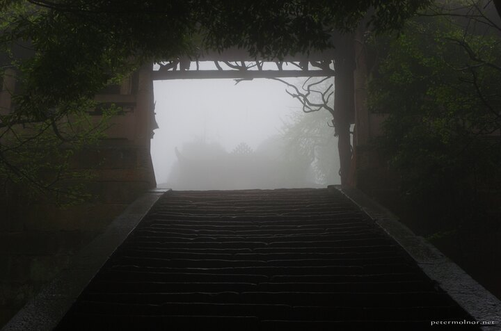
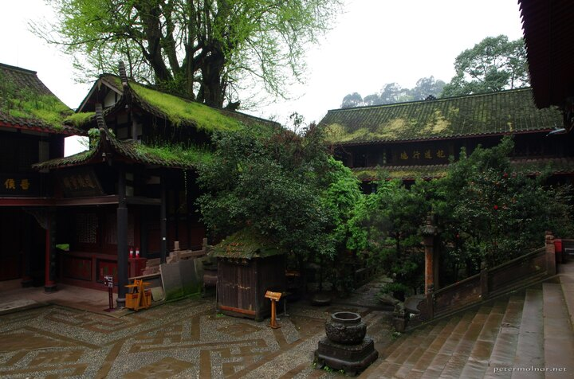
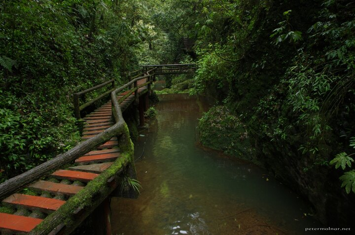
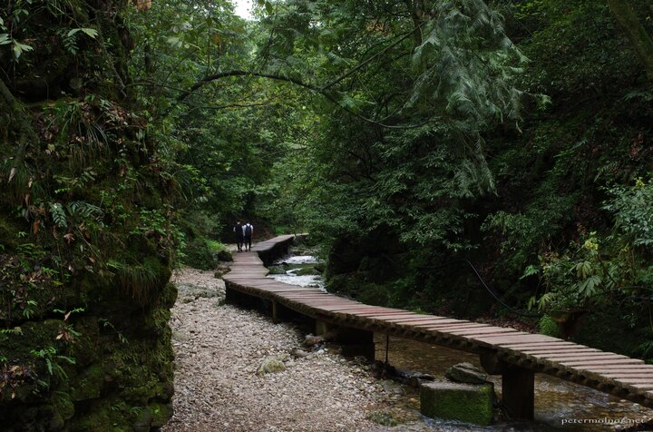

---
author:
    email: mail@petermolnar.net
    image: https://petermolnar.net/favicon.jpg
    name: Peter Molnar
    url: https://petermolnar.net
copies:
- http://web.archive.org/web/20160709135331/https://petermolnar.eu/sichuan-dujiangyan-qingcheng/
published: '2016-05-21T10:00:13+00:00'
summary: 'Going to two of the places we had to skip in our first trip: the
    ancient irrigation system of Dujiangyan and the front, taoist mountain
    of Qingcheng.'
tags:
- travel
title: 'Another 2 weeks in Sichuan: Dujiangyan and Mount Qingcheng'

---

After the first few days in Chengdu[^1] we moved on to Dujiangyan. We
got train tickets to a relatively remote train station, Xifu - which, to
our luck, was on the metro line closest to our hotel in Chendgu, but
when we asked for directions, the receptionists face morphed into a
question mark. "Why do you want to go there? Tourists don't go to Xipu."
So again, we were a little off the regular tracks, but it was at least
easy to get there.

## The way to Dujiangyan

Unlike the rest of the countries we've been to, Chengdu - so I assume
China itself - has baggage checks for the metro line as well. Not the
way too insane, European, remove-your-belt-shoes-everything, but xray
and fluid scanners. Therefore getting on the metro is a little slowers,
but it's surprisingly fast even with the check, and feels much safer.
*(Unless you carry some small bottles of Unicum in your bag, you know,
just in case, which you totally forget, and they try to tell you to get
it out from you bag in Chinese.)*

At Xipu were we approached by a bunch of definitely non-Asian people -
they turned out to be exchange students from the US trying to figure out
where we're from - one of them got a lucky guess of Eastern Europe -
going to Qingcheng.

The train was nice again, although not as hilariously good as on our
first trip in 2014; I think we somehow bought tickets for first class
that time. There is still at least 2x the leg space on second class
compared to anywhere in Europe, so fast trains in China = good,
comfortable trip.

The buildings you pass by also are slightly larger than the ones we're
used to in our tiny Old Continent.

## Dujiangyan: Irrigation System and Scenic Area

We knew the Water Releasing Festival[^2] will happen and we were also
fairly certain it will happen when we are there. The only knowledge we
were missing was the exact place, so we headed to the Irrigation System
and the Scenic Area - and maybe see something about this festival.

Right next to the hotel we stayed there was a bus station - bus 36, that
would take us to the entrance. But instead of the expected bus - you
know, a big, 30+ seats thing - a minivan sized 8 seater arrived, with
the bus sign 36 on front of it! Seriously, that was the bus, and it kind
of made sense, since it's a small town, not many using the public
transport. Oh, and it cost 1 Yuan. That is about 10 pennies.

The unexpected - there's always an unexpected - came when we reached the
entrance: my god, the amount of people there. A vast river of human
flood the street looked like, and for us, who were there for the
peaceful nature, this was kind of a shock.

After climbing a few steps we decided to take the least utilized paths
towards Anlan Bridge - and after \~4 in the afternoon, things finally
started to clear up and people started to vanish.

Going upper was suddenly "blocked" by an escalator, that was built
underneath the ancient roof, replacing the regular stairs. It is quite a
unique thing.

And of course, there is a beautiful temple at the top of the hill.

We wandered a few more temples in the Scenic Area - one of them was
exceptionally peaceful and seem to have survived the 2009 earthquake
with a few distortions to it's structure - impossible to align a picture
here.

The Anlan Bridge - the Husband & Wife Bridge - overlooks the irrigation
system[^3] which is the main cause to visit the area. In a few words:
this is a 2000+ years old layout, with very low dams, that regulates the
river Min, preventing it from flooding the plains it crosses. A few
turns here, a split there, and voilà, the river is not a monster
anymore. I wish we had a clearer day: with all the haze in the air it
was a bit hard to see it's full glory.

One note: get out the way you came in. The way out from the island is
long and if a taxi hadn't pop up there it would have taken us ours to
get back to the hotel.

Later it turned out that the festival was held at the very end of the
scenic area, close to the bridge - and it was as packed as it's
possible, so while we were a little sad we missed it, I think it's
better this way.

## Dujiangyan at night

When we saw some parts if this little city during the day it looked
promising for the night: knowing that people here like bathing their
nights in lights, we expected a view, and we were not wrong.

Finding food was a little tricky. Unlike in Jiuzhaigou[^4], the
restaurants and small places weren't keen on putting up pictures of the
dishes, so we ended up in a small alley, where some sympathetic local
woman was making good looking servings; semi-guessing that what we're
about to eat is some kind of pork with rice. It was good, so instead of
taking a risk of eating somewhere else, this was our place for two days.

Most parts of the food streets has fresh stock - and
I mean you choose the still living animal to eat. It's not for the faint
hearted; expect to see rabbits, pheasants, ducks, frogs, etc. here.
Nothing ugly thankfully, so no cats, dogs, or anything like that; most
of these animals are eaten in Europe as well, you just don't expect to
see them living before cooking any more.

## Mount Qingcheng, Front Mountain

On our first trip[^5] we decided to skip the front mountain and go for
the less known back mountain; this was one of the reasons why we wanted
to come back for a visit. Unfortunately we received a proper Welsh
weather for this day: rain, with a bit of a shower, bathed in fog. At
least it added a mysterious touch.

There were a few little shops around the entrance, and I have no idea
what kind of pasty were this two hammering, while singing some kind of
work-song, but it was interesting.

It was also not unusual to see small, old folks with insane packs on
their back. Apparently some mountains, especially the monasteries, are
only reachable on foot, so you still need people like them. And donkeys.

Before the cable car, we decided to sit down for a tea - that was
probably a good idea, because the really heavy rain started right after
we got our tea, so we didn't have to walk in that weather. After this,
it started to clear up a bit.

The mountain is full of Taoist temples, and most of them are
extraordinary. Unlike in Europe, ancient here usually means a thing that
had been there for thousands of years, but since they are in use, they
are constantly renovated - some parts are new, others are hundreds of
years old. I've read many disappointed entries, stating that what was
labelled ancient is a remake; it's not. It's a living, actively in use
thing, therefore it needs fixing; otherwise you could only visit ruins -
just like in Europe.

Meanwhile we met a Chinese guy, name Jason - also a photographer mad
enough to come out in this weather -, it was nice to talk to a local.

They way down is nice, with lots of temples, stairs and a surprisingly
large gulch - no wonder this place is the secret panda village from Kung
Fu Panda 3.

## Mount Qingcheng, Back Mountain (again), the other path

The original plan was to visit a scenic area in the north, but since we
really loved the back mountain the last time, and we only got to see one
of the paths, we ended up visiting it again. The area is currently
undergoing a massive development: lots of houses are built and
apparently many more tourists are coming - this was unfortunately
visible from the amount of rubbish as well, which was not like this on
our first trip.

It wasn't dark already like on our first visit, but no taxis and no
buses were around again, even though we expected them So yes, we ended
up getting of the mountain by looking lost enough, so the locals offered
us a ride back to the city for slightly unhappy amount of money.

[^1]: <https://petermolnar.net/sichuan-chengdu-2/>

[^2]: <http://m.chinadaily.com.cn/en/2016-04/05/content_24285470.htm>

[^3]: <https://en.wikipedia.org/wiki/Dujiangyan_irrigation_system>

[^4]: <https://petermolnar.net/sichuan-jiuzhaigou-huanglong/>

[^5]: <https://petermolnar.net/sichuan-mount-quingcheng/>