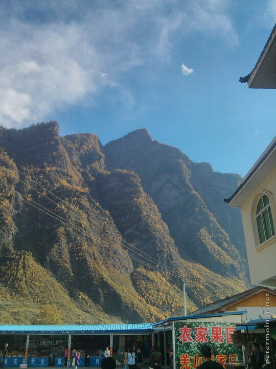
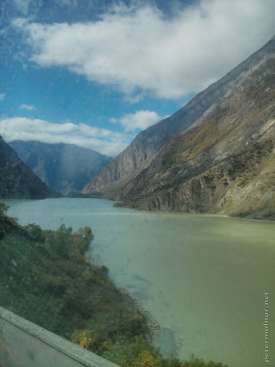
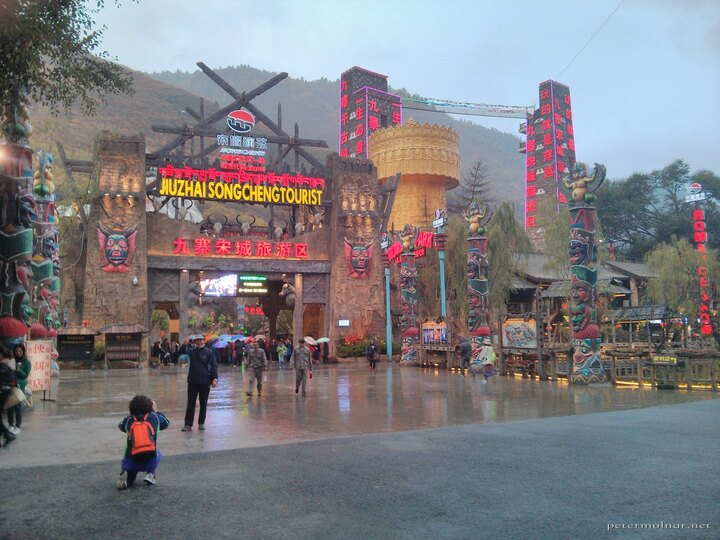
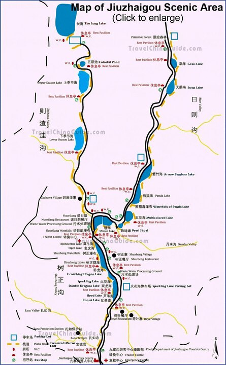
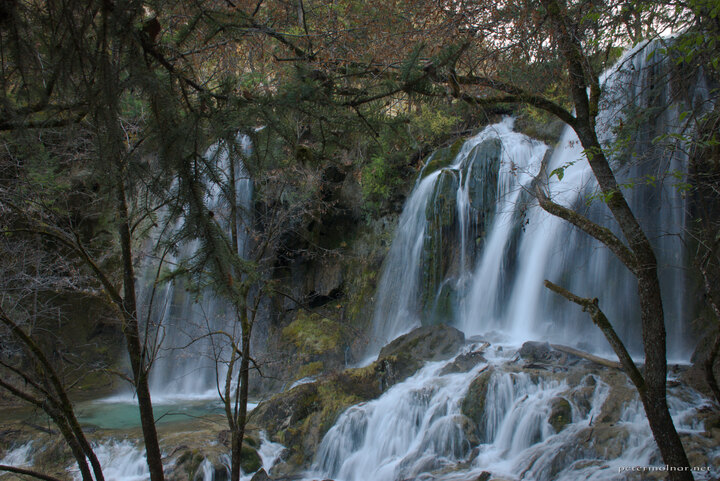
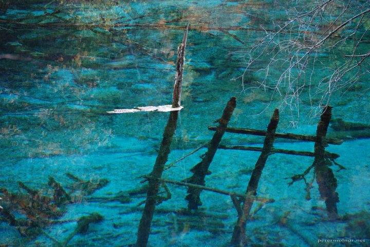
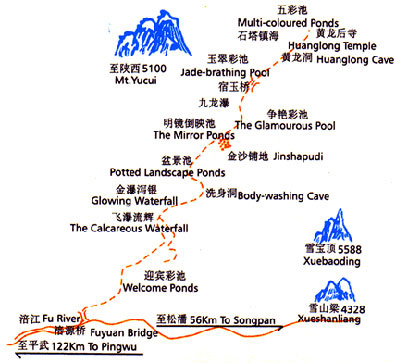
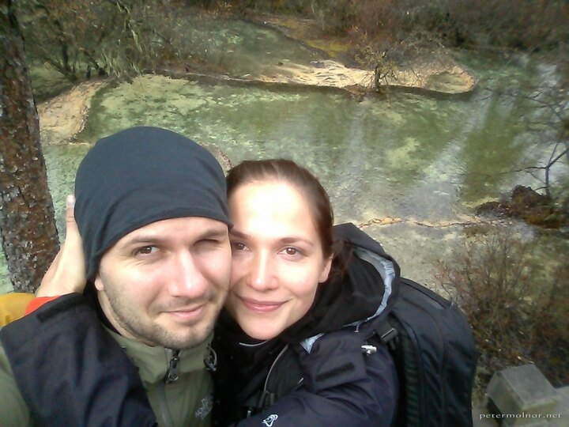

---
author:
    email: mail@petermolnar.net
    image: https://petermolnar.net/favicon.jpg
    name: Peter Molnar
    url: https://petermolnar.net
copies:
- http://web.archive.org/web/20141207160846/https://petermolnar.eu/journal/sichuan-jiuzhaigou-huanglong/
published: '2014-11-11T15:15:12+00:00'
redirect:
- nevrpc
summary: 'Our Sichuan adventures: travelling to Jiuzhaigou and to Huanglong,
    two of the most beautiful places in the world.'
tags:
- travel
title: '2 weeks of Sichuan: Jiuzhaigou & Huanglong (九寨沟   黄龙)'

---

A long time ago, in one of the Chinese chophouses in Hungary, there was
a calendar with a picture of a waterfall, coming out from a field,
surrounded with mountains. It looked unearthly, unbelievable. When my
wife asked for my interests in China, I could only describe the place to
her - she found it: it is the Nuorilang Waterfall in Jiuzhaigou
Valley[^1].

This is how our journey to Sichuan started.

## Travelling to Jiuzhaigou from Chengdu

The fastest way - in theory - to get to Jiuzhaigou from Chengdu is to go
by plane, but it's not cheap and you'll not be able to see and
experience a lot of things. Also, the airport is 2-3 hours of driving
from the valley itself, so I'm not entirely sure the flight worth it.

There is a direct bus from Chengdu Xinnanmen Bus Station[^2] to
Jiuzhaigou City, every day, at 8:00. When you look at the map, it does
not seem too bad, but do not believe it. It took 11 hours to get there
and 9 hours to get back, so be prepared for days of travelling. We were
not able to buy return tickets in the city, so the first thing upon
arrival was to visit the ticket office.

The bus stops approximately every 2-3 hours, at places prepared for
this. The best thing you can do is to buy lots of fresh mandarins from
the locals ( they are selling them at the bus stops ), because it will
both help you not to drink too much and to give your body tons of
Vitamin C, which will prevent sickness and altitude sickness as well.

*Some of the toilets at these stops are... hm... a bit far from the
Western European standards. They are cleaning it and everything, but the
are "structured" differently. Don't freak out.*

The way itself is interesting; you go through places I've never thought
I'll see; crystal clear rivers with a jungle of electrical wires on top;
mountains, peaks, yaks, lots and lots of fruit gardens...

... and apparently a mini, Chinese version of Las Vegas at Jiuzhaigo.
It's the place you pay 190¥ for a show, so we skipped.

## Accommodation & food

Don't panic if you were not able to find any accommodations beforehand:
right after you step out from the bus people will rush you with hotel
offers and you end up fighting our way out of them.

When the third taxi refused us as well because they had no idea where
Meido Kamsa Tibetian Inn[^3] is ( we did have Chinese printouts of the
directions, but that did not help), we started to panic a bit. Soon, a
car stopped beside us; again we showed him where we want to go. I think
he was asking for \~70¥ but there was small misunderstanding, so we
offered 100¥. *There is a certain point when you want someone to help
you even if it means you're paying more.* He immediately started making
phone calls and during our way he stepped out of the car 3 times, asking
for directions, so I believe finding the inn without help would have
been a problem.

The house is a Tibetan-style, very nice, clean place, but for our
surprise, the rooms are without conventional heaters. Thankfully we
noticed that the bed itself is heated, so we slept warm and tight. The
place is also pet-friendly and with a friendly pet: a small, brown,
lovely dog, Lala.

In the first evening we went down to the main road to eat something. One
would expect a lot of things at a place like this, but the music - and
some taste of biscuits - coming from one of the shops brought us back to
the 90s of Hungary.

The first place with nice smell turned out to be a good choice. We met
two Tibetan men here who spoke fluent English and they told us that the
food is good and cheap; the were right. We managed to order a plate with
chopped chicken and potatoes which tasted nearly exactly the same as
some Hungarian dishes! *Paprikás krumpli*, to be specific. We went back
a day later and asked what they would recommend: fish. Nora was asked to
go and check the exact fish we want to eat, which was then showed from a
distance, as "will this do"? After a nod, they simply hit the fish with
a massive strike to the desk, and that's it, ready to be processed :D
The result was a really good fish soup-ish bowl, also tasting familiar,
with a 1.9 kg fish.

The place is approximately here[^4].

## Jiuzhaigou

There are recommendations to go to the Valley as early as possible - it
opens at 7:00. We decided that \~8:00 will be just as good as 7:00 so we
asked the innkeeper woman to get a taxi for us. *Note: if you ask for a
car for 7:30 that means it will be there 7:15, waiting for you. 15
minutes earlier is the standard there.* The driver took us to the
entrance for 20¥.

In front of the gates you will probably experience the highest density
of tourists ever. Don't panic. It will be better inside - apart from the
Five Coloured Pool. The entrance fee is 220¥ / person, with additional
bus ticket ( hop-on-hop-off type ) it's 310¥.

After entering you have to take the bus till the first stop. The
footpath was closed, but due to the size of the valley, it's highly
recommended to go by bus for a while.

## Our path in Jiuzhaigou Valley

We had only one day here which we do regret but we miscalculated the
size of this area. If you can, stay for two days; one for Rize Valley
and one for Zechawa Valley. *Zaru Valley is only open for eco-tourists
and I do not know the details.* We saw most of the both valleys within
one day, but it's tiring and you cannot really sit down and rest.

We got off at the first bus stop, at Shuzheng Village, crossed the path
at **Shuzheng Waterfall** and walked beside the **Tiger and Rhinoceros
Lakes**. We met only \~20 other tourists beside us; it is beautiful and
peaceful. It's a \~5km walk to reach Nuorilang and the "Centre of
Everything".

**Nuorilang Waterfall** is beautiful, exceptional and unique. It's a
highly preferred place for wedding photos and for selfies so don't be
surprised of the nifty clothing and the high heels all around.

We jumped on the bus to the **Long Lake**. Local Tibetans will approach
you to dress up in traditional Tibetan dresses. They ask 20-120¥ for it,
depending on the dress and the number of people.

The next stop was the **Colourful Pond**; this is the most well-known
part of the valley, so expect a "bit" more tourists here. It is still
exceptional.

There was one of the Tibetan villages ( there is 9 in the whole valley )
on our way where you can buy, for example, combs made of yak horn, and
see a Tibetan mastiff at the backyard.

At this point, normally you take your time and go to the other valley
next day; since we only had this day, we hurried up and went to the
Primeval Forest by bus. *We're sorry we lost you, dear Chinese-Canadian
couple, it was a please to meet you, in case you happen to read this.*

**The Primeval Forest is higher than the others and it's a long way even
by bus. Take some sugary drink with you in case you feel dizzy and/or
sick because of the altitude changes.**

Sadly a few minutes after our arrival we were told the last buses are
leaving from there, so we did not see the forest itself, but the area is
still miraculous.

Our next stop was the **Panda Lake**, it's **Panda Waterfall**, the
**Multicoloured Lake** and the **Peacock Riverbed**. Even tough we were
in a bit of a hurry at this point, there were always others around us.
Not too many at this time of the day ( it was \~16:00 ), no real crowd
at all. Do not miss out these places. To be honest, in my opinion, these
were the most beautiful areas apart from the Rhinoceros Lake.

We had to leave this incredible valley after this. We checked the market
( a little walk to the right of the entrance); you can buy lots of
really nice food and things there.

Learning from the issues we had finding our inn yesterday Nora took a
picture of the main street where we needed to walk up to our place;
fortunately the taxies knew where that location is.

## Huanglong

By the time we exited Jiuzhaigou, the bus ticket office was already
closed, so the only way to go to Huanglong was to get a ride. Again we
asked our innkeeper for help and she, without hesitation told us, it's
ok, the price will be in between 400¥ and 500¥. After a quick call she
already arranged the ride, leaving at \~7:00 because our driver will
have to arrive back in time, so we have to leave Huanglong \~14:40.

It takes more than 2 hours to get to the other side of the mountain by
car. The weather was not too nice to use this day, but I have to admit,
a quietly singing Tibetan man driving us between the incredible
mountains with light snow all around has its certain magic.

Since we had no normal way of communicating - us speaking English or
Hungarian, him speaking Tibetan, us showing Chinese characters, him not
reading Chinese - we really hoped we arranged everything. He accompanied
us to the ticket office, to show us where it is, and took to the actual
cable car entrance by car as well: 100m further - to avoid the rain. The
entry fee is 200¥ and the cable car up only is an additional 80¥ per
person.

We were also ~~told~~ showed where he will be waiting for us.

We took the cable car to get to the top and walked down. Keep in mind
that this is at a higher altitude than Jiuzhaigou: you start at \~3600m
high. No wonder there are "Oxygen bar" titled little houses to stop if
you feel sick! *Our only concern was not finding hot tea at these
places.*

The weather started with snow, than sleet, than rain. If you happen to
come without any rain protection, don't worry: the locals sell cheap
raincoats and umbrellas at a lot of places.

The valley itself is beautiful. If possible, take your time, although
the tourist density is significantly higher here than on the footpaths
of Jiuzhaigou.

There are two, ancient temples close to the top.

And some beautiful waterfalls along the way.

We reached the exit right on time and we were surprised our driver was
waiting **on the exact spot** he told use he'll be. Not long before we
reached Zhangzha he asked if we're hungry ( there are international
signs to show that ) so we stopped in the middle of nowhere, at a fairly
large building, in a small chophouse. Everyone inside was obviously
surprised; no one spoke English, so we ordered a good-looking food based
on the pictures on the wall - it turned out the be the original version
of Kung Pao and it was delicious. Only after we left and saw the sign at
the front gate we realized we took our meal at the Jiuzhaigou Area
Police Station.

We left this miraculous area with the 08:00 bus back to Chengdu. This
time the weather was clouded which I was glad for: it's better to travel
in a mild weather.

## Footnotes

-   Zhangzha has ATMs, but many of them only have Chinese menu.
-   The bus ticket office closes early except for Saturday.
-   The locals are usually very helpful.
-   Food is brilliant; again, trust your nose.

[^1]: <http://travelsichuanguide.com/tour/jiuzhaigou.html>

[^2]: <http://travelsichuanguide.com/tour/xinnanmenbusstationtimetable.html>

[^3]: <https://www.booking.com/hotel/cn/meido-kamsa-tibetan-inn.html>

[^4]: <https://maps.google.com/maps?q=33.297097,103.863802&num=1&t=h&z=19>