---
author:
    email: mail@petermolnar.net
    image: https://petermolnar.net/favicon.jpg
    name: Peter Molnar
    url: https://petermolnar.net
copies:
- http://web.archive.org/web/20160709135547/https://petermolnar.net/sichuan-mount-emei/
event:
    end: 2016-04-11T08:45:00+0800
    location: Mount Emei 峨眉山, Sichuan, China
    start: 2016-04-07T09:00:00+0800
published: '2016-07-08T18:00:00+00:00'
summary: 'This is my third and last entry about our trip to Sichuan for the
    second time, about the main purpose for going back there: Mount Emei.'
tags:
- travel
title: 'Another 2 weeks in Sichuan: Mount Emei'

---

According to the legends, Emei is the location of the first ever
Buddhist monastery in China, so it's quite a famous place, with numerous
legends surrounding it.

Of course our trip wasn't as smooth as we originally expected: the metro
in Chengdu is much longer than it looks, and getting from one train
station to the other took us 1 1/4 hours. This resulted that we couldn't
buy bus tickets for the place we wanted to go after Emei, but in the
end, we canceled that side trip in favour of the mountain. Somehow we
also managed to buy the return tickets for the wrong day, so our first
thing to do at Emeishan station was to change the return time. This can
be done for 10-20% of the ticket price and they are willing to help,
even if you're only capable of describing the situation by hand and body
gestures.

We eventually did this one more time when we decided to stay 2 more days
here instead of a long bus ride to a potentially bad weather.

## Emeishan

There is a complete town around the mountains themselves, but we skipped
that. Around the first and lowest temple, the Baoguo Temple, there are a
few streets, filled with food stalls and restaurants, obviously to
capture the tourists. I'd say the prices are reasonable when you compare
it to Chengdu, and they taste great. It's completely different than the
usual Chengdu foods, so do try them.

We stayed at little, 3 star hotel, which had a large, airy room, but due
to the brutal humidity, the bathroom had some minor mould issues. On the
other hand, the hotel has an excellent kitchen with magnificent food,
and they are nice and patient to communicate - you do have to use a
translator app if you don't speak Mandarin though.

The receptionist also mentioned they have tickets for half price for the
hot springs. Hot springs! Those things that Hungary has a lot of, and
the UK none. So at the first day we decided to rest and go for that hot
spring - and wow.

I was expecting some pools, but not a complete, outdoor, water theme
park. The place[^1] is huge, the water is relaxing and is pretty hot.
Some parts were not open yet - it was early spring, so it's easy to
understand - but it still had 3 main hot pools, 4 small hot spools, a
large, snake-like pool surrounding the 4 smalls, various cool and warm
herb pools, a cool indoor pool, a large jacuzzi, and a sauna. And yes,
the large pools were not open - this was the small area of the park. The
ticket prices would have been a little high (245¥), but not with the
half price offer from the hotel. Unfortunately I didn't take any images
of this place, but I've found one few online[^2]. I've read that these
springs are not natural, but it's still lovely to just relax there.

Then "entrance" of the mount hosts a magnificent bell, a nice,
artificial waterfall, and a park around it, with lots of cicadas on the
trees. They are noisy :) Take a look around if you happen to have a
little spare time, it's a nice area.

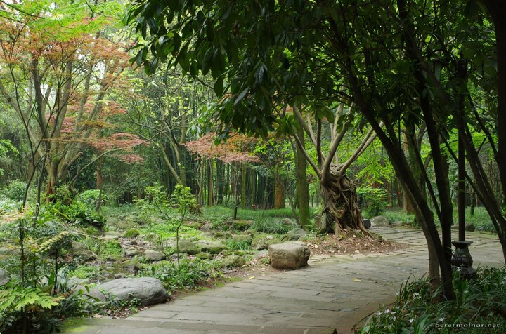

## The mountain - day 1

A few days before we got here someone told us to be aware, Emei requires
at least 2 days. Sure, not problem, we're staying for 3 nights.
Apparently 2 days has slightly different meaning to an European than to
them.

So on our second day, we got up, bought tickets for the buses that would
take us to the the high grounds, from where we either walk up to the top
or take a cable car. You also need to buy entry tickets for the
mountain, and eventually, they will be checked, so do it. The entry is
valid for 2 days, the bus can be bought for half of full route, but both
are return tickets.

*Before this, I asked if there are any "real" maps around, with altitude
lines and proper paths - nope. Nothing. Europe has magnificent tourist
maps and that doesn't apply for the rest of the world, so value the maps
you can get.*

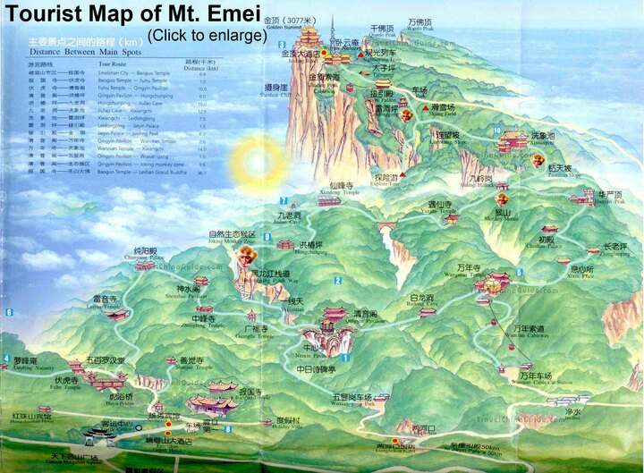

Following the Chinese breakfast - buns, eggs, kimchi, and some really
strange, tasteless rice porridge - we got on the bus and took the 2 1/2
hours ride to the top. People were mentioning that sometimes you run out
of time and in that case, you need to sleep at one of the monasteries on
the mountain, so we packed a set of clothes in case we need it. And some
emergency energy bars. Just in case.

At the bottom, it was around 23°C - and around 4°C at the top. Be
prepared! There were still a few spots of snow around - and a thick,
nasty fog, that covered and hid everything. We had a hard time finding
our way and to which cable car to use - it turned out they are
transitioning from a small one to a larger one, and the signs are not
always clear. We did find it in the end and got to the highest point
available by vehicles.

From here on, stairs guide you to the to the Golden Summit. Numerous
stalls are present next to the stairs, with local mushrooms and dried
wild things to buy; unfortunately we couldn't bring those on the plane,
so no shopping for us there. Do buy some bamboo staffs though, that is
good to scare the monkeys away.

Speaking of monkeys: a few realized this place is stuffed with people,
so they decided to stick around and wait for the herds of tourists to
come around. Eventually some will give them food; if you want to, give
them fruits. Otherwise they will steal whatever they can, leaving a big
mess all around: they do know how to open packaging, but unfortunately
they don't throw them in the bin.

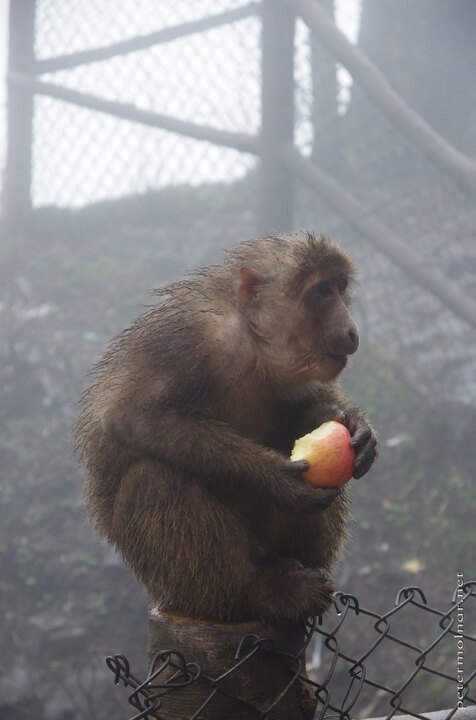

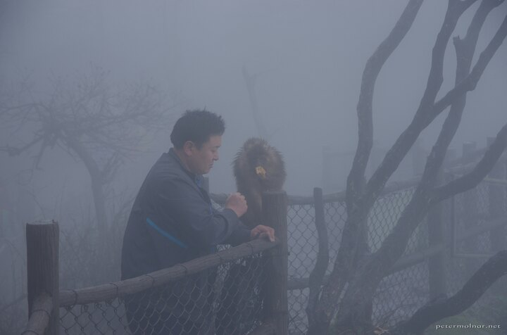

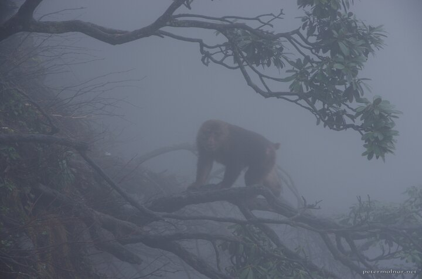

About half an our later we arrived at the peak at nearly 3099m- only to
realize that the giant, golden statue is scaffolded and the fog hides
everything from us. To ease the sadness we sat down to eat - and I've
ordered one of the worst dishes I've ever had. Titled 'cloud mushroom' -
feels, tastes, and looks like plastic sponge, and if it wasn't for Nora
to help sharing her dish with me, I would have been really sad about it.
Stick to the omlette with tomatoes; it's usual dish around here and it
can't really be ruined.

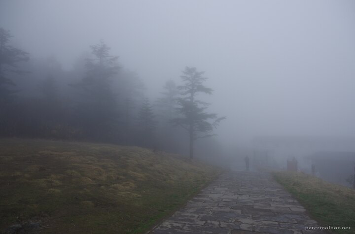

After waiting and eating for a bit there was absolutely no change with
the fog, so we decided to start walking down. What we didn't realize is
that we will be walking down for a while - we had 41km stairs ahead of
us! We bumped into a friendly Australian man somewhere at the beginning
of the journey, who also decided to take the same route we were planning
to have - since he could speak a little mandarin we decided to stick
around for a while.

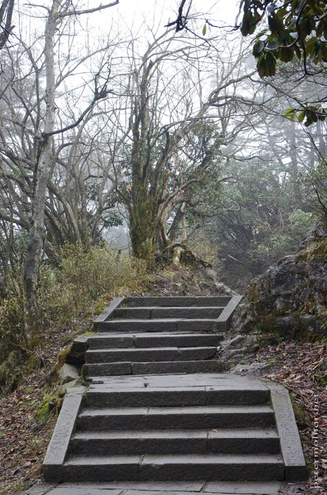

The first stop that had taken our breaths aways was the Elephant Bathing
Pool Monastery. Have you ever seen movies where nature had taken over?
Did you see Planet of the Apes? ( The old one. The real one. ) That is
how the first glimpse of that monastery looked like: in the middle of
the the mist, a red building, filled with Tibetan macaques[^3]. That
place is out of this world; it feels like a location of wushu movies, a
spot of legends and myths.

Countless steps, magnificent views, wild monkeys nearly reaching our
backpacks, gigantic waterfalls, and many hours later, at dusk, we
decided to stop at the next monastery and not continue with our descent
at night. The monastery charged a surprising amount of money for a
small, brutally humid room, but hey, not much of a choice here. They
also had electric blankets and electricity which we weren't expecting at
all, proper toilets, and some quite tasty food. For a small beer we had
to visit the shack next to the monastery, where I managed to leave my
camera, which then gave me the cold sweats, but since there is nowhere
to go with it at the middle of a sacred mountain, I got it back safe and
sound. Do take care of your equipment, no matter how tired you get!

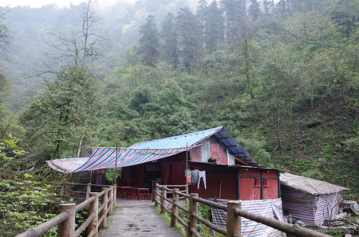

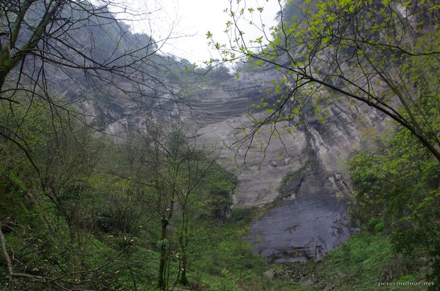

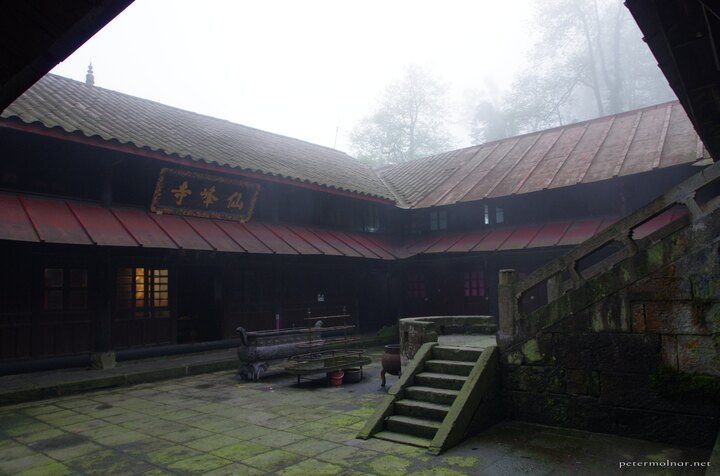

Spending a night at an old, authentic Buddhist monastery is definitely a
unique experience. During the night you hear strange noises, which are
either coming from rats, cats, or monkeys - maybe from a monkey, chasing
a cat which is chasing a rat. The humming of the monks will send you to
sleep and even if you wake up a few times due to those noises, you will
have a good, relaxing rest, no matter the circumstances. Also: don't try
to get up early. It's pitch black. Wait for the humming of the monks;
that is, apart from being a peaceful wake up call, the good time to get
out of the bed.

At this point we realized we won't have time for our planned last trip
before returning home, and decided that when we get down, we'll expend
our stay with 2 more days and cancel that other visit to enjoy Emei,
it's hot springs, foods, and temples a little longer.

## The mountain - day 2

Since the Australian man stayed at the same place we did, we started the
day together, but unfortunately he had to get to his train, so we soon
continued our journey alone.

By this time we realized that:

-   not many are taking this route
-   even less are going downhill
-   the sides of the steps are extremely slippery
-   the stairs themselves can get slippery

These factors all contribute to the fact that you'll be mostly alone, at
a magnificent place, in the nature, and it is for sure relaxing and
feels much like real freedom. Enjoy it.

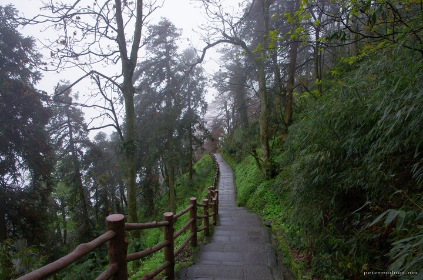

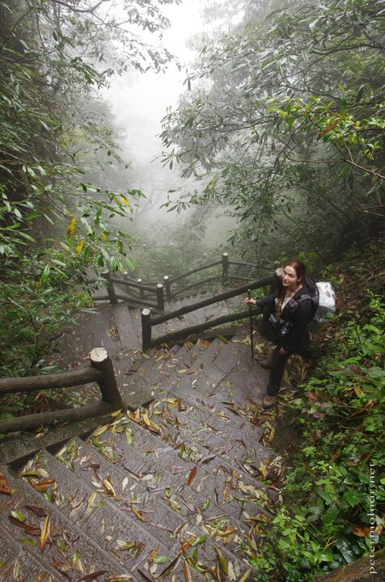

The next monastery is more modern and it's also located at a lovely
place, so depending on how far you get, this is also a good spot to
spend the night at. It is a few kilometers away from the one we slept
at, so careful, don't stretch reaching it.

Miles and miles of steps later you'll reach an area which looks like a
scene from a Peter Pan movie; it is the place where one of the big
monkey families live and which is close enough to a car park for the
lazy ones to get here to see the monkeys. And yes, the monkeys are
there, and they are stealing whatever they can. This unfortunately
results in an annoying amount of trash all around, because they do steal
whatever they can, the open the things and the throw the inedible parts
away. Put your food and plastic bottles away and keep an eye out for
them; avoid eye contact, as that is a sign of aggression, and don't run
away. They are still much smaller and they are aware of this.

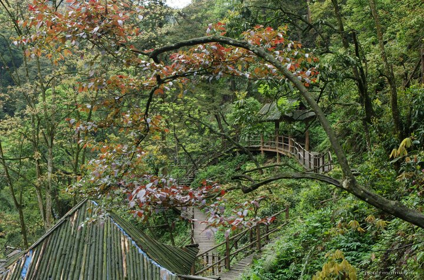

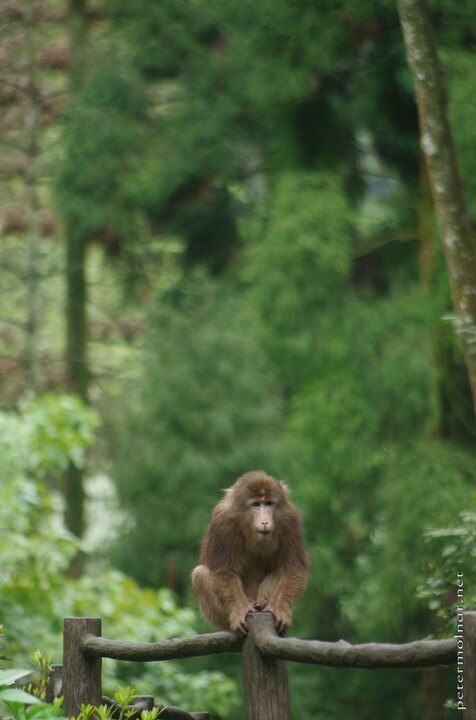

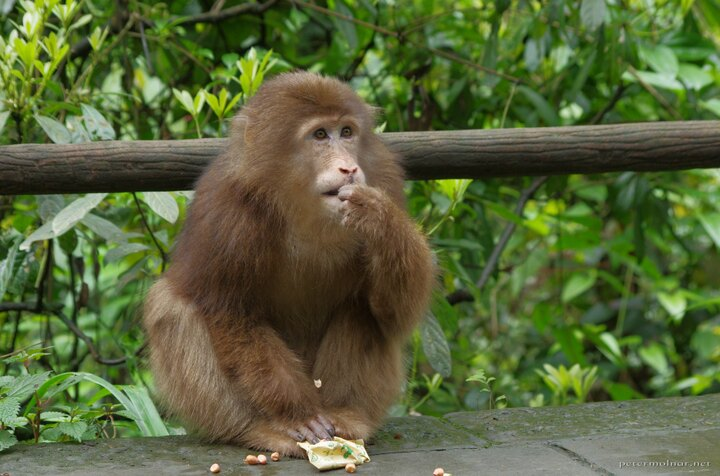

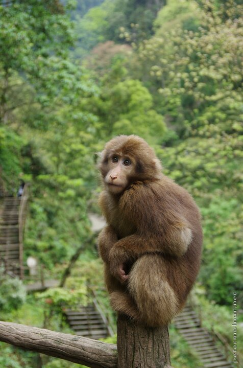

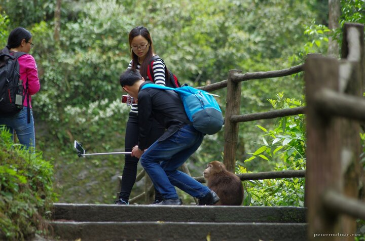

Be prepared for this area: there are hordes of tourists here, the
annoying, noisy tourists, which, especially spending 2 days alone in the
wild with the few you choose as company, is shocking.

When you leave the monkey behind there is a surprisingly long walk still
ahead of you to reach the parking area where you can jump on a bus to
get down - unless you're prepared to walk another 10-12km. We did take
this route two days later, but if you ask me, you can skip that part of
the mountain. Thankfully there are some nice views during this final
trip as well.

Slipping into the hot water of the hot springs was a big relief after
40+km of stairs, but the two days spent on Emei are among the most
unique experiences I've had so far.

## Monasteries and tea - day 3

Since we took the route which avoided the Wannian Temple which we also
wanted to see, our third day led here. Since this route is a short one,
we decided to walk instead of taking the cable car - and it was a good
choice!

This route of the mountain is filled with small stalls, mostly selling
tea - local tea. Tea that was grown here, on Emei itself.

So we met a family, with a large selection of teas - including raw,
fresh, small leaves, I've never seen or tasted before; and red tea: red,
because the tea bush itself has red leaves. By the way, the fresh leaves
are insanely strong, both in taste and as a tea; it was a bit too much.

The man showed us pictures that after collecting the leaves they bring
it to a manufacture to dry the out; also images of the plants and bushes
themselves. It was interesting to see that part as well, even if only
from pictures.

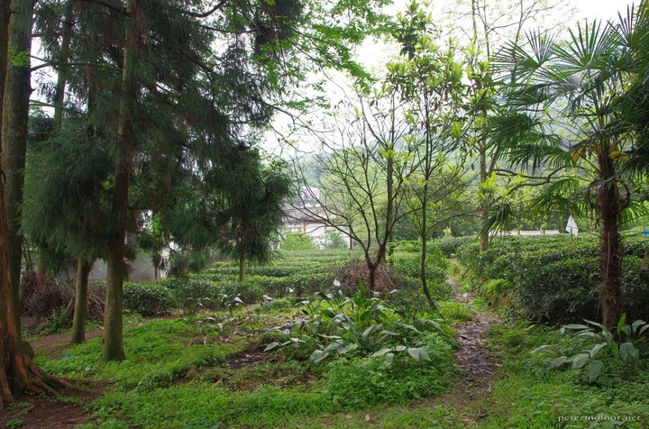

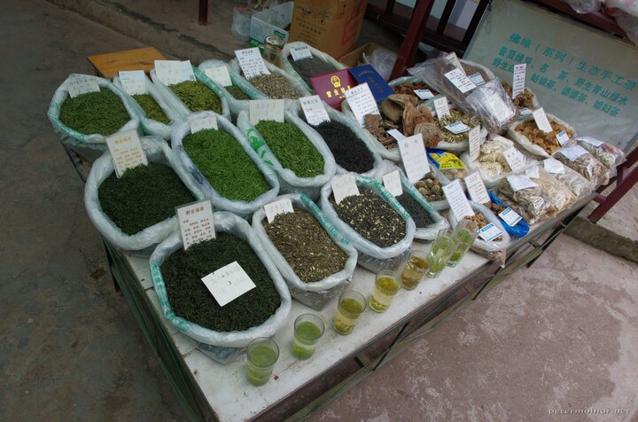

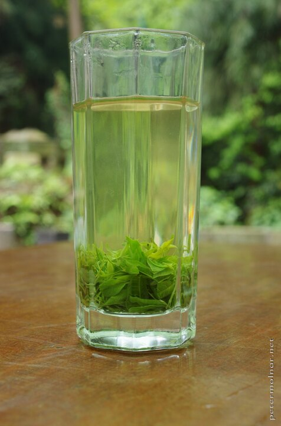

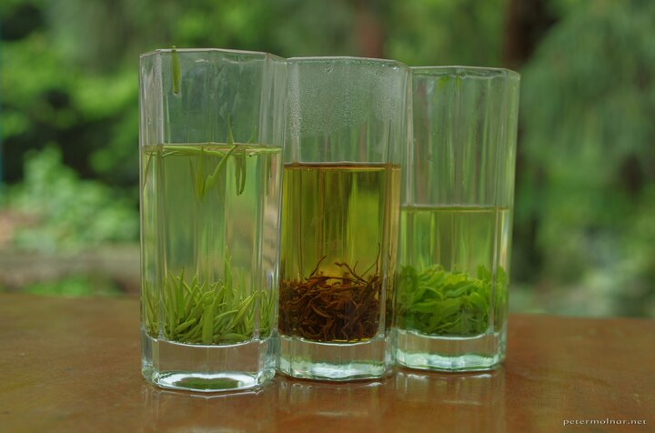

After a rather short - compared to the previous days - walk, we arrived
at a rather strange place. It was a place to sell things, with an
ethnicity unknown to us: it looked as a crossover between Tibetan and
some kind of South-American culture. The music was strange as well, and
it was a bit confusing whether this is already part of the temple or not
- it wasn't.

So a little later we got to Wannian Temple and to say, it's fairly
different from the others. First: it's huge. A vast amount of buildings,
with a very out-of-context central building. But it's beautiful,
peaceful as anything on this mountain.

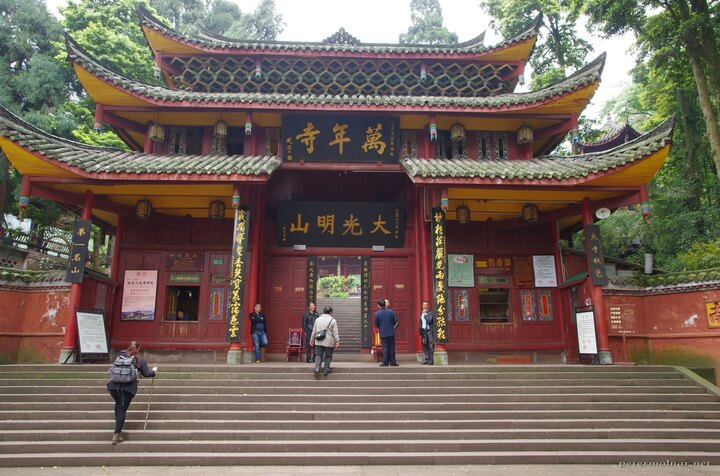

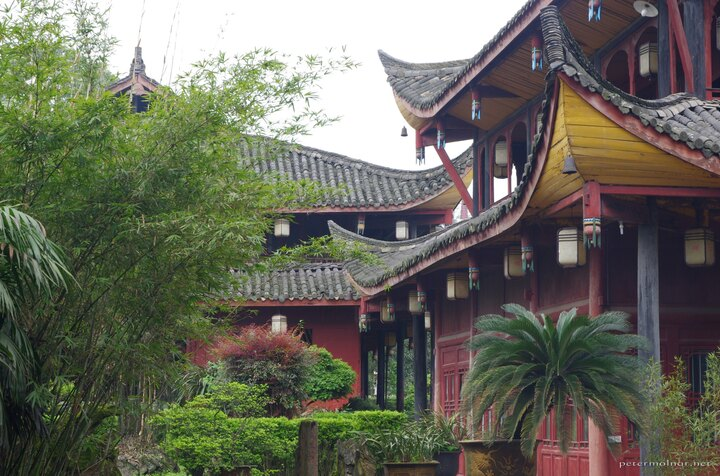

There was a rough looking, old, white cat walking around. Suddenly a
fairly well-dressed man walked to the cat, lifted it up, and started
walking to the side of the temple. For a minute, I was afraid what he's
doing, but he sat down, put the cat beside him and started petting it.
The cat immediately wanted to settle in his lap, but that was a no for
the man, yet it was wonderful to see this.

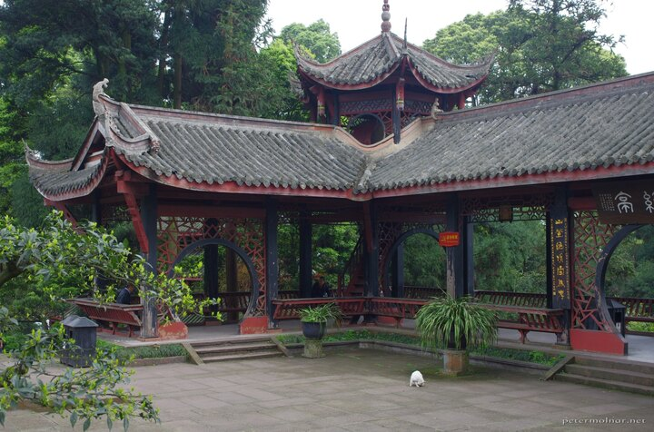

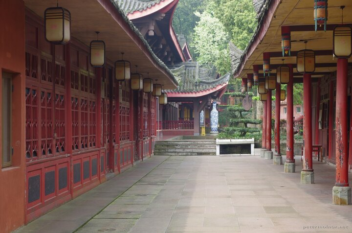

After this, we went back to the village, checked a few of the food
offerings, and had a rest.

## A rather uninteresting route - day 4

There was only one route we could take on the fourth day: from the - now
well known - Qingying Pavilion to the village and the Baoguo Temple
itself.

To be honest, this route doesn't worth it. It's not bad, no, but it's
going through and around villages, so it lacks that feeling of out of
civilization the mountain routes offer. It does have a few nice moments,
and on clear days, you could see the Golden Summit from certain
locations - this again was prevented by the humidity in the air.

## Summary

This is a wonderful place, and this little writing of mine can't really
capture it's magnificence. There is one route we didn't take, one, which
would require another 2 days - maybe once in the future.

If you can, visit this mountain. It's beautiful, the mountain paths are
mostly empty, and it's completely different from what Europe offers.

Thank you, and good by, Mount Emei!

[^1]: <https://www.google.co.uk/maps/place/Lingxiu+Hot+Spring/@29.5636123,103.448123,378m/>

[^2]: <http://www.sichuan-roads.fr/images/hotels/emei%20-%20hot%20spring%20htl%20-%20sources2.JPG>

[^3]: <https://en.wikipedia.org/wiki/Tibeta_macaque>