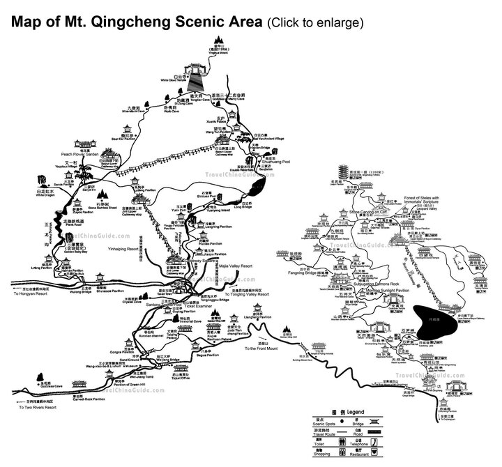
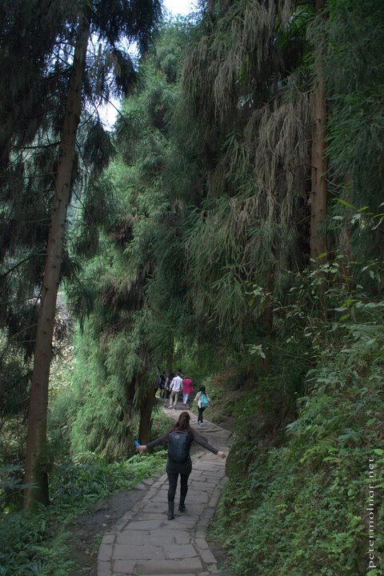
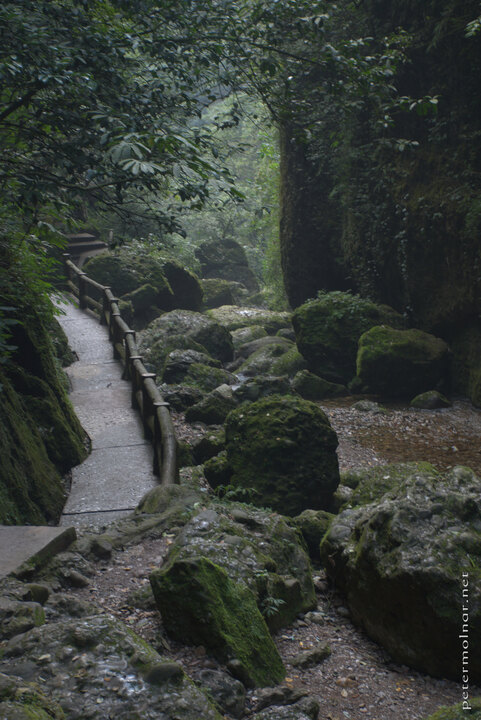

---
author:
    email: mail@petermolnar.net
    image: https://petermolnar.net/favicon.jpg
    name: Peter Molnar
    url: https://petermolnar.net
copies:
- http://web.archive.org/web/20190624130126/https://petermolnar.net/sichuan-mount-qingcheng/
published: '2014-11-25T09:00:01+00:00'
summary: 'Our Sichuan adventures: climbing the rear side of Mount Qingcheng,
    trying to keep up with the smart/pretty dressed locals and racing down
    the mountain before the night.'
tags:
- travel
title: '2 weeks of Sichuan:  Mount Qingcheng, rear peak (青城山)'

---

Mount Qingcheng is a regular destination from Chengdu; a Taoist sacred
mountain with lots of nice pavillions, temples, tourists... so we
decided to give it a twist and visit the less crowded, wilder rear peak
instead.

Getting to Mount Qingcheng seemed to be easy: there is a direct train
from the North Train Station of Chengdu. Since this was our very first
time taking a train in China we were ready for everything - except the
way the station itself works. The ticket office is in another building -
they were very kind - and there is a massive amount of people at the
front gates. Inside everything is displayed on large LED displays, so
it's easy to figure out which gate your train will leave from.
Unfortunately the earliest train we could buy ticket for was leaving in
one and a half hours, so we went to search for coffee. I do regret it,
but we ended up in a Starbucks because there was no other place to by
coffee at all. *Also, one brewed coffee costs more than the train
ticket.*

For our biggest surprise, the train was airy, clean, silent and really
fast ( 195km/h ) with stewardesses on board - it was a pleasant and fast
ride.

At Qingcheng Shan station - after we bought the return tickets - we
headed for the taxi drivers. The first driver who approached us did not
speak any English and asked (showed) for 80¥ to get us to the rear peak;
the others were asking 100¥ in English, so we went with the first man.
He was very kind, pointing out some very nice sights during our ride (
which was longer than we expected ) and when we arrived, he was really
trying to point out a place to eat at. Since we did not have any proper
meal before, we did eat there. No English speaker around, Chinese only
menu, and our Waygo app was having a bad day - the result was a very
tasty chicken soup, small portion - with literally a half chicken (!)
including head, toes and some strange-looking, small, yellow, egg-shaped
things we did not dare to eat. Only later we learned those were the
fruits of the Ginkgo tree.

The very first little town held a few surprises, including some strings
of Sichuan chilli, looking exactly the same as the Hungarian Paprika
strings. This was only one of the numerous similarities between Sichuan
and Hungary we came across.

The way up to the mountain was breathtaking[^1], in both meanings:
beautiful and steep, with countless steps, made from clay, and with an
intense humidity making everything wet.

At the end of the cable cars there are some frighteningly old villages:
just like the ones you'd expect from a good, old-fashioned horror movie.
Since the cable car is only running until 17:00, we did not take it,
instead we continued to the top.

By this time my legs were about to refuse to carry me on uphill, but
thankfully, this was already very close to the top. *Do not turn back at
the houses: you'll miss the most important parts of the mountain.* After
the village you'll reach the cave, with numerous clay sculptures of
bodhisattvas and shortly after the Goddess Mercy Cave with hundreds of
heads and faces carved into the stone.

The very top of the mountain gives place to a temple, with a sculpture
we've never seen anything like it before: a woman with hundreds of arms,
and an eye on each arm. We kept thinking about her until we finally
learned, she is Guanyin[^2], the Goddess of Mercy.

I do have to mention that we did this climb in boots and mostly outdoor
clothing, unlike the Chinese, who wore high heels and mini skirts and
did the climbing the same ( sometimes faster ) speed we did.

There is a small lake somewhere around midway which you can only cross
by a ferry - it will cost you 2¥ per person per way.

Unless you want to spend the night in one of the inns in the ancient
villages you should catch the last ferry, leaving a bit before the night
falls. By this time we were nearly running, keeping up to the locals
ahead.

When we got down, it was dark already. Even though we spotted the same
driver who brought us up, we missed him. By this time there are not too
many taxis around so when a group of locals approached us - I guess we
looked fairly lost - and offered to take us down, we accepted. We did
have to bargain a bit, since 200¥ sounded a bit too much; we agreed on
150¥ at the end. *Yes, it's twice the price of what the taxi driver
asked us, but if you do not have any other choices and you do want to
catch your train, pay it.*

He brought us down at a surprising speed, fast enough for me to have a
bit of an altitude sickness - my arms were prickling, I felt dizzy and
sick. Eat and/or drink something with a lot of sugar in it - like a 7up
-, energy helps.

It was a really nice day out and I really wish places like this were
available in the UK as well.

## Footnotes

The train stations are relatively clean, including the toilets. Much
cleaner compared to Hungary.

[^1]: <http://www.openstreetmap.org/way/236573281>

[^2]: <https://en.wikipedia.org/wiki/Guanyin>