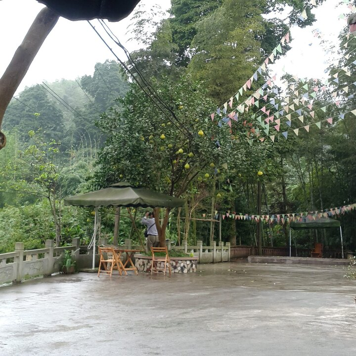
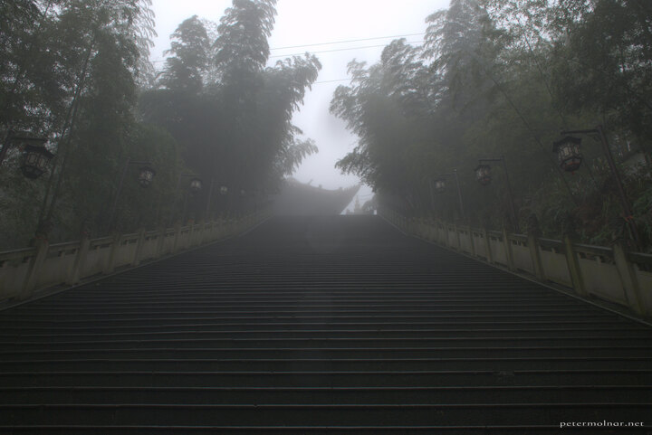
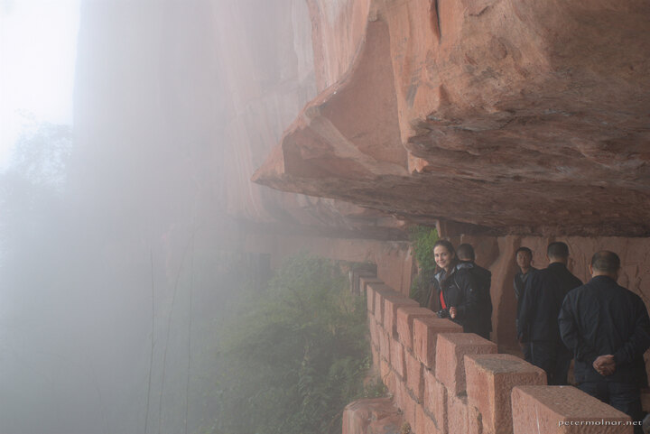

---
author:
    email: mail@petermolnar.net
    image: https://petermolnar.net/favicon.jpg
    name: Peter Molnar
    url: https://petermolnar.net
copies:
- http://web.archive.org/web/20141207172931/https://petermolnar.eu/journal/sichuan-shunan-bamboo-sea/
published: '2014-11-07T10:22:06+00:00'
summary: 'Our Sichuan adventures:  Shunan Zuhai, the famous Bamboo Sea, home
    of countless movies, heplful locals and thick fog.'
tags:
- travel
title: '2 weeks of Sichuan: Shunan Bamboo Sea (蜀南竹海国家公园)'

---

The Bamboo sea is a 120sqkm bamboo forest. It's beautiful, mysterious
and full of interesting places, but it's impossible to find on the
English maps. Many movies were filmed here and yet, still, it is hard to
find any actual information about it. At the moment, there is just no
way to book accommodation there online - but don't worry, the locals
will help.

We noticed the entry for "Shunan Bamboo Sea" at the bus timetable for
Chengdu Xinnanmen Bus Station[^1]; this means there is a direct bus from
Chengdu to the Bamboo Forest, and takes approximately 5 hours. ( Not bad
for \~400 km )

Until we reached Changning[^2] it was a regular bus trip, but here, the
driver ~~told~~ ~~asked~~ showed us to get off and get into a car that
was waiting for us. The only reason why we did not panic was that a
seemingly European man with a serious amount of photography equipment
was getting out of the car.

The driver and the car were both clean and nice, he immediately started
a little video for us about the Bamboo Sea. We asked him if he knew any
accommodations around to stay at; he responded something like: "you can
stay at our place, good environment, nice, clean". Since we do not speak
any Chinese, we used our tablet and he used he's smartphone for
translation, so don't worry, they are resourceful once it comes to
language issues. We did not have any alternatives at the moment, so we
said yes - and for 120¥/night for the 2 of us it was a brilliant deal.

It turned out that his family has a small inn with \~10 rooms[^3], nice,
clean and lovely, with a surprisingly good, free WiFi. We had a fast
lunch, made of mushrooms, eggs and bamboo shoots ( it was brilliant )
and by this time, he already offered to drive us around for 280¥ for two
days. The place is bigger than it seems therefore it's a good idea to
accept an offer like this unless you're willing to spend a few more days
wondering around. And they had a pomelo tree, which I've never seen
before.

He also offered to buy the return tickets for us and drive us back to
the pick-up point of the bus once we're leaving. We payed for the rooms
in advance, but not for the bus tickets or the driving around.

Unfortunately it was already getting dark, so the only place we could
visit this afternoon was the "Nine Days Waterfall".

The next day we had thick fog. I really love fog - in the cities. This
time, it prevented us to see lots of beautiful scenes, but also gave a
mysterious, ancient touch to the place.

Our driver accompanied us all along; during the walks he gave us some
interesting facts and information about the locations ( constantly
translating it on his smartphone ). He was a lovely and extremely
patient guide, we're really glad for all the help we got from him.

This day we managed to visit the Jade Corridor, the Lake, the Flying
Waterfall, and to one of the temples and the carved rock corridors -
unfortunately, I'm not sure about their name. We had a terrible weather
on the lake, but we still tried out the bamboo rafts - I must be
wonderful in a sunny, summer day. The temple had some truly ancient
bodhisattva sculptures and with the fog, it has a mythical, mystical
feeling all around.

Due to the weather, he suggested us to leave in the afternoon; they were
willing to pay the price of the room back! We wanted to give him a
generous tip at the end and he gave the half of it back, no matter how
hard we tried to convince him that he deserved it.

Getting back on the bus was at least confusing as getting off was: he
drove us to the bus, asked for the ticket prices then he accompanied us
to our seats. He also told us that the bus is leaving at 16:00 ( it was
\~14:40). After this, the bus went into the station and stayed there for
\~1 hour.

We did get off, because we saw a corridor leading to the town, but
without actual tickets, it was a strange feeling. The locals were kind
and we bought some souvenirs and drinks for 1/3 price compared to the
airport. There were no issues getting back on the bus; the driver was
the same who brought us down the day before ( he remembered us as well
).

## Footnotes

-   The only hotel we managed to find in this are is the Eden Resort
    Hotel[^4]; location[^5]. For our big surprise, this is also the
    place to buy the tickets to enter the Bamboo Sea and is at the West
    Gate.
-   There are many small villages, guest houses, inns inside, therefore
    there are no opening hours; it's 24/7 all the time.
-   To get to Shunan Zuhai (Shunan Bamboo Sea) from Chendgu take the
    direct bus from Chengdu Xinnanmen Bus Station to Shunan Bamboo Sea
    and do not freak out when you have to change from the bus to a car
    in Changning; this how it works.
-   We did not see any ATMs inside. Bring cash.

[^1]: <http://travelsichuanguide.com/tour/xinnanmenbusstationtimetable.html>

[^2]: <https://maps.google.com/maps?q=Changning,+Yibin,+Si%C3%A7uan,+K%C3%ADna&hl=hu&ie=UTF8&ll=28.624309,105.041656&spn=0.390564,0.698318&sll=37.0625,-95.677068&sspn=44.879582,89.384766&oq=Changning+sicu&t=h&hnear=Changning,+Yibin,+Sichuan,+K%C3%ADna&z=11>

[^3]: <https://maps.google.com/maps?q=28.464827,104.979957&hl=hu&sll=37.0625,-95.677068&sspn=43.393645,75.234375&t=h&z=14>

[^4]: <http://www.tripadvisor.co.uk/Hotel_Review-g1232130-d1232129-Reviews-Eden_Resort_Hotel-Changning_County_Sichuan.html#HEADING>

[^5]: <https://maps.google.co.uk/maps?q=28.444025,104.940559&ll=28.444402,104.941524&spn=0.005085,0.004495&num=1&t=m&z=17>