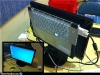

---
author:
    email: mail@petermolnar.net
    image: https://petermolnar.net/favicon.jpg
    name: Peter Molnar
    url: https://petermolnar.net
copies:
- http://web.archive.org/web/20200701204013/https://petermolnar.net/ld50/csinald-magad-pt-10/
lang: hu
published: '2010-09-02T13:14:00+02:00'
summary: Szeméttel, olajjal, meg ez mindennel. Szegeccsel minden cipő szebb,
    a régi géped meg elfér az új batármonitor hátolján.
title: Csináld magad! pt. 10

---

{.left} **SZERVES**. A Vissza a
jövőbe jó film, az utolsó mondatok egyike üt a legnagyobbat, *"képzeld,
gőzzel megy!"*, de ugyanilyen imádnivaló, amikor szerves szemetet pakol
az autóba, majd megy vele. Hogy hogy jön ez ide? Úgy, hogy állítólag el
tudod magadnak készíteni ezt a kütyüt, és lőn, amikor kipróbálod a 100
napos tojást, és rájössz, hogy európai vagy, akkor legalább lesz mire
használni. A cikkeket három részletben találod meg, itt[^1], itt[^2] és
itt[^3]. Egyébként pedig a legújabb, világmegváltó ötlet: mivel **a
műanyag zacsi olajból van**, alakítsuk vissza[^4]! Ilyet szeretnék
otthonra, *mert akkor **nem kell elvinnem a műanyagot a szelektívbe** *.
Meg lesz olajam. Igaz, ami menne vele még nincs, de veszek aggregátort
és lesz áramom, és akkor tudok még többet lógni a neten. Tegyétek ti is!

{.left} **GRRRRRLS**. Belenyúltam a régi cikkek
közé, mert bevillant, hogy eddig döntően fiús csináld magad!-okat írtam,
ami valószínűleg a nemenből és érdeklődési körömből fakad, szóval
**lányok**: szegecs, kalapács, szegecsverő vas (nem, ez nem szexuális
segédeszköz), és lőn, aktuáldivatnak is megfeleltethető, átvarázsolt
cipő[^5]. Láncot **Obiban** méterre, vasfűrészből elég a betét, a *végit
szigszalaggal betekerni, mondta nagyapám*, szegecset találtok
**cipőkellékesnél**, pl. Vörösmarty utca (Nyugati irányába lesz jobb
oldalt a Kisföldalatti felől), vagy Harminckettesek tere a Kálvária tér
felé a Baross utcán a bal oldalon, de ez jó drága, mindkettő munkaidőben
van nyitva, miért is ne. Extrémebb szegecs rocker boltokban, de azokat
már nem tudom hol vannak, aki tudja, írja le. Az alapeszközök először
drágák, de sokáig jók, szóval bőrdíszművességgel előre! Jut eszembe, a
láncot ehhez ajánlottam[^6], láttam is hasonlót drágáért boltban. Ez
utóbbi hölgy blogját[^7] egyébként az erre érdeklődőknek megéri
figyelni, kifejezetten eredeti ötletei vannak, mint napocska díszítés
biztosítótűkből[^8], vagy cicamintás állógallér[^9], kiegészítőnek,
bármihez, és így tovább, lelőhely tippeket tudok még adni, ha valaki
elakad.

{.left} **MOD**. Hogy ne legyek
mindig olyan komoly, félhumor a végére: volt egyszer egy ismerős, aki
ráült a notebookjára, ennek eredményeképpen a monitoron meglátszott a
feneke nyoma, értsd, négy helyen eltört. Mit lehet ilyenkor tenni? Kapd
le a monitort, a gépet meg szereld egy asztali monitor/LCD TV hátuljára,
és van neked HTPC-d.[^10]

**Felhívás! Ha elkészítesz valamit az ötletek közül, fényképezd le, vedd
fel, stb., és küldd el!**

[^1]: <http://www.instructables.com/id/Assembling-the-GEK-gasifier-and-preparing-for-fire/>

[^2]: <http://www.instructables.com/id/Building-the-GEK-Gasifier-in-seven-parts/>

[^3]: <http://www.instructables.com/id/First-firing-of-the-GEK-gasifier/>

[^4]: <http://www.youtube.com/watch?v=qGGabrorRS8>

[^5]: <http://hautemacabre.com/2009/07/diy-christian-louboutin-knockoffs/>

[^6]: <http://fashioninfusion.blogspot.com/2010/04/chain-heels.html>

[^7]: <http://fashioninfusion.blogspot.com/>

[^8]: <http://fashioninfusion.blogspot.com/2010/01/diy-safety-pins-coat.html>

[^9]: <http://fashioninfusion.blogspot.com/2010/05/diy-miu-miu-collar.html>

[^10]: <http://thereifixedit.com/2010/08/02/white-trash-repairs-frankomputer/>