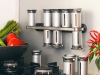

---
author:
    email: mail@petermolnar.net
    image: https://petermolnar.net/favicon.jpg
    name: Peter Molnar
    url: https://petermolnar.net
copies:
- http://web.archive.org/web/20200701204018/https://petermolnar.net/ld50/csinald-magad-pt-11/
lang: hu
published: '2010-09-09T13:18:26+02:00'
summary: Beton-art, vegyivirág, mágnes a mindennapokban.
title: Csináld magad! pt. 11

---

**Ezek most nem leírások, csupán inspirációk, mert bár mind
megvalósítható házilag, de még senki formálta leírásba. **Ha megcsinálod
valamelyiket, küldd el!\*\*

{.left} **BETON**. A "...mert jön a
beton"[^1] beépült a magyar szlengbe, maga az anyag pedig az iparba már
rég, keresve sem találni ennél industrialabb díszítőanyagot, de
önmagában kicsit unalmas és bizonyos szempontból - mondjuk a hálóban -
nyomasztó, ezért jobb, ha feldobjuk. Erre régebben vakolatot használtak,
ma inkább mintákat vájnak magába az anyagba, és lőn, díszített
beton[^2]. Hogy milyen lakásokat szeretek? Romantikus-industrial
lakásokat, azt, például. Ha pedig tényleg kemény vagy, itt van neked
betonból készült pendrive[^3].

{.left} **KÉMIA**. A vegyipar
lombikjai régóta ihletik meg a filmek gonosz tudósait, hát itt az ideje
otthon is használni a csinos kis üvegeket. Például váza helyett
tőkesúllyal ellátott kémcsövek virágoknak[^4], szerintem mestermunka,
szép, és végtelenül elegáns. Ha meg épp nincs virágszezon, mehet bele
olaj, és lesz belőle olajlámpa[^5]. Aki viszont szereti meglepni a
vacsoravendégeket, az adja az ételek mellé az olajokat és szószokat
pipettás üvegben[^6], én lehet, hogy elgondolkoznék egy-egy löttynél,
vajon épp sósavat teszek-e a vacsira.

{.left} **MÁGNES**. A fűszertartók leggyakrabban
azok a zacskók/tasakok/üvegek, amiben megvesszük őket, pedig se nem
elegáns, se nem kényelmes. A további tartók drágák, és nem túl
helytakarékosak, pedig az fontos, így valaki kitalálta a mágneses
fűszertartót[^7]. Hi-tech, design, funkció és helytakarékosság egyben,
ráadásul van rá egyszerűbb és könnyebben kivitelezhető elképzelés[^8].
UPDATE: Közben kiderítettem, hogy ez az ötlet szintén nem új, azonban
egyelőre nem túl elterjedt; lehet hasonlót kapni az IKEA-ban, de nem
ajánlott, mert nem csavaros a teteje, szóval minden kiszóródik belőle,
meg az Obiban, az már jobb. Mindenesetre el lehet készíteni, és akkor
nem lesz olyan, mint másé.

INFO *A Csináld magad! jelenlegi formájában elmegy pihenni, amikor
megint lesz sok-sok ötlet és iskolai szünet (na, kinek tűnt fel, hogy
nyári szünet volt?), újra jelentkezik. Addig is szeretettel fogadunk
minden ötletet kreatívkodó felhasználóinktól, legyen az vadonatúj tipp,
régebbiek újragondolása, elkészítése, egy-egy kész tárgy, dolog, lámpa,
bigyó, és így tovább, a feltétel mindössze annyi, hogy el lehessen
készíteni ipari (hehe) eszközök nélkül. Jó barkácsolást!*

[^1]: <http://www.youtube.com/watch?v=4Shgebe_fvo>

[^2]: <http://www.yankodesign.com/2008/05/15/art-to-walk-on/>

[^3]: <http://www.yankodesign.com/2010/05/24/concrete-memory-get-totally-cemented/>

[^4]: <http://www.yankodesign.com/2009/11/27/flower-arrangements/>

[^5]: <http://www.yankodesign.com/2009/11/26/sexy-oil-lamps/>

[^6]: <http://www.yankodesign.com/2009/10/13/chemistry-lab-equipments-on-the-table/>

[^7]: <http://www.yankodesign.com/2009/10/14/spices-that-defy-gravity/>

[^8]: <http://www.yankodesign.com/2009/07/06/5-favorite-spices-mago5-spice-rack-review/>