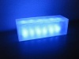
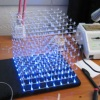

---
author:
    email: mail@petermolnar.net
    image: https://petermolnar.net/favicon.jpg
    name: Peter Molnar
    url: https://petermolnar.net
canonical: http://ld50.hu/article/ld50/napiharom/20100630
copies:
- http://web.archive.org/web/20200701204023/https://petermolnar.net/ld50/csinald-magad-pt-3/
lang: hu
published: '2010-07-01T11:48:36+01:00'
summary: LED így, LED úgy, LED amúgy. LEDjen neked jó.
title: Csináld magad! pt. 3

---

{.left} **LED MADNESS**. A csapból is a LED
áldásai folynak, majd az átlag halandónak az IKEA elad 13 000 Ft-ért
lámpát,[^1] mert nekik az jó. Szerencsére vannak emberek, akik
turbóznak, ötletelnek, készítenek,[^2] így születnek egyszerű és
eszement bonyolult, de legalább egyedi megoldások. A link után például a
legegyszerűbb zenére villogó LED-es izé,[^3] Contraston lesz nálam
kettő, ha valaki meg akarja nézni. Közelről, hogy fájjon, pedig csak 60
Ft-os LED-ből van, ami nem is Luxeon,[^4] az tényleg fáj, mert az 700
mA-t eszik, a másik meg 20-at, egyébként ilyen az eredeti, ha megy.[^5]
Az enyém hasonló. Alkatrészbeszerzés: elektrokontha.hu[^6], TIP31
helyett BD241.

{.left} **LED MOOD**. Persze ennyi nem elég, mivel
a LED tényleg jó, és egyébként szeretjük is, lehet hangulatvilágításra
használni, ja, és alig fogyaszt. Pl. négy nagy fényerejű LED elmegy
USB-ről,[^7] kisebb fényerővel több is, úgyhogy akár külön táp nélkül is
lehet hangulatvilágítást csinálni a számítógéped mellé,[^8] hogy ne
sötétben pusztítsd az agyad youtube-videókkal. Már persze ha ezt nem
érzed gótgyalázásnak. A fényt.

{.left} Milyen jó is az, amikor heteket töltesz
valaminek a felprogramozásával, ami látszólag értelmetlen, de legalább 5
percre mindenki tátja majd a száját, szóval készíts LED CUBE-ot,[^9] ami
nagy, bonyolult, drága, cserébe kiírja neked japánul 3D-ben,[^10] ha
kávét kell innod.

[^1]: <http://www.ikea.com/hu/hu/catalog/products/40116541>

[^2]: <http://hacknmod.com/topics/leds_lights/>

[^3]: <http://hacknmod.com/hack/led-light-box-thumps-to-your-music/>

[^4]: <http://luxeon.hu/luxeon_rebel_sq1.php>

[^5]: <http://www.youtube.com/watch?v=HPhm8VTCWpg>

[^6]: <http://elektrokontha.hu/>

[^7]: <http://led.linear1.org/led.wiz>

[^8]: <http://hacknmod.com/hack/pimp-your-workspace-with-cool-ambient-lighting/>

[^9]: <http://hacknmod.com/hack/tutorial-how-to-make-led-cubes/>

[^10]: <http://www.youtube.com/watch?v=Aj3_v7xCyJ0>