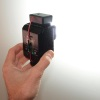
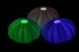

---
author:
    email: mail@petermolnar.net
    image: https://petermolnar.net/favicon.jpg
    name: Peter Molnar
    url: https://petermolnar.net
copies:
- http://web.archive.org/web/20200701204027/https://petermolnar.net/ld50/csinald-magad-pt-4/
lang: hu
published: '2010-07-07T11:51:29+01:00'
summary: DIY vakuszinkron, Arduino a csapból is, LED már megint.
title: Csináld magad! pt. 4

---

{.left} **VAKUSZINKRON**. A profi cuccok drágák,
mindig is azok voltak, nekünk pedig véges a pénztárcánk, hát toldjuk meg
találékonysággal. Vakut másik vaku villanására szinkronizálni lehet
egyszerűen és olcsón, meg persze egyszerűen és drágán, az utóbbi a
boltban kapható, az elsőhöz kell forrasztópáka is: 4 dióda, 1 tirisztor,
2 fényérzékeny dióda és egy csatlakozó. Ez utóbbi a legmacerásabb,
ajánlott beszerzési helye a Soós Kereskedés[^1], áramkör a BSS
elektronikától[^2]. Van 4, használom is őket, ha valaki meg szeretné
nézni, megmutatom én hogy rendeztem el az alkatrészeket, továbbá érdemes
tapadókorongot tenni az aljára, akkor fel is lehet tenni valamire.
*(Ennek az ötlete official, a Sunpak 3600 ugyanilyen elven működő gyári
cuccán láttam a katalógusban)*

{.left} **ARDUINO**. Ez a szó fogalommá vált az
elmúlt néhány évben. Néhány ember készített egy open source
hardware[^3]-t, amiben van egy mikrokontroller[^4], olcsó, házilag
összeállítható, és rendkívül könnyen programozható - innen egyenes út
vezetett a project sikeréhez. Elképesztő mennyiségű[^5] és néha
meglepően komoly projectek[^6] épülnek rá, de persze olyan is van,
amitől a fejünket fogjuk, pedig nem egyszerű, például a bluetoothos,
twitter vezérlet IKEA hangulatlámpa-hack.[^7] Szerencsére nálunk is
elérhető egy[^8] - két[^9] weboldal, ami foglalkozik vele. A kandósoknak
ismerős lehet az ötlet, ott nanoboardnak becéztek egy hasonlót,
mondhatni koppintást. Sajnos programozni, azt kell tudni, szerencsére az
atmel tud C-ül és jó a megszakításkezelése, a lényeg: bármilyen
komolyabb projectre jó.

{.left} **LED FEELING**. Az előző
post[^10]ban már említettem, a hangulatvilágításnak ára van[^11],
persze, ha nem elég kreatív valaki. A LED-ek többsége 3 V-on
kinyit[^12], a gombelem pedig alig ad le áramot, a kettőből és egy
tengeri sün azon részéből, melyre halála után nincs szüksége *(mondjuk
halála után semmire sincs szüksége...)*, ki lehet hozni
hangulatlámpát[^13]. Nem tudom, meddig világít, szerintem alig rövidebb
ideig, mint ameddig az elem magától le nem merül, de egyszer lemérem,
ígérem. Egyébként ugyanezt az ötletet mások gémkapoccsal
kombinálták[^14], szintén zseniális.

**Felhívás! Ha elkészítesz valamit az ötletek közül, fényképezd le, vedd
fel, stb., és küldd el!**

[^1]: <http://soosfoto.hu/>

[^2]: <http://bsselektronika.hu/index.php?id=242>

[^3]: <http://en.wikipedia.org/wiki/Open-source_hardware>

[^4]: <http://en.wikipedia.org/wiki/Microcontroller>

[^5]: <http://hacknmod.com/?s=arduino>

[^6]: <http://hacknmod.com/hack/incredible-100-arduino-based-cnc-machine/>

[^7]: <http://hacknmod.com/hack/twitter-controlled-led-ikea-table-using-bluetooth/>

[^8]: <http://arduino.kibu.hu/>

[^9]: <http://avr.tavir.hu/modules.php?name=Asers_Shop>

[^10]: <http://www.ld50.hu/article/ld50/napiharom/20100630>

[^11]: <http://www.ikea.com/hu/hu/catalog/products/60116540>

[^12]: <http://en.wikipedia.org/wiki/LED_circuit>

[^13]: <http://hacknmod.com/hack/diy-decorative-lighting-with-led-sea-urchins/>

[^14]: <http://www.yankodesign.com/2009/05/18/simply-a-bright-idea/>