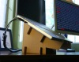
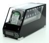
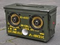

---
author:
    email: mail@petermolnar.net
    image: https://petermolnar.net/favicon.jpg
    name: Peter Molnar
    url: https://petermolnar.net
copies:
- http://web.archive.org/web/20200701204032/https://petermolnar.net/ld50/csinald-magad-pt-5/
lang: hu
published: '2010-07-14T12:55:14+02:00'
summary: DIY laptop állványok, DIY epic level home NAS, tölténydoboz-ghettoblaster.
title: Csináld magad! pt. 5

---

{.left} **NOTEBOOK STAND**. A notebookállvány
jó dolog, mert tud alatta szellőzni a gép *- ugye, Sis? -*, főleg, ha
ventilátor is van benne[^1], bár passzívan is teszi a dolgát - és
természetesen pénzbe kerül, mint a világon minden. **Ez, mint máskor,
most sem feltétlenül igaz:** ha kellően találékonyak vagyunk,
készíthetünk kartonból olcsót[^2], egyszerűt, profit, Mac-feelingűt[^3]
(3 db is van az oldalon), IKEA tartóból[^4] és egy plexilapból, de van,
aki PVC csövekből építkezik[^5], megint mások lyuggatott fémből készült
dokumentumtartóból,[^6] *erősebb idegzetűek erre ventilátort is
tehetnek[^7]*, a legzseniálisabbnak vitathatatlanul az 1 db drót
ruhafogasból készült[^8]et tartom. Papírból profi van pénzért is[^9],
igen vastag arcbőrű írhatta az árcédulát. Én is csináltam sajátot,
csúnya és nagyon home-made, de magas kellett, Obi párkányra való
cseréptartó volt a barátom, továbbá egy fúró és egy fémlap, méretre kb.
olyan, mint a Reloop laptop stand[^10], de hatodannyiba került.

{.left} **EPIC**. Minden valószínűség
szerint szembetalálkoztam az eddigi **netes handmade cuccok
legelementálisabb darabjával**, a Black Dwarf[^11]fal. Ez egy "home
made" NAS[^12], 16 TB diskkel, ránézésre úgy 3-4 nap megfeszített
munkával, zseniális how it's made videóval[^13], és így tovább. Ilyet
mindenkinek, otthonra nekem is kéne, egyszerűen mestermű. A tervezője
egyébként csinál még plexi-LED kombó workstationt[^14], LED
kávézóasztalt[^15], stb., érdemes a weboldalát[^16] részletesen átnézni.

{.left} **COMBAT SPEAKER**. Kicsit kilóg a
sorból, mert ez jelenleg egy boltban kapható[^17] áru, azonban ha jól
értelmezem a történetét, akkor eredetileg egy házilag barkácsolt
ötletből indult, ami annyira sikeres lett, hogy na, így valaki, aki
kellően leleményes, gyártani kezdte. A lényeg: fogj egy fém
**töltényládá**t töltény nélkül *(bár szerintem bármelyik hasonló láda
megteszi, a feeling a lényeg)*, **hangszórókat**, *esetleg hangláda
számító programot, hogy optimális legyen a méretezés, vagy kérdezz megy
valakit, aki ebben guru, de ők sajnos ritkák, a tanács tőlük meg még
inkább, esetleg próbálj meg alapul venni egy hangláda projectet[^18]*,
építs **crossovert és erősítőt[^19]** a cuccnak, és lőn: igazzy katonai
hangulat, amiből zene árad. Remélem elég industrial.

**Felhívás! Ha elkészítesz valamit az ötletek közül, fényképezd le, vedd
fel, stb., és küldd el!**

[^1]: <http://ipon.hu/webshop/product/prestigio_pnbs2/143980>

[^2]: <http://www.instructables.com/id/The-DIY-Cheapskate-Laptop-Stand-via-TheClosetEntre/>

[^3]: <http://theclosetentrepreneur.com/the-diy-cheapskate-laptop-stand>

[^4]: <http://www.ld50.hu/article/ld50/napiharom/20100714>

[^5]: <http://www.instructables.com/id/PVC-Laptop-Stand/>

[^6]: <http://www.instructables.com/id/Simple-Metallic-Laptop-Stand/>

[^7]: <http://www.instructables.com/id/Mesh-laptop-stand-with-usb-fans/>

[^8]: <http://www.instructables.com/id/Ergonomic-Laptop-Stand-Made-From-a-Coat-Hanger/>

[^9]: <http://ipon.hu/webshop/product/fellowes_earth_series_notebook_allvany_fekete/136621>

[^10]: <http://www.zaj.hu/aruhaz/1000198/reloop_laptop_stand_v_2>

[^11]: <http://www.willudesign.com/BlackDwarfTop.html>

[^12]: <http://en.wikipedia.org/wiki/Network-attached_storage>

[^13]: <http://www.youtube.com/watch?v=BatakM9iAik>

[^14]: <http://www.willudesign.com/TheDeskTop.html>

[^15]: <http://www.willudesign.com/CoffeeTableTop.html>

[^16]: <http://www.willudesign.com/>

[^17]: <http://www.thodio.nl/english/products/abox>

[^18]: <http://diyaudioprojects.com/Speakers/speakers.htm>

[^19]: <http://bsselektronika.hu/index.php?cat=4&db=10>