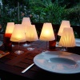
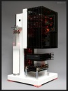
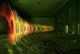

---
author:
    email: mail@petermolnar.net
    image: https://petermolnar.net/favicon.jpg
    name: Peter Molnar
    url: https://petermolnar.net
copies:
- http://web.archive.org/web/20200701204037/https://petermolnar.net/ld50/csinald-magad-pt-6/
lang: hu
published: '2010-07-27T12:59:53+02:00'
summary: HangulatLEDgyertya, casemodding, fényfestés.
title: Csináld magad! pt. 6

---

{.left} **GYERTYA**. Korábban volt már szó
egy-két hangulatvilágítási trükk[^1]ről és ötlet[^2]ről, de mindezek
inkább a technoit trendek felé kacsingatóknak szóltak, így, hogy a gótok
se érezzék magukat elhanyagolva, nézzétek és lepődjetek meg, mire jó a
papír, a pohár és a gyertya[^3] együtt. Aki meg nem szereti a gyertyát,
vagy fél, hogy meggyullad a papír, az hajtogasson LED-et 3V-os
gombelemre, mint a tengeri sünnél[^4], és tegye azt bele. Olcsón
zseniálisat, mint mindig, de hogy ne okozzak csalódást, nesztek
USB-s-LED-es Batman hívó[^5] és retinaszublimáló "zseb"lámpa[^6], építse
meg, aki túlságosan unatkozik, és hogy az utóbbihoz a fényt leadó
eszközt hol lehet beszerezni, elképzelésem sincs.

{.left} **CASE MOD**. Nem, ennek semmi köze
Case[^7]-hez, nem őt modoljuk, hanem a számítógép házát, amire lassan
külön művészeti ág épül fel. Van steampunk megoldás[^8], Halo mod[^9],
R2D2 console box[^10], letisztult minimalista LED-es kocka[^11], ezen
felül ami nekem személy szerint a legjobban tetszett, az nem is mod,
hanem egy önálló ház[^12], komoly funkcionalitásokkal, de *úgy néz ki,
mintha Doki hozta volna a Deloreanen a jövőből*. Még jó, hogy van
leírás, hogy hogyan kezdjünk neki.[^13]

{.left} **LIGHT DRAWING**. A mai "kicsit
kilóg a sorból" ötlet azért lóg ki egy kicsit a sorból, mert nem tárgy,
hanem ihlet fotósoknak: a fényfestés jó dolog, akinek van érzéke hozzá,
zseniális képeket tud kihozni belőle, de mivel mi nem átlag közösség
vagyunk, miért használnánk átlag zseblámpát? Ne is, jobb lenne LED-del
és lézerrel kísérletezni, és akkor születnek olcsó
számítógép-animációnak tűnő, korai kilencvenes éveket idéző[^14] *(lásd
Power Kapitány és a jövő harcosai[^15] )* képek. Hajrá.

**Felhívás! Ha elkészítesz valamit az ötletek közül, fényképezd le, vedd
fel, stb., és küldd el!**

[^1]: <http://www.ld50.hu/article/ld50/napiharom/20100721>

[^2]: <http://www.ld50.hu/article/ld50/napiharom/20100721>

[^3]: <http://www.yankodesign.com/2009/10/26/gorgeous-helen/>

[^4]: <http://www.ld50.hu/article/ld50/napiharom/20100707>

[^5]: <http://hacknmod.com/hack/diy-dark-kight-usb-spotlight/>

[^6]: <http://hacknmod.com/hack/diy-super-powered-flashlight-beam/>

[^7]: <http://ld50.hu/users/Case>

[^8]: <http://www.datamancer.net/steampunklaptop/steampunklaptop.htm>

[^9]: <http://hacknmod.com/hack/epic-halo-case-mod-the-master-chief-xbox-360/>

[^10]: <http://www.geek.com/articles/games/the-ultimate-r2d2-casemod-crams-in-eight-consoles-and-one-projector-20090923/>

[^11]: <http://hacknmod.com/hack/sleek-blue-led-case-mod/>

[^12]: <http://hacknmod.com/hack/stunning-pc-mod-combines-function-with-looks/>

[^13]: <http://hacknmod.com/hack/how-to-a-basic-case-mod-tutorial/>

[^14]: <http://hacknmod.com/hack/mindblowing-led-light-and-laser-photography/>

[^15]: <http://www.youtube.com/watch?v=Um0DsztIyn8>