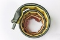
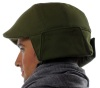

---
author:
    email: mail@petermolnar.net
    image: https://petermolnar.net/favicon.jpg
    name: Peter Molnar
    url: https://petermolnar.net
copies:
- http://web.archive.org/web/20200701204043/https://petermolnar.net/ld50/csinald-magad-pt-7/
lang: hu
published: '2010-08-04T13:04:04+02:00'
summary: Fényesernyő, fényes-ernyő, fény-esernyő, eh, mindegy. Meg pendrive
    és sisak.
title: Csináld magad! pt. 7

---

{.left} **ESERNYŐ**. Már volt szó
gombelemre tekert LED-ről[^1], szerencsére több LED-et nagyobb elemre is
rá lehet tekerni *(Laposelemér' - Nem a neved kérdeztem, hanem hogy
miért jöttél?)*, ennek fényében miért ne csinálnánk például világító
esernyő[^2]t? Este biztos, hogy jól jön, és talán az autós is kikerülni
a vizet. Vagy nem. Ha meg kávéfüggő vagy, toldd meg az esernyő
nyelét,[^3] hogy jó legyen neked, amikor a globalizáció ikonjából
származó papírpoharas kávét szürcsölöd az égből áldásként hulló, *még
nem égetően savas eső* alatt. Apropó, víz, ha a függönyöd fentről
LED-ekkel (mi mással) megvilágítod, olyan lesz, mint a vízesés,[^4]
kerül vagy 500 Ft-ba, táppal együtt. Persze elmegy USB-ről, ha mondjuk a
régi notebookod mellészereled a falra,[^5] *de ember legyen a talpán,
aki ez utóbbit szépnek fogja találni,* hacsak nem egy kicsit
igényesebben csinálod.[^6]

{.left} **KIEGÉSZÍTŐ**. A karkötők a nők fontos
alkotóelemei, a csuklószorítókat az erősebb (?) nem is elviseli, hát
miért ne kombináljuk a modern techikával? Lám, létezik már karkötő, ami
usb kábelt rejt,[^7] ha valaki meg tudja mondani, hol lehet olyan cuccot
venni, ami nagy divat volt a 90-es évek elején, értsd, *amit oda kellett
csapni a kezedre, és rátekeredett,* na, akkor abból pont meg lehet
csinálni. Állásbörzéken néha adnak ilyet, ha valaki tud, szerezzen.
Sokat. Még technokratábbak[fogjanak képet a netről, nagyítsák,
nyomtassák és aggassák
magukra,](http://www.yankodesign.com/2007/06/13/stolen-jewels-by-mike-and-maaike/)
lőn, egyfajta pixel art, bár nekem ez túlságosan funkciómentes.

{.left} **KÉTKERÉK**. A biciklissisak néha design,
néha nem, néha pedig egyáltalán nem. Szerencsére semmi nem akadályoz meg
benne, hogy bevond valamilyen anyaggal, mintával, dologgal, hogy minél
jobban átüssön utánozhatatlan személyiséged. Ezt az ötletet követve -
*és a világ talán legszerencsétlenebb sisakját alapul véve* - az NYC
Helmet már gyártani is kezdett ilyet,[^8] de némi ráfordítással bárki
megcsinálhatja.

**Felhívás! Ha elkészítesz valamit az ötletek közül, fényképezd le, vedd
fel, stb., és küldd el!**

[^1]: <http://www.yankodesign.com/2009/05/18/simply-a-bright-idea/>

[^2]: <http://www.yankodesign.com/2008/12/08/umbrella-lights-the-way/>

[^3]: <http://www.yankodesign.com/2010/05/14/coffee-loving-umbrella/>

[^4]: <http://www.yankodesign.com/2010/03/05/stuck-to-rivers-and-lakes/>

[^5]: <http://thereifixedit.com/2010/05/28/epic-kludge-photo-perfectly-good-obsolete-laptop/>

[^6]: <http://hacknmod.com/hack/build-diy-wall-mount-pc-old-laptop/>

[^7]: <http://www.yankodesign.com/2008/08/05/silky-snappy-snake/>

[^8]: <http://www.yankodesign.com/2009/08/26/nyc-helmet-im-giddy-with-excitement/>